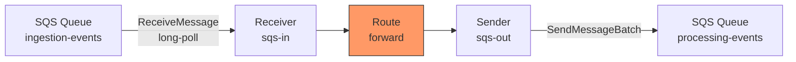
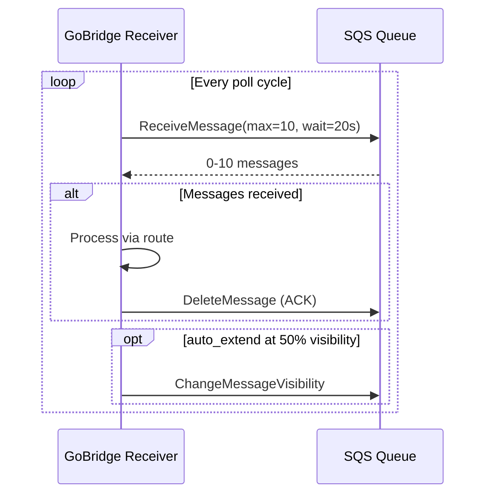

# Scenario 2: SQS-to-SQS Queue Bridge

A stateless transport bridge -- routes messages between two AWS SQS queues without sessions.

## Use Case

You have an ingestion queue receiving events from upstream producers and need to route those messages to a processing queue consumed by a downstream microservice. Both queues are standard SQS queues in the same AWS region.

## Architecture



## Configuration

```yaml
bridge:
  id: sqs-forwarder

receivers:
  - id: sqs-in
    transport: sqs
    options:
      queue_url: https://sqs.us-west-1.amazonaws.com/123456789/ingestion-events
      region: us-west-1
      max_messages: 10
      wait_time_seconds: 20
      visibility_timeout: 60
      auto_extend: true

senders:
  - id: sqs-out
    transport: sqs
    options:
      queue_url: https://sqs.us-west-1.amazonaws.com/123456789/processing-events
      region: us-west-1
      batch_size: 10

bindings:
  - id: to-processing
    sender_id: sqs-out
    address: processing-events

routes:
  - id: forward
    receiver_id: sqs-in
    delivery_mode: direct_hold
    dispatch_mode: single
    bindings: [to-processing]
```

## Config Walkthrough

### No Sessions

SQS is a **stateless** transport. Unlike MQTT, there's no persistent connection to manage. Each receive and send operation is an independent HTTP API call. This means:
- No `sessions` section needed
- Receivers and senders specify `transport: sqs` directly
- No `session_id` references

### `receivers`
- **`queue_url`** -- Fully qualified SQS queue URL. Alternatively use `queue_name` for automatic URL resolution.
- **`region: us-west-1`** -- AWS region. If omitted, uses the SDK default chain (env vars, instance profile, etc.).
- **`max_messages: 10`** -- Maximum messages per `ReceiveMessage` call (SQS max is 10).
- **`wait_time_seconds: 20`** -- Long polling. The API call waits up to 20 seconds for messages before returning empty. This reduces cost and latency vs short polling.
- **`visibility_timeout: 60`** -- After receiving a message, it becomes invisible to other consumers for 60 seconds. If not acknowledged in time, SQS re-delivers it.
- **`auto_extend: true`** -- A background goroutine renews the visibility timeout at 50% (30s mark), preventing redelivery for long-running processing.

### `senders`
- **`batch_size: 10`** -- Maximum entries per `SendMessageBatch` call. It takes effect only when a caller invokes the sender's `SendBatch` (batch) API directly. This route's per-delivery dispatch sends one message per `Send` call, so `batch_size` does not reduce API calls here, and it does not apply to the shared-outbox drain path either (the drainer sends one record per `Send`).
- Timeout defaults to 30 seconds per call.

> **Note on the SQS binding `address`.** An SQS sender is pinned to one queue via its `queue_url` or `queue_name`. The binding `address` may be the bare queue name (as here, `processing-events`) or the full queue URL -- either form is matched to that bound queue. It names the sender's queue rather than routing per message.

### SQS Polling Lifecycle



## Go Bootstrap

```go
cfg, _ := config.ParseFile("bridge.yaml", config.FormatAuto)

rt, _ := bridge.NewBuilder(cfg, bridge.WithLogger(logger)).
    RegisterTransport("sqs", sqs.NewFactory(logger)).
    Build(ctx)

rt.Start(ctx)
```

## Variations

### Using Queue Names (Auto-Resolve)

If you prefer logical names over URLs, the SQS adapter resolves them at startup:

```yaml
receivers:
  - id: sqs-in
    transport: sqs
    options:
      queue_name: ingestion-events
      region: us-west-1
```

### Custom Endpoint (LocalStack)

For local development with LocalStack:

```yaml
receivers:
  - id: sqs-in
    transport: sqs
    options:
      queue_url: http://localhost:4566/000000000000/ingestion-events
      endpoint: http://localhost:4566
      region: us-west-1
```

### FIFO Queues

For ordered, exactly-once processing:

```yaml
senders:
  - id: sqs-out
    transport: sqs
    options:
      queue_url: https://sqs.us-west-1.amazonaws.com/123456789/events.fifo
      fifo: true
      message_group_id: default-group
      batch_size: 10
```

The `message_group_id` determines ordering scope. Messages in the same group are delivered in order. Use `fifo: true` to enable FIFO semantics even when the group ID comes from envelope headers.

### SNS Unwrapping

When SQS receives messages via an SNS subscription, they arrive wrapped in an SNS envelope. Enable unwrapping to extract the original message:

```yaml
receivers:
  - id: sqs-in
    transport: sqs
    options:
      queue_url: https://sqs.us-west-1.amazonaws.com/123456789/events
      sns_unwrap: true
```

### AWS Profile Selection

Use a specific AWS shared-config profile:

```yaml
receivers:
  - id: sqs-in
    transport: sqs
    options:
      queue_name: ingestion-events
      region: us-west-1
      profile: production
```
