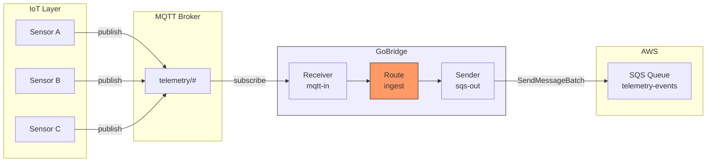
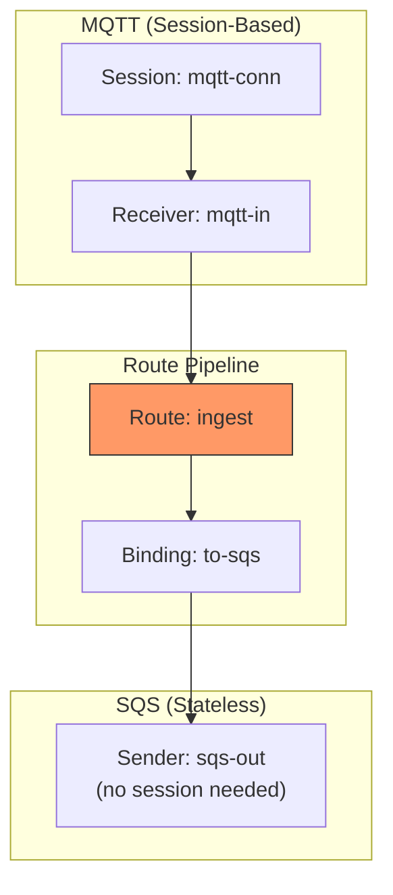

# Scenario 3: MQTT-to-SQS Cross-Transport Bridge

The canonical GoBridge use case -- bridge messages between different transport technologies.

## Use Case

IoT sensor devices publish telemetry to an MQTT broker. A backend microservice consumes events from an SQS queue for processing, analytics, and storage. GoBridge sits between them, translating MQTT messages into SQS messages.

## Architecture



## Configuration

```yaml
bridge:
  id: iot-ingest

sessions:
  - id: mqtt-conn
    transport: mqtt
    options:
      broker_url: tcp://mqtt.example.com:1883
      client_id: iot-bridge-01
      keep_alive: 30

receivers:
  - id: mqtt-in
    session_id: mqtt-conn
    topics:
      - topic: "telemetry/#"
        qos: 1

senders:
  - id: sqs-out
    transport: sqs
    options:
      queue_url: https://sqs.us-west-1.amazonaws.com/123456789/telemetry-events
      region: us-west-1
      batch_size: 10

bindings:
  - id: to-sqs
    sender_id: sqs-out
    address: telemetry-events

routes:
  - id: ingest
    receiver_id: mqtt-in
    delivery_mode: direct_hold
    dispatch_mode: single
    bindings: [to-sqs]
    policy:
      max_in_flight: 100
```

## Config Walkthrough

### Cross-Transport Wiring

This is where GoBridge shines -- the receiver uses MQTT (stateful, session-based) while the sender uses SQS (stateless, HTTP-based). The bridge normalizes messages into its internal `Envelope` format, making the transport boundary transparent.



### Key Observations

1. **MQTT receiver uses `session_id`** -- It references the `mqtt-conn` session which manages the persistent MQTT connection.

2. **SQS sender uses `transport` directly** -- No session needed. Each `SendMessageBatch` call is independent.

3. **Binding `address`** -- For SQS, the binding address is informational (the queue URL comes from sender options). For MQTT senders, the address would override `default_topic`.

4. **`max_in_flight: 100`** -- Limits concurrent messages being processed. Prevents the bridge from overwhelming the SQS sender during traffic spikes. When 100 messages are in-flight, the MQTT receiver pauses accepting new deliveries (backpressure).

### Message Flow

1. MQTT broker delivers a message on `telemetry/temperature/sensor-42`
2. Receiver wraps it in an `Envelope` with:
   - `Subject` = `telemetry/temperature/sensor-42` (the MQTT topic)
   - `Payload` = raw message bytes
   - `Headers` = bridge metadata (correlation-id, traceparent, etc.)
3. Route processes it (no processors in this example)
4. Sender publishes to SQS via `SendMessageBatch`
5. On success, receiver acknowledges the MQTT message (QoS 1 PUBACK)

## Go Bootstrap

```go
cfg, _ := config.ParseFile("bridge.yaml", config.FormatAuto)

rt, _ := bridge.NewBuilder(cfg, bridge.WithLogger(logger)).
    RegisterTransport("mqtt", paho.NewFactory(logger)).
    RegisterTransport("sqs", sqs.NewFactory(logger)).
    Build(ctx)

rt.Start(ctx)
```

Both transport factories must be registered since the config references both `mqtt` and `sqs`.

## Variations

### With SNS Unwrap on Receiver

If your MQTT messages are arriving via an SNS-to-SQS subscription pattern (in reverse):

```yaml
receivers:
  - id: sqs-in
    transport: sqs
    options:
      queue_url: https://sqs.us-west-1.amazonaws.com/123456789/raw-events
      sns_unwrap: true
```

### Batch Tuning

For high-throughput scenarios, tune the SQS sender batch size and the route concurrency:

```yaml
senders:
  - id: sqs-out
    transport: sqs
    options:
      queue_url: https://sqs.us-west-1.amazonaws.com/123456789/telemetry-events
      batch_size: 10      # max messages per API call
      timeout: 15s        # per-call timeout

routes:
  - id: ingest
    receiver_id: mqtt-in
    bindings: [to-sqs]
    policy:
      max_in_flight: 500  # higher concurrency for throughput
```

### MQTT QoS 2 for Exactly-Once

For critical data where you cannot tolerate duplicates at the MQTT layer:

```yaml
receivers:
  - id: mqtt-in
    session_id: mqtt-conn
    topics:
      - topic: "telemetry/#"
        qos: 2  # exactly-once delivery from broker
```

Note: QoS 2 applies only to the MQTT leg. SQS provides at-least-once delivery. For end-to-end exactly-once, use FIFO queues with deduplication.

### Adding a Delivery Delay

Delay SQS message visibility for consumers (useful for scheduling):

```yaml
senders:
  - id: sqs-out
    transport: sqs
    options:
      queue_url: https://sqs.us-west-1.amazonaws.com/123456789/delayed-events
      delay_seconds: 300  # 5-minute delay before visible
```

### TLS MQTT + Credentials

Separate sensitive credentials from config:

```yaml
sessions:
  - id: mqtt-conn
    transport: mqtt
    options:
      broker_url: tls://mqtt.example.com:8883
      client_id: iot-bridge-01
      credentials_uri: file://prod/mqtt/broker
      tls:
        enable: true
        ca_cert_file: /etc/certs/ca.pem
```

The `credentials_uri` resolves username/password and optionally TLS certificates from a credential store. See [Credentials & HTTP API](../credentials-and-http-api.md).
