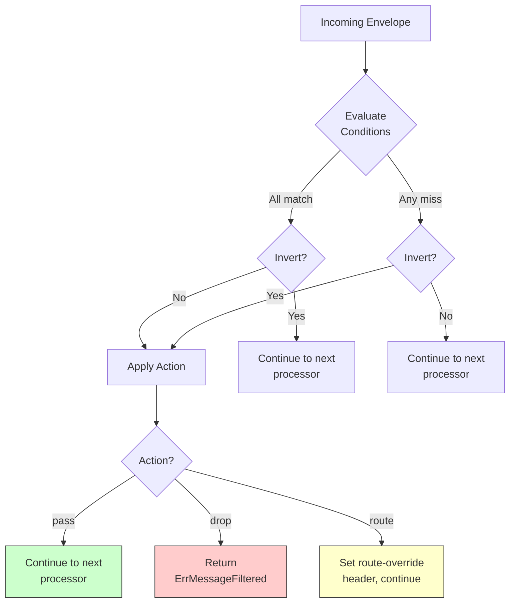

# Scenario 4: Fan-Out with Filtering

Route IoT sensor data from a single MQTT subscription to several destinations based on message content.

## Use Case

You have sensor devices publishing JSON telemetry to `sensors/#` on an MQTT broker. Temperature readings must go to `events/temperature` for alerting, and humidity readings must go to a separate topic `events/humidity` for analytics. The bridge inspects each message and fans it out to the correct destination.

## Architecture

```mermaid
flowchart LR
    subgraph MQTT Broker
        T["sensors/#"]
    end

    subgraph GoBridge
        R[Receiver\nsensor-in]
        F1[Filter\ntemp-filter]
        F2[Filter\nhumidity-filter]
        Route[Route\nsensor-route\ndispatch: fan_out]
    end

    subgraph MQTT Broker (egress)
        Q1["events/temperature"]
        Q2["events/humidity"]
    end

    T -->|subscribe| R
    R --> Route
    Route --> F1 --> Q1
    Route --> F2 --> Q2

    style Route fill:#f96,stroke:#333
    style GoBridge fill:#eef,stroke:#333
```

## Configuration

```yaml
bridge:
  id: sensor-fanout

sessions:
  - id: mqtt-conn
    transport: mqtt
    options:
      session:
        broker_url: tcp://mqtt.example.com:1883
        client_id: sensor-fanout-01
        keep_alive: 30
        # The builder sizes ingress memory from max_payload_bytes,
        # receive_maximum and the route's max_in_flight before it opens
        # anything; 200 in flight at the default 256 KiB payload cap needs
        # ~305 MiB, above the 256 MiB default budget. State the budget.
        ingress_memory_budget_bytes: 335544320   # 320 MiB

receivers:
  - id: sensor-in
    session_id: mqtt-conn
    topics:
      - topic: "sensors/#"
        qos: 1

stores:
  # Fan-out is a shared-outbox feature: the route persists one record per
  # binding and drains each on its own. This scenario is about filtering, so
  # the stores are in memory and each acknowledges what a restart loses;
  # Scenario 5 shows the durable pairing.
  lease:
    type: memory
    options:
      acknowledge_single_replica: true
  outbox:
    type: memory
    options:
      acknowledge_volatile: true
  dlq:
    type: memory
    options:
      acknowledge_volatile: true

senders:
  # One sender, two destinations: a shared-outbox route drains through the
  # sender its session block names, and every binding is an address on it.
  - id: mqtt-out
    session_id: mqtt-conn
    options:
      sender:
        qos: 1

bindings:
  - id: to-temperature
    sender_id: mqtt-out
    address: events/temperature

  - id: to-humidity
    sender_id: mqtt-out
    address: events/humidity

routes:
  - id: sensor-route
    receiver_id: sensor-in
    delivery_mode: shared_outbox
    dispatch_mode: fan_out
    bindings: [to-temperature, to-humidity]
    processors: [temp-filter, humidity-filter]
    policy:
      ack_after: outbox_persist
      max_in_flight: 200
    # The session block is what makes the bridge manage the MQTT session
    # (connect, subscribe, reconcile) and gives the outbox its drainer.
    session:
      session_id: mqtt-conn
      sender_id: mqtt-out
```

## Processor Registration (Go)

Processors are registered programmatically at build time and referenced by name in the YAML `processors` list. Here is how to create and register the two filter processors for this scenario.

```go
package main

import (
    "context"
    "log/slog"

    "github.com/mariotoffia/gobridge/bridge"
    cfgparser "github.com/mariotoffia/gobridge/config/parser"
    "github.com/mariotoffia/gobridge/ports"
    "github.com/mariotoffia/gobridge/adapters/mqtt/transport/paho"
    "github.com/mariotoffia/gobridge/processors/filter"
)

func main() {
    logger := slog.Default()

    // Build the plugin registry and register each linked adapter's config
    // decoder. ParseFile requires a non-nil registry.
    reg := ports.NewRegistry()
    _ = paho.Register(reg)

    cfg, _ := cfgparser.ParseFile("bridge.yaml", cfgparser.FormatAuto, reg)

    // Create filter: pass messages where the subject contains "temperature"
    tempFilter, _ := filter.New(filter.Config{
        Name: "temp-filter",
        Conditions: []filter.Condition{
            {Field: "subject", Operator: "contains", Value: "temperature"},
        },
        Action: filter.ActionPass,
    })

    // Create filter: pass messages where the JSON payload type == "humidity"
    humidFilter, _ := filter.New(filter.Config{
        Name: "humidity-filter",
        Conditions: []filter.Condition{
            {Field: "$.type", Operator: "eq", Value: "humidity"},
        },
        Action: filter.ActionPass,
    })

    rt, _ := bridge.NewBuilder(cfg, bridge.WithLogger(logger)).
        RegisterTransportFactory("mqtt", paho.NewFactory(logger)).
        RegisterProcessor("temp-filter", tempFilter).
        RegisterProcessor("humidity-filter", humidFilter).
        Build(context.Background())

    ctx, cancel := context.WithCancel(context.Background())
    defer cancel()

    rt.Start(ctx)
    // ... wait for signal ...
    rt.Stop(ctx)
}
```

The YAML `processors: [temp-filter, humidity-filter]` references the `Name` returned by each `Processor.Name()` call. The bridge builder resolves these names at build time.

## Config Walkthrough

### Filter Field Patterns

The `Field` in a filter condition selects which part of the `Envelope` to inspect.

| Pattern | Resolves To | Example |
|---------|-------------|---------|
| `subject` | `Envelope.Subject` (logical event subject; for raw MQTT ingress this comes from the `gobridge.subject` user property — the publish topic lives in `Headers["mqtt.topic"]`) | `sensor.temperature.room-1` |
| `header.<key>` | `Envelope.Headers["<key>"]` | `header.x-bridge.content-type` |
| `$.<path>` | Dot-path into JSON `Envelope.Payload` | `$.type`, `$.reading.unit` |
| bare name | Falls back to `Envelope.Headers[name]` | `content-type` |

For JSON payload extraction (`$.` prefix), the filter unmarshals the payload into a `map[string]any` and walks the dot-separated path. Nested objects are supported: `$.location.floor` extracts `{"location": {"floor": 3}}` to `3`.

### Filter Operators

All operators supported by the `Condition` type:

| Operator | Description | Value Type |
|----------|-------------|------------|
| `eq` | Exact equality (deep compare) | any |
| `ne` | Not equal | any |
| `contains` | String contains substring | string |
| `regex` | Regular expression match | string (pattern) |
| `gt` | Greater than (numeric) | number |
| `lt` | Less than (numeric) | number |
| `gte` | Greater than or equal (numeric) | number |
| `lte` | Less than or equal (numeric) | number |
| `exists` | Field presence check | bool (`true`/`false`) |
| `in` | Value is in a list | slice |

Numeric operators (`gt`, `lt`, `gte`, `lte`) convert both the field value and the condition value to `float64` before comparing. String-encoded numbers are supported.

### Filter Actions

Each filter processor has exactly one action that applies when conditions match:

- **`pass`** -- Allow the message through. Non-matching messages are dropped (return `ErrMessageFiltered`).
- **`drop`** -- Discard the message. Non-matching messages pass through to the next processor.
- **`route`** -- Redirect the message by setting `x-bridge.route-override` in the envelope headers. Requires `RouteTo` to be configured.

### The `Invert` Option

Setting `Invert: true` flips the match result. Combined with `ActionDrop`, this creates a "pass everything except" filter. The `NewPassFilter` convenience function uses `Invert: true` with `ActionDrop` internally.

### Dispatch Mode: `fan_out`

```yaml
dispatch_mode: fan_out
```

- **`single`** (default) -- Send to the first matching binding. One message, one destination.
- **`fan_out`** -- Send to ALL listed bindings. Each binding receives a copy of the envelope.

With `fan_out`, the route iterates every binding in the `bindings` list. Each binding's processor chain runs independently. If binding A's filter drops a message but binding B's filter passes it, only B's sender receives it.

### Processor Chain Ordering

Processors listed in `processors` run in order for each message before dispatch. In a `fan_out` route, the processor chain runs once per binding evaluation. The chain is:

1. Message arrives from receiver
2. For each binding: run processor chain -> if passed, send via binding's sender
3. Acknowledge source after all bindings complete (or fail)

## Filter Decision Flow



When action is `pass` and conditions match: the message continues. When action is `pass` and conditions do not match: the message is dropped. This "whitelist" behavior is the most common pattern for fan-out filtering.

## Variations

### Regex-Based Filtering

Use a regular expression to match MQTT topics with complex patterns:

```go
regexFilter, _ := filter.New(filter.Config{
    Name: "temp-regex",
    Conditions: []filter.Condition{
        {
            Field:    "subject",
            Operator: "regex",
            Value:    `^sensors/temperature/(room|lab)-\d+$`,
        },
    },
    Action: filter.ActionPass,
})
```

This passes only temperature readings from rooms or labs with numeric IDs (e.g., `sensors/temperature/room-42`, `sensors/temperature/lab-7`).

### Header-Based Routing

Route based on headers injected by the MQTT transport adapter:

```go
priorityFilter, _ := filter.New(filter.Config{
    Name: "high-priority",
    Conditions: []filter.Condition{
        {Field: "header.priority", Operator: "eq", Value: "high"},
    },
    Action: filter.ActionPass,
})
```

### JSON Payload with Numeric Threshold

Drop temperature readings below a threshold:

```go
coldFilter, _ := filter.NewDropFilter("drop-cold",
    filter.Condition{Field: "$.temperature", Operator: "lt", Value: 10.0},
)
```

Messages with `{"temperature": 5.2}` are dropped. Messages with `{"temperature": 22.1}` pass through.

### Inverted Conditions (Blocklist)

Drop messages from a known bad sensor while passing everything else:

```go
blocklist, _ := filter.New(filter.Config{
    Name:   "blocklist",
    Invert: true,
    Conditions: []filter.Condition{
        {Field: "$.sensor_id", Operator: "in", Value: []any{"bad-sensor-01", "bad-sensor-02"}},
    },
    Action: filter.ActionDrop,
})
```

With `Invert: true` and `ActionDrop`: messages that do NOT match the conditions are dropped. Messages that DO match (from the bad sensors) pass through... which is backwards. To block specific sensors, use `Invert: false` (the default) with `ActionDrop`:

```go
blocklist, _ := filter.NewDropFilter("blocklist",
    filter.Condition{
        Field:    "$.sensor_id",
        Operator: "in",
        Value:    []any{"bad-sensor-01", "bad-sensor-02"},
    },
)
```

### Multiple Conditions (AND Logic)

All conditions in a single filter must match (AND logic). To pass only high-temperature readings from floor 3:

```go
combinedFilter, _ := filter.New(filter.Config{
    Name: "floor3-hot",
    Conditions: []filter.Condition{
        {Field: "$.location.floor", Operator: "eq", Value: float64(3)},
        {Field: "$.temperature", Operator: "gt", Value: 30.0},
    },
    Action: filter.ActionPass,
})
```

Both conditions must be true for the message to pass.

### Route Override with Filter

Redirect messages to a different route dynamically:

```go
rerouteFilter, _ := filter.NewRouteFilter(
    "reroute-alerts",
    "alert-route",
    filter.Condition{Field: "$.temperature", Operator: "gt", Value: 50.0},
)
```

Messages with temperature above 50 get the `x-bridge.route-override` header set to `alert-route`, causing the runtime to redirect them.

### Fan-Out to Three or More Destinations

Add a third binding -- another address on the same sender -- for an archive
topic:

```yaml
bindings:
  - id: to-temperature
    sender_id: mqtt-out
    address: events/temperature
  - id: to-humidity
    sender_id: mqtt-out
    address: events/humidity
  - id: to-archive
    sender_id: mqtt-out
    address: events/archive

routes:
  - id: sensor-route
    receiver_id: sensor-in
    delivery_mode: shared_outbox
    dispatch_mode: fan_out
    bindings: [to-temperature, to-humidity, to-archive]
    processors: [temp-filter, humidity-filter, archive-pass]
    session:
      session_id: mqtt-conn
      sender_id: mqtt-out
```

A destination on a different sender (an SQS queue, say) is a route of its own:
a shared-outbox route has one drainer, wired with its session sender.

The `archive-pass` processor would be a no-op or use `ActionPass` with no conditions, ensuring all messages reach the archive regardless of type.
