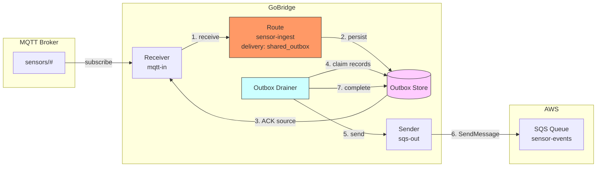
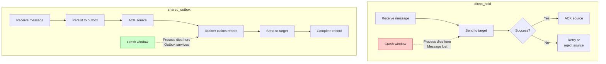
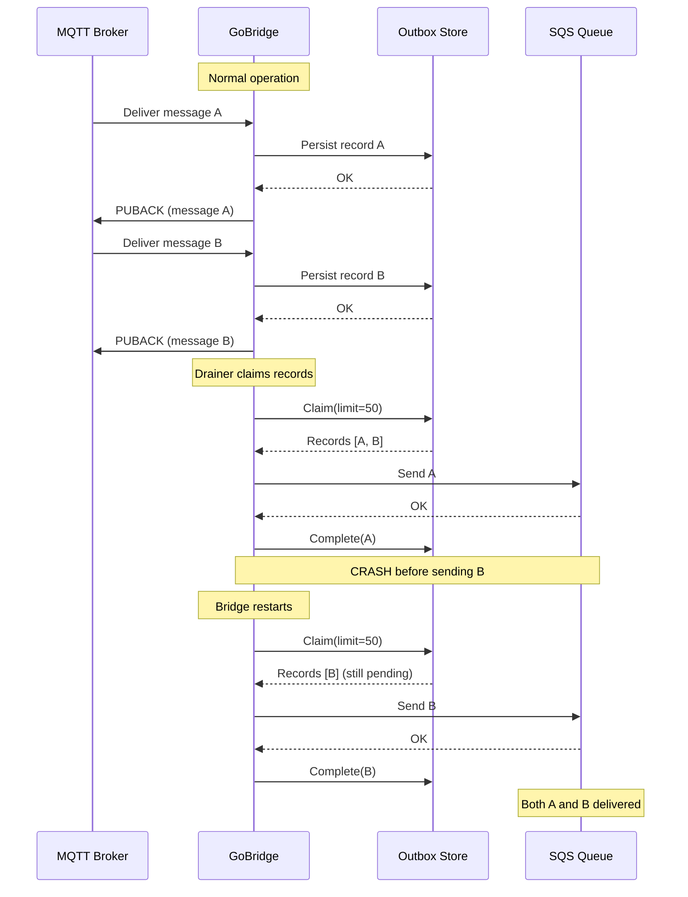

# Scenario 5: Durable Delivery with SharedOutbox

Guarantee zero message loss across bridge crashes by decoupling ingress from egress with a persistent outbox.

## Use Case

IoT sensor data arrives on MQTT and must reach an SQS queue for downstream processing. If the bridge crashes between receiving an MQTT message and sending it to SQS, the message must not be lost. The default `direct_hold` mode holds the source delivery open during send, but if the process dies mid-flight, the message is gone -- the MQTT broker already delivered it, and the SQS send never completed.

The `shared_outbox` delivery mode solves this by persisting messages to a durable store before acknowledging the source. A background drainer then reads from the outbox and delivers to the target. If the bridge crashes, the drainer picks up persisted records on restart.

## Architecture



## Direct Hold vs Shared Outbox

The two delivery modes represent fundamentally different trade-offs.



With `direct_hold`, the source delivery stays open while the target send runs. Fast and simple, but a crash between receive and ACK means the message is in limbo. MQTT QoS 1 will redeliver, but there is a window where the broker may consider the message delivered if the TCP connection was already clean.

With `shared_outbox`, the message is persisted before the source is acknowledged. The outbox survives crashes. After restart, the drainer finds pending records and delivers them.

## Configuration

```yaml
bridge:
  id: durable-sensor-ingest

sessions:
  - id: mqtt-conn
    transport: mqtt
    options:
      broker_url: tcp://mqtt.example.com:1883
      client_id: durable-ingest-01
      keep_alive: 30

stores:
  outbox:
    type: memory
  lease:
    type: memory

receivers:
  - id: mqtt-in
    session_id: mqtt-conn
    topics:
      - topic: "sensors/#"
        qos: 1

senders:
  - id: sqs-out
    transport: sqs
    options:
      queue_url: https://sqs.us-west-1.amazonaws.com/123456789/sensor-events
      region: us-west-1
      batch_size: 10

bindings:
  - id: to-sqs
    sender_id: sqs-out
    address: sensor-events

routes:
  - id: sensor-ingest
    receiver_id: mqtt-in
    delivery_mode: shared_outbox
    dispatch_mode: single
    bindings: [to-sqs]
    policy:
      ack_after: outbox_persist
      max_in_flight: 100
      max_outbox_depth: 10000
      max_replay_attempts: 5
      on_expired: dlq
      on_permanent_failure: dlq
    session:
      session_id: mqtt-conn
      sender_id: sqs-out
      drain_interval: 1s
      drain_batch_size: 50
```

## Config Walkthrough

### `delivery_mode: shared_outbox`

Switches the route from synchronous hold to asynchronous outbox-based delivery. The route pipeline persists the envelope into the outbox store instead of sending directly to the target. A background drainer process handles actual delivery.

### `ack_after` -- When to Acknowledge the Source

The `ack_after` policy field controls the trade-off between speed and guarantee strength.

| Value | Behavior | Trade-off |
|-------|----------|-----------|
| `outbox_persist` | ACK the source as soon as the outbox write succeeds | Fast ACK, message survives crashes in the outbox |
| `target_accept` | ACK only after the target sender confirms delivery | Slower, but end-to-end guarantee before ACK |

With `outbox_persist`, the MQTT PUBACK is sent the moment the outbox store confirms the write. The message is durable in the outbox but has not yet reached SQS. This is the recommended default for `shared_outbox` -- it keeps ingress latency low.

With `target_accept`, the source is not acknowledged until the drainer has successfully sent the message to SQS and marked the outbox record as completed. This provides the strongest guarantee but couples ingress throughput to egress latency.

### `stores.outbox`

The outbox store must be configured when using `shared_outbox` delivery mode.

```yaml
stores:
  outbox:
    type: memory
```

The `type` field selects the store backend:

| Type | Durability | Use Case |
|------|-----------|----------|
| `memory` | Process lifetime only | Development, testing, low-risk workloads |
| `sqlite` | Disk-persistent | Single-instance production without external DB |
| `dynamodb` | Cloud-durable | Multi-instance production, high availability |

For true crash survival, use `sqlite` or `dynamodb`. The `memory` store is useful for development but loses all pending records on process restart.

### `stores.lease`

The lease store coordinates outbox ownership in multi-instance deployments. The drainer acquires a lease before claiming outbox records, preventing duplicate delivery when multiple bridge instances share the same outbox store.

For single-instance deployments, `memory` is sufficient. For multi-instance, use `dynamodb` to ensure only one instance drains at a time.

### `max_outbox_depth`

```yaml
policy:
  max_outbox_depth: 10000
```

Limits the number of pending records in the outbox. When the depth reaches this limit, the route applies backpressure -- new messages from the receiver are blocked until the drainer reduces the queue. The default is 10,000 records.

This protects against unbounded memory growth when the target is down. The receiver pauses accepting deliveries, which in turn applies backpressure to the MQTT broker via QoS flow control.

### `max_replay_attempts`

```yaml
policy:
  max_replay_attempts: 5
```

The maximum number of times the drainer retries delivering an outbox record. After this limit, the record is moved to the DLQ (if `on_permanent_failure: dlq`) or dropped. The default is 5 attempts.

### Outbox Drainer

The drainer is a background goroutine that runs the following loop:

1. **Claim** -- Query the outbox store for pending records, marking them as claimed by this instance
2. **Send** -- Deliver each claimed record to the target sender
3. **Complete** -- Mark successfully sent records as completed
4. **Retry** -- Failed records are released back to pending with an incremented replay count
5. **Wait** -- Sleep for `drain_interval` before the next cycle

### `drain_interval` and `drain_strategy`

The `session.drain_interval` field sets a fixed polling interval:

```yaml
session:
  drain_interval: 1s
```

For more sophisticated polling, use `drain_strategy`:

```yaml
session:
  drain_strategy:
    type: adaptive_backoff
    min_interval: 100ms
    max_interval: 30s
    multiplier: 2.0
```

The `adaptive_backoff` strategy reduces polling frequency when the outbox is empty (saving resources) and increases it immediately when records are found (reducing latency). When `drain_strategy` is set, it takes precedence over `drain_interval`.

| Strategy | Behavior |
|----------|----------|
| `fixed_poll` | Always waits the configured interval between drain cycles |
| `adaptive_backoff` | Starts at `min_interval`, backs off by `multiplier` when empty, resets to `min_interval` when records are found |

## Crash Recovery

The following sequence shows what happens when the bridge crashes and restarts.



Record A was completed before the crash, so it is not re-sent. Record B was claimed but never completed -- the outbox store releases it back to pending status (the claim expires), and the new drainer instance picks it up.

## Key Decisions: When to Use Each Mode

| Criterion | `direct_hold` | `shared_outbox` |
|-----------|--------------|-----------------|
| Simplicity | Simple, no stores needed | Requires outbox + lease stores |
| Latency | Low (synchronous send) | Higher (persist + drain cycle) |
| Crash safety | Message may be lost on crash | Message survives in outbox |
| Throughput | Bounded by target latency | Ingress decoupled from egress |
| Multi-instance | Works independently | Requires lease coordination |
| Resource usage | Minimal | Outbox storage + drainer goroutine |

**Use `direct_hold` when:**
- Messages are non-critical or the source has its own redelivery (e.g., SQS visibility timeout)
- Simplicity is preferred over durability
- Latency is the primary concern

**Use `shared_outbox` when:**
- Zero message loss is a hard requirement
- The target may be temporarily unavailable (outbox buffers during outages)
- You need to decouple ingress throughput from egress latency
- Running multiple bridge instances that must coordinate delivery

## Variations

### SQLite Outbox for Disk Persistence

Replace the in-memory outbox with SQLite for single-instance crash survival:

```yaml
stores:
  outbox:
    type: sqlite
    options:
      path: /var/lib/gobridge/outbox.db
      wal_mode: true
  lease:
    type: memory
```

On crash and restart, the drainer finds all pending records and resumes delivery. WAL mode is recommended for concurrent read/write performance.

### DynamoDB Outbox for Multi-Instance

For multi-instance production deployments, both stores must use DynamoDB so that lease coordination and outbox access are shared across instances:

```yaml
stores:
  outbox:
    type: dynamodb
    options:
      table_name: gobridge-outbox
      region: us-west-1
  lease:
    type: dynamodb
    options:
      table_name: gobridge-leases
      region: us-west-1
```

### Adaptive Backoff Drain Strategy

Reduce DynamoDB read costs during idle periods. When messages flow, the drainer polls every 100ms. When the outbox is empty, it backs off (200ms, 400ms, 800ms, ... up to 30s) and resets to 100ms when records reappear:

```yaml
session:
  drain_batch_size: 100
  drain_strategy:
    type: adaptive_backoff
    min_interval: 100ms
    max_interval: 30s
    multiplier: 2.0
```

### DLQ for Failed Deliveries

After `max_replay_attempts` failed deliveries, records move to the DLQ store. Operators can inspect and replay entries via the HTTP admin API:

```yaml
stores:
  outbox:
    type: sqlite
    options:
      path: /var/lib/gobridge/outbox.db
  dlq:
    type: sqlite
    options:
      path: /var/lib/gobridge/dlq.db

routes:
  - id: sensor-ingest
    receiver_id: mqtt-in
    delivery_mode: shared_outbox
    bindings: [to-sqs]
    policy:
      max_replay_attempts: 3
      on_permanent_failure: dlq
      on_expired: dlq
```

### Target Accept ACK for Strongest Guarantees

Delay the MQTT PUBACK until the target sender confirms delivery. Slower, but appropriate for financial or regulatory data:

```yaml
policy:
  ack_after: target_accept
  max_in_flight: 50
```

### Combined: Durable Fan-Out

Combine `shared_outbox` with `fan_out` dispatch. Each binding gets its own outbox record, and the drainer delivers independently:

```yaml
routes:
  - id: durable-fanout
    receiver_id: mqtt-in
    delivery_mode: shared_outbox
    dispatch_mode: fan_out
    bindings: [to-sqs, to-archive]
    policy:
      ack_after: outbox_persist
      max_outbox_depth: 5000
```
