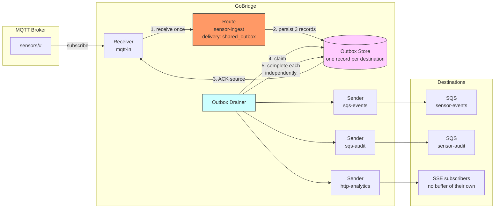
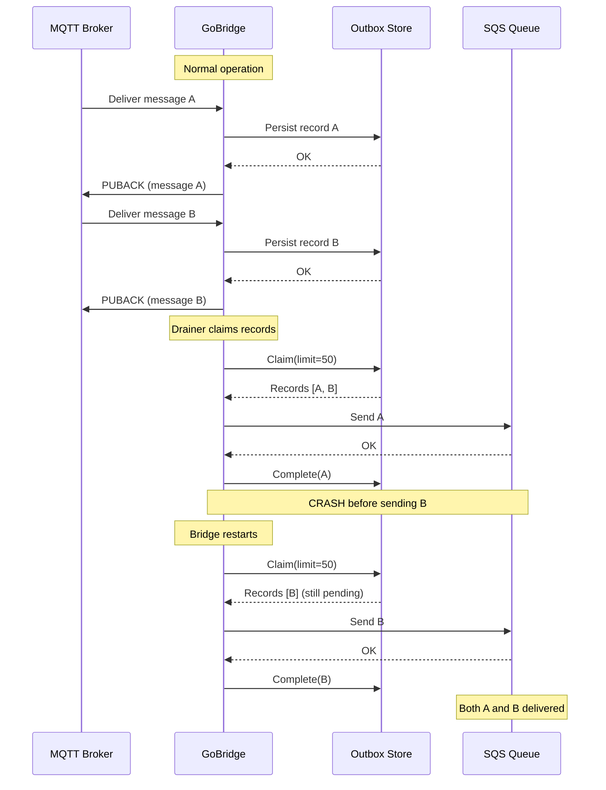

# Scenario 5: Fan-out and Back-pressure with SharedOutbox

Decouple ingress from egress with a persistent outbox, and keep per-destination
progress across a crash when one message has several destinations.

> **An outbox is not crash protection.** Read the next three lines before
> reaching for one.

## What the outbox does NOT do

An outbox does not protect you from a crash. The bridge only tells the source a
message is handled once the work is finished, so if it dies the source simply
sends the message again — and that is just as true when it dies before writing
to the outbox as when it dies before reaching the destination. All the outbox
changes is where the message waits, and it adds one more system that has to be
working for anything to get through.

## Use Case

What the outbox is actually for is below, and this scenario is built on the
first of them: IoT sensor data arrives on MQTT and must reach **several**
destinations, and a crash after three of five have accepted must not replay all
five. Source redelivery cannot express partial progress — the outbox records it
per destination. The same store then absorbs a destination outage without
holding the source open for its duration.

## Architecture



One message in, three destinations out. The outbox holds a record per
destination, so each is completed on its own — and the HTTP endpoint, which
cannot hold a request open while the bridge waits and has no queue of its own,
is retried without replaying the two that already accepted.

## Direct Hold vs Shared Outbox

Both modes survive a crash the same way: the source was never told the message
was handled, so it sends it again. The difference shows up only when there is
more than one destination.

```mermaid
flowchart TD
    subgraph "direct_hold — one destination"
        DH1[Receive] --> DH2[Send]
        DH2 --> DH3{Accepted?}
        DH3 -->|Yes| DH4[Tell the source it is handled]
        DH3 -->|No| DH5[Retry, then reject]
        DH6["Crash anywhere before DH4"] -.->|Source was never told\nSo it sends it again| DH1
    end

    subgraph "direct_hold — three destinations"
        M1[Receive] --> M2[Send to A ok]
        M2 --> M3[Send to B ok]
        M3 --> M4["Crash before C"]
        M4 -.->|Source sends it again\nA and B get a duplicate| M1
    end

    subgraph "shared_outbox — three destinations"
        SO1[Receive] --> SO2[Write one record per destination]
        SO2 --> SO3[Tell the source it is handled]
        SO3 --> SO4[A done] --> SO5[B done] --> SO6["Crash before C"]
        SO6 -.->|Restart: A and B already done\nOnly C is sent| SO7[C done]
        SO8["Crash before SO2"] -.->|Source was never told\nSo it sends it again| SO1
    end

    style DH6 fill:#ffd,stroke:#cc3
    style SO8 fill:#ffd,stroke:#cc3
    style M4 fill:#fcc,stroke:#c33
    style SO7 fill:#cfc,stroke:#3c3
```



Read the two yellow boxes together: they are the same crash, with the same
recovery, in both modes. The outbox earns its place in the red box — replaying
every destination because one of them had not been reached yet.

## Configuration

```yaml
bridge:
  id: durable-sensor-ingest

sessions:
  - id: mqtt-conn
    transport: mqtt
    options:
      session:
        broker_url: tcp://mqtt.example.com:1883
        client_id: durable-ingest-01
        keep_alive: 30

stores:
  outbox:
    type: sqlite
    options:
      path: /var/lib/gobridge/outbox.db
  lease:
    # A crash-durable outbox REQUIRES a crash-durable lease. The outbox
    # persists a per-partition fencing high-water-mark; an in-memory lease
    # renumbers its fencing versions from zero on every restart and would then
    # claim below that mark and be fenced out forever. The bridge rejects that
    # pairing at startup, so a durable outbox pairs with dynamodb.
    type: dynamodb
    options:
      table_name: gobridge-leases

receivers:
  - id: mqtt-in
    session_id: mqtt-conn
    topics:
      - topic: "sensors/#"
        qos: 1

senders:
  - id: sqs-events
    transport: sqs
    options:
      queue_url: https://sqs.us-west-1.amazonaws.com/123456789/sensor-events
      region: us-west-1
      batch_size: 10
  - id: sqs-audit
    transport: sqs
    options:
      queue_url: https://sqs.us-west-1.amazonaws.com/123456789/sensor-audit
      region: us-west-1
      batch_size: 10
  # The destination that cannot buffer for itself. It is the reason this route
  # keeps its own record of what has been accepted: an SSE stream with nobody
  # attached has nowhere to hold the message, and replaying it would also replay
  # the two queues above.
  - id: http-analytics
    transport: http
    options:
      mode: sse
      path: /analytics/v1/sensors
      heartbeat_interval: 30s

bindings:
  - id: to-events
    sender_id: sqs-events
    address: sensor-events
  - id: to-audit
    sender_id: sqs-audit
    address: sensor-audit
  - id: to-analytics
    sender_id: http-analytics
    address: /analytics/v1/sensors

routes:
  - id: sensor-ingest
    receiver_id: mqtt-in
    delivery_mode: shared_outbox
    # One message, three destinations, each completed on its own.
    dispatch_mode: fan_out
    bindings: [to-events, to-audit, to-analytics]
    policy:
      ack_after: outbox_persist
      max_in_flight: 100
      max_outbox_depth: 10000
      max_replay_attempts: 5
      on_expired: dlq
      on_permanent_failure: dlq
    session:
      session_id: mqtt-conn
      sender_id: sqs-events
      drain_interval: 1s
      drain_batch_size: 50
```

> **Note on the SQS binding `address`.** The SQS sender is pinned to one queue via its `queue_url` or `queue_name`. The binding `address` may be the bare queue name (as here, `sensor-events`) or the full queue URL -- either form is matched to that bound queue rather than routing per message.

The field-by-field walkthrough of the configuration above is on its own page: [Durable shared outbox — config walkthrough](05-durable-shared-outbox-walkthrough.md).

## Crash Recovery

The following sequence shows what happens when the bridge crashes and restarts.



Record A was completed before the crash, so it is not re-sent. Record B was claimed but never completed -- the outbox store releases it back to pending status (the claim expires), and the new drainer instance picks it up.

### Transient Failures vs. Crash Recovery

Two distinct paths return a claimed record to `pending`:

- **Transient send failure, owner still alive** (for example, the target broker briefly disconnects). The drainer returns the record to `pending` immediately, so the same owner re-claims and retries it on the very next drain -- no fencing-version bump and no wall-clock wait. This live-owner release is available on the `memory`, `sqlite`, and `dynamodb` stores. Each retry increments the replay count, so a persistently failing record still reaches the DLQ once it exceeds `max_replay_attempts`.
- **Crash recovery, owner gone.** A dead instance cannot release anything. `dynamodb` additionally reclaims a record whose claim has gone stale past a wall-clock threshold, allowing another instance to take over. The `memory` and `sqlite` stores have no wall-clock reclaim; a restarted single instance recovers its own records when it re-acquires the lease at a higher fencing version.

## Key Decisions: When to Use Each Mode

| Criterion | `direct_hold` | `shared_outbox` |
|-----------|--------------|-----------------|
| Simplicity | Simple, no stores needed | Requires outbox + lease stores |
| Latency | Low (synchronous send) | Higher (persist + drain cycle) |
| Crash safety | No loss -- the source is not acknowledged until the target accepts, so it redelivers | No loss, but for the same reason: the source is not acknowledged until the outbox write completes. The outbox adds nothing here |
| Per-destination progress | A crash replays every destination | Recorded per destination; a crash replays only what had not been accepted |
| Throughput | Bounded by target latency | Ingress decoupled from egress |
| Multi-instance | No fencing token at the sender boundary | Fenced by the owning session |
| Resource usage | Minimal | Outbox storage + drainer goroutine, and one more system in series |

**Use `direct_hold` for any single-destination route.** The source delivery is
held open until the egress succeeds, so a crash means the source redelivers --
an SQS visibility window, or an unsent MQTT PUBACK, both work. The source is
already the durable buffer, and an outbox in front of it does not add a copy:
with `ack_after: outbox_persist` the source is settled the moment the record is
persisted, so the outbox **moves** the durable copy from the source into a
store you operate, and makes the route depend on three systems instead of two.

**Use `shared_outbox` when:**
- One message fans out to several destinations and a partial success must survive a crash -- source redelivery cannot express "three of five accepted"
- The target may be unavailable long enough that holding the source open is not viable, and you would rather own the buffer than let the source's redelivery window expire
- You need to decouple ingress throughput from egress latency
- Several instances share an exclusive session and the duplicate-send window across failover must be fenced

Note that none of these is "so a crash does not lose the message". That is
already true without an outbox, on any source the bridge can withhold
acknowledgement from.

## Variations

### SQLite Outbox for Disk Persistence

Replace the in-memory outbox with SQLite for single-instance crash survival.
The lease must be durable too — see the pairing rule below:

```yaml
stores:
  outbox:
    type: sqlite
    options:
      path: /var/lib/gobridge/outbox.db
  lease:
    type: dynamodb
    options:
      table_name: gobridge-leases
```

On crash and restart, the drainer finds all pending records and resumes
delivery. WAL journalling is always enabled. The store keeps a single writer
connection with a `busy_timeout`, so concurrent in-process writers serialise
safely rather than failing with `SQLITE_BUSY`.

**Recovering in-flight (claimed-but-not-completed) records.** A record that was
claimed by a drainer that then crashed before completing or releasing it is
recovered two ways: a higher lease fencing version reclaims it immediately, and
— as a same-owner fallback — the `stale_claim_duration` window (auto-derived
from `step_down_grace`, or set explicitly) lets it be re-claimed once the claim
goes stale. The native SQLite outbox now honours `stale_claim_duration` for this
fallback, matching the DynamoDB backend.

> **Pairing rule: a volatile lease may not back a durable outbox.** The
> in-memory lease store numbers fencing versions from a per-process counter that
> restarts at zero, while the SQLite and DynamoDB outboxes persist a
> per-partition fencing high-water-mark and reject every claim below it. After a
> restart — once the durable mark has passed 1, which one prior re-acquire is
> enough to do — the new owner claims below the mark, is rejected as stale, and
> the partition never drains again while ingress keeps acknowledging into it.
> The builder therefore REJECTS `lease: memory` with a `sqlite` or `dynamodb`
> outbox at startup. The two supported postures are a durable lease with a
> durable outbox (production), and an in-memory lease with an in-memory outbox
> (development, and only with `acknowledge_volatile: true` — see the store
> reference in [processors-and-stores](../processors-and-stores.md)).
>
> **A SQLite outbox with a DynamoDB lease is still single-replica.** The lease
> is cluster-wide but the database file is node-local, so a second replica
> ingests into its OWN outbox file and cannot drain it until it happens to win
> the lease. Run exactly one replica on this pairing; for real multi-instance
> operation both stores must be DynamoDB (next section).

### DynamoDB Outbox for Multi-Instance

For multi-instance production deployments, both stores must use DynamoDB so that lease coordination and outbox access are shared across instances:

```yaml
stores:
  outbox:
    type: dynamodb
    options:
      table_name: gobridge-outbox
      region: us-west-1
  lease:
    type: dynamodb
    options:
      table_name: gobridge-leases
```

**Standby readiness.** Only the lease holder drains; standby instances hold their drainers idle until they win the lease. The active drainer also gates each cycle on egress-transport readiness -- when the target session is disconnected, it skips the drain instead of running failing Claim+Send cycles. This keeps a broker outage from silently burning the replay budget and poisoning healthy records while the target is simply unreachable.

### Adaptive Backoff Drain Strategy

Reduce DynamoDB read costs during idle periods. When messages flow, the drainer polls every 100ms. When the outbox is empty, it backs off (200ms, 400ms, 800ms, ... up to 30s) and resets to 100ms when records reappear:

```yaml
session:
  drain_batch_size: 100
  drain_strategy:
    type: adaptive_backoff
    min_interval: 100ms
    max_interval: 30s
    multiplier: 2.0
```

### DLQ for Failed Deliveries

A record reaches the DLQ store on a permanent send error (immediately) or on replay-count exhaustion once it has also spent its `replay_budget` -- the wall-clock from the first delivery attempt, default 15m (legacy records without a recorded first attempt fall back to the `CreatedAt` age gate). Operators can inspect and replay entries via the HTTP admin API:

```yaml
stores:
  outbox:
    type: sqlite
    options:
      path: /var/lib/gobridge/outbox.db
  dlq:
    type: sqlite
    options:
      path: /var/lib/gobridge/dlq.db

routes:
  - id: sensor-ingest
    receiver_id: mqtt-in
    delivery_mode: shared_outbox
    dispatch_mode: fan_out
    bindings: [to-events, to-audit, to-analytics]
    policy:
      max_replay_attempts: 3
      on_permanent_failure: dlq
      on_expired: dlq
```

**DLQ writes are session-fenced.** Before writing an entry, the DLQ router checks the lease for the session that owns the failing route. The check is scoped to that session: a route with no exclusive session (empty session ID, or an ingress failure with no owning session) is never blocked, so a standby can DLQ its own unfenced ingress failures, while an unrelated instance's lease can no longer authorize a write for a route it does not own. The write is confirmed durable before the source delivery or outbox record is settled -- if the DLQ write fails, the record is left claimed for redelivery rather than lost. The gate is best-effort (the lease token is not passed to the store write), so a lease lost mid-write can produce a duplicate entry, never a lost one.

**Conservation law.** Every received message ends in exactly one terminal state, and the runtime metrics account for all of them: `MessagesReceived = MessagesSent + MessagesDropped + MessagesFiltered + MessagesExpired + DLQEntries + in-flight`. A rising `MessagesDropped` (terminated with neither a send nor a DLQ record) is the single signal for silent loss. `MessagesExpired` covers TTL drops (route-expired ingress and the drainer's expire sweep); `MessagesFiltered` covers deliberate processor discards. Watch these series together to prove the outbox is losing nothing.

### Strongest Guarantee: Keep `outbox_persist`

For `shared_outbox` the strongest source guarantee IS `outbox_persist` -- the
source is ACKed only after the message is durable in the outbox, so a crash never
loses it. There is no "wait for the target" variant on this delivery mode:
`ack_after: target_accept` is rejected at startup (`runtime/validator.go`),
because the drainer delivers to the target asynchronously and the source ACK cannot
be deferred that far.

If your requirement is that the source stay unacknowledged until the *target*
confirms delivery -- for example financial or regulatory data where you accept
coupling ingress throughput to egress latency -- use `direct_hold` instead of
`shared_outbox`:

```yaml
routes:
  - id: sensor-ingest
    receiver_id: mqtt-in
    delivery_mode: direct_hold
    dispatch_mode: single
    bindings: [to-events]
    policy:
      ack_after: target_accept   # direct_hold default; the source is held open until the target accepts
      max_in_flight: 50
```

This gives up nothing in crash safety — the source is still not acknowledged
until the destination accepts, so a crash still means redelivery — and it gives
up the outbox store, its lease and a hop. What it costs is the two things the
outbox is for: there is no per-destination progress to resume from, so it suits
one destination, and there is no buffer, so a destination outage holds the
source open until its own redelivery window runs out.

### Combined: Durable Fan-Out

This is the shape the main configuration above already uses, restated on its
own: each binding gets its own outbox record and the drainer completes them
independently, so a destination that was already accepted is not replayed when
another one has to be retried.

```yaml
routes:
  - id: durable-fanout
    receiver_id: mqtt-in
    delivery_mode: shared_outbox
    dispatch_mode: fan_out
    bindings: [to-events, to-audit, to-analytics]
    policy:
      ack_after: outbox_persist
      max_outbox_depth: 5000
```
