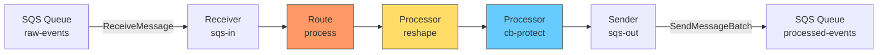
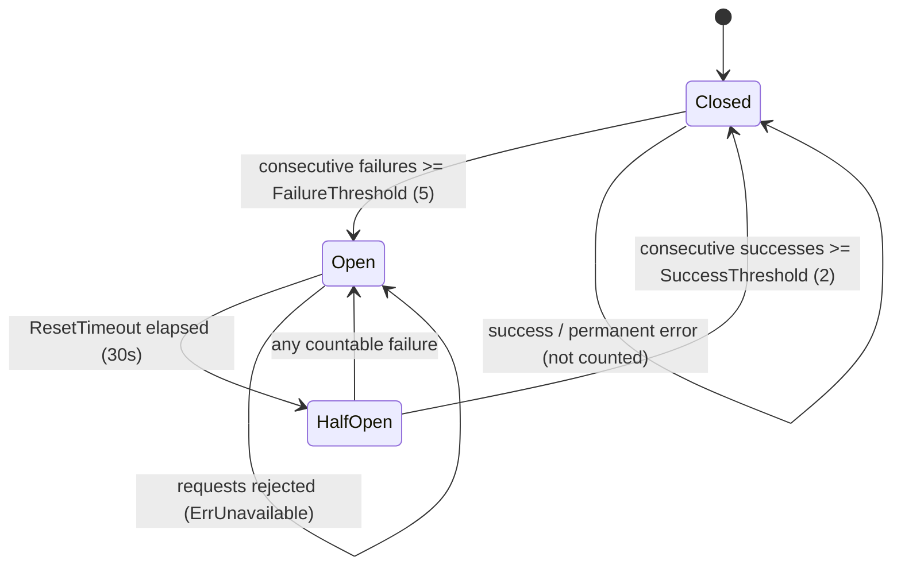

# Scenario 6: Transform + Circuit Breaker Pipeline

Reshape JSON payloads and protect downstream services with a circuit breaker -- all inside the processor chain.

## Use Case

An SQS queue receives JSON events with a deeply nested structure from upstream producers. Before forwarding to a downstream SQS processing queue, you need to:

1. **Flatten** nested fields into a simpler schema (rename, type-convert, encode).
2. **Protect** the downstream service with a circuit breaker so transient failures do not cascade into retry storms.

The two processors run in sequence: transform first, circuit breaker second.

## Processor Chain



Messages flow left to right: receive, reshape the payload, check the circuit breaker, dispatch. If the breaker is open, the message is rejected with `ErrUnavailable` and the runtime applies its retry/backoff policy.

## Configuration

```yaml
bridge:
  id: transform-cb-pipeline

receivers:
  - id: sqs-in
    transport: sqs
    options:
      queue_url: https://sqs.us-west-1.amazonaws.com/123456789/raw-events
      region: us-west-1
      max_messages: 10
      wait_time_seconds: 20
      visibility_timeout: 60

senders:
  - id: sqs-out
    transport: sqs
    options:
      queue_url: https://sqs.us-west-1.amazonaws.com/123456789/processed-events
      region: us-west-1
      batch_size: 10

bindings:
  - id: to-processed
    sender_id: sqs-out
    address: processed-events

routes:
  - id: process
    receiver_id: sqs-in
    delivery_mode: direct_hold
    dispatch_mode: single
    bindings: [to-processed]
    processors: [reshape, cb-protect]
    policy:
      max_in_flight: 50
      on_permanent_failure: dlq
      on_expired: dlq
```

## Config Walkthrough

### `processors: [reshape, cb-protect]`

The route references two processor names. These are **not** defined in YAML -- they are registered programmatically in Go and the names must match exactly. The chain executes left to right: `reshape` runs first, then `cb-protect`.

### `policy.max_in_flight: 50`

Limits concurrent messages in the pipeline to 50. When the limit is reached, the receiver pauses polling. This prevents the circuit breaker from being overwhelmed during recovery.

### `policy.on_permanent_failure: dlq`

Messages that hit a permanent error (invalid payload, schema violation) are routed to the DLQ store instead of being silently dropped. Requires a `stores.dlq` block if you want persistence.

## Processor Registration (Go)

Both processors are created in Go and registered on the builder before `Build()` is called.

### Transform Processor

```go
transformProc := transform.New(transform.Config{
    Name: "reshape",
    Mappings: []transform.FieldMapping{
        {Source: "$.event.user.name", Target: "username", Transform: "string"},
        {Source: "$.event.timestamp", Target: "ts", Transform: "int"},
        {Source: "$.event.data.value", Target: "reading", Transform: "float", DefaultValue: 0.0},
        {Source: "$.event.raw", Target: "encoded", Transform: "base64encode"},
    },
    DropUnmapped: false,
    FailOnError:  true,
})
```

### Circuit Breaker Processor

```go
cbProc := circuitbreaker.New("cb-protect", circuitbreaker.Config{
    FailureThreshold:  5,
    SuccessThreshold:  2,
    ResetTimeout:      30 * time.Second,
    HalfOpenMaxProbes: 1,
}, circuitbreaker.WithKeyExtractor(circuitbreaker.GlobalKey()))
```

### Builder Wiring

```go
cfg, _ := config.ParseFile("bridge.yaml", config.FormatAuto)

rt, _ := bridge.NewBuilder(cfg, bridge.WithLogger(logger)).
    RegisterTransport("sqs", sqs.NewBridgeFactory(logger)).
    RegisterProcessor("reshape", transformProc).
    RegisterProcessor("cb-protect", cbProc).
    RegisterStoreFactory("memory", nativestore.NewMemoryStoreFactory()).
    Build(ctx)

rt.Start(ctx)
```

The names `"reshape"` and `"cb-protect"` passed to `RegisterProcessor` must match the strings in the YAML `processors` list. If a name is missing, the builder returns an error.

## Circuit Breaker State Machine



**Key behavior:** When the breaker is Open, every message receives an `ErrUnavailable` error (class: `transient`). The runtime treats this as a recoverable failure and retries according to the route backoff policy.

## Deep Dive: Transform Processor

The transform processor extracts fields from a JSON payload using JSONPath expressions, applies type conversions, and writes the results into a new (or merged) output payload.

### FieldMapping Fields

| Field | Type | Required | Description |
|-------|------|----------|-------------|
| `Source` | string | yes | JSONPath expression (e.g. `$.event.user.name`) |
| `Target` | string | yes | Output field in dot notation (e.g. `username`) |
| `Transform` | string | no | Type conversion to apply (see table below) |
| `DefaultValue` | any | no | Fallback value when source path is not found |
| `Required` | bool | no | Fail the message if source path cannot be resolved |

### Transform Types

| Type | Input | Output | Example |
|------|-------|--------|---------|
| `string` | any | string | `42` becomes `"42"` |
| `int` | numeric/string | int64 | `"42"` becomes `42` |
| `float` | numeric/string | float64 | `"3.14"` becomes `3.14` |
| `bool` | truthy/string | bool | `"true"` becomes `true` |
| `base64encode` | string/bytes | base64 string | `"hello"` becomes `"aGVsbG8="` |
| `base64decode` | base64 string | raw bytes | `"aGVsbG8="` becomes `"hello"` |

### DropUnmapped Behavior

- **`false` (default)** -- Original payload fields are preserved. Mapped fields are applied on top, overwriting collisions. Use this when you want to enrich without losing context.
- **`true`** -- Only fields produced by mappings appear in the output. The original payload is discarded. Use this when the downstream consumer expects a strict schema.

### FailOnError Behavior

- **`false` (default)** -- Mapping errors for individual fields are skipped silently. Other mappings still apply. The message continues through the chain.
- **`true`** -- Any mapping error (missing required source, type conversion failure) fails the message immediately. The error is classified as `rejected` (permanent), which routes it to the DLQ if `on_permanent_failure: dlq` is set.

### Example: Input and Output

Given this input payload:

```json
{
  "event": {
    "user": { "name": "alice" },
    "timestamp": 1711629000,
    "data": { "value": 23.5 },
    "raw": "sensor-data-bytes"
  },
  "metadata": { "version": 3 }
}
```

With `DropUnmapped: false`, the output payload is:

```json
{
  "event": { "user": { "name": "alice" }, "timestamp": 1711629000, "data": { "value": 23.5 }, "raw": "sensor-data-bytes" },
  "metadata": { "version": 3 },
  "username": "alice",
  "ts": 1711629000,
  "reading": 23.5,
  "encoded": "c2Vuc29yLWRhdGEtYnl0ZXM="
}
```

With `DropUnmapped: true`, only the mapped fields remain:

```json
{
  "username": "alice",
  "ts": 1711629000,
  "reading": 23.5,
  "encoded": "c2Vuc29yLWRhdGEtYnl0ZXM="
}
```

## Deep Dive: Circuit Breaker

### What Trips the Breaker

By default, only **transient (recoverable) errors** count toward the failure threshold. The breaker uses `domain.IsRecoverableError()` to classify errors:

| Error Class | Counted | Examples |
|-------------|---------|----------|
| `transient` | yes | `ErrTimeout`, `ErrConnectionLost`, `ErrUnavailable`, `ErrThrottled` |
| `permanent` | no | `ErrNotAuthorized`, `ErrForbidden`, `ErrProtocolError` |
| `rejected` | no | `ErrInvalidPayload`, `ErrSchemaViolation`, `ErrPayloadTooLarge` |
| `expired` | no | `ErrMessageExpired` |

This means a burst of bad payloads will not trip the breaker. Only genuine infrastructure problems (DNS failure, connection timeout, rate limiting) open the circuit.

### Key Extraction Strategies

The circuit breaker is partitioned by key. Different strategies provide different isolation granularity:

| Strategy | Function | Behavior |
|----------|----------|----------|
| Global | `circuitbreaker.GlobalKey()` | Single breaker for all messages. One failing destination opens the breaker for everyone. |
| Subject | `circuitbreaker.SubjectKey()` | Separate breaker per `Envelope.Subject`. Failure on topic A does not affect topic B. |
| Header | `circuitbreaker.HeaderKey("tenant-id")` | Separate breaker per header value. Tenant isolation -- one tenant's failures do not block others. |

### State Transition Details

- **Closed to Open**: After `FailureThreshold` (5) consecutive transient errors, the breaker opens. All subsequent requests are immediately rejected with `ErrUnavailable`.
- **Open to HalfOpen**: After `ResetTimeout` (30s) elapses, the breaker allows `HalfOpenMaxProbes` (1) probe request through.
- **HalfOpen to Closed**: If `SuccessThreshold` (2) consecutive probes succeed, the breaker closes and normal traffic resumes.
- **HalfOpen to Open**: If any probe fails with a countable error, the breaker re-opens for another `ResetTimeout` period.

## Variations

### Per-Subject Circuit Breakers

Isolate failures by MQTT topic or SQS message subject:

```go
cbProc := circuitbreaker.New("cb-protect", circuitbreaker.Config{
    FailureThreshold:  5,
    SuccessThreshold:  2,
    ResetTimeout:      30 * time.Second,
    HalfOpenMaxProbes: 1,
}, circuitbreaker.WithKeyExtractor(circuitbreaker.SubjectKey()))
```

### Base64 Decode (Incoming Encoded Payloads)

If upstream sends base64-encoded fields, decode them during transform:

```go
transform.FieldMapping{
    Source:    "$.event.encodedData",
    Target:   "rawData",
    Transform: "base64decode",
}
```

### Drop Unmapped Fields for Strict Schema

When the downstream consumer requires a minimal, well-defined schema:

```go
transformProc := transform.New(transform.Config{
    Name:         "strict-reshape",
    DropUnmapped: true,
    FailOnError:  true,
    Mappings: []transform.FieldMapping{
        {Source: "$.event.user.name", Target: "username", Transform: "string", Required: true},
        {Source: "$.event.timestamp", Target: "ts", Transform: "int", Required: true},
    },
})
```

With `DropUnmapped: true` and `Required: true`, any message missing required fields is rejected and routed to the DLQ.

### Custom Error Classifier

Override which errors trip the breaker:

```go
cbProc := circuitbreaker.New("cb-protect", circuitbreaker.Config{
    FailureThreshold: 5,
    ResetTimeout:     30 * time.Second,
    CountError: func(err error) bool {
        // Only count timeout and connection errors
        be, ok := domain.AsBridgeError(err)
        if !ok {
            return true
        }
        return be.Code == domain.ErrCodeTimeout ||
               be.Code == domain.ErrCodeConnectionLost
    },
}, circuitbreaker.WithKeyExtractor(circuitbreaker.GlobalKey()))
```

### Adding a DLQ Store

To persist permanently failed messages, add a DLQ store:

```yaml
stores:
  dlq:
    type: memory

routes:
  - id: process
    receiver_id: sqs-in
    delivery_mode: direct_hold
    dispatch_mode: single
    bindings: [to-processed]
    processors: [reshape, cb-protect]
    policy:
      max_in_flight: 50
      on_permanent_failure: dlq
      on_expired: dlq
```

For production durability, replace `memory` with `sqlite` (single instance) or `dynamodb` (clustered).
