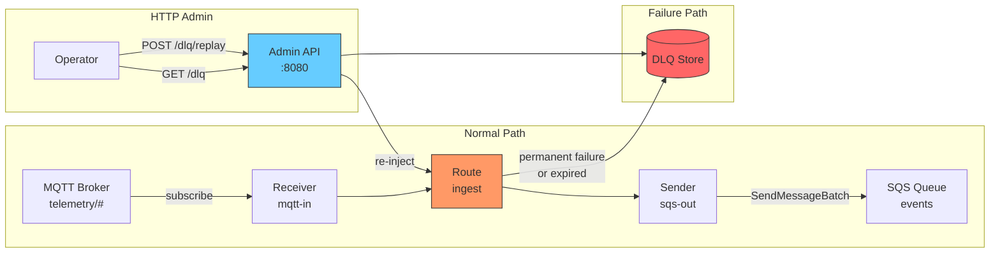
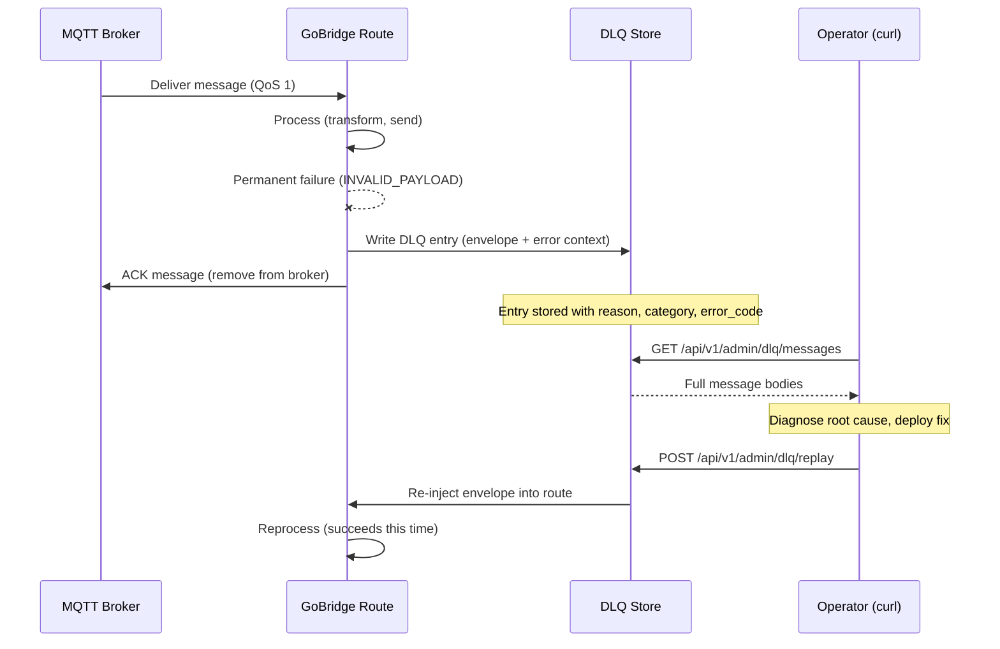
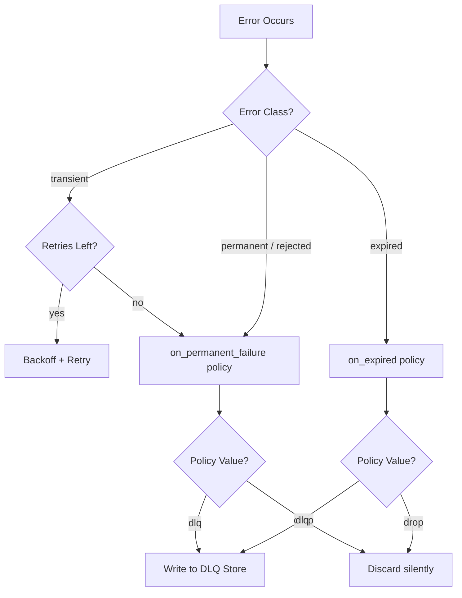

# Scenario 7: DLQ with HTTP API Management

Route permanently failed messages to a dead-letter queue and manage them through the HTTP admin API.

## Use Case

An MQTT-to-SQS bridge processes telemetry data. Some messages fail permanently -- malformed JSON, authentication errors, or expired TTLs. Instead of silently dropping these messages, you want to:

1. **Capture** failed messages in a dead-letter queue with full error context.
2. **Inspect** DLQ entries through an HTTP API to diagnose problems.
3. **Replay** correctable entries back into the pipeline after fixing the root cause.
4. **Purge** old entries that are no longer relevant.

## Architecture



## Configuration

```yaml
bridge:
  id: dlq-managed-bridge

sessions:
  - id: mqtt-conn
    transport: mqtt
    options:
      broker_url: tcp://mqtt.example.com:1883
      client_id: dlq-bridge-01

receivers:
  - id: mqtt-in
    session_id: mqtt-conn
    topics:
      - topic: "telemetry/#"
        qos: 1

senders:
  - id: sqs-out
    transport: sqs
    options:
      queue_url: https://sqs.us-west-1.amazonaws.com/123456789/events
      region: us-west-1
      batch_size: 10

bindings:
  - id: to-events
    sender_id: sqs-out
    address: events

stores:
  dlq:
    type: memory

routes:
  - id: ingest
    receiver_id: mqtt-in
    delivery_mode: direct_hold
    dispatch_mode: single
    bindings: [to-events]
    policy:
      max_in_flight: 100
      max_replay_attempts: 3
      on_permanent_failure: dlq
      on_expired: dlq
      backoff:
        initial_interval: 1s
        max_interval: 30s
        multiplier: 2.0

http:
  admin_addr: ":8080"
  monitor_addr: ":8081"
  admin_api_key: "change-me-to-a-real-secret-key"
```

## Config Walkthrough

### `stores.dlq: { type: memory }`

The DLQ store holds failed message entries. The `memory` type is suitable for development and single-instance deployments, but entries are lost on restart. See **Variations** for persistent options.

### `policy.on_permanent_failure: dlq`

When a message encounters a **non-recoverable error** -- invalid payload, authentication rejection, schema violation -- the runtime routes it to the DLQ store. The alternative value `drop` silently discards the message.

### `policy.on_expired: dlq`

When a message exceeds its TTL, it is routed to the DLQ instead of being dropped. This catches messages that spent too long in retry loops or were delayed in transit.

### `policy.max_replay_attempts: 3`

Transient errors are retried up to 3 times with exponential backoff. After exhausting retries, the message follows the `on_permanent_failure` policy -- in this case, DLQ.

### HTTP Configuration

- **`admin_api_key`** -- Must be at least 16 characters. The server refuses to start with a shorter key. Required for all admin endpoints.
- **`admin_addr: ":8080"`** -- Control operations: bridge start/stop, DLQ management, message injection. All endpoints require authentication.
- **`monitor_addr: ":8081"`** -- Health probes (unauthenticated) and topology inspection (authenticated).

## HTTP API: DLQ Operations

All admin endpoints require the API key via the `X-API-Key` header or `Authorization: Bearer <key>`. Key comparison uses SHA-256 constant-time hashing to prevent timing attacks. Failed auth returns HTTP 401 with a `WWW-Authenticate: Bearer realm="gobridge-admin"` header.

### DLQ Summary

```bash
curl -s -H "X-API-Key: change-me-to-a-real-secret-key" \
  "http://localhost:8080/api/v1/admin/dlq" | jq .
```

```json
{ "configured": true, "count": 1 }
```

All DLQ endpoints return HTTP 404 with `{"error": "no DLQ store configured"}` when no DLQ store is present.

### Retrieve DLQ Messages

Paginated message listing with filtering. Supports `route_id`, `category`, `since`, `before`, `limit` (max 1000), and `offset` parameters.

```bash
curl -s -H "X-API-Key: change-me-to-a-real-secret-key" \
  "http://localhost:8080/api/v1/admin/dlq/messages?route_id=ingest&limit=10" | jq .
```

```json
{
  "messages": [
    {
      "id": "dlq-001", "route_id": "ingest", "binding_id": "to-events",
      "source_id": "mqtt-in", "correlation_id": "corr-abc-123",
      "subject": "telemetry/temperature/sensor-42",
      "reason": "invalid payload", "category": "rejected",
      "error_code": "INVALID_PAYLOAD",
      "last_error": "json: cannot unmarshal string into Go value of type int",
      "failed_at": "2026-03-28T10:15:30Z", "attempts": 3
    }
  ],
  "total": 1, "limit": 10, "offset": 0
}
```

### Replay DLQ Entries

Re-inject entries back into their original route. Maximum 1000 IDs per request.

```bash
curl -s -X POST -H "X-API-Key: change-me-to-a-real-secret-key" \
  -H "Content-Type: application/json" \
  -d '{"ids": ["dlq-001", "dlq-002"]}' \
  "http://localhost:8080/api/v1/admin/dlq/replay" | jq .
```

```json
{ "replayed": 2 }
```

### Purge DLQ Entries

Permanently delete all expired entries up to the current time.

```bash
curl -s -X POST -H "X-API-Key: change-me-to-a-real-secret-key" \
  "http://localhost:8080/api/v1/admin/dlq/purge" | jq .
```

```json
{ "purged": 5 }
```

## DLQ Lifecycle Sequence



## Deep Dive: When Each Failure Policy Triggers

### `on_expired: dlq` -- TTL Exceeded

Triggers when `now > envelope.ExpiresAt`. Common causes: message sat too long in the source queue, transient retries consumed more time than TTL allows, or a circuit breaker held the message open. Error class: `expired`, code: `MESSAGE_EXPIRED`.

### `on_permanent_failure: dlq` -- Unrecoverable Error

Triggers in two scenarios:

**Immediate permanent failure** -- First attempt returns class `permanent` or `rejected`:
- `INVALID_PAYLOAD`, `NOT_AUTHORIZED`, `FORBIDDEN`, `PAYLOAD_TOO_LARGE`, `SCHEMA_VIOLATION`

**Exhausted retries** -- Transient errors (`TIMEOUT`, `CONNECTION_LOST`, `UNAVAILABLE`, `THROTTLED`) persist beyond `max_replay_attempts`.

### Decision Flow



## Monitor Endpoints

The monitor server (`:8081`) exposes unauthenticated probes and authenticated observability endpoints. All health probes set `Cache-Control: no-cache, max-age=0`.

### Unauthenticated Probes

| Endpoint | Purpose | Response |
|----------|---------|----------|
| `GET /api/v1/monitor/health` | Full health check | `{"status":"ok", "instance_id":"...", "routes":3}` (200 or 503) |
| `GET /api/v1/monitor/live` | Liveness probe | `{"status":"alive"}` -- always 200 while process runs |
| `GET /api/v1/monitor/ready` | Readiness probe | `{"status":"ready", "role":"standalone"}` -- 200 when processing |

The `health` endpoint returns `status` as `ok`, `unhealthy`, or `not_running`. When components have errors, a `failed_components` count is included. The `role` field reflects the deployment mode: `standalone`, `active` (lease holder), or `standby` (waiting for lease).

### Authenticated Endpoints

These require the monitor API key (or admin key as fallback):

| Endpoint | Purpose |
|----------|---------|
| `GET /api/v1/monitor/topology` | Instance identity, running state, compact route list |
| `GET /api/v1/monitor/routes` | Detailed routes with policy (max_in_flight, ack_after, on_expired) |
| `GET /api/v1/monitor/deephealth` | Session connectivity, lease status, subscription convergence, service levels |

The deep health endpoint returns 200 when ready for traffic, 503 otherwise, with a `service_level` field aggregating session health: `full`, `degraded`, or `none`.

## Go Bootstrap

```go
cfg, _ := config.ParseFile("bridge.yaml", config.FormatAuto)

rt, _ := bridge.NewBuilder(cfg, bridge.WithLogger(logger)).
    RegisterTransport("mqtt", paho.NewFactory(logger)).
    RegisterTransport("sqs", sqs.NewFactory(logger)).
    RegisterStoreFactory("memory", nativestore.NewMemoryStoreFactory()).
    Build(ctx)

rt.Start(ctx)
```

The memory store factory must be registered for `stores.dlq` to resolve. Without it, the builder returns `"no store factory registered for dlq type \"memory\""`.

## Variations

### Separate Monitor API Key

```yaml
http:
  admin_addr: ":8080"
  monitor_addr: ":8081"
  admin_api_key: "admin-key-min-16-characters"
  monitor_api_key: "monitor-key-min-16-chars"
```

Authenticated monitor endpoints (`/topology`, `/routes`) use the monitor key. Health probes remain unauthenticated.

### Persistent DLQ with SQLite

For single-instance production where DLQ entries must survive restarts:

```yaml
stores:
  dlq:
    type: sqlite
    options:
      path: /data/dlq.db
```

```go
builder.RegisterStoreFactory("sqlite", nativestore.NewSQLiteStoreFactory())
```

### Distributed DLQ with DynamoDB

For clustered deployments where multiple instances share a DLQ:

```yaml
bridge:
  id: dlq-managed-bridge
  deployment_mode: clustered

stores:
  dlq:
    type: dynamodb
    options:
      table_name: gobridge-dlq
      region: us-west-1
```

```go
builder.RegisterStoreFactory("dynamodb", awsstore.NewDynamoDBStoreFactory(ddbClient))
```

Clustered mode requires all configured stores to be distributed. Memory and SQLite stores are rejected during validation.

### CORS for Dashboard Integration

```yaml
http:
  admin_addr: ":8080"
  admin_api_key: "change-me-to-a-real-secret-key"
  cors_origins: "https://dashboard.example.com,https://admin.example.com"
```

Wildcard `*` is explicitly rejected to prevent open CORS. List specific origins, separated by commas.
