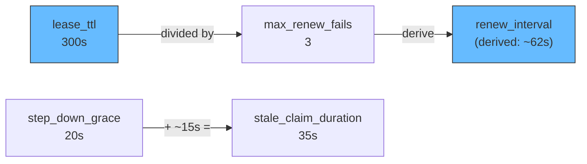

# Clustered exclusive sessions — lease mechanics

## Lease Lifecycle

The following diagram shows the full lease lifecycle across a failover event.

```mermaid
sequenceDiagram
    participant B1 as bridge-01
    participant LS as Lease Store (DynamoDB)
    participant B2 as bridge-02

    Note over: Startup - both instances compete for lease

    B1->>LS: AcquireLease(bridge-01, ttl=300s)
    LS-->>B1: Granted (fencing_token=1)
    B2->>LS: AcquireLease(bridge-02, ttl=300s)
    LS-->>B2: Denied (held by bridge-01)

    Note over: Active - connects MQTT, processes messages

    B1->>B1: Connect MQTT (connect_after_lease)
    B1->>B1: Subscribe $share/bridge-group/telemetry/#

    loop Every ~62s (derived from lease_ttl / max_renew_fails)
        B1->>LS: RenewLease(bridge-01, fencing_token=1)
        LS-->>B1: Renewed
    end

    loop Standby polling
        B2->>LS: CheckLease()
        LS-->>B2: Held by bridge-01, not expired
    end

    Note over: Failure - bridge-01 crashes

    B1--xB1: Process crash

    Note over: Detection - lease expires after 300s

    B2->>LS: AcquireLease(bridge-02, ttl=300s)
    LS-->>B2: Granted (fencing_token=2)

    Note over: Takeover - bridge-02 becomes active

    B2->>B2: Connect MQTT (connect_after_lease)
    B2->>B2: Subscribe $share/bridge-group/telemetry/#
    B2->>B2: Claim orphaned outbox records (fencing_token=2)
    B2->>B2: Drain outbox to SQS
```

The worst-case failover window is bounded by the lease takeover mechanism, not
by a fixed `lease_ttl`. A standby that polls the lease store continuously — the
normal HA case — begins its observation window at roughly the owner's last
successful renewal and seizes about one `lease_ttl` (300s) after that renewal.
A **cold** standby that only starts observing *after* the owner has already
died must observe the now-final liveness tuple for a full TTL first, so it needs
up to **~2×`lease_ttl`** to take over. The DynamoDB lease store uses a
local-clock observation window (it never compares the owner's written expiry
against the taker's clock), so takeover cannot be advanced or delayed by clock
skew between instances. During the window the standby cannot acquire the lease;
messages published to the MQTT broker are retained (QoS 1 with
`clean_start: false`) and delivered to the new active instance once it connects.

## Tuning Relationships

The lease, renewal, and grace period settings form an interconnected system. Changing one value may require adjusting others.



### `lease_ttl` (300s)

How long a lease remains valid after acquisition or last renewal. This is the failover detection window. Shorter values mean faster failover but more frequent renewal traffic. A lease holder that fails to renew within this window loses the lease.

### `renew_interval` (derived: ~62s)

How often the active instance renews its lease. When left unset, the session
manager derives it from `lease_ttl` and `max_renew_fails`: it first computes a
per-attempt budget `(lease_ttl × 3) / (max_renew_fails × 4)` — placing the
`max_renew_fails`-th attempt at ~75% of the TTL — then **reserves** the per-call
`renew_call_timeout` (capped at 5s) out of that budget and leaves an `interval/8`
slice for jitter, so `renew_interval = (budget − reserve) × 8/9`. For
`lease_ttl=300s`, `max_renew_fails=3` the budget is 75s and the derived interval
is ~62s. Set `renew_interval` explicitly to override the derivation.

### `max_renew_fails` (3)

How many consecutive renewal failures the active instance tolerates before it
re-checks ownership. After `max_renew_fails` consecutive *transient* failures
(timeout / throttle / unavailable) the instance performs **one authoritative
lease read** before deciding: a genuine store outage fails that read too and the
instance steps down (fail-closed) and drains in-flight messages, but a transient
blip whose read still names this instance as the unexpired owner is treated as a
no-op, so a brief wobble does not needlessly surrender the lease. A *definitive*
loss (the row now names another owner, or the lease has expired) steps down
immediately, without waiting for `max_renew_fails`.

### `step_down_grace` (20s)

After deciding to step down (either from renewal failures or an explicit request), the instance closes its source session — immediately halting consumption and acknowledgement of new source messages — and waits up to 20 seconds for in-flight messages to complete. This stops a former owner from consuming the source during failover and prevents message loss during graceful transitions.

### `stale_claim_duration` (35s)

On the outbox store, this controls how long an outbox record must remain unclaimed before another instance can re-claim it. Set this to approximately `step_down_grace + 15s` (20s + 15s = 35s) to ensure the original holder has time to complete its drain before records are re-claimed.

If `stale_claim_duration` is too short, a recovering instance might re-claim records that the stepping-down instance is still processing, causing duplicates. If too long, orphaned records sit idle unnecessarily.

## Fencing Tokens

The outbox store uses monotonically increasing fencing tokens to prevent duplicate sends during failover. This is critical for correctness.

Each lease acquisition generates a new fencing token (an incrementing integer). When the active instance writes to the outbox, it stamps each record with its current fencing token. When the outbox drainer sends records to SQS and marks them complete, it includes the fencing token in a conditional write:

1. **bridge-01** acquires lease with `fencing_token=1`.
2. **bridge-01** persists outbox record `{id:, fencing_token: 1, status: pending}`.
3. **bridge-01** crashes before delivering to SQS.
4. **bridge-02** acquires lease with `fencing_token=2`.
5. **bridge-02** claims: conditional update sets `fencing_token=2, status: claimed`.
6. **bridge-01** recovers momentarily and tries to complete with `fencing_token=1`. The conditional write fails because the record now has `fencing_token=2`.
7. **bridge-02** delivers to SQS. Because bridge-01 crashed *before* its own send (step 3), this interleaving yields a single delivery; the general contract is at-least-once (below).

The DynamoDB conditional expression ensures that only the current lease holder can commit outbox records. Stale holders are fenced out of the *commit*, not the *send*: had bridge-01 reached SQS before crashing, bridge-02's redelivery would be a duplicate at the destination. Fencing guarantees at-most-once **commit**, while delivery stays at-least-once, so downstream consumers must be idempotent.
