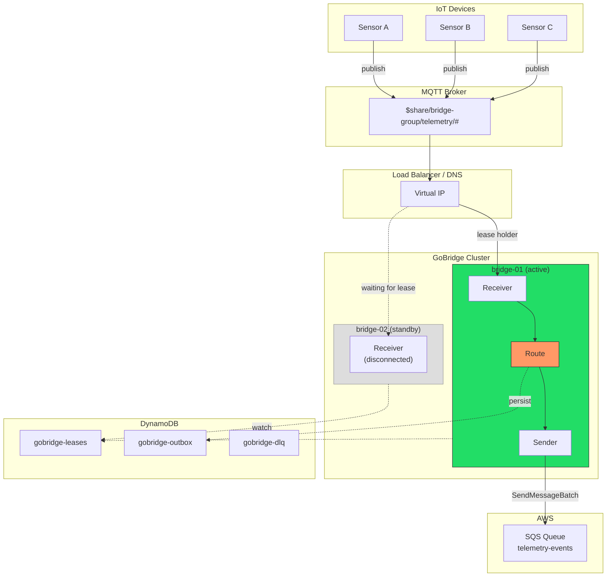
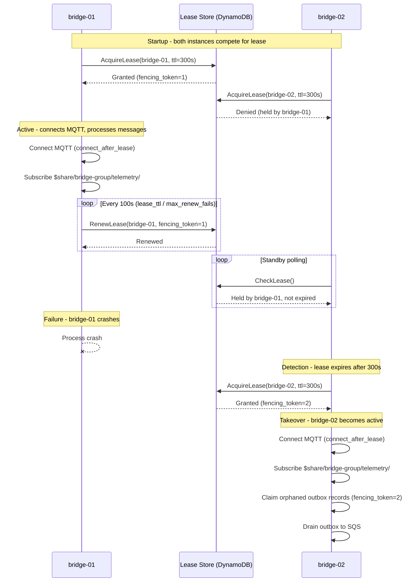
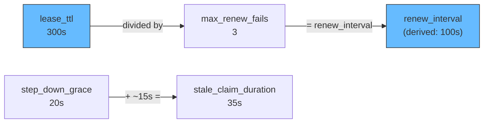

# Scenario 8: Clustered MQTT with Exclusive Sessions

Two GoBridge instances run behind a load balancer for high availability. Only one instance actively consumes from MQTT at a time (single-active consumer pattern). When the active instance fails, the standby takes over. A shared outbox backed by DynamoDB ensures no messages are lost during failover.

## Use Case

You have IoT devices publishing telemetry at high volume. A single SQS queue receives all processed events downstream. Running two bridge instances provides high availability, but MQTT subscription semantics create a problem: if both instances subscribe to the same topic, every message is delivered twice (once to each subscriber). You need exactly one instance actively consuming at any time, with automatic failover when the active instance becomes unavailable.

The exclusive session pattern solves this with distributed lease coordination. One instance holds the lease and processes messages. The other instance watches the lease and takes over when the holder fails to renew.

## Architecture



Both instances share the DynamoDB lease table for coordination, the outbox table for durable delivery, and the DLQ table for permanently failed messages.

## Configuration

This configuration is deployed to both instances. Only `instance_id` differs between them.

```yaml
bridge:
  id: telemetry-bridge
  instance_id: bridge-01          # bridge-02 on the other instance
  deployment_mode: clustered
  shutdown_timeout: 45s
  # Scaled drain formula: ceiling = min(batchCount * per_record_drain_timeout,
  # max_drain_timeout). Legacy drain_timeout is retained for backward
  # compatibility but the scaled fields are preferred for production.
  per_record_drain_timeout: 3s
  max_drain_timeout: 30s
  log_level: info

sessions:
  - id: mqtt-conn
    transport: mqtt
    session_mode: exclusive
    options:
      broker_url: tls://mqtt.prod.example.com:8883
      client_id: bridge-01        # unique per instance
      keep_alive: 30
      connect_timeout: 30s
      clean_start: false
      session_expiry_interval: 3600
      tls:
        enable: true
        ca_cert_file: /etc/certs/ca.pem

stores:
  lease:
    type: dynamodb
    options:
      table_name: gobridge-leases
  outbox:
    type: dynamodb
    options:
      table_name: gobridge-outbox
      stale_claim_duration: 35s
  dlq:
    type: dynamodb
    options:
      table_name: gobridge-dlq

receivers:
  - id: telemetry-in
    session_id: mqtt-conn
    topics:
      - topic: "$share/bridge-group/telemetry/#"
        qos: 1

senders:
  - id: sqs-out
    transport: sqs
    options:
      queue_url: https://sqs.us-west-1.amazonaws.com/123456789/telemetry-events
      region: us-west-1
      batch_size: 10

bindings:
  - id: to-sqs
    sender_id: sqs-out
    address: telemetry-events

routes:
  - id: ingest
    receiver_id: telemetry-in
    delivery_mode: shared_outbox
    dispatch_mode: single
    bindings: [to-sqs]
    policy:
      max_in_flight: 100
      ack_after: outbox_persist
      max_replay_attempts: 5
      on_expired: dlq
      on_permanent_failure: dlq
      backoff:
        initial_interval: 1s
        max_interval: 60s
        multiplier: 2.0
    session:
      session_id: mqtt-conn
      sender_id: sqs-out
      lease_ttl: 300s
      step_down_grace: 20s
      max_renew_fails: 3
      connect_after_lease: true
      drain_batch_size: 10
      drain_strategy:
        type: adaptive_backoff
        min_interval: 500ms
        max_interval: 10s
        multiplier: 1.5
```

## Config Walkthrough

### `deployment_mode: clustered`

Enables cluster-aware behavior across the bridge. In clustered mode the builder enforces that all configured stores use distributed backends (DynamoDB). Memory and SQLite stores are rejected because they are process-local and cannot coordinate across instances.

### `instance_id: bridge-01`

A stable, unique identifier for this instance. Used as the lease holder identity in DynamoDB and as part of outbox fencing tokens. Each instance in the cluster must have a distinct value. Typically injected via environment variable or instance-specific config overlay.

### `session_mode: exclusive`

On the session, `exclusive` means that only one instance in the cluster may own this session at a time. Ownership is determined by a lease stored in `stores.lease`. The instance that acquires the lease becomes the active consumer. All other instances remain in standby, periodically checking whether the lease has expired.

This mode requires `stores.lease` to be configured. The builder validates this at startup and returns an error if the lease store is missing.

### `$share/bridge-group/telemetry/#` topic prefix

The `$share/` prefix activates MQTT v5 shared subscriptions. In a shared subscription, the broker distributes each message to only one subscriber in the group (here `bridge-group`), rather than delivering it to every subscriber. This prevents N-fold message duplication when multiple bridge instances connect.

**Validation rule:** In clustered mode, MQTT receivers must use either a `$share/` topic prefix or an exclusive session (or both). Without one of these mechanisms, every instance would receive every message, causing duplicates. The config validator enforces this:

```
requires $share/ topic prefix or exclusive session
```

In this scenario we use both for defense in depth: the exclusive session ensures only one instance connects, and the `$share/` prefix provides a safety net at the broker level.

### `connect_after_lease: true`

When set, the bridge does not open the MQTT connection until the lease is acquired. The standby instance has no open TCP connection to the broker. This is important for two reasons:

1. **Client ID uniqueness.** MQTT brokers disconnect existing connections when a new client connects with the same `client_id`. Without `connect_after_lease`, both instances would connect simultaneously and fight over the client ID.

2. **Resource conservation.** The standby instance consumes no broker resources until it actually needs to take over.

### `delivery_mode: shared_outbox` with exclusive session

These two features work together to provide at-least-once delivery across failovers:

1. The active instance receives an MQTT message and immediately persists it to the outbox store (DynamoDB).
2. The receiver acknowledges the MQTT message after outbox persistence (`ack_after: outbox_persist`).
3. The outbox drainer asynchronously reads records and sends them to SQS.
4. If the active instance fails between outbox persistence and SQS delivery, the new active instance claims the orphaned outbox records and completes delivery.

Without `shared_outbox`, a `direct_hold` route would lose messages that were in-flight when the active instance crashed.

### `drain_strategy: adaptive_backoff`

The outbox drainer adjusts its polling frequency based on load. When outbox records are found, the drainer polls at `min_interval` (500ms). When the outbox is empty, polling backs off exponentially up to `max_interval` (10s). This balances latency and DynamoDB read costs.

## Lease Lifecycle

The following diagram shows the full lease lifecycle across a failover event.



The worst-case failover window equals `lease_ttl` (300 seconds). During this window, the standby instance cannot acquire the lease because the previous holder's lease has not yet expired. Messages published to the MQTT broker during this window are retained by the broker (QoS 1 with `clean_start: false`) and delivered to the new active instance once it connects.

## Tuning Relationships

The lease, renewal, and grace period settings form an interconnected system. Changing one value may require adjusting others.



### `lease_ttl` (300s)

How long a lease remains valid after acquisition or last renewal. This is the failover detection window. Shorter values mean faster failover but more frequent renewal traffic. A lease holder that fails to renew within this window loses the lease.

### `renew_interval` (derived: lease_ttl / max_renew_fails = 100s)

How often the active instance renews its lease. The default derivation ensures that the instance has `max_renew_fails` chances to renew before the lease expires. You can set `renew_interval` explicitly to override this calculation.

### `max_renew_fails` (3)

How many consecutive renewal failures the active instance tolerates before initiating a step-down. After 3 consecutive failures, the instance assumes it has lost connectivity to DynamoDB and begins draining in-flight messages.

### `step_down_grace` (20s)

After deciding to step down (either from renewal failures or an explicit request), the instance stops accepting new messages and waits up to 20 seconds for in-flight messages to complete. This prevents message loss during graceful transitions.

### `stale_claim_duration` (35s)

On the outbox store, this controls how long an outbox record must remain unclaimed before another instance can re-claim it. Set this to approximately `step_down_grace + 15s` (20s + 15s = 35s) to ensure the original holder has time to complete its drain before records are re-claimed.

If `stale_claim_duration` is too short, a recovering instance might re-claim records that the stepping-down instance is still processing, causing duplicates. If too long, orphaned records sit idle unnecessarily.

## Fencing Tokens

The outbox store uses monotonically increasing fencing tokens to prevent duplicate sends during failover. This is critical for correctness.

Each lease acquisition generates a new fencing token (an incrementing integer). When the active instance writes to the outbox, it stamps each record with its current fencing token. When the outbox drainer sends records to SQS and marks them complete, it includes the fencing token in a conditional write:

1. **bridge-01** acquires lease with `fencing_token=1`.
2. **bridge-01** persists outbox record `{id: R1, fencing_token: 1, status: pending}`.
3. **bridge-01** crashes before delivering R1 to SQS.
4. **bridge-02** acquires lease with `fencing_token=2`.
5. **bridge-02** claims R1: conditional update sets `fencing_token=2, status: claimed`.
6. **bridge-01** recovers momentarily and tries to complete R1 with `fencing_token=1`. The conditional write fails because the record now has `fencing_token=2`.
7. **bridge-02** delivers R1 to SQS exactly once.

The DynamoDB conditional expression ensures that only the current lease holder can modify outbox records. Stale holders are fenced out, preventing duplicate deliveries.

## Variations

### Three-Instance Cluster

Add a third instance for N+2 redundancy. Only one instance is active at a time. The others queue behind it in lease acquisition order:

```yaml
bridge:
  id: telemetry-bridge
  instance_id: bridge-03
  deployment_mode: clustered
  cluster:
    endpoints:
      bridge-01: "10.0.1.10:8080"
      bridge-02: "10.0.1.11:8080"
      bridge-03: "10.0.1.12:8080"
```

The `cluster.endpoints` map provides static endpoint discovery. This is optional -- without it, instances discover each other through the lease store metadata.

### Mixed Session Modes

Not every route needs exclusive sessions. You can combine exclusive MQTT routes with stateless SQS-to-SQS routes on the same bridge:

```yaml
sessions:
  - id: mqtt-exclusive
    transport: mqtt
    session_mode: exclusive
    options:
      broker_url: tls://mqtt.prod.example.com:8883
      client_id: bridge-01

routes:
  - id: mqtt-to-sqs
    receiver_id: mqtt-in
    delivery_mode: shared_outbox
    bindings: [to-sqs]
    session:
      session_id: mqtt-exclusive
      sender_id: sqs-out
      lease_ttl: 300s
      connect_after_lease: true

  - id: sqs-to-sqs
    receiver_id: sqs-in
    delivery_mode: direct_hold
    bindings: [to-processing]
    # No session block -- SQS is stateless, both instances consume
```

The `sqs-to-sqs` route runs on both instances simultaneously (SQS handles competing consumers natively via visibility timeouts). The `mqtt-to-sqs` route runs on only the lease-holding instance.

### Shorter Failover Window

For faster failover at the cost of more DynamoDB writes:

```yaml
routes:
  - id: ingest
    session:
      lease_ttl: 60s
      max_renew_fails: 3
      step_down_grace: 10s
      # renew_interval derived: 60s / 3 = 20s

stores:
  outbox:
    type: dynamodb
    options:
      table_name: gobridge-outbox
      stale_claim_duration: 25s   # step_down_grace (10s) + 15s
```

This reduces the worst-case failover window from 300 seconds to 60 seconds. The renewal interval drops to 20 seconds, tripling the DynamoDB write rate for lease renewals. For most workloads this is negligible, but factor it into your DynamoDB capacity planning.
