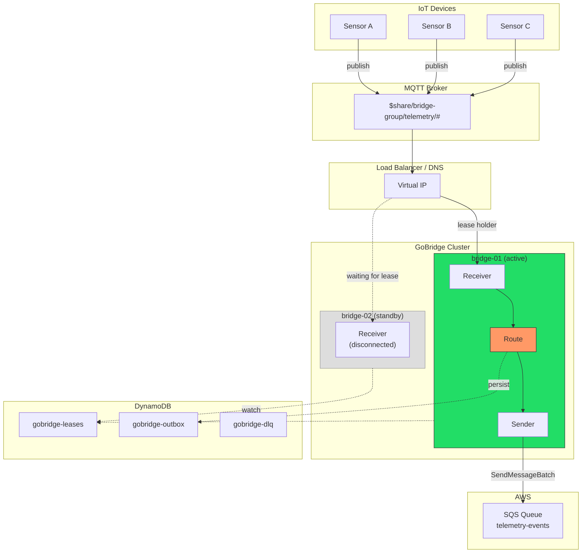
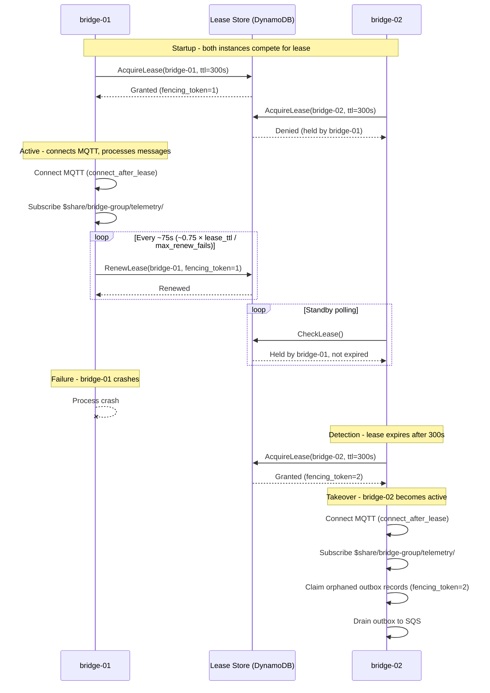
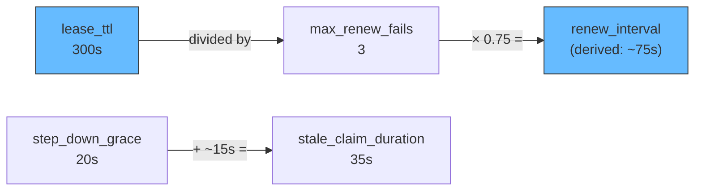

# Scenario 8: Clustered MQTT with Exclusive Sessions

Two GoBridge instances run behind a load balancer for high availability. Only one instance actively consumes from MQTT at a time (single-active consumer pattern). When the active instance fails, the standby takes over. A shared outbox backed by DynamoDB ensures no messages are lost during failover.

## Use Case

You have IoT devices publishing telemetry at high volume. A single SQS queue receives all processed events downstream. Running two bridge instances provides high availability, but MQTT subscription semantics create a problem: if both instances subscribe to the same topic, every message is delivered twice (once to each subscriber). You need exactly one instance actively consuming at any time, with automatic failover when the active instance becomes unavailable.

The exclusive session pattern solves this with distributed lease coordination. One instance holds the lease and processes messages. The other instance watches the lease and takes over when the holder fails to renew.

## Architecture



Both instances share the DynamoDB lease table for coordination, the outbox table for durable delivery, and the DLQ table for permanently failed messages.

## Configuration

This configuration is deployed to both instances. Only `instance_id` differs between them.

```yaml
bridge:
  id: telemetry-bridge
  instance_id: bridge-01          # bridge-02 on the other instance
  deployment_mode: clustered
  shutdown_timeout: 45s
  # Scaled drain formula: ceiling = min(batchCount * per_record_drain_timeout,
  # max_drain_timeout). Legacy drain_timeout is retained for backward
  # compatibility but the scaled fields are preferred for production.
  per_record_drain_timeout: 3s
  max_drain_timeout: 30s
  log_level: info

sessions:
  - id: mqtt-conn
    transport: mqtt
    session_mode: exclusive
    options:
      session:
        broker_url: tls://mqtt.prod.example.com:8883
        client_id: bridge-01        # unique per instance
        keep_alive: 30
        connect_timeout: 30s
        clean_start: false
        session_expiry_interval: 3600
        tls:
          enable: true
          ca_cert_file: /etc/certs/ca.pem

stores:
  lease:
    type: dynamodb
    options:
      table_name: gobridge-leases
  outbox:
    type: dynamodb
    options:
      table_name: gobridge-outbox
      stale_claim_duration: 35s
  dlq:
    type: dynamodb
    options:
      table_name: gobridge-dlq

receivers:
  - id: telemetry-in
    session_id: mqtt-conn
    topics:
      - topic: "$share/bridge-group/telemetry/#"
        qos: 1

senders:
  - id: sqs-out
    transport: sqs
    options:
      queue_url: https://sqs.us-west-1.amazonaws.com/123456789/telemetry-events
      region: us-west-1
      batch_size: 10

bindings:
  - id: to-sqs
    sender_id: sqs-out
    address: telemetry-events

routes:
  - id: ingest
    receiver_id: telemetry-in
    delivery_mode: shared_outbox
    dispatch_mode: single
    bindings: [to-sqs]
    policy:
      max_in_flight: 100
      ack_after: outbox_persist
      max_replay_attempts: 5
      on_expired: dlq
      on_permanent_failure: dlq
      backoff:
        initial_interval: 1s
        max_interval: 60s
        multiplier: 2.0
    session:
      session_id: mqtt-conn
      sender_id: sqs-out
      lease_ttl: 300s
      step_down_grace: 20s
      max_renew_fails: 3
      connect_after_lease: true
      drain_batch_size: 10
      drain_strategy:
        type: adaptive_backoff
        min_interval: 500ms
        max_interval: 10s
        multiplier: 1.5
```

## Config Walkthrough

### `deployment_mode: clustered`

Enables cluster-aware behavior across the bridge. In clustered mode the builder enforces that all configured stores use distributed backends (DynamoDB). Memory and SQLite stores are rejected because they are process-local and cannot coordinate across instances.

### `instance_id: bridge-01`

A stable, unique identifier for this instance. Used as the lease holder identity in DynamoDB and as part of outbox fencing tokens. Each instance in the cluster must have a distinct value. Typically injected via environment variable or instance-specific config overlay.

### `session_mode: exclusive`

On the session, `exclusive` means that only one instance in the cluster may own this session at a time. Ownership is determined by a lease stored in `stores.lease`. The instance that acquires the lease becomes the active consumer. All other instances remain in standby, periodically checking whether the lease has expired.

This mode requires `stores.lease` to be configured. The builder validates this at startup and returns an error if the lease store is missing.

### `$share/bridge-group/telemetry/#` topic prefix

The `$share/` prefix activates MQTT v5 shared subscriptions. In a shared subscription, the broker distributes each message to only one subscriber in the group (here `bridge-group`), rather than delivering it to every subscriber. This prevents N-fold message duplication when multiple bridge instances connect.

**Validation rule:** In clustered mode, MQTT receivers must use either a `$share/` topic prefix or an exclusive session (or both). Without one of these mechanisms, every instance would receive every message, causing duplicates. The config validator enforces this:

```text
requires $share/ topic prefix or exclusive session
```

In this scenario we use both for defense in depth: the exclusive session ensures only one instance connects, and the `$share/` prefix provides a safety net at the broker level.

### `connect_after_lease: true`

When set, the bridge does not open the MQTT connection until the lease is acquired. The standby instance has no open TCP connection to the broker. This is important for two reasons:

1. **Client ID uniqueness.** MQTT brokers disconnect existing connections when a new client connects with the same `client_id`. Without `connect_after_lease`, both instances would connect simultaneously and fight over the client ID.

2. **Resource conservation.** The standby instance consumes no broker resources until it takes over.

The connection lifecycle is **symmetric**: just as the session connects only *after* the lease is acquired, it is **closed when the lease is lost**. On step-down the instance closes its source session, so it immediately stops consuming and acknowledging source messages while the new owner takes over — this prevents split-brain consumption where a former owner keeps draining the source. In-flight outbox `Send`+`Complete` still drains during `step_down_grace` (that settlement runs on the destination side and does not need the source connection); a source acknowledgement lost on close is redelivered under the at-least-once contract.

When the instance later re-acquires the lease it re-establishes the session. How depends on the transport:

- **Restartable transports** reconnect the source session **in-process** and resume immediately.
- The **MQTT (Paho) session is deliberately single-use** (once `Close` runs, `Start` returns `ErrUnavailable` rather than reconnecting, to avoid a zombie state where a freshly attached connection manager coexists with an already-closed events channel). Re-establishing it in-process is therefore impossible: the session manager surfaces `ErrUnavailable` and the runtime enters a **terminal** state. The process then **restarts** with a fresh session — driven either by the liveness probe (`GET /api/v1/monitor/live` fails closed once terminal) or, on any deployment, by the built-in backstop that **exits the process with a non-zero code** when the runtime goes terminal.

Either way **no message is lost**: un-acknowledged source messages are redelivered to whichever instance next holds the lease, and outbox fencing tokens prevent duplicate destination sends. The single-use path costs one process restart on re-acquisition rather than an in-process reconnect. A restart policy is therefore required: on Kubernetes the default `restartPolicy: Always` covers it (wiring a `livenessProbe` to `/api/v1/monitor/live` gives faster, more granular detection and is recommended); under systemd use `Restart=on-failure` (or `always`). Readiness alone is insufficient — it only removes the pod from the load balancer, it does not restart a terminal runtime.

### `delivery_mode: shared_outbox` with exclusive session

These two features work together to provide at-least-once delivery across failovers:

1. The active instance receives an MQTT message and immediately persists it to the outbox store (DynamoDB).
2. The receiver acknowledges the MQTT message after outbox persistence (`ack_after: outbox_persist`).
3. The outbox drainer asynchronously reads records and sends them to SQS.
4. If the active instance fails between outbox persistence and SQS delivery, the new active instance claims the orphaned outbox records and completes delivery.

Without `shared_outbox`, a `direct_hold` route would lose messages that were in-flight when the active instance crashed.

### `drain_strategy: adaptive_backoff`

The outbox drainer adjusts its polling frequency based on load. When outbox records are found, the drainer polls at `min_interval` (500ms). When the outbox is empty, polling backs off exponentially up to `max_interval` (10s). This balances latency and DynamoDB read costs.

## Lease Lifecycle

The following diagram shows the full lease lifecycle across a failover event.



The worst-case failover window is bounded by the lease takeover mechanism, not
by a fixed `lease_ttl`. A standby that polls the lease store continuously — the
normal HA case — begins its observation window at roughly the owner's last
successful renewal and seizes about one `lease_ttl` (300s) after that renewal.
A **cold** standby that only starts observing *after* the owner has already
died must observe the now-final liveness tuple for a full TTL first, so it needs
up to **~2×`lease_ttl`** to take over. The DynamoDB lease store uses a
local-clock observation window (it never compares the owner's written expiry
against the taker's clock), so takeover cannot be advanced or delayed by clock
skew between instances. During the window the standby cannot acquire the lease;
messages published to the MQTT broker are retained (QoS 1 with
`clean_start: false`) and delivered to the new active instance once it connects.

## Tuning Relationships

The lease, renewal, and grace period settings form an interconnected system. Changing one value may require adjusting others.



### `lease_ttl` (300s)

How long a lease remains valid after acquisition or last renewal. This is the failover detection window. Shorter values mean faster failover but more frequent renewal traffic. A lease holder that fails to renew within this window loses the lease.

### `renew_interval` (derived: ~0.75 × lease_ttl / max_renew_fails = 75s)

How often the active instance renews its lease. When left unset, the session
manager derives it as `(lease_ttl × 3) / (max_renew_fails × 4)` — placing the
`max_renew_fails`-th attempt at ~75% of the TTL and reserving ~25% as headroom
for jitter and clock slack. For `lease_ttl=300s`, `max_renew_fails=3` that is
75s. You can set `renew_interval` explicitly to override the derivation.

### `max_renew_fails` (3)

How many consecutive renewal failures the active instance tolerates before initiating a step-down. After 3 consecutive failures, the instance assumes it has lost connectivity to DynamoDB and begins draining in-flight messages.

### `step_down_grace` (20s)

After deciding to step down (either from renewal failures or an explicit request), the instance closes its source session — immediately halting consumption and acknowledgement of new source messages — and waits up to 20 seconds for in-flight messages to complete. This stops a former owner from consuming the source during failover and prevents message loss during graceful transitions.

### `stale_claim_duration` (35s)

On the outbox store, this controls how long an outbox record must remain unclaimed before another instance can re-claim it. Set this to approximately `step_down_grace + 15s` (20s + 15s = 35s) to ensure the original holder has time to complete its drain before records are re-claimed.

If `stale_claim_duration` is too short, a recovering instance might re-claim records that the stepping-down instance is still processing, causing duplicates. If too long, orphaned records sit idle unnecessarily.

## Fencing Tokens

The outbox store uses monotonically increasing fencing tokens to prevent duplicate sends during failover. This is critical for correctness.

Each lease acquisition generates a new fencing token (an incrementing integer). When the active instance writes to the outbox, it stamps each record with its current fencing token. When the outbox drainer sends records to SQS and marks them complete, it includes the fencing token in a conditional write:

1. **bridge-01** acquires lease with `fencing_token=1`.
2. **bridge-01** persists outbox record `{id: R1, fencing_token: 1, status: pending}`.
3. **bridge-01** crashes before delivering R1 to SQS.
4. **bridge-02** acquires lease with `fencing_token=2`.
5. **bridge-02** claims R1: conditional update sets `fencing_token=2, status: claimed`.
6. **bridge-01** recovers momentarily and tries to complete R1 with `fencing_token=1`. The conditional write fails because the record now has `fencing_token=2`.
7. **bridge-02** delivers R1 to SQS exactly once.

The DynamoDB conditional expression ensures that only the current lease holder can modify outbox records. Stale holders are fenced out, preventing duplicate deliveries.

## Variations

### Three-Instance Cluster

Add a third instance for N+2 redundancy. Only one instance is active at a time. The others queue behind it in lease acquisition order:

```yaml
bridge:
  id: telemetry-bridge
  instance_id: bridge-03
  deployment_mode: clustered
  cluster:
    endpoints:
      bridge-01: "10.0.1.10:8080"
      bridge-02: "10.0.1.11:8080"
      bridge-03: "10.0.1.12:8080"
```

The `cluster.endpoints` map provides static endpoint discovery. This is optional -- without it, instances discover each other through the lease store metadata: each owner writes its own reachable endpoint into the lease row on acquire/renew. On ECS/Fargate the endpoint is resolved from the task metadata endpoint by the ECS resolver, which retries a bounded number of times (5 attempts, exponential backoff from 500ms capped at 4s, ~7.5s worst case) to absorb the brief window before the task metadata is populated. A missing metadata environment variable is treated as a permanent misconfiguration and fails immediately without retrying.

### Mixed Session Modes

Not every route needs exclusive sessions. You can combine exclusive MQTT routes with stateless SQS-to-SQS routes on the same bridge:

```yaml
sessions:
  - id: mqtt-exclusive
    transport: mqtt
    session_mode: exclusive
    options:
      session:
        broker_url: tls://mqtt.prod.example.com:8883
        client_id: bridge-01

routes:
  - id: mqtt-to-sqs
    receiver_id: mqtt-in
    delivery_mode: shared_outbox
    bindings: [to-sqs]
    session:
      session_id: mqtt-exclusive
      sender_id: sqs-out
      lease_ttl: 300s
      connect_after_lease: true

  - id: sqs-to-sqs
    receiver_id: sqs-in
    delivery_mode: direct_hold
    bindings: [to-processing]
    # No session block -- SQS is stateless, both instances consume
```

The `sqs-to-sqs` route runs on both instances simultaneously (SQS handles competing consumers natively via visibility timeouts). The `mqtt-to-sqs` route runs on only the lease-holding instance.

### High-Availability Profile

The default lease timing trades fast failover for low renewal traffic: a dead owner is not detected until its `lease_ttl` (360s) lapses, so worst-case failover approaches 6 minutes. High-availability deployments usually want failover inside the 30--60s band. GoBridge ships a named preset that encodes the *correct interrelationship* between the four timing knobs. Getting that relationship wrong cannot break single-owner safety -- the lease store admits one non-expired lease at a time and the outbox fences every send by fencing-token version -- but it does cause spurious failovers, slower recovery, or a wider at-least-once duplicate-*send* window, so prefer the preset (or the recipe below) over hand-tuning.

**Code preset.** When you build the runtime programmatically, start from `session.HAConfig` instead of `session.DefaultConfig`:

```go
// ~45s worst-case failover. Tightens only the lease-timing knobs;
// inherits DefaultConfig's drain strategy and batch sizes.
cfg := session.HAConfig("mqtt-exclusive", true)
mgr := session.NewFromConfig(cfg, sess, leaseStore, ownerID, logger)
```

It sets `LeaseTTL=45s`, `RenewInterval=14s` (pinned explicitly, not derived — `14×3=42s < 45s` keeps the third renew off the expiry boundary), `MaxRenewFails=3`, `RenewJitter=1s`, and `StepDownGrace=5s`.

**Blueprint recipe.** YAML deployments express the same profile with the existing session knobs:

```yaml
routes:
  - id: ingest
    session:
      lease_ttl: 45s
      max_renew_fails: 3
      step_down_grace: 5s
      # renew_interval left unset -> derived ~0.75 x 45s / 3 = 11.25s.
      # To match the code preset exactly, pin renew_interval: 14s and
      # lease_renew_jitter: 1s.

stores:
  outbox:
    type: dynamodb
    options:
      table_name: gobridge-outbox
      stale_claim_duration: 20s   # step_down_grace (5s) + 15s
```

> The blueprint exposes jitter as the `lease_renew_jitter` session field. Leaving
> both `renew_interval` and `lease_renew_jitter` unset lets the session manager
> derive them from `lease_ttl`: `renew_interval ≈ 0.75 × lease_ttl / max_renew_fails`
> (~11.25s here) and jitter = `renew_interval / 4` (~2.8s). The renew timer runs
> at `renew_interval ± jitter/2`, well inside the 45s TTL. To reproduce the code
> preset's exact 14s interval / 1s jitter in YAML, set both fields explicitly.

**Failover math.** Worst-case failover for a warm (continuously polling) standby
is approximately `lease_ttl` (45s) plus takeover: a standby retries `Acquire`
every ~5s (the acquire poll is derived and capped at 5s) plus broker-connect
time, so budget ~45--55s end to end. A **cold** standby that only begins
observing after the owner died needs up to ~2×`lease_ttl` (~90s) — see the
takeover observation window above. During the window the broker retains messages
(QoS 1, `clean_start: false`) and replays them to the new owner once it connects
-- as in the failover sequence above, with 45s in place of 300s.

**Invariants the preset preserves** (and any hand-tuned profile must too):

- `step_down_grace < lease_ttl` (5s vs 45s) -- the only step-down trigger is involuntary (`max_renew_fails` consecutive renew failures, detected at roughly `lease_ttl`); the owner then stops claiming and drains in-flight work for `step_down_grace` before releasing. Keeping it well under `lease_ttl` bounds that drain -- it does *not* order the old owner's last send ahead of the new owner's first. Single-owner safety comes from lease-store mutual exclusion plus version fencing on every outbox `Complete`/`Claim`, independent of these timings; a brief duplicate *send* (never a duplicate commit) during the overlap is the inherent at-least-once window, so downstream must be idempotent.
- `renew_interval × max_renew_fails < lease_ttl` (14s × 3 = 42s < 45s in the code preset) -- the owner gets `max_renew_fails` renewal attempts inside one TTL, so it tolerates two consecutive transient renewal failures before stepping down. Folding in jitter, the worst-case span is `max_renew_fails × (renew_interval + jitter/2) = 3 × (14 + 0.5) = 43.5s`, still under the 45s TTL.
- `stale_claim_duration` above the worst-case drain-batch timeout (≈20s) -- this bounds recovery of a *same-owner* stranded claim; it does not gate failover (a new owner reclaims immediately via its higher fencing version). Both the DynamoDB and native SQLite outboxes honour it; only the in-memory outbox is version-only. `step_down_grace + 15s` (20s) is a convenient rule of thumb that clears the drain ceiling (see [tuning relationships](#tuning-relationships) above).

**Tradeoff.** Failover drops from ~360s to ~45s, but the ~14s renewal interval raises the lease-store write rate roughly 8× over the default (~14s vs ~110s renewals). For most workloads this is negligible DynamoDB traffic; factor it into capacity planning anyway. The tighter timing also tolerates fewer transient renewal failures, so blip-prone networks will see more spurious step-downs -- relax `lease_ttl` toward 60s if renewals are unreliable.

**Pick a point in the band.** The preset's 45s is a defensible midpoint; the relationships above hold across the whole 30--60s band. The `renew_interval` column shows the value derived when unset (`~0.75 × lease_ttl / max_renew_fails`); the HA code preset instead pins 14s:

| Profile | `lease_ttl` | `renew_interval` | `step_down_grace` | `stale_claim_duration` | Worst-case failover |
|---|---|---|---|---|---|
| Aggressive | 30s | ~7.5s (derived) | 5s | 20s | ~30s + takeover |
| **HA (`session.HAConfig`)** | **45s** | **14s (pinned)** | **5s** | **20s** | **~45s + takeover** |
| Conservative | 60s | 15s (derived) | 10s | 25s | ~60s + takeover |

Faster rows fail over sooner but renew more often and tolerate fewer network blips. Start at the HA row and move up or down only with evidence from your lease-store latency and renewal-failure metrics.

> Via the blueprint (YAML), leaving both `renew_interval` and `lease_renew_jitter` unset derives jitter as `renew_interval / 4`. The Aggressive row's derived ~7.5s interval therefore pairs with ~1.9s jitter, so renewals span ~6.6--8.4s -- comfortably inside a 30s TTL. There is no fixed 5s jitter default on the derive path; that value belongs to the `session.DefaultConfig` code preset. Pin `renew_interval: 14s` and `lease_renew_jitter: 1s`, or call `session.HAConfig`, to reproduce the HA preset's exact cadence.

### Ownership Under Lease-Store Failure

Routing an exclusive route needs a definite answer to "do I own this?". When the
lease store is unreachable (its circuit breaker is open) or a transient error
leaves no cached owner, the route locator's posture decides what happens. The
default is **fail-closed** (`LocatorConfig.FailOpen = false`, matching the
session layer): the locator refuses the routing decision and returns an error, so
a non-owner never processes or forwards an exclusive route while ownership is
unverifiable. This trades availability for strict single-owner exclusivity.

Set `FailOpen = true` to restore optimistic LOCAL processing during those
windows, trading exclusivity for availability. Only enable it where the workload
tolerates transient duplicate processing — outbox version fencing on the data
path still prevents duplicate commits. The locator caches ownership for a short
window (2s default) and opens its breaker after repeated store failures (3 by
default) with a cooldown (5s), so brief store blips do not immediately flip the
posture.
