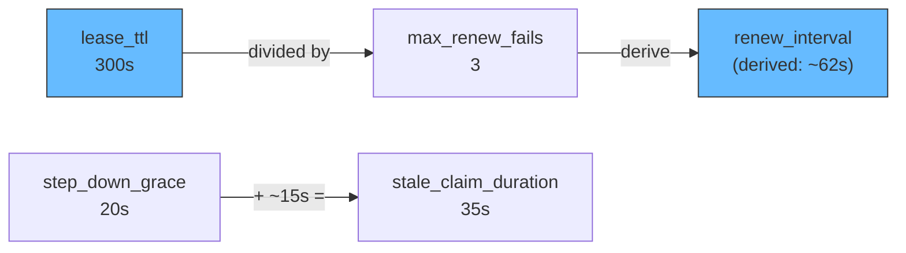

# Scenario 8: Clustered MQTT with Exclusive Sessions

Two GoBridge instances run behind a load balancer for high availability. Only one instance actively consumes from MQTT at a time (single-active consumer pattern). When the active instance fails, the standby takes over. A shared outbox backed by DynamoDB gives **at-least-once** delivery *once a message is persisted to the outbox*: after outbox persistence the message survives failover, but **duplicates are possible** at the destination, and `direct_hold` or drop policies can still lose messages that were in flight when the active instance crashed. See [`delivery_mode: shared_outbox` with exclusive session](#delivery_mode-shared_outbox-with-exclusive-session) below and the `MessagesDropped` / `MessagesExpired` loss signals.

## Use Case

You have IoT devices publishing telemetry at high volume. A single SQS queue receives all processed events downstream. Running two bridge instances provides high availability, but MQTT subscription semantics create a problem: if both instances subscribe to the same topic, every message is delivered twice (once to each subscriber). You need exactly one instance actively consuming at any time, with automatic failover when the active instance becomes unavailable. Single-active consumption removes the double-subscription duplication; it does **not** make end-to-end delivery exactly-once — a retry after outbox persistence can still deliver a duplicate to SQS, so downstream consumers must stay idempotent.

The exclusive session pattern solves this with distributed lease coordination. One instance holds the lease and processes messages. The other instance watches the lease and takes over when the holder fails to renew.

## Architecture

```mermaid
flowchart TB
    subgraph IoT ["IoT Devices"]
        D1[Sensor A]
        D2[Sensor B]
        D3[Sensor C]
    end

    subgraph Broker ["MQTT Broker"]
        T["$share/bridge-group/telemetry/#"]
    end

    D1 & D2 & D3 -->|publish| T

    subgraph LB ["Load Balancer / DNS"]
        VIP["Virtual IP"]
    end

    T --> VIP

    subgraph Cluster ["GoBridge Cluster"]
        subgraph Inst1 ["bridge-01 (active)"]
            R1["Receiver"]
            Route1["Route"]
            S1["Sender"]
            R1 --> Route1 --> S1
        end

        subgraph Inst2 ["bridge-02 (standby)"]
            R2["Receiver\n(disconnected)"]
        end
    end

    VIP -->|"lease holder"| R1
    VIP -.->|"waiting for lease"|

    subgraph AWS ["AWS"]
        SQS["SQS Queue\ntelemetry-events"]
    end

    subgraph DDB ["DynamoDB"]
        Leases["gobridge-leases"]
        Outbox["gobridge-outbox"]
        DLQ["gobridge-dlq"]
    end

    S1 -->|SendMessageBatch| SQS
    Route1 -.->|persist| Outbox
    Inst1 -.->|renew| Leases
    Inst2 -.->|watch| Leases

    style Inst1 fill:#2d6,stroke:#333
    style Inst2 fill:#ddd,stroke:#999
    style Route1 fill:#f96,stroke:#333
```

Both instances share the DynamoDB lease table for coordination, the outbox table for durable delivery, and the DLQ table for permanently failed messages.

## Configuration

This configuration is deployed to both instances. Only `instance_id` differs between them.

```yaml
bridge:
  id: telemetry-bridge
  instance_id: bridge-01          # bridge-02 on the other instance
  deployment_mode: clustered
  shutdown_timeout: 45s
  # Scaled drain formula: ceiling = min(batchCount * per_record_drain_timeout,
  # max_drain_timeout). Legacy drain_timeout is retained for backward
  # compatibility but the scaled fields are preferred for production.
  per_record_drain_timeout: 3s
  max_drain_timeout: 30s
  log_level: info

sessions:
  - id: mqtt-conn
    transport: mqtt
    session_mode: exclusive
    options:
      session:
        broker_url: tls://mqtt.prod.example.com:8883
        client_id: telemetry-bridge  # SAME on every instance (see the client_id walkthrough)
        keep_alive: 30
        connect_timeout: 30s
        reconcile_timeout: 30s
        clean_start: false
        session_expiry_interval: 3600
        tls:
          enable: true
          ca_cert_file: /etc/certs/ca.pem

stores:
  lease:
    type: dynamodb
    options:
      table_name: gobridge-leases
  outbox:
    type: dynamodb
    options:
      table_name: gobridge-outbox
      stale_claim_duration: 35s
  dlq:
    type: dynamodb
    options:
      table_name: gobridge-dlq

receivers:
  - id: telemetry-in
    session_id: mqtt-conn
    topics:
      - topic: "$share/bridge-group/telemetry/#"
        qos: 1

senders:
  - id: sqs-out
    transport: sqs
    options:
      queue_url: https://sqs.us-west-1.amazonaws.com/123456789/telemetry-events
      region: us-west-1
      batch_size: 10

bindings:
  - id: to-sqs
    sender_id: sqs-out
    address: telemetry-events

routes:
  - id: ingest
    receiver_id: telemetry-in
    delivery_mode: shared_outbox
    dispatch_mode: single
    bindings: [to-sqs]
    policy:
      max_in_flight: 100
      ack_after: outbox_persist
      max_replay_attempts: 5
      on_expired: dlq
      on_permanent_failure: dlq
      backoff:
        initial_interval: 1s
        max_interval: 60s
        multiplier: 2.0
    session:
      session_id: mqtt-conn
      sender_id: sqs-out
      lease_ttl: 300s
      step_down_grace: 20s
      max_renew_fails: 3
      connect_after_lease: true
      # Optional declared objective: failure detection to ServiceLevelFull.
      # Paho activation = 2*30s connect + 4*30s reconcile + 2*30s grace = 240s.
      # min poll=3.75s; calls=1+ceil(300s/3.75s)=81.
      # Budget = 300s + 2*6.25s + 81*5s + 240s + 10s = 967.5s.
      failover_slo: 980s
      startup_allowance: 10s
      drain_batch_size: 10
      drain_strategy:
        type: adaptive_backoff
        min_interval: 500ms
        max_interval: 10s
        multiplier: 1.5
```

## Config Walkthrough

### `deployment_mode: clustered`

Enables cluster-aware behavior across the bridge. In clustered mode the builder enforces that all configured stores use distributed backends (DynamoDB). Memory and SQLite stores are rejected because they are process-local and cannot coordinate across instances.

### `instance_id: bridge-01`

A stable, unique identifier for this instance. Used as the lease holder identity in DynamoDB and as part of outbox fencing tokens. Each instance in the cluster must have a distinct value. Typically injected via environment variable or instance-specific config overlay.

> **Replicated-config warning (Kubernetes).** A Deployment that mounts one
> ConfigMap into `replicas: 2+` gives every pod the **same** `instance_id` -- the
> value is baked into the shared file. GoBridge no longer lets that ping-pong the
> lease: the lease ownership token is `instance_id#<boot-nonce>`, where the nonce
> is generated per process, so two pods sharing an `instance_id` still derive
> distinct lease owners and one wins cleanly instead of each re-seizing the
> other's lease. `instance_id` stays the human-facing display identity (logs,
> health, the source-id header), so make it distinct anyway -- inject it from the
> pod identity (a StatefulSet ordinal, or `metadata.name` via the downward API)
> so dashboards and logs can tell the replicas apart.

### `client_id: telemetry-bridge` (SHARED across instances)

In an **exclusive** session the `client_id` MUST be **stable and identical on
every instance** of the logical session — the opposite of `instance_id`. This is
the MQTT identity contract that makes lease failover carry the broker session:

> When the active instance dies and the standby reconnects with the **same**
> `client_id`, the broker performs *session takeover* and hands the resumed
> session — its `$share` subscription and its queued QoS 1/2 messages — to the
> new owner. The lease guarantees only one instance is ever connected at a time,
> so a shared `client_id` never causes a live collision; it is exactly what lets
> the standby inherit the dead owner's session.

> **Do NOT use a unique-per-instance `client_id` on an exclusive session.** A
> unique id (`bridge-01`, `bridge-02`, …) makes each instance a **separate**
> broker session. When `bridge-01` dies, *its* session keeps the `$share`
> subscription and accumulates queued QoS 1/2 deliveries; `bridge-02` connects as
> a different session and the broker does **not** hand it that queue. Those
> messages are **stranded broker-side** until the dead session expires (up to
> `session_expiry_interval`, an hour in this example) — a silent loss that
> `shared_outbox` cannot recover, because it protects messages only *after* the
> bridge receives them. With unique ids you lose the very failover continuity this
> scenario exists to provide.

Because `client_id` is shared, it can live in the replicated config file
unchanged — only `instance_id` needs to differ per instance. (For the *opposite*
posture — stateless `$share` scale-out with `session_mode: ephemeral`, where each
replica needs a **distinct** `client_id` — set `client_id_suffix: hostname` or
`nonce` so one shared config file still yields unique ids per pod; see the MQTT
transport reference. That option is rejected on exclusive sessions precisely
because it would strand messages as described above.)

### `session_mode: exclusive`

On the session, `exclusive` means that only one instance in the cluster may own this session at a time. Ownership is determined by a lease stored in `stores.lease`. The instance that acquires the lease becomes the active consumer. All other instances remain in standby, periodically checking whether the lease has expired.

This mode requires `stores.lease` to be configured. The builder validates this at startup and returns an error if the lease store is missing.

### `$share/bridge-group/telemetry/#` topic prefix

The `$share/` prefix activates MQTT v5 shared subscriptions. In a shared subscription, the broker distributes each message to only one subscriber in the group (here `bridge-group`), rather than delivering it to every subscriber. This prevents N-fold message duplication when multiple bridge instances connect.

**Validation rule:** In clustered mode, MQTT receivers must use either a `$share/` topic prefix or an exclusive session (or both). Without one of these mechanisms, every instance would receive every message, causing duplicates. The config validator enforces this:

```text
requires $share/ topic prefix or exclusive session
```

In this scenario we use both for defense in depth: the exclusive session ensures only one instance connects, and the `$share/` prefix provides a safety net at the broker level.

### `connect_after_lease: true`

When set, the bridge does not open the MQTT connection until the lease is acquired. The standby instance has no open TCP connection to the broker. This is important for two reasons:

1. **A shared `client_id` stays safe.** Exclusive instances share one stable `client_id` (above), so the lease is what guarantees only one of them is ever connected. `connect_after_lease` enforces that: the standby holds no connection, so it cannot take over the active owner's broker session before it actually owns the lease. Without it, a booting standby would connect with the shared `client_id` and *session-takeover-kick* the live owner mid-stream. (This is the reverse hazard from the stranding one: shared id + no lease gate = mutual kicking; unique id = stranded queues. The lease + a shared id + `connect_after_lease` is the only combination that both serialises connections and carries the session on failover.)

2. **Resource conservation.** The standby instance consumes no broker resources until it takes over.

The connection lifecycle is **symmetric**: just as the session connects only *after* the lease is acquired, it is **closed when the lease is lost**. On step-down the instance closes its source session, so it immediately stops consuming and acknowledging source messages while the new owner takes over — this prevents split-brain consumption where a former owner keeps draining the source. In-flight outbox `Send`+`Complete` still drains during `step_down_grace` (that settlement runs on the destination side and does not need the source connection); a source acknowledgement lost on close is redelivered under the at-least-once contract.

When the instance later re-acquires the lease it re-establishes the session. How depends on the transport:

- **Restartable transports** reconnect the source session **in-process** and resume immediately.
- The **MQTT (Paho) session is deliberately single-use** (once `Close` runs, `Start` returns `ErrUnavailable` rather than reconnecting, to avoid a zombie state where a freshly attached connection manager coexists with an already-closed events channel). Re-establishing it in-process is therefore impossible: the session manager releases the lease and surfaces the terminal sentinel `ErrSessionUnrecoverable` (wrapping the permanent `ErrUnavailable`) so a standby can take over, and the supervisor escalates that to a **terminal** runtime state rather than looping on the dead instance. The process then **restarts** with a fresh session — driven either by the liveness probe (`GET /api/v1/monitor/live` fails closed once terminal) or, on any deployment, by the built-in backstop that **exits the process with a non-zero code** when the runtime goes terminal.

Either way, **no acknowledged message is lost under `shared_outbox` with `ack_after: outbox_persist`**: un-acknowledged source messages are redelivered to whichever instance next holds the lease, and outbox fencing tokens prevent duplicate destination sends. (A `direct_hold` or drop route carries no such guarantee — it can still lose messages that were in flight at crash time; see the opening note.) The single-use path costs one process restart on re-acquisition rather than an in-process reconnect. A restart policy is therefore required: on Kubernetes the default `restartPolicy: Always` covers it (wiring a `livenessProbe` to `/api/v1/monitor/live` gives faster, more granular detection and is recommended); under systemd use `Restart=on-failure` (or `always`). Readiness alone is insufficient — it only removes the pod from the load balancer, it does not restart a terminal runtime.

### `delivery_mode: shared_outbox` with exclusive session

These two features work together to provide at-least-once delivery across failovers:

1. The active instance receives an MQTT message and immediately persists it to the outbox store (DynamoDB).
2. The receiver acknowledges the MQTT message after outbox persistence (`ack_after: outbox_persist`).
3. The outbox drainer asynchronously reads records and sends them to SQS.
4. If the active instance fails between outbox persistence and SQS delivery, the new active instance claims the orphaned outbox records and completes delivery.

Without `shared_outbox`, a `direct_hold` route would lose messages that were in-flight when the active instance crashed.

### `drain_strategy: adaptive_backoff`

The outbox drainer adjusts its polling frequency based on load. When outbox records are found, the drainer polls at `min_interval` (500ms). When the outbox is empty, polling backs off exponentially up to `max_interval` (10s). This balances latency and DynamoDB read costs.

## Lease Lifecycle

The following diagram shows the full lease lifecycle across a failover event.

```mermaid
sequenceDiagram
    participant B1 as bridge-01
    participant LS as Lease Store (DynamoDB)
    participant B2 as bridge-02

    Note over: Startup - both instances compete for lease

    B1->>LS: AcquireLease(bridge-01, ttl=300s)
    LS-->>B1: Granted (fencing_token=1)
    B2->>LS: AcquireLease(bridge-02, ttl=300s)
    LS-->>B2: Denied (held by bridge-01)

    Note over: Active - connects MQTT, processes messages

    B1->>B1: Connect MQTT (connect_after_lease)
    B1->>B1: Subscribe $share/bridge-group/telemetry/#

    loop Every ~62s (derived from lease_ttl / max_renew_fails)
        B1->>LS: RenewLease(bridge-01, fencing_token=1)
        LS-->>B1: Renewed
    end

    loop Standby polling
        B2->>LS: CheckLease()
        LS-->>B2: Held by bridge-01, not expired
    end

    Note over: Failure - bridge-01 crashes

    B1--xB1: Process crash

    Note over: Detection - lease expires after 300s

    B2->>LS: AcquireLease(bridge-02, ttl=300s)
    LS-->>B2: Granted (fencing_token=2)

    Note over: Takeover - bridge-02 becomes active

    B2->>B2: Connect MQTT (connect_after_lease)
    B2->>B2: Subscribe $share/bridge-group/telemetry/#
    B2->>B2: Claim orphaned outbox records (fencing_token=2)
    B2->>B2: Drain outbox to SQS
```

The worst-case failover window is bounded by the lease takeover mechanism, not
by a fixed `lease_ttl`. A standby that polls the lease store continuously — the
normal HA case — begins its observation window at roughly the owner's last
successful renewal and seizes about one `lease_ttl` (300s) after that renewal.
A **cold** standby that only starts observing *after* the owner has already
died must observe the now-final liveness tuple for a full TTL first, so it needs
up to **~2×`lease_ttl`** to take over. The DynamoDB lease store uses a
local-clock observation window (it never compares the owner's written expiry
against the taker's clock), so takeover cannot be advanced or delayed by clock
skew between instances. During the window the standby cannot acquire the lease;
messages published to the MQTT broker are retained (QoS 1 with
`clean_start: false`) and delivered to the new active instance once it connects.

## Tuning Relationships

The lease, renewal, and grace period settings form an interconnected system. Changing one value may require adjusting others.



### `lease_ttl` (300s)

How long a lease remains valid after acquisition or last renewal. This is the failover detection window. Shorter values mean faster failover but more frequent renewal traffic. A lease holder that fails to renew within this window loses the lease.

### `renew_interval` (derived: ~62s)

How often the active instance renews its lease. When left unset, the session
manager derives it from `lease_ttl` and `max_renew_fails`: it first computes a
per-attempt budget `(lease_ttl × 3) / (max_renew_fails × 4)` — placing the
`max_renew_fails`-th attempt at ~75% of the TTL — then **reserves** the per-call
`renew_call_timeout` (capped at 5s) out of that budget and leaves an `interval/8`
slice for jitter, so `renew_interval = (budget − reserve) × 8/9`. For
`lease_ttl=300s`, `max_renew_fails=3` the budget is 75s and the derived interval
is ~62s. Set `renew_interval` explicitly to override the derivation.

### `max_renew_fails` (3)

How many consecutive renewal failures the active instance tolerates before it
re-checks ownership. After `max_renew_fails` consecutive *transient* failures
(timeout / throttle / unavailable) the instance performs **one authoritative
lease read** before deciding: a genuine store outage fails that read too and the
instance steps down (fail-closed) and drains in-flight messages, but a transient
blip whose read still names this instance as the unexpired owner is treated as a
no-op, so a brief wobble does not needlessly surrender the lease. A *definitive*
loss (the row now names another owner, or the lease has expired) steps down
immediately, without waiting for `max_renew_fails`.

### `step_down_grace` (20s)

After deciding to step down (either from renewal failures or an explicit request), the instance closes its source session — immediately halting consumption and acknowledgement of new source messages — and waits up to 20 seconds for in-flight messages to complete. This stops a former owner from consuming the source during failover and prevents message loss during graceful transitions.

### `stale_claim_duration` (35s)

On the outbox store, this controls how long an outbox record must remain unclaimed before another instance can re-claim it. Set this to approximately `step_down_grace + 15s` (20s + 15s = 35s) to ensure the original holder has time to complete its drain before records are re-claimed.

If `stale_claim_duration` is too short, a recovering instance might re-claim records that the stepping-down instance is still processing, causing duplicates. If too long, orphaned records sit idle unnecessarily.

## Fencing Tokens

The outbox store uses monotonically increasing fencing tokens to prevent duplicate sends during failover. This is critical for correctness.

Each lease acquisition generates a new fencing token (an incrementing integer). When the active instance writes to the outbox, it stamps each record with its current fencing token. When the outbox drainer sends records to SQS and marks them complete, it includes the fencing token in a conditional write:

1. **bridge-01** acquires lease with `fencing_token=1`.
2. **bridge-01** persists outbox record `{id:, fencing_token: 1, status: pending}`.
3. **bridge-01** crashes before delivering to SQS.
4. **bridge-02** acquires lease with `fencing_token=2`.
5. **bridge-02** claims: conditional update sets `fencing_token=2, status: claimed`.
6. **bridge-01** recovers momentarily and tries to complete with `fencing_token=1`. The conditional write fails because the record now has `fencing_token=2`.
7. **bridge-02** delivers to SQS. Because bridge-01 crashed *before* its own send (step 3), this interleaving yields a single delivery; the general contract is at-least-once (below).

The DynamoDB conditional expression ensures that only the current lease holder can commit outbox records. Stale holders are fenced out of the *commit*, not the *send*: had bridge-01 reached SQS before crashing, bridge-02's redelivery would be a duplicate at the destination. Fencing guarantees at-most-once **commit**, while delivery stays at-least-once, so downstream consumers must be idempotent.

## Variations

### Three-Instance Cluster

Add a third instance for N+2 redundancy. Only one instance is active at a time. The others queue behind it in lease acquisition order:

```yaml
bridge:
  id: telemetry-bridge
  instance_id: bridge-03
  deployment_mode: clustered
  cluster:
    # THIS instance's advertised capability endpoints, keyed by capability with
    # a full URL value (NOT a peer/instance map). The HTTP forwarder POSTs remote
    # exclusive requests to endpoints["http"].
    endpoints:
      http: "http://10.0.1.12:8080"
```

The `cluster.endpoints` map is an optional **static override** for THIS instance's advertised capability endpoints, keyed by capability (`http`) with a full URL value. It is **not** a peer/instance membership map: the HTTP forwarder locates the owning instance's endpoint via `endpoints["http"]`, so a peer map (`instance-01: "10.0.1.10:8080"`) has no `http` key and makes every remote exclusive HTTP forward fail with `target has no HTTP endpoint` (502) — the config validator rejects that shape in clustered mode. Without the override, instances discover each other through the lease store metadata: each owner writes its own reachable endpoint into the lease row on acquire/renew. On ECS/Fargate the endpoint is resolved from the task metadata endpoint by the ECS resolver, which retries a bounded number of times (5 attempts, exponential backoff from 500ms capped at 4s, ~7.5s worst case) to absorb the brief window before the task metadata is populated. A missing metadata environment variable is treated as a permanent misconfiguration and fails immediately without retrying.

### Mixed Session Modes

Not every route needs exclusive sessions. You can combine exclusive MQTT routes with stateless SQS-to-SQS routes on the same bridge:

```yaml
sessions:
  - id: mqtt-exclusive
    transport: mqtt
    session_mode: exclusive
    options:
      session:
        broker_url: tls://mqtt.prod.example.com:8883
        client_id: mqtt-exclusive-bridge  # SAME on every instance (exclusive: stable shared id)

routes:
  - id: mqtt-to-sqs
    receiver_id: mqtt-in
    delivery_mode: shared_outbox
    bindings: [to-sqs]
    session:
      session_id: mqtt-exclusive
      sender_id: sqs-out
      lease_ttl: 300s
      connect_after_lease: true

  - id: sqs-to-sqs
    receiver_id: sqs-in
    delivery_mode: direct_hold
    bindings: [to-processing]
    # No session block -- SQS is stateless, both instances consume
```

The `sqs-to-sqs` route runs on both instances simultaneously (SQS handles competing consumers natively via visibility timeouts). The `mqtt-to-sqs` route runs on only the lease-holding instance.

### Failover SLO Validation

`session.HAConfig` remains a lower-latency **lease cadence**, not a failover
promise. The endpoint of a declared `failover_slo` is failure detection to the
successor reporting `ServiceLevelFull`. Before any store or transport resource
is opened, the builder validates:

```text
lease_ttl
+ 2 * max(1ms, ceil(1.25 * acquire_poll_interval))
+ (1 + ceil(lease_ttl / min_jittered_poll)) * renew_call_timeout
+ complete post-takeover transport activation
+ startup_allowance
<= failover_slo
```

The exact boundary passes; one nanosecond over fails. Checked duration arithmetic
fails closed on non-positive required terms, negative values, unknown transport
timing, or overflow. The generic capability is one aggregate duration, so the
builder never double-counts nested connect/reconcile phases. Paho reuses its
complete post-acquire phase calculator: initial connect, managed cleanup/replay,
recycle/reconnect, four reconcile-owned waits, and two grace windows.

There are two independent jittered poll boundaries. If the owner crashes just
after renewal and just after a standby poll, the first later Acquire can only
establish a post-response monotonic baseline. Observation then needs a full TTL;
a later quantized poll crosses the threshold and that same Acquire immediately
issues conditional takeover, avoiding a third poll. With TTL `6s` and maximum
jittered poll `5s`, controlled fake-clock and DynamoDB Local tests reject
takeover at `10s` and acquire at `15s`; the conservative formula allows
`6s + 2×5s = 16s`.

`renew_call_timeout` bounds each complete LeaseStore Acquire call as well as
Renew; internal Put/Get/CAS/takeover operations share that one call context and
are not counted separately. `acquireLeaseWithRetry` waits only after a call
returns, while post-CAS call latency is excluded from persisted observation
elapsed. The minimum implemented jitter delay is
`max(1ms, poll - (poll/2)/2)`, so the maximum observation rounds are
`ceil(lease_ttl / min_jittered_poll)` and total calls are that value plus the
baseline-establishing call. Every call receives one `renew_call_timeout` budget.
Delayed-every-CAS tests prove this wall time is not observation evidence.

Normal competing observers have one CAS winner, and that winner proceeds to
takeover in the threshold-crossing attempt. A losing observer discards its local
interval and retries safely. Backend errors or pathological contention that
prevents every winner from completing takeover remain outside the deterministic
budget and must be represented by measured SLO error budget/alerts.
`startup_allowance` defaults to zero and is bounded to 10 minutes. Empty
`failover_slo` means that no objective is declared.

The example in this scenario declares `980s`. Paho default post-takeover
activation is `2×30s connect + 4×30s reconcile + 2×30s grace = 240s`; the
minimum jittered poll is `3.75s`, so call count is
`1 + ceil(300/3.75) = 81`. The full budget is
`300s + 2×6.25s + 81×5s + 240s + 10s = 967.5s`, so preflight accepts it.
This is an admission check, not proof that the deployment meets 980 seconds.
Warm and cold failure-detection-to-`ServiceLevelFull` samples must be measured in
the target environment before publishing an SLO claim.

#### Persisted takeover observation

The DynamoDB lease item stores a fingerprint of the exact liveness tuple plus an
accumulated unchanged duration and generation. The tuple includes lease key,
owner, fencing version, `renewed_at`, and `expires_at`. An observer measures only
local monotonic elapsed time from a baseline sampled only after a successful
consistent read or observation CAS response, then compare-and-set adds that
interval while conditioning on the complete tuple and current evidence.
Competing observers therefore cannot add overlapping intervals twice.

A replacement process inherits already-confirmed elapsed evidence. It does not
subtract timestamps written on another host, so wall-clock skew cannot cause an
early takeover. Renewal, release, acquisition, takeover, and any tuple mutation
reset evidence atomically. Legacy rows without evidence start at zero. The lease
table still has DynamoDB TTL disabled because the row is the permanent fencing
counter.

**Upgrade policy.** A pre-observation row may omit all three observation fields;
it starts at zero. The base tuple is never optional. Active rows require exact
key, non-empty owner, positive version/`renewed_at`, and `expires_at > renewed_at`;
released rows retain positive version/`renewed_at` with empty owner and
`expires_at: 0`. Partial evidence, missing base fields, negative/overflow values,
or impossible ordering fails closed as `shared.ErrInvalidConfig`. Rows from
builds that predate `renewed_at` require an offline migration: quiesce every
lease user, preserve each fencing version, write a valid active or released
tuple, verify it, then restart. GoBridge does not auto-heal an ambiguous owner.

Persisted evidence removes the former mandatory second-TTL penalty for a process
replacement. It does not manufacture observation time: if no observer had
confirmed the tuple before replacement, the new process starts from zero and
must confirm a full TTL. Startup delay remains part of the cold path and belongs
in `startup_allowance` or the measured deployment evidence.

#### Warm-standby deployment invariant

The blueprint itself contains no replica count or peer-health inventory at
preflight, so config validation alone cannot prove that a healthy warm standby
exists — never present configuration validation as that proof. The shipped AWS
deployment model now enforces the invariant outside the blueprint: the
[`GoBridgeDynamoDBHA` CDK construct](../../deployment/aws-filebased-config/cdk/constructs/gobridgedynamodbha)
deploys one control task plus at least two workers (`WorkerDesiredCount` may
never be below two) across a required two-AZ subnet spread, so any single task
loss leaves at least one continuously polling warm standby. A deployment that
does **not** use this construct must still enforce and verify the invariant in
its own orchestrator.

#### Measurement and alerting

`TestUC3ClusterFailover` reads the real lease row, stops the verified holder,
requires both owner and fencing version to change, waits for the successor to
reach `ServiceLevelFull`, and reports warm and cold p50, p95, p99, maximum, and
sample count separately. Production currently has no single in-process metric
choke point spanning external failure detection and readiness on another host.
Use orchestrator and health-probe telemetry to record that same interval and
alert when it exceeds the declared objective; do not substitute
`LeaseTransfers` latency for failure-to-Full latency.

### Ownership Under Lease-Store Failure

Routing an exclusive route needs a definite answer to "do I own this?". When the
lease store is unreachable (its circuit breaker is open) or a transient error
leaves no cached owner, the route locator's posture decides what happens. The
default is **fail-closed** (`LocatorConfig.FailOpen = false`, matching the
session layer): the locator refuses the routing decision and returns an error, so
a non-owner never processes or forwards an exclusive route while ownership is
unverifiable. This trades availability for strict single-owner exclusivity.

Set `FailOpen = true` to restore optimistic LOCAL processing during those
windows, trading exclusivity for availability. Only enable it where the workload
tolerates transient duplicate processing — outbox version fencing on the data
path still prevents duplicate commits. The locator caches ownership for a short
window (2s default) and opens its breaker after repeated store failures (3 by
default) with a cooldown (5s), so brief store blips do not immediately flip the
posture.
