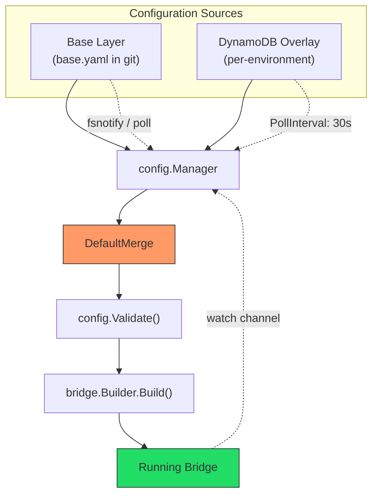
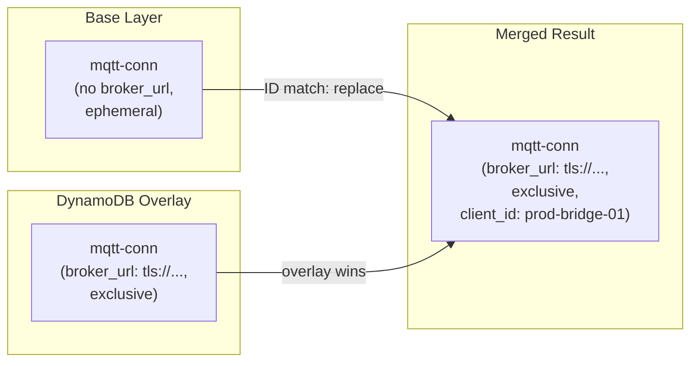
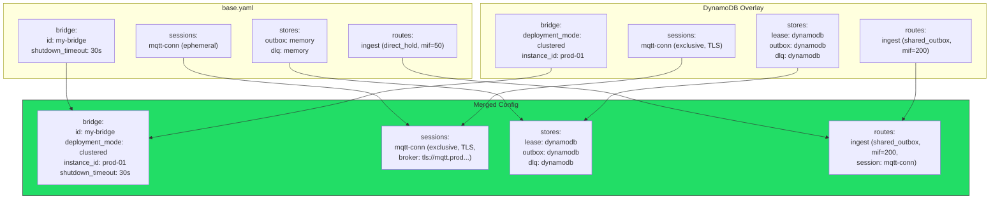

# Scenario 9: Layered Configuration with DynamoDB Overlay

A base YAML file defines shared defaults (transports, processors, stores). A DynamoDB overlay adds environment-specific settings (queue URLs, broker addresses, deployment mode). This separates concerns: developers manage the base config in version control, operations manage the overlay in DynamoDB.

## Use Case

Your organization deploys the same bridge across development, staging, and production environments. The routing logic, processor chain, and structural config are identical everywhere -- only infrastructure endpoints, credentials, and scaling parameters differ. You want developers to own the base configuration in git where it can be reviewed and versioned, while operations teams manage environment-specific overrides through a centralized DynamoDB table without requiring code changes or redeployments.

The layered configuration pattern solves this by composing a final `BridgeConfig` from multiple sources. The base layer provides sensible defaults. The DynamoDB overlay patches in environment-specific values. The `Manager` merges them, validates the result, and emits configuration change events when either layer updates.

## Layer Stack



Both sources can emit change notifications. The file watcher uses fsnotify or SHA-256 polling. The DynamoDB loader uses version-number polling. When either source changes, the Manager re-merges all layers, validates the result, and sends the new config through the watch channel.

## Base YAML Config (Shared Defaults)

This file lives in the repository and defines the structural skeleton -- sessions, receivers, senders, bindings, routes, and development-safe store backends.

```yaml
# base.yaml -- checked into git
bridge:
  id: my-bridge
  shutdown_timeout: 30s

config_watch:
  mode: notify
  debounce: 200ms

sessions:
  - id: mqtt-conn
    transport: mqtt
    options:
      client_id: bridge-01
      keep_alive: 30
      connect_timeout: 30s

stores:
  outbox:
    type: memory
  dlq:
    type: memory

receivers:
  - id: telemetry-in
    session_id: mqtt-conn
    topics:
      - topic: "telemetry/#"
        qos: 1

senders:
  - id: sqs-out
    transport: sqs
    options:
      region: us-east-1
      batch_size: 10

bindings:
  - id: to-sqs
    sender_id: sqs-out
    address: telemetry-events

routes:
  - id: ingest
    receiver_id: telemetry-in
    delivery_mode: direct_hold
    dispatch_mode: single
    bindings: [to-sqs]
    policy:
      max_in_flight: 50
      on_permanent_failure: dlq
```

This config works standalone for local development -- the MQTT broker URL defaults to `localhost`, stores use in-memory backends, and the deployment mode is `standalone` (the default). No secrets, no cloud infrastructure.

## DynamoDB Overlay (Environment-Specific)

The overlay is stored as a single DynamoDB item. Only the fields that differ from the base need to be present. Missing fields are inherited from the base layer.

```json
{
  "bridge": {
    "deployment_mode": "clustered",
    "instance_id": "prod-01"
  },
  "sessions": [
    {
      "id": "mqtt-conn",
      "session_mode": "exclusive",
      "options": {
        "broker_url": "tls://mqtt.prod.example.com:8883",
        "client_id": "prod-bridge-01",
        "tls": {
          "enable": true,
          "ca_cert_file": "/etc/certs/ca.pem"
        }
      }
    }
  ],
  "senders": [
    {
      "id": "sqs-out",
      "options": {
        "queue_url": "https://sqs.us-east-1.amazonaws.com/123456789/telemetry-events"
      }
    }
  ],
  "stores": {
    "lease": {
      "type": "dynamodb",
      "options": { "table_name": "prod-leases" }
    },
    "outbox": {
      "type": "dynamodb",
      "options": { "table_name": "prod-outbox" }
    },
    "dlq": {
      "type": "dynamodb",
      "options": { "table_name": "prod-dlq" }
    }
  },
  "routes": [
    {
      "id": "ingest",
      "delivery_mode": "shared_outbox",
      "policy": {
        "max_in_flight": 200,
        "ack_after": "outbox_persist"
      },
      "session": {
        "session_id": "mqtt-conn",
        "sender_id": "sqs-out",
        "lease_ttl": "300s",
        "connect_after_lease": true
      }
    }
  ]
}
```

The overlay transforms a simple local-dev config into a production-grade clustered deployment. It adds the production broker URL, switches stores from memory to DynamoDB, enables exclusive sessions with lease coordination, and increases concurrency.

## Go Code: Manager Setup

```go
package main

import (
    "context"
    "log/slog"
    "os"
    "os/signal"
    "time"

    "github.com/mariotoffia/gobridge/bridge"
    "github.com/mariotoffia/gobridge/config"
    fileconfig "github.com/mariotoffia/gobridge/adapters/native/config/file"
    ddbconfig "github.com/mariotoffia/gobridge/adapters/aws/config/dynamodb"
    nativestore "github.com/mariotoffia/gobridge/adapters/native/store"
    awsstore "github.com/mariotoffia/gobridge/adapters/aws/store/dynamodb"
    paho "github.com/mariotoffia/gobridge/adapters/mqtt/transport/paho"
    sqs "github.com/mariotoffia/gobridge/adapters/aws/transport/sqs"
)

func main() {
    ctx, stop := signal.NotifyContext(context.Background(), os.Interrupt)
    defer stop()

    logger := slog.Default()

    // --- Base layer: file source with watcher ---
    fileSource := fileconfig.NewSource("base.yaml")
    fileWatcher := fileconfig.NewWatcher("base.yaml",
        fileconfig.WithLogger(logger),
    )

    // --- Overlay layer: DynamoDB source with polling ---
    ddbLoader := ddbconfig.NewLoader(ddbClient,
        ddbconfig.WithTableName("gobridge-config"),
        ddbconfig.WithBridgeID("production"),
        ddbconfig.WithPollInterval(30 * time.Second),
    )

    // --- Compose layers into a Manager ---
    mgr := config.NewManager(
        config.Layer{Name: "base", Loader: fileSource, Watcher: fileWatcher},
        config.WithOverlay(config.Layer{
            Name: "env", Loader: ddbLoader, Watcher: ddbLoader,
        }),
        config.WithManagerLogger(logger),
    )

    // Load merges base + overlay, then validates
    cfg, err := mgr.Load(ctx)
    if err != nil {
        slog.Error("config load failed", "error", err)
        os.Exit(1)
    }

    // Watch emits merged configs when either layer changes
    watchCh, err := mgr.Watch(ctx)
    if err != nil {
        slog.Error("config watch failed", "error", err)
        os.Exit(1)
    }
    defer mgr.Stop()

    // --- Build and run the bridge ---
    sup := bridge.NewSupervisor(
        bridge.WithSupervisorLogger(logger),
        bridge.WithReconfigStrategy(
            bridge.NewWindowedStrategy(10*time.Second, 30*time.Second),
        ),
    )

    sup.RegisterTransport("mqtt", paho.NewBridgeFactory(logger))
    sup.RegisterTransport("sqs", sqs.NewBridgeFactory(logger))
    sup.RegisterStoreFactory("memory", nativestore.NewMemoryStoreFactory())
    sup.RegisterStoreFactory("dynamodb", awsstore.NewDynamoDBStoreFactory(ddbClient))

    // Run blocks until ctx is cancelled
    sup.Run(ctx, cfg, watchCh)
}
```

The `Manager` handles all merge and validation logic internally. The caller receives a fully merged, validated `BridgeConfig` from `Load()` and a channel of subsequent merged configs from `Watch()`.

## Merge Semantics Deep Dive

The `DefaultMerge` function applies overlay values onto the base config using field-level and ID-level merge rules. Understanding these rules is essential for predicting the final config.

### `bridge` settings: non-zero field replacement

Each non-zero field in the overlay replaces the corresponding base field. Zero-value fields in the overlay are ignored (they inherit the base value).

| Field | Base | Overlay | Merged |
|-------|------|---------|--------|
| `id` | `my-bridge` | *(not set)* | `my-bridge` |
| `deployment_mode` | *(default: standalone)* | `clustered` | `clustered` |
| `instance_id` | *(not set)* | `prod-01` | `prod-01` |
| `shutdown_timeout` | `30s` | *(not set)* | `30s` |

### `sessions`, `receivers`, `senders`, `bindings`, `routes`: merge by ID

Collections are merged by matching the `id` field. When an overlay entry has the same ID as a base entry, the overlay replaces the base entry entirely. When an overlay entry has a new ID not present in the base, it is appended.



**Important:** When IDs match, the overlay entry replaces the base entry as a whole unit. The options maps are not deep-merged -- the overlay's options map replaces the base's options map entirely. This means the overlay session must include all required options (like `client_id`), not just the ones being changed.

In the example above, the overlay session includes both `broker_url` (new) and `client_id: prod-bridge-01` (overriding the base value of `bridge-01`). If the overlay omitted `client_id`, the merged session would have no `client_id` and validation would fail.

### `stores`: per-role replacement

Each store role (`lease`, `outbox`, `dlq`) is treated independently. If the overlay defines a role, it replaces the base definition for that role. If the overlay does not define a role, the base definition is preserved.

| Role | Base | Overlay | Merged |
|------|------|---------|--------|
| `lease` | *(nil)* | `dynamodb (prod-leases)` | `dynamodb (prod-leases)` |
| `outbox` | `memory` | `dynamodb (prod-outbox)` | `dynamodb (prod-outbox)` |
| `dlq` | `memory` | `dynamodb (prod-dlq)` | `dynamodb (prod-dlq)` |

### `config_watch`, `http`: wholesale replacement

These top-level objects are replaced entirely if the overlay provides a non-nil value. If the overlay omits them, the base values are preserved.

In the example, the overlay does not include `config_watch`, so the base definition (`mode: notify, debounce: 200ms`) carries through unchanged.

### New entries are appended

If the overlay adds a receiver, sender, binding, or route with an ID not present in the base, it is appended to the collection:

```json
{
  "receivers": [
    { "id": "webhook-in", "transport": "http", "options": { "path": "/webhooks" } }
  ]
}
```

This overlay would result in two receivers: `telemetry-in` (from base) and `webhook-in` (from overlay).

## Merge Visualization

The following diagram shows the complete merge result for this scenario.



## When to Use Each Pattern

| Pattern | Best For | Advantages | Drawbacks |
|---------|----------|------------|-----------|
| **File-only** | Simple deployments, all config in git | Auditable, no external deps | Requires file edit to change; no env separation |
| **DynamoDB-only** | Centralized config management | Centralized, environment-aware | No git history; requires DynamoDB everywhere |
| **Layered** (recommended) | Separation of concerns | Devs own structure in git; ops override in DynamoDB | Requires understanding merge semantics |

## Variations

### Three-Layer Stack

Add a third layer for instance-specific overrides. Layers are applied in order: base, then environment, then instance.

```go
instanceSource := fileconfig.NewSource("/etc/gobridge/instance.yaml")
instanceWatcher := fileconfig.NewWatcher("/etc/gobridge/instance.yaml")

mgr := config.NewManager(
    config.Layer{Name: "base", Loader: fileSource, Watcher: fileWatcher},
    config.WithOverlay(config.Layer{Name: "env", Loader: ddbLoader, Watcher: ddbLoader}),
    config.WithOverlay(config.Layer{
        Name: "instance", Loader: instanceSource, Watcher: instanceWatcher,
    }),
)
```

The instance-level overlay might contain only the `instance_id` and `client_id`:

```yaml
# /etc/gobridge/instance.yaml
bridge:
  instance_id: prod-03

sessions:
  - id: mqtt-conn
    options:
      client_id: prod-bridge-03
```

This three-layer approach is useful when you have many instances in a cluster and each needs a unique identity, but all share the same environment-level config.

### Custom MergeFunc

The default merge behavior can be replaced with a custom function using `WithMergeFunc`. This is useful when you need non-standard merge logic, such as deep-merging options maps instead of replacing them.

```go
mgr := config.NewManager(
    config.Layer{Name: "base", Loader: fileSource, Watcher: fileWatcher},
    config.WithOverlay(config.Layer{Name: "env", Loader: ddbLoader, Watcher: ddbLoader}),
    config.WithMergeFunc(func(base, overlay *config.BridgeConfig) (*config.BridgeConfig, error) {
        // Custom merge logic here
        // For example, deep-merge session options instead of replacing
        merged := config.DefaultMerge(base, overlay)
        // ... apply additional transformations ...
        return merged, nil
    }),
)
```

The custom merge function receives the base config and the next overlay. It is called once for each overlay in order. The return value becomes the new base for the next overlay. If the function returns an error, the Manager propagates it from `Load()` or through the watch channel.

### DynamoDB Table Schema

The DynamoDB config table uses the following schema. One item per bridge, identified by the bridge ID:

| Attribute | Type | Key | Description |
|-----------|------|-----|-------------|
| `PK` | String | Partition | `config#<bridge-id>` (e.g., `config#production`) |
| `SK` | String | Sort | `current` |
| `config` | Map | -- | The full or partial `BridgeConfig` as a DynamoDB map |
| `version` | Number | -- | Monotonically increasing version for change detection |
| `updated_at` | String | -- | ISO 8601 timestamp of last update |

The DynamoDB loader polls this item at `PollInterval` and compares the `version` field. When the version changes, it deserializes the `config` attribute into a `BridgeConfig` struct and emits it through the watcher channel.

To update the overlay, write a new item with an incremented `version`. The bridge picks up the change within one poll interval (default 30 seconds).
