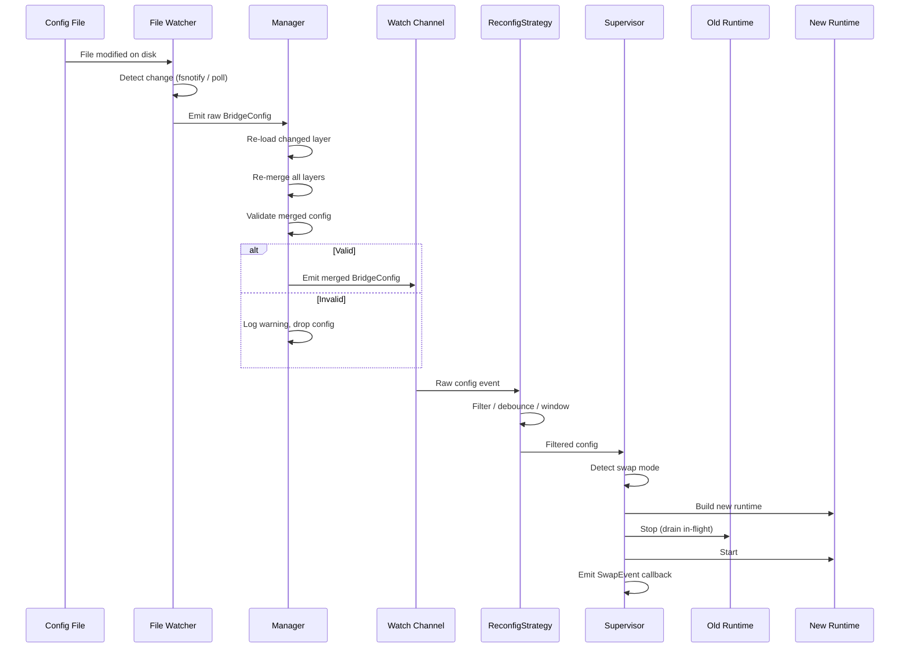
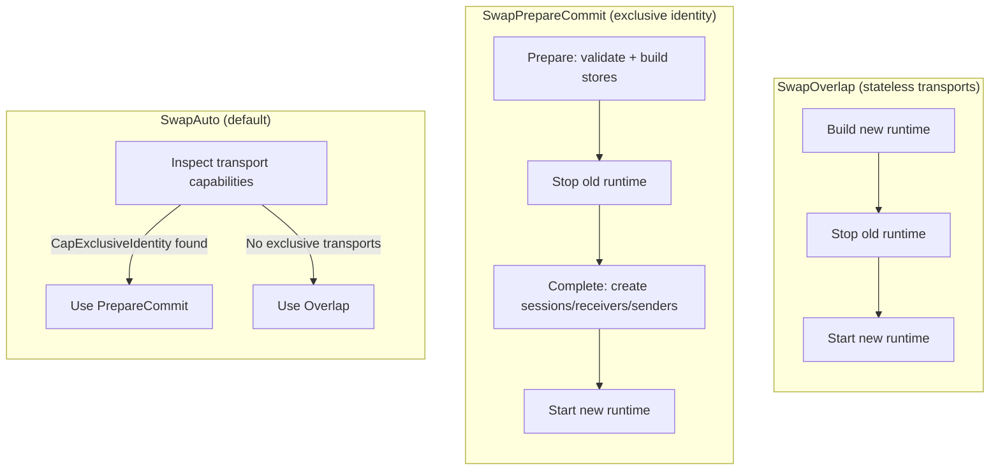

# Scenario 10: Dynamic Reconfiguration

Update a running bridge -- add routes, change policies, or swap endpoints -- without restarting the process.

## Use Case

You operate a message bridge in production and need to evolve its configuration over time: adding new routes for newly discovered device types, adjusting backpressure limits in response to traffic patterns, or changing broker endpoints during maintenance windows. Restarting the process is unacceptable because it interrupts in-flight message processing and may cause duplicate deliveries downstream.

GoBridge solves this with a layered configuration system, file watchers, and a Supervisor that coordinates runtime swaps safely.

## Dynamic Reconfiguration Lifecycle



## Configuration

```yaml
bridge:
  id: dynamic-bridge
  shutdown_timeout: 30s

config_watch:
  mode: notify
  debounce: 200ms

sessions:
  - id: mqtt
    transport: mqtt
    options:
      broker_url: tcp://localhost:1883
      client_id: dynamic-01

receivers:
  - id: in
    session_id: mqtt
    topics:
      - topic: "events/#"

senders:
  - id: out
    session_id: mqtt
    options:
      default_topic: processed/events

bindings:
  - id: fwd
    sender_id: out
    address: processed/events

routes:
  - id: process
    receiver_id: in
    bindings: [fwd]
```

The `config_watch` block is the key addition. It tells the file watcher to use filesystem event notifications (`notify`) and coalesce rapid writes within a 200ms debounce window before signalling a change.

## Go Bootstrap with Supervisor

```go
package main

import (
    "context"
    "log/slog"
    "os"
    "os/signal"
    "time"

    "github.com/mariotoffia/gobridge/bridge"
    "github.com/mariotoffia/gobridge/config"
    fileconfig "github.com/mariotoffia/gobridge/adapters/native/config/file"
    nativestore "github.com/mariotoffia/gobridge/adapters/native/store"
    "github.com/mariotoffia/gobridge/adapters/mqtt/transport/paho"
)

func main() {
    ctx, cancel := signal.NotifyContext(context.Background(), os.Interrupt)
    defer cancel()

    logger := slog.Default()

    // 1. Load initial config from file
    fileSource := fileconfig.NewSource("bridge.yaml")
    baseCfg, _ := fileSource.Load(ctx)

    // 2. Create file watcher using config_watch settings
    fileWatcher := fileconfig.NewWatcher("bridge.yaml",
        fileconfig.WithWatchConfig(baseCfg.ConfigWatch),
        fileconfig.WithLogger(logger),
    )

    // 3. Create manager (supports layered config)
    mgr := config.NewManager(
        config.Layer{Name: "file", Loader: fileSource, Watcher: fileWatcher},
        config.WithManagerLogger(logger),
    )
    cfg, _ := mgr.Load(ctx)

    // 4. Create supervisor with windowed strategy
    sup := bridge.NewSupervisor(
        bridge.WithSupervisorLogger(logger),
        bridge.WithReconfigStrategy(
            bridge.NewWindowedStrategy(10*time.Second, 30*time.Second),
        ),
        bridge.WithOnSwap(func(ev bridge.SwapEvent) {
            if ev.Error != nil {
                logger.Error("reconfig failed", "error", ev.Error)
            } else {
                logger.Info("reconfig applied",
                    "duration", ev.Duration,
                    "swap_mode", ev.SwapMode)
            }
        }),
    )

    // 5. Register transport and store factories
    sup.RegisterTransport("mqtt", paho.NewFactory(logger))
    sup.RegisterStoreFactory("memory", nativestore.NewMemoryStoreFactory())

    // 6. Start watching and run (blocks until ctx cancelled)
    watchCh, _ := mgr.Watch(ctx)
    defer mgr.Stop()

    sup.Run(ctx, cfg, watchCh)
}
```

Key points:

- **`NewWindowedStrategy(10s, 30s)`** -- Debounce with a 10-second quiet period and a 30-second hard deadline. If edits keep arriving, the latest config is applied at most 30 seconds after the first change.
- **`WithOnSwap`** -- Callback invoked after every swap attempt, successful or not. Useful for alerting and metrics.
- **`sup.Run`** -- Blocks until the context is cancelled. Config change failures are logged but do not stop the supervisor.

## Swap Modes

The Supervisor supports three swap modes that control how it transitions between old and new runtimes.



### SwapOverlap

Build the new runtime completely while the old one is still running. Then stop the old runtime and start the new one. This minimizes downtime because the new runtime is fully constructed before the old one shuts down. Best for stateless transports like SQS or Azure Service Bus where there is no conflict in having two instances alive briefly.

### SwapPrepareCommit

Split the build into two phases. **Prepare** validates the config and builds stores while the old runtime runs. **Complete** creates transport sessions, receivers, and senders only after the old runtime has stopped. This is required for MQTT because two clients with the same `client_id` cannot connect simultaneously -- the broker disconnects the first one. The MQTT factory declares `CapExclusiveIdentity` to signal this constraint.

### SwapAuto (Default)

Inspects all transport factories referenced by the new config's sessions. If any factory declares `CapExclusiveIdentity`, the supervisor uses PrepareCommit. Otherwise it uses Overlap. This is the recommended default -- it adapts automatically to the transports in use.

## ReconfigStrategy Comparison

Three built-in strategies control when config changes trigger a rebuild.

| Strategy | Constructor | Behaviour | Best For |
|----------|-------------|-----------|----------|
| `DirectStrategy` | `NewDirectStrategy()` | Every change triggers immediate rebuild | Development |
| `DebouncedStrategy` | `NewDebouncedStrategy(quietPeriod)` | Waits for quiet period with no new changes; resets timer on each change | Burst edits |
| `WindowedStrategy` | `NewWindowedStrategy(quietPeriod, maxDelay)` | Like Debounced, but forces emit after `maxDelay` even if changes keep arriving | Production |

### Strategy Timing

The following diagram shows how each strategy responds to the same series of config changes arriving over time.

```mermaid
gantt
    title Strategy Timing Comparison
    dateFormat X
    axisFormat %s

    section Changes
    Change 1          :milestone, c1, 0, 0
    Change 2          :milestone, c2, 3, 0
    Change 3          :milestone, c3, 6, 0
    Change 4          :milestone, c4, 8, 0

    section DirectStrategy
    Rebuild 1         :crit, d1, 0, 1
    Rebuild 2         :crit, d2, 3, 1
    Rebuild 3         :crit, d3, 6, 1
    Rebuild 4         :crit, d4, 8, 1

    section DebouncedStrategy (quiet=5s)
    Wait              :active, dw, 8, 13
    Rebuild           :crit, dr, 13, 1

    section WindowedStrategy (quiet=5s max=10s)
    Window cap        :active, ww, 0, 10
    Rebuild           :crit, wr, 10, 1
```



- **DirectStrategy** rebuilds four times -- once per change.
- **DebouncedStrategy** waits 5 seconds after the last change (Change 4 at t=8), emitting at t=13. Only the latest config is applied.
- **WindowedStrategy** would normally wait for quiet, but the max delay (10s from Change 1 at t=0) fires first at t=10. The latest config at that moment is applied.

## Config Walkthrough

### `config_watch`

| Field | Value | Purpose |
|-------|-------|---------|
| `mode` | `notify` | Use filesystem events (fsnotify) for instant detection |
| `debounce` | `200ms` | Coalesce rapid file writes (editor save + format) |

The debounce in `config_watch` is the **file watcher** debounce -- it controls how quickly the watcher re-reads the file after a filesystem event. The **ReconfigStrategy** debounce is separate and controls how quickly the Supervisor acts on the parsed config.

### Two Debounce Layers

1. **File watcher debounce** (`config_watch.debounce: 200ms`) -- Prevents reading a partially written file. An editor that writes in multiple steps (truncate, write, rename) generates several events; the debounce ensures the watcher reads the final state.

2. **ReconfigStrategy debounce** (`WindowedStrategy(10s, 30s)`) -- Prevents rebuilding the runtime for every small edit. An operator making several related changes (add a receiver, add a route, adjust a policy) gets a single rebuild after the quiet period.

## Key Decisions

### notify vs poll Mode

| Factor | `notify` | `poll` |
|--------|----------|--------|
| Latency | Milliseconds | Up to `poll_interval` |
| CPU cost | Near zero (event-driven) | Periodic SHA-256 hash per interval |
| Works on NFS / network mounts | No (fsnotify requires inotify/kqueue) | Yes |
| Works in containers with mounted ConfigMaps | Unreliable (symlink swaps) | Yes |

**Recommendation:** Use `notify` for local disks. Use `poll` for NFS, network mounts, and Kubernetes ConfigMap volumes.

### Debounce Timing

- **File debounce (100-500ms):** Match your editor's save behavior. 200ms handles most editors.
- **Quiet period (5-15s):** Long enough for an operator to make related changes. 10s is a good default.
- **Max delay (20-60s):** Upper bound for continuous change streams. 30s balances responsiveness with stability.

## Variations

### Poll Mode for NFS

```yaml
config_watch:
  mode: poll
  poll_interval: 30s
```

The watcher computes a SHA-256 hash of the file every 30 seconds. Only when the hash changes does it re-read and parse the file.

### Custom ReconfigStrategy

Implement the `ReconfigStrategy` interface for custom behavior:

```go
type ReconfigStrategy interface {
    Filter(ctx context.Context, in <-chan *config.BridgeConfig) <-chan *config.BridgeConfig
}
```

For example, a strategy that only applies changes during maintenance windows, or one that requires approval from an external system before proceeding.

### Recovery on Invalid Config

When the Manager re-merges layers and the result fails validation, it logs a warning and drops the invalid config. The watch channel does not receive the invalid config, so the Supervisor continues running with the last known good configuration.

```
WARN config manager: rebuild failed trigger=file error="bridge.id is required"
```

This means a typo in the YAML does not take down the bridge. Fix the file, and the next valid config will be applied.

### Layered Config with Environment Overrides

```go
mgr := config.NewManager(
    config.Layer{Name: "base", Loader: baseSource, Watcher: baseWatcher},
    config.WithOverlay(config.Layer{
        Name:    "env",
        Loader:  ddbLoader,
        Watcher: ddbLoader,
    }),
    config.WithManagerLogger(logger),
)
```

A change to either the base file or the DynamoDB overlay triggers a re-merge of all layers. The merged result is validated before emission.

### Forcing a Specific Swap Mode

```go
sup := bridge.NewSupervisor(
    bridge.WithSwapMode(bridge.SwapPrepareCommit),
)
```

Use this when SwapAuto picks the wrong mode -- for example, a custom transport that requires exclusive access but does not declare `CapExclusiveIdentity`.
