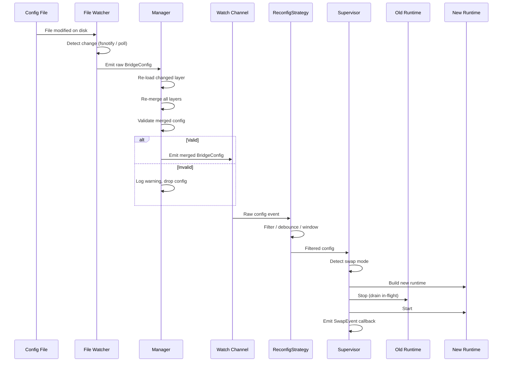
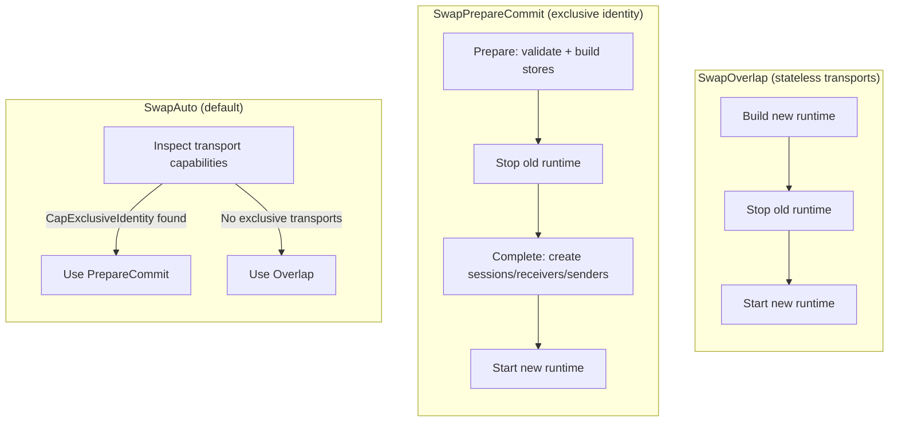

# Scenario 10: Dynamic Reconfiguration

Update a running bridge -- add routes, change policies, or swap endpoints -- without restarting the process.

## Use Case

You operate a message bridge in production and need to evolve its configuration over time: adding new routes for newly discovered device types, adjusting backpressure limits in response to traffic patterns, or changing broker endpoints during maintenance windows. Restarting the process is unacceptable because it interrupts in-flight message processing and may cause duplicate deliveries downstream.

GoBridge solves this with a layered configuration system, file watchers, and a Supervisor that coordinates runtime swaps safely **within a single process**. Reconfiguration is per-process, not cluster-coordinated -- see [Cluster Semantics and Limitations](#cluster-semantics-and-limitations) for the boundaries this implies in a multi-instance deployment.

## Dynamic Reconfiguration Lifecycle



## Configuration

```yaml
bridge:
  id: dynamic-bridge
  shutdown_timeout: 30s

config_watch:
  mode: notify
  debounce: 200ms

sessions:
  - id: mqtt
    transport: mqtt
    options:
      session:
        broker_url: tcp://localhost:1883
        client_id: dynamic-01

receivers:
  - id: in
    session_id: mqtt
    topics:
      - topic: "events/#"

senders:
  - id: out
    session_id: mqtt
    options:
      sender:
        default_topic: processed/events

bindings:
  - id: fwd
    sender_id: out
    address: processed/events

routes:
  - id: process
    receiver_id: in
    bindings: [fwd]
```

The `config_watch` block is the key addition. It tells the file watcher to use filesystem event notifications (`notify`) and coalesce rapid writes within a 200ms debounce window before signalling a change.

## Go Bootstrap with Supervisor

```go
package main

import (
    "context"
    "log/slog"
    "os"
    "os/signal"
    "time"

    "github.com/mariotoffia/gobridge/bridge"
    "github.com/mariotoffia/gobridge/config"
    fileconfig "github.com/mariotoffia/gobridge/adapters/native/config/file"
    nativestore "github.com/mariotoffia/gobridge/adapters/native/store"
    "github.com/mariotoffia/gobridge/adapters/mqtt/transport/paho"
    "github.com/mariotoffia/gobridge/ports"
)

func main() {
    ctx, cancel := signal.NotifyContext(context.Background(), os.Interrupt)
    defer cancel()

    logger := slog.Default()

    // 1. Build the plugin registry, register the linked adapters, and load
    //    config. NewSource and NewWatcher both require the *ports.Registry.
    reg := ports.NewRegistry()
    _ = paho.Register(reg)
    _ = nativestore.Register(reg)
    fileSource := fileconfig.NewSource("bridge.yaml", reg)
    baseCfg, _ := fileSource.Load(ctx)

    // 2. Create file watcher using config_watch settings (same registry)
    fileWatcher := fileconfig.NewWatcher("bridge.yaml", reg,
        fileconfig.WithWatchConfig(baseCfg.ConfigWatch),
        fileconfig.WithLogger(logger),
    )

    // 3. Create manager (supports layered config)
    mgr := config.NewManager(
        config.Layer{Name: "file", Loader: fileSource, Watcher: fileWatcher},
        config.WithManagerLogger(logger),
    )
    cfg, _ := mgr.Load(ctx)

    // 4. Create supervisor with windowed strategy
    sup := bridge.NewSupervisor(
        bridge.WithSupervisorLogger(logger),
        bridge.WithReconfigStrategy(
            bridge.NewWindowedStrategy(10*time.Second, 30*time.Second, nil),
        ),
        bridge.WithOnSwap(func(ev bridge.SwapEvent) {
            if ev.Error != nil {
                logger.Error("reconfig failed", "error", ev.Error)
            } else {
                logger.Info("reconfig applied",
                    "duration", ev.Duration,
                    "swap_mode", ev.SwapMode)
            }
        }),
    )

    // 5. Register transport and store factories
    sup.RegisterTransport("mqtt", paho.NewFactory(logger))
    sup.RegisterStoreFactory("memory", nativestore.NewMemoryStoreFactory())

    // 6. Start watching and run (blocks until ctx cancelled)
    watchCh, _ := mgr.Watch(ctx)
    defer mgr.Stop()

    sup.Run(ctx, cfg, watchCh)
}
```

Key points:

- **`NewWindowedStrategy`** -- Debounce with a 10-second quiet period and a 30-second hard deadline. If edits keep arriving, the latest config is applied at most 30 seconds after the first change.
- **`WithOnSwap`** -- Callback invoked after every swap attempt, successful or not. Useful for alerting and metrics.
- **`sup.Run`** -- Blocks until the context is cancelled. Config change failures are logged but do not stop the supervisor.

## Swap Modes

The Supervisor supports three swap modes that control how it transitions between old and new runtimes.



### SwapOverlap

Build the new runtime completely while the old one is still running. Then stop the old runtime and start the new one. This minimizes downtime because the new runtime is fully constructed before the old one shuts down. Best for stateless transports like SQS or Azure Service Bus where there is no conflict in having two instances alive briefly.

### SwapPrepareCommit

Split the build into two phases. **Prepare** validates the config and builds stores while the old runtime runs. **Complete** creates transport sessions, receivers, and senders only after the old runtime has stopped. This is required for MQTT because two clients with the same `client_id` cannot connect simultaneously -- the broker disconnects the first one. The MQTT factory declares `CapExclusiveIdentity` to signal this constraint.

### SwapAuto (Default)

Inspects all transport factories referenced by the new config's sessions. If any factory declares `CapExclusiveIdentity`, the supervisor uses PrepareCommit. Otherwise it uses Overlap. This is the recommended default -- it adapts automatically to the transports in use.

## Cluster Semantics and Limitations

Reconfiguration is **per-process**. Each instance independently watches its own config source, reloads, validates, and swaps its runtime through the Supervisor. GoBridge does **not** apply a config version atomically across the cluster: there is **no cluster-wide version barrier and no coordinated cluster rollback**.

**This is why a per-process live reload of a clustered deployment is now rejected fail-closed** (see below). Historically, letting each instance swap independently meant that during a rolling reload -- or if one instance failed to load or validate the new config -- different instances would run **different** route, store, session, or policy definitions simultaneously, until every instance had reloaded (indefinitely, if an instance stayed wedged on a config it could not load). That split-version window was a live-reconfiguration hazard; the fail-closed guard now prevents it from ever arising through a live reload. A **coordinated** whole-cohort rollout still passes through a brief transition, which is exactly why the [Cluster Config Rollout runbook](../runbooks/cluster-config-rollout.md) quiesces ingress and commits behind a version/readiness barrier instead of swapping members live.

The classification below describes why each change is unsafe to roll across a cohort (and how single-process/standalone reload still behaves):

- **Per-instance durability and fencing guarantees hold -- as long as every instance resolves a session to the same session id, lease store, and outbox store.** The outbox is durable on each instance, and lease fencing admits a single active drainer for an exclusive session regardless of config version, because the lease CAS is keyed on the lease version, not `BridgeConfig.Version` (see [Scenario 8: Clustered MQTT with Exclusive Sessions](08-clustered-exclusive-sessions.md)). Within those bounds a mixed-version window does **not** cause duplicate *commits* or message loss within an instance.
  - **A reconfiguration that changes a session's id, or repoints its lease or outbox store, is _not_ version-skew-safe.** Two instances then drive the *same* session against *different* stores: both hold "its" lease (in different lease stores) and drain independently -- elevated duplicate *sends* -- and any records left undrained in the now-unreferenced outbox store are stranded and lost. Treat session ids and lease/outbox store targets as cluster-wide invariants: migrate them with a full drain-and-stop, never a rolling reconfiguration.
- **Routing, policy, and transformation behaviour is eventually consistent across the cluster, not atomic.** The same message class may be handled under the old or the new definition depending on which instance processed it during the divergence window.

There is **no** supported *live* rollout for a clustered deployment: a live reload of (or into) a clustered cohort is rejected fail-closed (see below). Operators must coordinate the cutover externally -- drain and stop all instances, commit, then restart all instances behind a version/readiness barrier -- per the [Cluster Config Rollout runbook](../runbooks/cluster-config-rollout.md).

### Clustered live reload is rejected, fail-closed

A per-process live reload cannot roll a clustered cohort safely: there is no cluster-wide version barrier, no all-member readiness gate, and no coordinated rollback. So the runtime **refuses every non-no-op live reload of (or into) a clustered deployment wholesale** (finding H8), rather than adopting a split-inducing config.

The guard fires in both reload paths -- the `Supervisor` (`bridge.Supervisor.apply`) and the AWS file-based composition root (`bootstrap.App.applyLogicalConfig`) -- **after no-op detection but before any Plan/build/store query or stop**. It triggers when **either** the currently-applied **or** the proposed config is clustered (`deployment_mode: clustered`, or a static `cluster.endpoints` override), covering both *entering* and *leaving* a cohort via live reload. On refusal:

- the **current runtime keeps serving unchanged** -- the applied config, its running `config_version`, and the runtime reference are untouched;
- the swap **fails through the existing failure path** -- the Supervisor emits the failed `SwapEvent` and the `ConfigReloads{state="failure"}` counter; the AWS root returns the error so `watchLoop` keeps the last-good runtime and an admin commit surfaces `committed_not_applied`.

`WithAllowDestructiveReload` does **not** bypass this guard. That escape hatch only discards *local* durable backlog; it cannot substitute for cluster consensus, so it is irrelevant to a whole-cohort cutover.

A genuine **no-op re-emit** (byte-identical content -- e.g. the poll watcher re-emitting an unchanged file) is detected *before* the guard and stays accepted; it is not a reconfiguration.

This whole-class rejection supersedes the earlier piecemeal per-invariant refusals (durable store identity, outbox/DLQ removal or orphaned `shared_outbox` partition, lease-bearing exclusive `session_id`): in a clustered deployment those are now refused as part of the broad guard, not just individually. In a **standalone** (single-process) deployment they still apply exactly as before -- see `storeIdentityChanged`, the durable-reload preflight, and `leaseSessionIDChanged`. Single-process live reload behaviour is unchanged.

Roll a clustered config change with a **full stop/restart of all nodes** per the runbook -- never a live/rolling reconfiguration.

To operate safely:

- **Validate config before deploy.** The `version` CAS field (`BridgeConfig.Version`) and the local applied-config reference tracking guard concurrent *commits* to a shared config file (e.g. on AWS EFS) and make per-process reloads idempotent; they are **not cluster consensus and not a version barrier**, do **not** gate the per-instance apply, and must **not** be relied on as resilient live reconfiguration across a cohort.
- **Do not attempt a live/rolling reconfiguration of a clustered deployment.** It is rejected fail-closed; use the [Cluster Config Rollout runbook](../runbooks/cluster-config-rollout.md) for an externally coordinated whole-cohort replacement.
- **Observe each instance's running `config_version`.** On each reconfiguration swap the Supervisor logs `config_version` -- always the version running *after* the swap; a failed swap keeps the old config running and additionally logs the rejected version as `attempted_config_version`. The same value is exposed on the authenticated monitor endpoint `GET /api/v1/monitor/topology` as the `config_version` field when a config provider is wired (`httpapi/monitor.go:186-211`), and programmatically via `Supervisor.Config().Version`. For fleet-wide convergence monitoring, scrape `config_version` from `/topology` across every instance rather than relying on swap logs alone (the initial config load is not logged with a version). Treat persistent version divergence across instances as an alertable condition. Note: after a swap that fails *and* whose recovery also fails, `config_version` still reports the intended old version while no runtime is live -- cross-check the `running` flag on `/topology` to distinguish that case.

## ReconfigStrategy Comparison

Three built-in strategies control when config changes trigger a rebuild.

| Strategy | Constructor | Behaviour | Best For |
|----------|-------------|-----------|----------|
| `DirectStrategy` | `NewDirectStrategy()` | Every change triggers immediate rebuild | Development |
| `DebouncedStrategy` | `NewDebouncedStrategy(quietPeriod, clk)` | Waits for quiet period with no new changes; resets timer on each change | Burst edits |
| `WindowedStrategy` | `NewWindowedStrategy(quietPeriod, maxDelay, clk)` | Like Debounced, but forces emit after `maxDelay` even if changes keep arriving | Production |

### Strategy Timing

The following diagram shows how each strategy responds to the same series of config changes arriving over time.

```mermaid
gantt
    title Strategy Timing Comparison
    dateFormat X
    axisFormat %s

    section Changes
    Change 1          :milestone, c1, 0, 0
    Change 2          :milestone, c2, 3, 0
    Change 3          :milestone, c3, 6, 0
    Change 4          :milestone, c4, 8, 0

    section DirectStrategy
    Rebuild 1         :crit, d1, 0, 1
    Rebuild 2         :crit, d2, 3, 1
    Rebuild 3         :crit, d3, 6, 1
    Rebuild 4         :crit, d4, 8, 1

    section DebouncedStrategy (quiet=5s)
    Wait              :active, dw, 8, 13
    Rebuild           :crit, dr, 13, 1

    section WindowedStrategy (quiet=5s max=10s)
    Window cap        :active, ww, 0, 10
    Rebuild           :crit, wr, 10, 1
```



- **DirectStrategy** rebuilds four times -- once per change.
- **DebouncedStrategy** waits 5 seconds after the last change (Change 4 at t=8), emitting at t=13. Only the latest config is applied.
- **WindowedStrategy** would normally wait for quiet, but the max delay (10s from Change 1 at t=0) fires first at t=10. The latest config at that moment is applied.

## Config Walkthrough

### `config_watch`

| Field | Value | Purpose |
|-------|-------|---------|
| `mode` | `notify` | Use filesystem events (fsnotify) for instant detection |
| `debounce` | `200ms` | Coalesce rapid file writes (editor save + format) |

The debounce in `config_watch` is the **file watcher** debounce -- it controls how quickly the watcher re-reads the file after a filesystem event. The **ReconfigStrategy** debounce is separate and controls how quickly the Supervisor acts on the parsed config.

### Two Debounce Layers

1. **File watcher debounce** (`config_watch.debounce: 200ms`) -- Prevents reading a partially written file. An editor that writes in multiple steps (truncate, write, rename) generates several events; the debounce ensures the watcher reads the final state.

2. **ReconfigStrategy debounce** (`WindowedStrategy(10s, 30s)`) -- Prevents rebuilding the runtime for every small edit. An operator making several related changes (add a receiver, add a route, adjust a policy) gets a single rebuild after the quiet period.

## Key Decisions

### notify vs poll Mode

| Factor | `notify` | `poll` |
|--------|----------|--------|
| Latency | Milliseconds | Up to `poll_interval` |
| CPU cost | Near zero (event-driven) | Periodic SHA-256 hash per interval |
| Works on NFS / network mounts | No (fsnotify requires inotify/kqueue) | Yes |
| Works in containers with mounted ConfigMaps | Unreliable (symlink swaps) | Yes |

**Recommendation:** Use `notify` for local disks. Use `poll` for NFS, network mounts, and Kubernetes ConfigMap volumes.

### Debounce Timing

- **File debounce (100-500ms):** Match your editor's save behavior. 200ms handles most editors.
- **Quiet period (5-15s):** Long enough for an operator to make related changes. 10s is a good default.
- **Max delay (20-60s):** Upper bound for continuous change streams. 30s balances responsiveness with stability.

## Variations

### Poll Mode for NFS

```yaml
config_watch:
  mode: poll
  poll_interval: 30s
```

The watcher computes a SHA-256 hash of the file every 30 seconds. Only when the hash changes does it re-read and parse the file.

### Custom ReconfigStrategy

Implement the `ReconfigStrategy` interface for custom behavior:

```go
type ReconfigStrategy interface {
    Filter(ctx context.Context, in <-chan *ports.BridgeConfig) <-chan *ports.BridgeConfig
}
```

For example, a strategy that only applies changes during maintenance windows, or one that requires approval from an external system before proceeding.

### Recovery on Invalid Config

When the Manager re-merges layers and the result fails validation, it logs a warning and drops the invalid config. The watch channel does not receive the invalid config, so the Supervisor continues running with the last known good configuration.

```text
WARN config manager: rebuild failed trigger=file error="bridge.id is required"
```

This means a typo in the YAML does not take down the bridge. Fix the file, and the next valid config will be applied.

### Layered Config with Environment Overrides

```go
mgr := config.NewManager(
    config.Layer{Name: "base", Loader: baseSource, Watcher: baseWatcher},
    config.WithOverlay(config.Layer{
        Name:    "env",
        Loader:  ddbLoader,
        Watcher: ddbLoader,
    }),
    config.WithManagerLogger(logger),
)
```

A change to either the base file or the DynamoDB overlay triggers a re-merge of all layers. The merged result is validated before emission.

### Forcing a Specific Swap Mode

```go
sup := bridge.NewSupervisor(
    bridge.WithSwapMode(bridge.SwapPrepareCommit),
)
```

Use this when SwapAuto picks the wrong mode -- for example, a custom transport that requires exclusive access but does not declare `CapExclusiveIdentity`.
