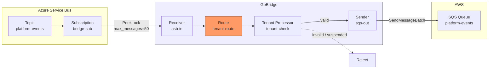
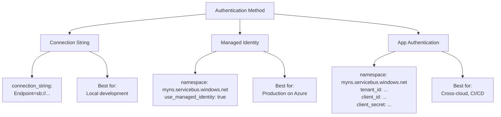

# Scenario 11: Multi-Tenant Azure Service Bus

Route events from multiple tenants through a shared Azure Service Bus infrastructure with per-tenant validation, quota enforcement, and cross-cloud delivery.

## Use Case

You operate a SaaS platform where each tenant publishes domain events to a shared Azure Service Bus topic. A bridge subscription consumes all tenant events, validates the tenant identity header, enforces message size quotas, and forwards valid messages to a processing queue. In production, authentication uses Azure Managed Identity. In development, a connection string is used instead.

## Architecture



## Configuration

```yaml
bridge:
  id: multi-tenant-asb

receivers:
  - id: asb-in
    transport: servicebus
    options:
      connection:
        namespace: myplatform.servicebus.windows.net
        use_managed_identity: true
      receiver:
        topic_name: platform-events
        subscription_name: bridge-sub
        max_messages: 50
        receive_mode: PeekLock
        auto_extend: true

senders:
  - id: sqs-out
    transport: sqs
    options:
      queue_url: https://sqs.eu-west-1.amazonaws.com/123456789/platform-events
      region: eu-west-1
      batch_size: 10

bindings:
  - id: to-processing
    sender_id: sqs-out
    address: platform-events

routes:
  - id: tenant-route
    receiver_id: asb-in
    delivery_mode: direct_hold
    dispatch_mode: single
    bindings: [to-processing]
    processors: [tenant-check]
    policy:
      max_in_flight: 200
```

## Config Walkthrough

### No Sessions

Azure Service Bus is a **stateless** transport in GoBridge. Unlike MQTT, there is no persistent connection to manage. Each receiver creates its own AMQP link internally. This means:

- No `sessions` section needed.
- The receiver specifies `transport: servicebus` directly.
- No `session_id` references.

### Receiver Options

Receiver options split into a `connection` group (namespace, authentication) and a
`receiver` group (entity and receive behavior):

| Field | Value | Purpose |
|-------|-------|---------|
| `connection.namespace` | `myplatform.servicebus.windows.net` | Service Bus namespace FQDN |
| `connection.use_managed_identity` | `true` | Authenticate via Azure Managed Identity |
| `receiver.topic_name` | `platform-events` | Subscribe to this topic |
| `receiver.subscription_name` | `bridge-sub` | Specific subscription on the topic |
| `receiver.max_messages` | `50` | Receive up to 50 messages per call (ASB supports 1--100) |
| `receiver.receive_mode` | `PeekLock` | Messages are locked, not deleted on receive |
| `receiver.auto_extend` | `true` | Renew message lock at 50% of `lock_duration` |

### Cross-Cloud Delivery

This scenario bridges Azure Service Bus (ingress) to AWS SQS (egress) -- a genuine cross-cloud pattern. GoBridge normalizes messages into its internal `Envelope` format, making the transport boundary transparent. The tenant header set by the Azure publisher is preserved as an envelope header and available to the tenant processor and the SQS consumer downstream.

## Tenant Processor

Register the tenant processor in Go before building the runtime:

```go
tenantProc, _ := tenant.New(tenant.Config{
    Name:          "tenant-check",
    TenantHeader:  "x-tenant-id",
    RequireTenant: true,
},
    tenant.WithValidator(myTenantValidator),
    tenant.WithUsageTracker(myUsageTracker),
)

sup.RegisterProcessor("tenant-check", tenantProc)
```

### How It Works

- **`RequireTenant: true`** -- Messages without the `x-tenant-id` header are rejected immediately.
- **`WithValidator`** -- Your custom `TenantValidator` implementation looks up the tenant, rejects unknown or suspended tenants, and checks payload size against `TenantInfo.MaxMessageSizeBytes`. Return `nil` for valid messages, an error for rejected ones.
- **`WithUsageTracker`** -- Optional `TenantUsageTracker` maintains per-tenant in-flight and message counters for rate limiting or billing.

## Azure Service Bus Authentication

Three authentication paths are supported, each configured via receiver or sender options.



### Connection String

The simplest option. The connection string contains the namespace, key name, and key value in a single string. Suitable for local development and testing.

```yaml
receivers:
  - id: asb-in
    transport: servicebus
    options:
      connection:
        connection_string: "Endpoint=sb://myplatform.servicebus.windows.net/;SharedAccessKeyName=listen;SharedAccessKey=base64key=="
      receiver:
        topic_name: platform-events
        subscription_name: bridge-sub
        receive_mode: PeekLock
```

### Managed Identity

No secrets in configuration. The Azure SDK acquires tokens from the instance metadata service. Requires the VM, container, or App Service to have a system-assigned or user-assigned managed identity with the `Azure Service Bus Data Receiver` role.

```yaml
receivers:
  - id: asb-in
    transport: servicebus
    options:
      connection:
        namespace: myplatform.servicebus.windows.net
        use_managed_identity: true
      receiver:
        topic_name: platform-events
        subscription_name: bridge-sub
```

### App Authentication (Service Principal)

Uses Azure AD client credentials. The service principal needs the appropriate RBAC role on the Service Bus namespace. Suitable for cross-cloud deployments or CI/CD pipelines that cannot use managed identity.

```yaml
receivers:
  - id: asb-in
    transport: servicebus
    options:
      connection:
        namespace: myplatform.servicebus.windows.net
        tenant_id: "aaaaaaaa-bbbb-cccc-dddd-eeeeeeeeeeee"
        client_id: "ffffffff-0000-1111-2222-333333333333"
        client_secret: "my-secret"
      receiver:
        topic_name: platform-events
        subscription_name: bridge-sub
```

## Azure Service Bus Features

### Topic Subscriptions vs Queue Consumption

Azure SB supports two consumption patterns:

| Pattern | Options Required | Use Case |
|---------|-----------------|----------|
| **Topic + Subscription** | `topic_name` + `subscription_name` | Fan-out: multiple consumers each get a copy |
| **Queue** | `queue_name` | Point-to-point: one consumer group |

```yaml
# Topic subscription
receivers:
  - id: topic-recv
    transport: servicebus
    options:
      receiver:
        topic_name: platform-events
        subscription_name: bridge-sub

# Direct queue
receivers:
  - id: queue-recv
    transport: servicebus
    options:
      receiver:
        queue_name: orders
```

### Receive Modes

| Mode | Behavior | When To Use |
|------|----------|-------------|
| `PeekLock` (default) | Message locked on receive; must ACK or NACK | Production: supports retry and dead-lettering |
| `ReceiveAndDelete` | Message deleted on receive; no ACK needed | High-throughput where loss is acceptable |

With `PeekLock`, the bridge acknowledges the message after the route completes successfully (`direct_hold` delivery mode). On failure, the message is released back to the subscription for redelivery.

### Auto-Extend Lock

When `auto_extend: true`, a background goroutine renews the message lock at 50% of `lock_duration`. This prevents the broker from releasing the message while the bridge is still processing it. The default `lock_duration` is 30 seconds; adjust it if your route processing time exceeds 15 seconds.

```yaml
options:
  receive_mode: PeekLock
  lock_duration: 60s
  auto_extend: true
```

### Sub-Queues

Azure SB maintains sub-queues for special message categories:

| Sub-Queue | `sub_queue` Value | Contains |
|-----------|-------------------|----------|
| Main queue | `""` (default) | Normal messages |
| Dead-letter | `"deadletter"` | Messages that exceeded max delivery count or were explicitly dead-lettered |
| Transfer dead-letter | `"transferdeadletter"` | Messages that failed during auto-forwarding between entities |

### Azure SB Sessions vs GoBridge Sessions

These are entirely different concepts:

- **Azure SB sessions** (`session_id` in receiver/sender options) are a Service Bus feature for ordered, grouped message processing. Messages with the same session ID are delivered in order to a single consumer.
- **GoBridge sessions** (`sessions` in YAML, `SessionDef`) represent stateful transport connections like an MQTT connection. Azure SB does not use GoBridge sessions because it is stateless at the bridge level.

To lock a receiver to a specific Azure SB session:

```yaml
receivers:
  - id: ordered-recv
    transport: servicebus
    options:
      receiver:
        queue_name: ordered-tasks
        session_id: "partition-1"
```

### Receiver Batch Size

`receiver.max_messages` bounds how many messages a single `ReceiveMessages` poll pulls from the broker (default 10, capped at 100); `receiver.max_wait_time` bounds how long that poll waits before returning idle (floored at 1s). There is no prefetch knob -- `azservicebus` manages AMQP link credit internally, so tuning happens through the receive batch size.

| Workload | `receiver.max_messages` |
|----------|------------------------|
| Low-latency, small messages | 1--10 |
| Large messages, slow processing | 1--5 |
| High-throughput batch processing | 50--100 |

## Go Bootstrap

```go
cfg, _ := config.ParseFile("bridge.yaml", config.FormatAuto)

tenantProc, _ := tenant.New(tenant.Config{
    Name:          "tenant-check",
    TenantHeader:  "x-tenant-id",
    RequireTenant: true,
}, tenant.WithValidator(myTenantValidator))

rt, _ := bridge.NewBuilder(cfg, bridge.WithLogger(logger)).
    RegisterTransport("servicebus", servicebus.NewFactory(logger)).
    RegisterTransport("sqs", sqs.NewFactory(logger)).
    RegisterProcessor("tenant-check", tenantProc).
    Build(ctx)

rt.Start(ctx)
```

Both `servicebus` and `sqs` transport factories must be registered since the config references both.

## Variations

### Connection String for Local Development

Use the Azure Service Bus emulator or a development namespace:

```yaml
receivers:
  - id: asb-in
    transport: servicebus
    options:
      connection:
        connection_string: "Endpoint=sb://localhost;SharedAccessKeyName=dev;SharedAccessKey=devkey=="
      receiver:
        topic_name: platform-events
        subscription_name: bridge-sub
        receive_mode: PeekLock
```

### Dead-Letter Sub-Queue Processing

Read messages that have been dead-lettered by the broker (exceeded max delivery count) and route them to a monitoring system:

```yaml
receivers:
  - id: dlq-reader
    transport: servicebus
    options:
      connection:
        namespace: myplatform.servicebus.windows.net
        use_managed_identity: true
      receiver:
        queue_name: orders
        sub_queue: deadletter
        receive_mode: PeekLock

senders:
  - id: alert-out
    transport: sqs
    options:
      queue_name: dlq-alerts
      region: eu-west-1

bindings:
  - id: to-alerts
    sender_id: alert-out
    address: dlq-alerts

routes:
  - id: dlq-to-alerts
    receiver_id: dlq-reader
    bindings: [to-alerts]
```

### Adding a Per-Tenant Circuit Breaker

Protect the downstream SQS queue with a circuit breaker partitioned by tenant. Add `tenant-cb` after `tenant-check` in the processor chain:

```yaml
routes:
  - id: tenant-route
    receiver_id: asb-in
    bindings: [to-processing]
    processors: [tenant-check, tenant-cb]
    policy:
      max_in_flight: 200
      on_permanent_failure: dlq
```

```go
cbProc := circuitbreaker.New("tenant-cb", circuitbreaker.Config{
    FailureThreshold: 10, SuccessThreshold: 3,
    ResetTimeout: 60 * time.Second, HalfOpenMaxProbes: 2,
}, circuitbreaker.WithKeyExtractor(circuitbreaker.HeaderKey("x-tenant-id")))
```

This isolates tenants from each other. If tenant A's processing fails 10 times consecutively, only tenant A's breaker opens. Tenant B's messages continue flowing.
