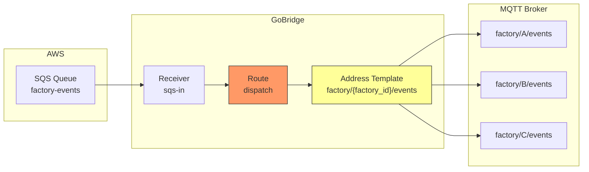
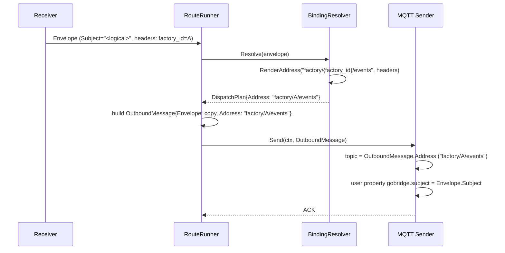
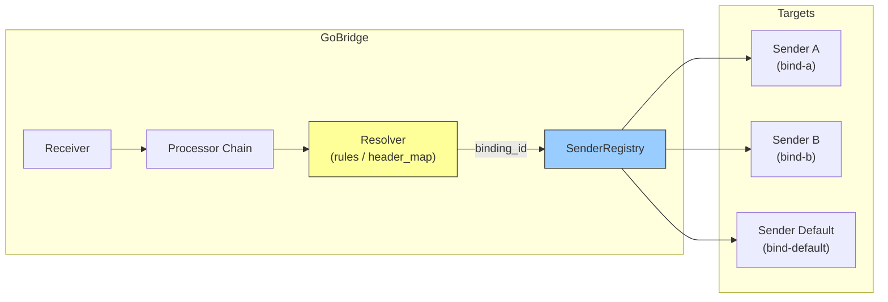

# Scenario 12: Dynamic Destination Routing

Route messages to different MQTT topics or bindings based on message headers and content. This is one of GoBridge's most powerful features for content-based routing.

## Use Case

A factory automation system receives events from an SQS queue. Each event has a `factory_id` header identifying which factory it belongs to. GoBridge must publish each event to the correct MQTT topic per factory: `factory/{factory_id}/events`.

## Architecture



## How Address Templates Work

Binding addresses can contain `{placeholder}` tokens. At runtime, GoBridge replaces each placeholder with the corresponding value from the envelope's headers:

```
Template:  factory/{factory_id}/orders/{device_id}
Headers:   factory_id = "A", device_id = "42"
Result:    factory/A/orders/42
```

The rendered address becomes `DispatchPlan.Address`. The runtime carries it across the egress path on `ports.OutboundMessage.Address`, and the MQTT sender uses it as the publish topic. `Envelope.Subject` is **not** mutated — it remains the logical event subject and travels alongside the message as the `gobridge.subject` MQTT user property.

**Safety guarantees:**
- Single-pass substitution -- rendered values are never re-parsed (no injection risk)
- Missing placeholders cause an error (message is not silently dropped)
- Empty rendered addresses are rejected
- MQTT topics are validated (no wildcards `+`/`#`, no empty segments)

## Configuration: SQS to Dynamic MQTT Topics

```yaml
bridge:
  id: factory-router

sessions:
  - id: mqtt-conn
    transport: mqtt
    options:
      session:
        broker_url: tcp://mqtt.factory.local:1883
        client_id: factory-router-01

receivers:
  - id: sqs-in
    transport: sqs
    options:
      queue_url: https://sqs.us-west-1.amazonaws.com/123456789/factory-events
      region: us-west-1

senders:
  - id: mqtt-out
    session_id: mqtt-conn
    options:
      sender:
        qos: 1

bindings:
  - id: to-factory-topic
    sender_id: mqtt-out
    address: "factory/{factory_id}/events"

routes:
  - id: dispatch
    receiver_id: sqs-in
    delivery_mode: direct_hold
    dispatch_mode: single
    bindings: [to-factory-topic]
```

### Walkthrough

1. **SQS receiver** polls the queue and delivers each message as an `Envelope`
2. The envelope carries headers set by the upstream producer (e.g. `factory_id: "A"`)
3. **Route dispatch** resolves the binding address template: `factory/{factory_id}/events` becomes `factory/A/events`
4. The runtime constructs an outbound `ports.OutboundMessage{Envelope: <copy>, Address: "factory/A/events"}`. Dispatch headers are merged onto the envelope copy; the source `Envelope.Subject` is left untouched.
5. **MQTT sender** publishes to topic `factory/A/events` (taken from `OutboundMessage.Address`). The logical subject is propagated as the `gobridge.subject` MQTT user property so downstream consumers can reconstruct it.

Note: The `default_topic` on the sender is a fallback used only when `OutboundMessage.Address` is empty. The publish topic is **never** read from `Envelope.Subject`.

## Address Resolution Flow



## Configuration: MQTT to Dynamic MQTT Topics

Route incoming MQTT messages to different output topics based on headers:

```yaml
bridge:
  id: topic-router

sessions:
  - id: mqtt-conn
    transport: mqtt
    options:
      session:
        broker_url: tcp://localhost:1883
        client_id: topic-router-01

receivers:
  - id: mqtt-in
    session_id: mqtt-conn
    topics:
      - topic: "events/#"
        qos: 1

senders:
  - id: mqtt-out
    session_id: mqtt-conn
    options:
      sender:
        qos: 1

bindings:
  - id: to-region-topic
    sender_id: mqtt-out
    address: "processed/{region}/{event_type}"

routes:
  - id: route-by-region
    receiver_id: mqtt-in
    delivery_mode: direct_hold
    dispatch_mode: single
    bindings: [to-region-topic]
```

A message on `events/temperature` with headers `region: "eu-west"`, `event_type: "temperature"` is published to `processed/eu-west/temperature`.

## Programmatic: Header-Based Binding Selection

For more complex routing where different bindings (different senders/queues) are selected based on headers, use `MatchByHeader` programmatically:

```go
import "github.com/mariotoffia/gobridge/runtime"

// Define bindings for different factories
bindings := []domain.DestinationBinding{
    {ID: "bind-factory-a", SenderID: "mqtt-a", Address: "factory/a/orders"},
    {ID: "bind-factory-b", SenderID: "mqtt-b", Address: "factory/b/orders"},
}

// Select binding based on "factory" header value
resolver := runtime.NewBindingResolver(bindings,
    runtime.MatchByHeader("factory", map[string]string{
        "A": "bind-factory-a",
        "B": "bind-factory-b",
    }),
)
```

This selects entirely different senders (potentially different MQTT sessions or different queues) based on header values.

### Built-In Match Functions

| Function | Description | Use Case |
|----------|-------------|----------|
| `MatchByID(id)` | Always selects a specific binding | Static single-target routes |
| `MatchAll` | Selects every binding | Fan-out to all targets |
| `MatchByHeader(key, map)` | Maps header value to binding ID | Route by tenant, factory, region |

Custom `MatchFunc` implementations can inspect any part of the envelope:

```go
// Custom: route by payload content
customMatch := func(env *domain.Envelope, b domain.DestinationBinding) bool {
    // Parse payload and make routing decisions
    var event map[string]any
    json.Unmarshal(env.Payload(), &event)
    priority, _ := event["priority"].(string)
    if priority == "high" && b.ID == "high-priority-binding" {
        return true
    }
    return b.ID == "default-binding"
}
```

## Fan-Out with Dynamic Addresses

Combine `fan_out` dispatch with address templates to send to multiple dynamically-resolved destinations:

```yaml
bindings:
  - id: to-factory-orders
    sender_id: mqtt-out
    address: "factory/{factory_id}/orders"
  - id: to-factory-audit
    sender_id: mqtt-out
    address: "audit/{factory_id}/events"

routes:
  - id: dispatch
    receiver_id: sqs-in
    delivery_mode: shared_outbox
    dispatch_mode: fan_out
    bindings: [to-factory-orders, to-factory-audit]

stores:
  outbox: { type: memory }
```

Each message is sent to **both** bindings, each with its own rendered address. A message with `factory_id: "A"` produces:
- `factory/A/orders`
- `audit/A/events`

Note: Fan-out requires `shared_outbox` delivery mode.

## Transport-Specific Behaviour

How `OutboundMessage.Address` (resolved from the binding template) is used depends on the transport. In every case, `Envelope.Subject` is the logical event subject and is carried over the wire either in a native subject field or in the `gobridge.subject` user-property/header — never as the destination.

| Transport | Where `OutboundMessage.Address` goes | Where `Envelope.Subject` rides |
|-----------|--------------------------------------|--------------------------------|
| **MQTT** | Publish topic. Overrides `default_topic`; validated for wildcards. | MQTT user property `gobridge.subject` |
| **AMQP 0-9-1** | Routing key (when sender `routing_key` is empty). | AMQP header `gobridge.subject` |
| **AMQP 1.0** | Validated against the configured sender link address (mismatch fails fast). Per-address dynamic links are deferred. | `Message.Properties.Subject` |
| **SQS** | Reserved for future dynamic queue selection. The queue URL/name remains static on the sender today. | `Subject` message attribute |
| **Azure SB** | Reserved for future dynamic entity selection. The queue/topic remains static on the sender today. | `Message.Subject` |
| **HTTP/SSE** | Path is static on the sender. | JSON `subject` field |

For MQTT and AMQP 0-9-1, dynamic addressing is fully effective — each message can land on a different topic / routing key. For SQS, Azure SB, and HTTP, the destination is fixed per sender for now; `OutboundMessage.Address` is preserved as transport-neutral metadata.

## Config-Driven Resolver

In addition to address templates and programmatic `MatchFunc`, GoBridge supports a **config-driven resolver** that selects bindings based on envelope content -- headers, subject, or JSON payload fields. This eliminates the need for Go code in most content-based routing scenarios.

### Architecture



The resolver evaluates rules against each incoming envelope and returns a binding ID. The **SenderRegistry** maps binding IDs to senders, allowing a single route to dispatch to entirely different transports or connections per message.

### Configuration Example: Multi-Tenant Routing

Route messages to different Azure Service Bus queues based on the `x-tenant` header:

```yaml
senders:
  - id: sb-acme
    transport: servicebus
    options:
      connection:
        connection_string: "${ACME_SB_CONN}"
      sender:
        queue_name: acme-events
  - id: sb-globex
    transport: servicebus
    options:
      connection:
        connection_string: "${GLOBEX_SB_CONN}"
      sender:
        queue_name: globex-events
  - id: sb-default
    transport: servicebus
    options:
      connection:
        connection_string: "${DEFAULT_SB_CONN}"
      sender:
        queue_name: unrouted-events

bindings:
  - id: bind-acme
    sender_id: sb-acme
    address: acme-events
  - id: bind-globex
    sender_id: sb-globex
    address: globex-events
  - id: bind-default
    sender_id: sb-default
    address: unrouted-events

routes:
  - id: tenant-router
    receiver_id: http-in
    delivery_mode: direct_hold
    bindings: [bind-acme, bind-globex, bind-default]
    resolver:
      type: rules
      default_binding: bind-default
      rules:
        - binding_id: bind-acme
          match:
            - field: header.x-tenant
              operator: eq
              value: acme
        - binding_id: bind-globex
          match:
            - field: header.x-tenant
              operator: eq
              value: globex
```

Rules are evaluated top-to-bottom. The first rule whose conditions all match (AND logic) wins. If no rule matches, `default_binding` is used. If neither matches, the message is rejected.

### Configuration Example: JSON Payload Routing

Route based on a field inside the JSON payload using `$.` path syntax:

```yaml
routes:
  - id: priority-router
    receiver_id: sqs-in
    bindings: [bind-high-priority, bind-normal]
    resolver:
      type: rules
      default_binding: bind-normal
      rules:
        - binding_id: bind-high-priority
          match:
            - field: $.priority
              operator: eq
              value: high
            - field: $.metadata.region
              operator: in
              value: ["us-west-1", "eu-west-1"]
```

The payload is parsed lazily on first `$.` access and cached for all subsequent condition evaluations within the same message.

### header_map Shorthand

For simple header-value-to-binding mappings, `header_map` is more concise than `rules`:

```yaml
routes:
  - id: factory-router
    receiver_id: sqs-in
    bindings: [bind-factory-a, bind-factory-b]
    resolver:
      type: header_map
      header_key: factory_id
      header_map:
        A: bind-factory-a
        B: bind-factory-b
```

### HeaderRouteOverride

The filter processor's `ActionRoute` sets a `x-bridge.route-override` header during the processor chain. The runtime now consumes this header in both `direct_hold` and `shared_outbox` delivery modes:

1. The processor chain sets `HeaderRouteOverride` to a binding ID
2. The runtime validates that the binding exists on the current route
3. If valid, the message is dispatched to that binding (bypassing the resolver)
4. The override header is stripped before sending to the target
5. If the binding ID is invalid, the runtime falls through to normal resolver evaluation

This enables processors to override routing decisions dynamically, complementing the config-driven resolver.

## Limitations

1. **SQS queue selection is static** -- You cannot dynamically choose which SQS queue to send to based on message content. The queue URL is fixed in sender config. To route to different queues, use separate senders with different bindings and a resolver to select between them.

2. **Address templates only resolve from headers** -- The `{placeholder}` syntax in binding addresses resolves from envelope headers only, not from JSON payload fields. To use payload values in address templates, first extract them into headers with a transform processor (see [Payload-Based Routing via Transform](#pattern-payload-based-routing-via-transform)). However, the resolver's `$.` conditions can select different bindings based on payload content, and each binding has its own static address -- so many payload-routing scenarios do not need address templates at all.

## Pattern: Payload-Based Routing via Transform

Extract payload fields into headers, then use address templates:

```go
// Step 1: Transform extracts payload field into a header
transformProc, _ := transform.New(transform.Config{
    Name: "extract-region",
    Mappings: []transform.FieldMapping{
        {Source: "$.metadata.region", Target: "header.region"},
    },
})

// Step 2: Address template uses the extracted header
// binding address: "events/{region}/processed"
```

```yaml
routes:
  - id: region-route
    receiver_id: mqtt-in
    processors: [extract-region]
    bindings: [to-region-topic]

bindings:
  - id: to-region-topic
    sender_id: mqtt-out
    address: "events/{region}/processed"
```

This two-step pattern lets you route based on any JSON payload field.
