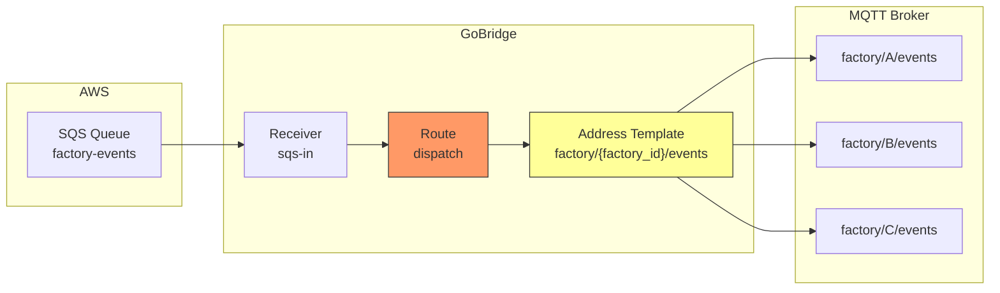
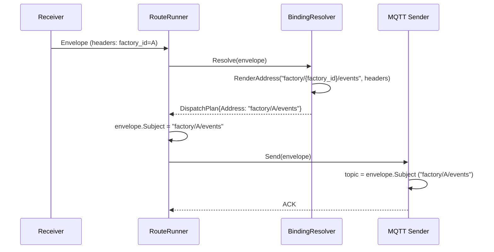

# Scenario 12: Dynamic Destination Routing

Route messages to different MQTT topics or bindings based on message headers and content. This is one of GoBridge's most powerful features for content-based routing.

## Use Case

A factory automation system receives events from an SQS queue. Each event has a `factory_id` header identifying which factory it belongs to. GoBridge must publish each event to the correct MQTT topic per factory: `factory/{factory_id}/events`.

## Architecture



## How Address Templates Work

Binding addresses can contain `{placeholder}` tokens. At runtime, GoBridge replaces each placeholder with the corresponding value from the envelope's headers:

```
Template:  factory/{factory_id}/orders/{device_id}
Headers:   factory_id = "A", device_id = "42"
Result:    factory/A/orders/42
```

The rendered address becomes the `Envelope.Subject`, which the MQTT sender uses as the publish topic.

**Safety guarantees:**
- Single-pass substitution -- rendered values are never re-parsed (no injection risk)
- Missing placeholders cause an error (message is not silently dropped)
- Empty rendered addresses are rejected
- MQTT topics are validated (no wildcards `+`/`#`, no empty segments)

## Configuration: SQS to Dynamic MQTT Topics

```yaml
bridge:
  id: factory-router

sessions:
  - id: mqtt-conn
    transport: mqtt
    options:
      broker_url: tcp://mqtt.factory.local:1883
      client_id: factory-router-01

receivers:
  - id: sqs-in
    transport: sqs
    options:
      queue_url: https://sqs.us-east-1.amazonaws.com/123456789/factory-events
      region: us-east-1

senders:
  - id: mqtt-out
    session_id: mqtt-conn
    options:
      qos: 1

bindings:
  - id: to-factory-topic
    sender_id: mqtt-out
    address: "factory/{factory_id}/events"

routes:
  - id: dispatch
    receiver_id: sqs-in
    delivery_mode: direct_hold
    dispatch_mode: single
    bindings: [to-factory-topic]
```

### Walkthrough

1. **SQS receiver** polls the queue and delivers each message as an `Envelope`
2. The envelope carries headers set by the upstream producer (e.g. `factory_id: "A"`)
3. **Route dispatch** resolves the binding address template: `factory/{factory_id}/events` becomes `factory/A/events`
4. The rendered address is set as `Envelope.Subject`
5. **MQTT sender** publishes to topic `factory/A/events` (using Subject, not `default_topic`)

Note: The `default_topic` on the sender is a fallback. When the binding address resolves successfully, it takes precedence.

## Address Resolution Flow



## Configuration: MQTT to Dynamic MQTT Topics

Route incoming MQTT messages to different output topics based on headers:

```yaml
bridge:
  id: topic-router

sessions:
  - id: mqtt-conn
    transport: mqtt
    options:
      broker_url: tcp://localhost:1883
      client_id: topic-router-01

receivers:
  - id: mqtt-in
    session_id: mqtt-conn
    topics:
      - topic: "events/#"
        qos: 1

senders:
  - id: mqtt-out
    session_id: mqtt-conn
    options:
      qos: 1

bindings:
  - id: to-region-topic
    sender_id: mqtt-out
    address: "processed/{region}/{event_type}"

routes:
  - id: route-by-region
    receiver_id: mqtt-in
    delivery_mode: direct_hold
    dispatch_mode: single
    bindings: [to-region-topic]
```

A message on `events/temperature` with headers `region: "eu-west"`, `event_type: "temperature"` is published to `processed/eu-west/temperature`.

## Programmatic: Header-Based Binding Selection

For more complex routing where different bindings (different senders/queues) are selected based on headers, use `MatchByHeader` programmatically:

```go
import "github.com/mariotoffia/gobridge/runtime"

// Define bindings for different factories
bindings := []domain.DestinationBinding{
    {ID: "bind-factory-a", SenderID: "mqtt-a", Address: "factory/a/orders"},
    {ID: "bind-factory-b", SenderID: "mqtt-b", Address: "factory/b/orders"},
}

// Select binding based on "factory" header value
resolver := runtime.NewBindingResolver(bindings,
    runtime.MatchByHeader("factory", map[string]string{
        "A": "bind-factory-a",
        "B": "bind-factory-b",
    }),
)
```

This selects entirely different senders (potentially different MQTT sessions or different queues) based on header values.

### Built-In Match Functions

| Function | Description | Use Case |
|----------|-------------|----------|
| `MatchByID(id)` | Always selects a specific binding | Static single-target routes |
| `MatchAll` | Selects every binding | Fan-out to all targets |
| `MatchByHeader(key, map)` | Maps header value to binding ID | Route by tenant, factory, region |

Custom `MatchFunc` implementations can inspect any part of the envelope:

```go
// Custom: route by payload content
customMatch := func(env *domain.Envelope, b domain.DestinationBinding) bool {
    // Parse payload and make routing decisions
    var event map[string]any
    json.Unmarshal(env.Payload, &event)
    priority, _ := event["priority"].(string)
    if priority == "high" && b.ID == "high-priority-binding" {
        return true
    }
    return b.ID == "default-binding"
}
```

## Fan-Out with Dynamic Addresses

Combine `fan_out` dispatch with address templates to send to multiple dynamically-resolved destinations:

```yaml
bindings:
  - id: to-factory-orders
    sender_id: mqtt-out
    address: "factory/{factory_id}/orders"
  - id: to-factory-audit
    sender_id: mqtt-out
    address: "audit/{factory_id}/events"

routes:
  - id: dispatch
    receiver_id: sqs-in
    delivery_mode: shared_outbox
    dispatch_mode: fan_out
    bindings: [to-factory-orders, to-factory-audit]

stores:
  outbox: { type: memory }
```

Each message is sent to **both** bindings, each with its own rendered address. A message with `factory_id: "A"` produces:
- `factory/A/orders`
- `audit/A/events`

Note: Fan-out requires `shared_outbox` delivery mode.

## Transport-Specific Behaviour

How the resolved address is used depends on the transport:

| Transport | Address Effect | Notes |
|-----------|---------------|-------|
| **MQTT** | Becomes the publish topic | Overrides `default_topic`; validated for wildcards |
| **SQS** | Stored as metadata | Queue URL comes from sender config (static) |
| **Azure SB** | Stored as metadata | Queue/topic from sender config (static) |
| **HTTP** | Stored as metadata | Path from sender config |

For MQTT, dynamic addressing is fully effective -- each message can go to a different topic. For SQS/Azure SB, the queue/topic is fixed per sender, but the address is preserved as message metadata.

## Limitations

1. **SQS queue selection is static** -- You cannot dynamically choose which SQS queue to send to based on message content. The queue URL is fixed in sender config. To route to different queues, use separate senders + `MatchByHeader` binding selection.

2. **MatchByHeader is programmatic only** -- The YAML config only supports static binding references. Dynamic binding selection requires Go code with a custom `DestinationResolver` or `MatchFunc`.

3. **Filter `route` action is incomplete** -- The filter processor's `ActionRoute` sets a header (`x-bridge.route-override`) but this header is not currently acted upon by the runtime route engine.

4. **Address templates only resolve from headers** -- Payload fields cannot be used directly in address templates. To route based on payload content, use a transform processor to extract payload fields into headers first, then use address templates.

## Pattern: Payload-Based Routing via Transform

Extract payload fields into headers, then use address templates:

```go
// Step 1: Transform extracts payload field into a header
transformProc := transform.New(transform.Config{
    Name: "extract-region",
    Mappings: []transform.FieldMapping{
        {Source: "$.metadata.region", Target: "header.region"},
    },
})

// Step 2: Address template uses the extracted header
// binding address: "events/{region}/processed"
```

```yaml
routes:
  - id: region-route
    receiver_id: mqtt-in
    processors: [extract-region]
    bindings: [to-region-topic]

bindings:
  - id: to-region-topic
    sender_id: mqtt-out
    address: "events/{region}/processed"
```

This two-step pattern lets you route based on any JSON payload field.
