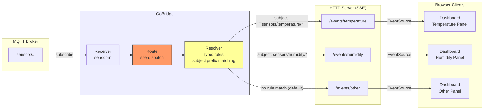
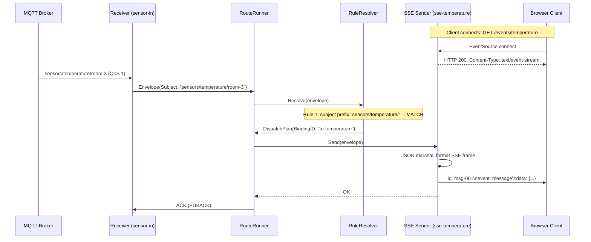

# Scenario 13: Content-Based Routing to SSE Streams

Route IoT sensor data from MQTT to separate Server-Sent Events (SSE) streams based on the message subject, using the config-driven rules resolver.

## Use Case

An MQTT broker receives IoT sensor data on `sensors/#`. A web dashboard needs separate SSE streams for different data types so that each panel subscribes only to its relevant feed:

- Temperature data (`sensors/temperature/...`) goes to SSE endpoint `/events/temperature`
- Humidity data (`sensors/humidity/...`) goes to SSE endpoint `/events/humidity`
- All other sensor data goes to SSE endpoint `/events/other`

GoBridge inspects each incoming message's subject and routes it to exactly one SSE sender using the `rules` resolver with `prefix` matching. Browser clients connect to the SSE endpoints and receive a filtered, real-time event stream.

## Architecture



## Configuration

```yaml
bridge:
  id: sensor-sse-router

sessions:
  - id: mqtt-conn
    transport: mqtt
    options:
      broker_url: tcp://mqtt.iot.local:1883
      client_id: sensor-sse-router-01
      keep_alive: 30

receivers:
  - id: sensor-in
    session_id: mqtt-conn
    topics:
      - topic: "sensors/#"
        qos: 1

senders:
  - id: sse-temperature
    transport: http
    options:
      mode: sse
      path: /events/temperature
      heartbeat_interval: 15s
      max_clients: 500

  - id: sse-humidity
    transport: http
    options:
      mode: sse
      path: /events/humidity
      heartbeat_interval: 15s
      max_clients: 500

  - id: sse-other
    transport: http
    options:
      mode: sse
      path: /events/other
      heartbeat_interval: 15s
      max_clients: 500

bindings:
  - id: to-temperature
    sender_id: sse-temperature
    address: temperature

  - id: to-humidity
    sender_id: sse-humidity
    address: humidity

  - id: to-other
    sender_id: sse-other
    address: other

routes:
  - id: sse-dispatch
    receiver_id: sensor-in
    delivery_mode: direct_hold
    dispatch_mode: single
    bindings: [to-temperature, to-humidity, to-other]
    resolver:
      type: rules
      default_binding: to-other
      rules:
        - binding_id: to-temperature
          match:
            - field: subject
              operator: prefix
              value: "sensors/temperature/"
        - binding_id: to-humidity
          match:
            - field: subject
              operator: prefix
              value: "sensors/humidity/"
    policy:
      max_in_flight: 500
```

## Config Walkthrough

### SSE Senders

Each SSE sender registers an HTTP endpoint that browser clients connect to via the `EventSource` API. The `mode: sse` option is currently the only sender mode supported by the HTTP transport.

| Option | Purpose |
|--------|---------|
| `mode` | Must be `sse`. Selects Server-Sent Events output. |
| `path` | HTTP GET path where clients connect (e.g., `/events/temperature`). |
| `heartbeat_interval` | How often to send SSE comment heartbeats to keep connections alive. Default: 30s. |
| `max_clients` | Maximum concurrent SSE connections per sender. Default: 10000. |

All three SSE senders share the same HTTP transport factory and internal `http.ServeMux`. The factory's `Handler()` method returns a single `http.Handler` that dispatches to the correct SSE sender based on the request path.

### Resolver: Rules Type

The `resolver` block replaces the need for programmatic `MatchFunc` registration. The rules are evaluated in order (first-match-wins):

1. **Rule 1:** If `subject` starts with `sensors/temperature/`, select binding `to-temperature`.
2. **Rule 2:** If `subject` starts with `sensors/humidity/`, select binding `to-humidity`.
3. **Default:** If no rule matches, select `to-other` (the `default_binding`).

A message on topic `sensors/temperature/room-3` matches rule 1 and is broadcast to all clients connected to `/events/temperature`. A message on topic `sensors/pressure/lab-1` matches no rule and falls through to the default binding `to-other`.

### Delivery Mode: DirectHold

SSE is an ephemeral transport. Connected clients receive events in real-time; disconnected clients miss events. There is no durable queue or outbox backing the SSE stream.

This makes `direct_hold` the correct delivery mode:

- **No outbox needed.** Messages are broadcast to connected clients immediately. If no clients are connected, the message is sent to zero recipients (no error).
- **No visibility extension.** SSE senders do not implement message acknowledgment. The MQTT source is acknowledged as soon as the SSE broadcast completes.
- **No replay.** Clients that reconnect do not receive missed events. If replay is needed, add a parallel binding to a durable store.

The HTTP transport advertises the `CapHTTPEndpoint` capability. Routes using HTTP sources or SSE senders operate correctly with `direct_hold` because the transport does not require visibility extension or deferred acknowledgment.

### Bindings and Address

The `address` field in each binding is stored as metadata on the dispatch plan. For SSE senders the address is informational only -- the sender broadcasts to all connected clients regardless of the address value. The actual SSE endpoint path is configured in the sender's `path` option.

### Backpressure

The `max_in_flight: 500` policy limits concurrent messages flowing through the route. If MQTT delivers faster than the SSE broadcast can complete, backpressure propagates to the MQTT receiver. Each SSE client has a 256-event internal buffer; when a client's buffer is full, events are dropped for that client with a warning log.

## Message Flow



## Go Bootstrap

```go
package main

import (
    "context"
    "net/http"

    "github.com/mariotoffia/gobridge/bridge"
    "github.com/mariotoffia/gobridge/config"
    adaptershttp "github.com/mariotoffia/gobridge/adapters/http/transport"
    "github.com/mariotoffia/gobridge/adapters/mqtt/transport/paho"
)

func main() {
    cfg, _ := config.ParseFile("bridge.yaml", config.FormatAuto)

    httpFactory := adaptershttp.NewBridgeFactory()

    sup, _ := bridge.NewBuilder(cfg).
        RegisterTransport("mqtt", paho.NewBridgeFactory(nil)).
        RegisterTransport("http", httpFactory).
        Build(context.Background())

    // Mount SSE endpoints on an HTTP server
    go func() {
        mux := http.NewServeMux()
        mux.Handle("/events/", httpFactory.Handler())
        _ = http.ListenAndServe(":8080", mux)
    }()

    ctx, cancel := context.WithCancel(context.Background())
    defer cancel()

    sup.Start(ctx)
    // ... wait for signal ...
    sup.Stop(ctx)
}
```

The HTTP transport factory accumulates all SSE sender paths. Mounting `httpFactory.Handler()` on a standard `http.ServeMux` exposes `/events/temperature`, `/events/humidity`, and `/events/other` as SSE endpoints.

## Variations

### Regex-Based Subject Matching

Use regex instead of prefix for more complex topic patterns:

```yaml
resolver:
  type: rules
  default_binding: to-other
  rules:
    - binding_id: to-temperature
      match:
        - field: subject
          operator: regex
          value: "^sensors/temperature/(room|lab)-\\d+$"
    - binding_id: to-humidity
      match:
        - field: subject
          operator: regex
          value: "^sensors/humidity/[a-z]+-\\d+$"
```

This restricts matching to specific topic name formats, rejecting malformed topics.

### JSON Payload-Based Routing

Route based on a `type` field inside the JSON payload instead of the MQTT topic:

```yaml
resolver:
  type: rules
  default_binding: to-other
  rules:
    - binding_id: to-temperature
      match:
        - field: $.type
          operator: eq
          value: "temperature"
    - binding_id: to-humidity
      match:
        - field: $.type
          operator: eq
          value: "humidity"
```

This is useful when multiple sensor types share the same MQTT topic but differentiate via a payload field like `{"type": "temperature", "value": 22.5}`.

### Adding API Key Authentication to SSE Endpoints

Protect SSE streams with a per-sender API key:

```yaml
senders:
  - id: sse-temperature
    transport: http
    options:
      mode: sse
      path: /events/temperature
      api_key: "dashboard-key-min-16ch"
```

Clients must include the key via `X-API-Key` header or `Authorization: Bearer` token. Connections without a valid key receive HTTP 401. The key is compared using SHA-256 constant-time hashing to prevent timing and length-based information leaks.

### Parallel Durable Binding

Add a fourth binding to archive all sensor data to SQS while still streaming to SSE:

```yaml
senders:
  - id: sqs-archive
    transport: sqs
    options:
      queue_url: https://sqs.us-east-1.amazonaws.com/123456789/sensor-archive
      region: us-east-1

bindings:
  - id: to-archive
    sender_id: sqs-archive
    address: sensor-archive

routes:
  - id: sse-dispatch
    receiver_id: sensor-in
    delivery_mode: direct_hold
    dispatch_mode: single
    bindings: [to-temperature, to-humidity, to-other, to-archive]
    resolver:
      type: all
```

Changing the resolver to `type: all` converts this into a fan-out route where every binding receives every message. To combine fan-out with filtering, use separate routes or the processor-based filter approach from Scenario 4.

## Notes

- **First-match-wins semantics.** Rules are evaluated top to bottom. A message matching both rule 1 and rule 2 is sent only to the first matching binding. This differs from `fan_out` dispatch, which sends to all bindings.
- **SSE is fire-and-forget.** The sender broadcasts to all connected clients. If zero clients are connected, the `Send` call succeeds with no recipients. No error is returned.
- **Heartbeats keep connections alive.** The `heartbeat_interval` sends SSE comments (`: heartbeat\n\n`) to prevent proxies and load balancers from closing idle connections.
- **Resolver validation at startup.** The config validator checks that all `binding_id` values in resolver rules reference bindings listed in the route's `bindings` array. Invalid references cause a startup error, not a runtime surprise.
- **No shared sessions for HTTP.** The HTTP transport is stateless. `NewSession` returns `(nil, nil)`. There is no `sessions` entry for HTTP senders.
