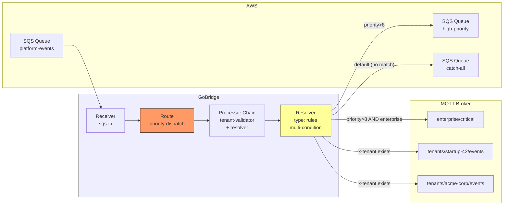
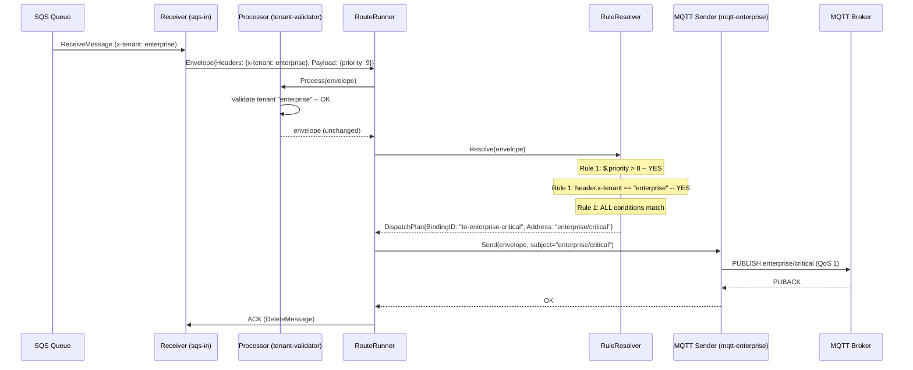

# Scenario 14: Multi-Tenant Priority Routing

Route SaaS platform events from SQS to different destinations based on tenant identity and message priority, using multi-condition rules with mixed transport targets.

## Use Case

A SaaS platform receives events from an SQS queue. Each event carries:

- An `x-tenant` header identifying the tenant (e.g., `enterprise`, `startup-42`)
- A JSON payload with a `$.priority` field (integer 1--10, where 10 is most critical)

The routing rules are:

1. **Enterprise critical:** Priority > 8 AND tenant is `enterprise` -- dedicated MQTT topic `enterprise/critical`
2. **Shared high-priority:** Priority > 8 (any tenant) -- shared SQS high-priority queue
3. **Per-tenant delivery:** Tenant header exists -- per-tenant MQTT topic `tenants/{x-tenant}/events` (address template)
4. **Catch-all:** No rule matches -- catch-all SQS dead-letter queue

This scenario demonstrates multi-condition AND logic, address templates combined with resolver rules, mixed transport routing (SQS to MQTT + SQS), and default fallback bindings.

## Architecture



## Configuration

```yaml
bridge:
  id: tenant-priority-router

sessions:
  - id: mqtt-conn
    transport: mqtt
    options:
      broker_url: tcp://mqtt.platform.local:1883
      client_id: tenant-router-01
      keep_alive: 60

receivers:
  - id: sqs-in
    transport: sqs
    options:
      queue_url: https://sqs.us-west-1.amazonaws.com/123456789/platform-events
      region: us-west-1
      wait_time_seconds: 20
      max_messages: 10

senders:
  - id: mqtt-enterprise
    session_id: mqtt-conn
    options:
      qos: 1

  - id: mqtt-tenants
    session_id: mqtt-conn
    options:
      qos: 1

  - id: sqs-high-priority
    transport: sqs
    options:
      queue_url: https://sqs.us-west-1.amazonaws.com/123456789/high-priority
      region: us-west-1
      batch_size: 10

  - id: sqs-catch-all
    transport: sqs
    options:
      queue_url: https://sqs.us-west-1.amazonaws.com/123456789/catch-all
      region: us-west-1

bindings:
  - id: to-enterprise-critical
    sender_id: mqtt-enterprise
    address: "enterprise/critical"

  - id: to-high-priority
    sender_id: sqs-high-priority
    address: high-priority

  - id: to-tenant-topic
    sender_id: mqtt-tenants
    address: "tenants/{x-tenant}/events"

  - id: to-catch-all
    sender_id: sqs-catch-all
    address: catch-all

routes:
  - id: priority-dispatch
    receiver_id: sqs-in
    delivery_mode: direct_hold
    dispatch_mode: single
    bindings:
      - to-enterprise-critical
      - to-high-priority
      - to-tenant-topic
      - to-catch-all
    processors: [tenant-validator]
    resolver:
      type: rules
      default_binding: to-catch-all
      rules:
        - binding_id: to-enterprise-critical
          match:
            - field: $.priority
              operator: gt
              value: 8
            - field: header.x-tenant
              operator: eq
              value: "enterprise"

        - binding_id: to-high-priority
          match:
            - field: $.priority
              operator: gt
              value: 8

        - binding_id: to-tenant-topic
          match:
            - field: header.x-tenant
              operator: exists
              value: true

    policy:
      max_in_flight: 200
      on_permanent_failure: dlq

stores:
  outbox: { type: memory }
  dlq: { type: memory }
```

## Config Walkthrough

### Multi-Condition Rules (AND Logic)

Each rule's `match` array uses AND logic -- all conditions must be true for the rule to select its binding.

**Rule 1** has two conditions:

```yaml
- binding_id: to-enterprise-critical
  match:
    - field: $.priority
      operator: gt
      value: 8
    - field: header.x-tenant
      operator: eq
      value: "enterprise"
```

Both `$.priority > 8` AND `header.x-tenant == "enterprise"` must be true. A message from tenant `enterprise` with priority 7 does not match this rule. A message from tenant `startup-42` with priority 9 does not match either -- both conditions are required.

### First-Match-Wins Ordering

Rules are evaluated top to bottom. The ordering matters:

1. **Rule 1** (enterprise critical) is checked first because it is the most specific. It requires both high priority and a specific tenant.
2. **Rule 2** (shared high-priority) is checked next. It catches all remaining high-priority messages regardless of tenant. An enterprise message with priority 9 already matched rule 1 and never reaches rule 2.
3. **Rule 3** (per-tenant) catches all messages with an `x-tenant` header that did not match the priority rules above.
4. **Default binding** (catch-all) handles messages without an `x-tenant` header or with malformed payloads where `$.priority` extraction fails.

If rule 2 were placed before rule 1, enterprise critical messages would be consumed by the shared high-priority queue and never reach the dedicated enterprise topic.

### Address Templates with Resolver

Binding `to-tenant-topic` uses an address template:

```yaml
- id: to-tenant-topic
  sender_id: mqtt-tenants
  address: "tenants/{x-tenant}/events"
```

When the resolver selects this binding, the `RenderAddress` function replaces `{x-tenant}` with the value of the `x-tenant` header from the envelope. A message with header `x-tenant: startup-42` is published to MQTT topic `tenants/startup-42/events`.

This combines two GoBridge features:

- **Resolver rules** decide which binding to use (content-based selection)
- **Address templates** decide the concrete destination within that binding (header-based rendering)

Rule 3 ensures the `x-tenant` header exists before the template is rendered. If the header were missing, `RenderAddress` would return an error, and the message would fail. The `exists` condition acts as a guard.

### Mixed Transport Routing

This route sends to both MQTT and SQS senders from a single receiver:

| Binding | Transport | Destination |
|---------|-----------|-------------|
| `to-enterprise-critical` | MQTT | `enterprise/critical` (static topic) |
| `to-high-priority` | SQS | `high-priority` queue (static) |
| `to-tenant-topic` | MQTT | `tenants/{x-tenant}/events` (dynamic topic) |
| `to-catch-all` | SQS | `catch-all` queue (static) |

The MQTT senders share a session (`mqtt-conn`). The SQS senders each have their own connection because SQS is stateless at the transport level.

### Delivery Mode Considerations

The route uses `direct_hold` for simplicity. In production, consider the durability requirements for each binding:

| Binding | Recommended Mode | Rationale |
|---------|-----------------|-----------|
| `to-enterprise-critical` | `shared_outbox` | Critical messages must not be lost. Outbox provides at-least-once delivery even if MQTT is temporarily unavailable. |
| `to-high-priority` | `direct_hold` | SQS is durable. The SQS sender uses `SendMessage` which is itself durable. |
| `to-tenant-topic` | `shared_outbox` | Per-tenant MQTT topics benefit from outbox durability. |
| `to-catch-all` | `direct_hold` | Catch-all is best-effort. Direct delivery is sufficient. |

A single route can only have one `delivery_mode`. To use different modes per destination, split into multiple routes or accept the trade-off of a single mode. When `shared_outbox` is configured, all bindings benefit from outbox durability, at the cost of additional latency and storage.

### Processor Chain

The `processors: [tenant-validator]` runs before the resolver evaluates rules. This ensures:

1. The tenant header is validated (exists, is not suspended, passes quota checks)
2. Invalid messages are rejected before reaching the resolver
3. The resolver receives only clean, validated envelopes

## Message Flow: Enterprise Critical Path



## Tenant Validator Processor

Register the tenant validator programmatically:

```go
package main

import (
    "context"

    "github.com/mariotoffia/gobridge/bridge"
    "github.com/mariotoffia/gobridge/config"
    "github.com/mariotoffia/gobridge/adapters/mqtt/transport/paho"
    "github.com/mariotoffia/gobridge/adapters/aws/transport/sqs"
    "github.com/mariotoffia/gobridge/processors/tenant"
)

func main() {
    cfg, _ := config.ParseFile("bridge.yaml", config.FormatAuto)

    tenantProc := tenant.New(tenant.Config{
        Name:          "tenant-validator",
        TenantHeader:  "x-tenant",
        RequireTenant: false, // allow catch-all for messages without tenant
    }, tenant.WithValidator(myTenantValidator))

    sup, _ := bridge.NewBuilder(cfg).
        RegisterTransport("mqtt", paho.NewBridgeFactory(nil)).
        RegisterTransport("sqs", sqs.NewBridgeFactory(nil)).
        RegisterProcessor("tenant-validator", tenantProc).
        Build(context.Background())

    ctx, cancel := context.WithCancel(context.Background())
    defer cancel()

    sup.Start(ctx)
    // ... wait for signal ...
    sup.Stop(ctx)
}
```

Note that `RequireTenant` is set to `false`. Messages without the `x-tenant` header are allowed through the processor and fall to the catch-all binding via the resolver's `default_binding`. If `RequireTenant` were `true`, messages without the header would be rejected by the processor and never reach the resolver.

## Rule Evaluation Details

### Condition Field Patterns

The three field types used in this scenario:

| Pattern | Example | Resolves To |
|---------|---------|-------------|
| `$.priority` | JSON payload path | `Envelope.Payload` unmarshaled, then `priority` key |
| `header.x-tenant` | Header lookup | `Envelope.Headers["x-tenant"]` |
| `subject` | Envelope subject | `Envelope.Subject` (not used in this scenario) |

### Lazy Payload Parsing

When multiple rules reference `$.` paths, the JSON payload is parsed only once per envelope. The `evalContext` caches the parsed `map[string]any` and reuses it across all condition evaluations. In this scenario, rules 1 and 2 both access `$.priority`, but the payload is unmarshaled once.

### Numeric Comparison

The `gt` operator converts both the extracted payload value and the condition value to `float64` before comparing. JSON numbers are parsed via `json.Number` to avoid precision loss. String-encoded numbers (e.g., `"9"`) are also supported.

### Condition Evaluation Errors

If a condition fails to evaluate (e.g., payload is not valid JSON, field path does not exist), the condition is treated as non-matching. The rule is skipped, and evaluation continues to the next rule. This means:

- A message with `$.priority: "not-a-number"` fails the `gt` comparison, skips rules 1 and 2, and falls through to rule 3 or the default.
- A message with no JSON payload at all skips rules 1 and 2, and if it has an `x-tenant` header, matches rule 3.

## Variations

### Header Map Resolver (Simpler Alternative)

If routing is based solely on the tenant header without priority logic, use `header_map` instead of `rules`:

```yaml
resolver:
  type: header_map
  header_key: x-tenant
  default_binding: to-catch-all
  header_map:
    enterprise: to-enterprise-critical
    startup-42: to-tenant-a
    acme-corp: to-tenant-b
```

This is simpler but cannot express multi-condition logic or numeric comparisons.

### Adding a Circuit Breaker Per Tenant

Protect downstream MQTT from a flood of events from a single tenant:

```yaml
routes:
  - id: priority-dispatch
    processors: [tenant-validator, tenant-cb]
```

```go
cbProc := circuitbreaker.New("tenant-cb", circuitbreaker.Config{
    FailureThreshold:  5,
    SuccessThreshold:  3,
    ResetTimeout:      30 * time.Second,
    HalfOpenMaxProbes: 2,
}, circuitbreaker.WithKeyExtractor(circuitbreaker.HeaderKey("x-tenant")))
```

Each tenant gets an independent circuit breaker. If tenant `startup-42` causes 5 consecutive failures, only that tenant's breaker opens. Enterprise messages continue flowing.

### Payload-Based Tenant Extraction

If the tenant ID is in the JSON payload instead of a header, use a transform processor to extract it before the resolver runs:

```go
extractProc := transform.New(transform.Config{
    Name: "extract-tenant",
    Mappings: []transform.FieldMapping{
        {Source: "$.metadata.tenant_id", Target: "header.x-tenant"},
    },
})
```

```yaml
routes:
  - id: priority-dispatch
    processors: [extract-tenant, tenant-validator]
```

The transform runs first, copies `$.metadata.tenant_id` into the `x-tenant` header, and then the tenant validator and resolver can use the header as normal.

### Multiple Priority Tiers

Extend the rules to support three priority tiers:

```yaml
resolver:
  type: rules
  default_binding: to-catch-all
  rules:
    - binding_id: to-enterprise-critical
      match:
        - field: $.priority
          operator: gt
          value: 8
        - field: header.x-tenant
          operator: eq
          value: "enterprise"

    - binding_id: to-critical
      match:
        - field: $.priority
          operator: gt
          value: 8

    - binding_id: to-elevated
      match:
        - field: $.priority
          operator: gt
          value: 5

    - binding_id: to-tenant-topic
      match:
        - field: header.x-tenant
          operator: exists
          value: true
```

Messages with priority 6--8 go to the `to-elevated` binding. Messages with priority 1--5 that have a tenant header go to the per-tenant topic. The ordering ensures more specific rules are evaluated first.

## Notes

- **Resolver validation at startup.** All `binding_id` values in rules must reference bindings in the route's `bindings` array. The `default_binding` must also be listed. Invalid references cause a config validation error at startup.
- **Rules are pre-compiled.** `CompileMatchRules` is called once at startup. Regex patterns are compiled and cached. Condition evaluators are safe for concurrent use across goroutines.
- **Address template safety.** `RenderAddress` uses single-pass substitution. Rendered values are never re-expanded, preventing header-value injection. Missing placeholders cause an error, not a silent drop.
- **SQS queue selection is static.** Each SQS sender is bound to a specific queue URL. To route to different SQS queues, use separate senders as shown in this scenario. Dynamic SQS queue selection within a single sender is not supported.
- **Condition evaluation order within a rule.** Conditions within a single rule are evaluated left to right. Evaluation short-circuits on the first non-matching condition. Place cheaper checks (header lookups) before expensive checks (JSON path extraction) for optimal performance.
