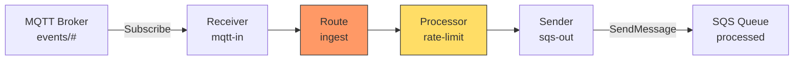

# Scenario 17: Custom Processor Implementation

Build a reusable rate-limiting processor that enforces per-tenant message throughput using the `ports.Processor` interface.

## Use Case

Your bridge routes messages from an MQTT broker to an SQS queue. Multiple tenants share the same ingress topic, and you need to throttle high-volume tenants so they cannot starve others. The built-in processors (filter, transform, circuit breaker, tenant) do not cover rate limiting, so you build a custom one.

The processor:

1. Extracts a tenant ID from the `x-bridge.tenant-id` header.
2. Tracks per-tenant request counts in a sliding window.
3. Rejects messages that exceed the configured rate with `ErrThrottled`, causing the runtime to retry with backoff.

## Architecture



## The Processor Interface

Every processor implements two methods:

```go
type Processor interface {
    Name() string
    Process(ctx context.Context, env *domain.Envelope, next ProcessorFunc) error
}

type ProcessorFunc func(ctx context.Context, env *domain.Envelope) error
```

The `next` parameter is the continuation -- calling it passes the envelope to the next processor in the chain (or to dispatch if this is the last processor). This is the **onion model**: each processor wraps the next, so cross-cutting concerns execute in order on the way in and in reverse on the way out.

**Key rules:**

- Always call `next(ctx, env)` unless you intentionally reject the message.
- Return `nil` to indicate success (the runtime acks the source delivery).
- Return a `domain.BridgeError` with the appropriate `ErrorClass` to drive retry or DLQ behavior.
- Do not start goroutines or hold state beyond what the processor owns -- the runtime manages concurrency.

## Implementation

```go
package ratelimit

import (
	"context"
	"sync"
	"time"

	"github.com/mariotoffia/gobridge/domain"
	"github.com/mariotoffia/gobridge/ports"
)

var _ ports.Processor = (*Processor)(nil)

// Config holds per-tenant rate-limit parameters.
type Config struct {
	// MaxRequests is the maximum number of messages per window per tenant.
	MaxRequests int
	// Window is the sliding window duration.
	Window time.Duration
}

// Processor enforces per-tenant rate limiting using a sliding window.
type Processor struct {
	name   string
	config Config
	mu     sync.Mutex
	// tenants maps tenant ID to a slice of request timestamps.
	tenants map[string][]time.Time
}

// New creates a rate-limit processor with the given config.
func New(name string, cfg Config) *Processor {
	if cfg.MaxRequests <= 0 {
		cfg.MaxRequests = 100
	}
	if cfg.Window <= 0 {
		cfg.Window = time.Minute
	}
	return &Processor{
		name:    name,
		config:  cfg,
		tenants: make(map[string][]time.Time),
	}
}

func (p *Processor) Name() string {
	if p.name == "" {
		return "rate-limit"
	}
	return p.name
}

func (p *Processor) Process(
	ctx context.Context,
	env *domain.Envelope,
	next ports.ProcessorFunc,
) error {
	tenant, _ := domain.GetHeaderString(env.Headers, domain.HeaderTenantID)
	if tenant == "" {
		tenant = "_default"
	}

	if !p.allow(tenant) {
		return domain.ErrThrottled.With("tenant", tenant)
	}

	return next(ctx, env)
}

// allow returns true if the tenant has capacity in the current window.
func (p *Processor) allow(tenant string) bool {
	now := time.Now()
	cutoff := now.Add(-p.config.Window)

	p.mu.Lock()
	defer p.mu.Unlock()

	// Prune expired timestamps.
	ts := p.tenants[tenant]
	start := 0
	for start < len(ts) && ts[start].Before(cutoff) {
		start++
	}
	ts = ts[start:]

	if len(ts) >= p.config.MaxRequests {
		p.tenants[tenant] = ts
		return false
	}

	p.tenants[tenant] = append(ts, now)
	return true
}
```

### Design Notes

| Decision | Rationale |
|---|---|
| Return `ErrThrottled` | This is a `Transient` error, so the runtime retries with backoff rather than sending to the DLQ. |
| `_default` tenant fallback | Messages without a tenant header still get rate-limited under a shared budget. |
| `sync.Mutex` for state | The runtime calls `Process` concurrently (up to `MaxInFlight`). The mutex protects the sliding window map. |
| No goroutines | The processor is stateless from the runtime's perspective -- it does not own lifecycle. The runtime handles start/stop. |

## Configuration

```yaml
bridge:
  id: rate-limited-bridge

sessions:
  - id: mqtt-session
    transport: mqtt
    options:
      broker_url: tcp://localhost:1883
      client_id: rate-bridge-01

receivers:
  - id: mqtt-in
    transport: mqtt
    session_id: mqtt-session
    topics:
      - topic: "events/#"
        qos: 1

senders:
  - id: sqs-out
    transport: sqs
    options:
      queue_url: https://sqs.us-west-1.amazonaws.com/123456789/processed
      region: us-west-1

bindings:
  - id: to-sqs
    sender_id: sqs-out
    address: processed

routes:
  - id: ingest
    receiver_id: mqtt-in
    delivery_mode: direct_hold
    dispatch_mode: single
    bindings: [to-sqs]
    processors: [rate-limit]
    policy:
      max_in_flight: 50
      on_permanent_failure: dlq
```

## Go Bootstrap

```go
package main

import (
	"context"
	"log"
	"os/signal"
	"syscall"
	"time"

	"github.com/mariotoffia/gobridge/config"

	"example.com/ratelimit"

	paho "github.com/mariotoffia/gobridge/adapters/mqtt/transport/paho"
	sqs  "github.com/mariotoffia/gobridge/adapters/aws/transport/sqs"
	"github.com/mariotoffia/gobridge/bridge"
)

func main() {
	ctx, stop := signal.NotifyContext(context.Background(), syscall.SIGINT, syscall.SIGTERM)
	defer stop()

	cfg, err := config.ParseFile("bridge.yaml", config.FormatAuto)
	if err != nil {
		log.Fatal(err)
	}

	rl := ratelimit.New("rate-limit", ratelimit.Config{
		MaxRequests: 200,
		Window:      time.Minute,
	})

	rt, err := bridge.NewBuilder(cfg).
		RegisterTransport("mqtt", paho.NewFactory()).
		RegisterTransport("sqs", sqs.NewFactory()).
		RegisterProcessor("rate-limit", rl).
		Build(ctx)
	if err != nil {
		log.Fatal(err)
	}

	if err := rt.Start(ctx); err != nil {
		log.Fatal(err)
	}

	<-ctx.Done()
	_ = rt.Stop(context.Background())
}
```

The processor name in `RegisterProcessor` must match the name in `routes[].processors`.

## Variations

### Enrichment Processor

A processor that adds headers without blocking:

```go
func (p *EnrichProcessor) Process(ctx context.Context, env *domain.Envelope, next ports.ProcessorFunc) error {
    domain.SetHeader(env.Headers, "x-bridge.processed-at", time.Now().UTC().Format(time.RFC3339))
    domain.SetHeader(env.Headers, "x-bridge.source-region", p.region)
    return next(ctx, env)
}
```

### Validation Processor

Reject invalid payloads permanently (no retry):

```go
func (p *ValidateProcessor) Process(ctx context.Context, env *domain.Envelope, next ports.ProcessorFunc) error {
    if len(env.Payload) == 0 {
        return domain.ErrInvalidPayload.With("reason", "empty payload")
    }
    if len(env.Payload) > p.maxSize {
        return domain.ErrPayloadTooLarge.With("size", strconv.Itoa(len(env.Payload)))
    }
    return next(ctx, env)
}
```

`ErrInvalidPayload` and `ErrPayloadTooLarge` are `Permanent` errors, so the runtime routes them to the DLQ (per policy) without retrying.

### Conditional Short-Circuit

Drop messages silently (ack without DLQ) using the filter sentinel:

```go
func (p *DropProcessor) Process(ctx context.Context, env *domain.Envelope, next ports.ProcessorFunc) error {
    if env.Subject == "internal/heartbeat" {
        return domain.ErrMessageFiltered // ack, no DLQ
    }
    return next(ctx, env)
}
```

### Chaining Multiple Custom Processors

```yaml
routes:
  - id: full-pipeline
    receiver_id: mqtt-in
    bindings: [to-sqs]
    processors: [validate, enrich, rate-limit]
```

Processors execute left to right. A failure in any processor short-circuits the chain -- the remaining processors and dispatch are skipped.
