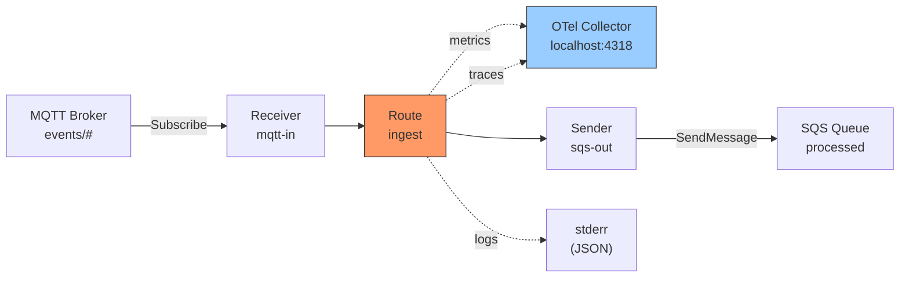

# Scenario 18: Full-Stack Observability

Wire metrics, distributed tracing, and structured logging into a bridge so every message is measurable, traceable, and auditable.

## Use Case

You run an MQTT-to-SQS bridge in production. When latency spikes or messages land in the DLQ, you need to answer three questions fast:

1. **What happened?** -- Metrics show delivery rates, error counts, and latency percentiles.
2. **Where did it happen?** -- Traces follow a single message from receiver through processors to sender.
3. **Why did it happen?** -- Structured logs carry correlation IDs that tie a log line to a specific trace and message.

GoBridge supports all three pillars through port interfaces with pluggable backends.

## Architecture



The runtime automatically instruments message delivery with metrics and traces. You only need to wire the exporters.

## What the Runtime Emits

### Metrics

The runtime emits these metrics automatically when a `MetricsExporter` is configured. Names are the constant *values* declared in `domain/shared/metrics.go` (the exporter passes them through verbatim):

| Metric | Kind | Tags | Description |
|---|---|---|---|
| `MessagesReceived` | Counter | `route_id` | Messages accepted for a route |
| `MessagesSent` | Counter | `route_id` | Messages dispatched to a sender |
| `MessagesDropped` | Counter | `route_id` | Messages dropped (retry unsupported, no DLQ) -- the SILENT-LOSS signal; alarmed by default (`MessagesDropped > 0`) |
| `MessagesExpired` | Counter | `route_id` | Messages dropped by TTL under `on_expired=drop` -- alarmed by default when sustained |
| `RouteErrors` | Counter | `route_id` | Recoverable route errors |
| `DeliveryE2ELatency` | Timer | `route_id` | End-to-end delivery time per message |
| `DeliveryPanics` | Counter | `route_id` | Recovered panics during delivery |
| `DLQEntries` | Counter | `route_id`, `category` | DLQ ARRIVALS (ingress counter -- only increases) |
| `DLQDepth` | Gauge | — | Standing DLQ BACKLOG right now (sampled via the store's optional `DLQDepthReporter`) -- alarmed by default (`DLQDepth > 0`) |
| `DLQWriteFailures` | Counter | — | Failed DLQ writes |
| `OutboxDepth` | Gauge | `partition` | TRUE pending outbox backlog (exact count via the store's optional `OutboxDepthReporter`; falls back to the claimed-count lower bound until an adapter implements it) |
| `OutboxClaimBatchSize` | Gauge | `partition` | Records claimed on the last drain poll -- liveness/throughput, NOT the backlog |
| `OutboxDepthFailures` | Counter | `partition` | Depth-query failures on a supported reporter (real DB/read error); `OutboxDepth` is skipped that cycle so the missing-data alarm fires instead of masking the fault |
| `OutboxDrainLatency` | Timer | `session_id` | Outbox drain cycle time |
| `OutboxExpiredBeforeSend` | Counter | `route_id` | Claimed record found past its TTL before its send; handled by the route's `on_expired` policy |
| `OutboxReplayCount` | Counter | `route_id` | A redelivered record (`ReplayCount > 1`) reprocessed on a later attempt |
| `OutboxDuplicateRisk` | Counter | `route_id` | Send succeeded but the follow-up Complete failed, so the record will be re-sent |
| `OutboxDeferred` | Counter | `route_id` | Claimed records not processed this drain cycle (batch deadline hit) and released for the next |
| `DrainSkippedNoLease` | Counter | `session_id`, `route_id` | Drain cycle skipped because the drainer holds no lease |
| `OutboxDrainStalled` | Counter | `session_id`, `route_id` | Drain batch whose in-flight sends did not return within the watchdog grace (a Sender ignoring `ctx`) |
| `LeaseAcquireLatency` | Timer | `lease_id` | Lease acquisition latency |
| `LeaseAcquireFailures` | Counter | `lease_id` | Failed lease acquisitions |
| `MQTTReconnects` | Counter | `session_id` | Session reconnects (historical wire name) |

All metrics use `shared.Tag` for dimensional tagging. The OTLP/CloudWatch
backend applies its own name normalization (e.g. Prometheus lowercases and
`_`-separates), so dashboard queries use the backend-normalized form of these
names.

**Reading the loss/duplicate ledger.** The outbox counters above are the
conservation ledger for at-least-once delivery -- watch their *rate*, not their
absolute value:

- `OutboxExpiredBeforeSend` rising -- messages are hitting their TTL while
  queued: a backlog, or a broker outage longer than the message TTL.
- `OutboxReplayCount` rising -- records are being redelivered repeatedly and are
  approaching the poison threshold.
- `OutboxDuplicateRisk` rising -- sends that completed but could not be marked
  Complete, so they will be re-sent; this is the duplicate window the
  `x-bridge.idempotency-key` / `x-bridge.dedup-id` headers exist to absorb.
- `OutboxDeferred` rising under load -- the drain budget is too small for the
  batch size.
- `DrainSkippedNoLease` rising on a route that should drain -- a misconfiguration
  (e.g. `shared_outbox` on a non-exclusive session); a normal standby
  legitimately holds no lease.
- `OutboxDrainStalled` non-zero -- a Sender is ignoring `ctx` cancellation and
  has wedged the drain loop; a diagnostic only, the runtime does not kill the
  wedged goroutines.

**Transport-adapter metrics.** Some adapters self-instrument under names
declared in their own package rather than in `domain/shared/metrics.go`. The
MQTT (paho) router emits two backpressure counters (`MQTTRouterDropped` is
tagged `session_id`; `MQTTRouterBuffered` is untagged):

| Metric | Kind | Description |
|---|---|---|
| `MQTTRouterDropped` | Counter | A publish dropped under backpressure -- the dispatch queue was full under flood (QoS 0), or the pending buffer was full / over its byte ceiling. QoS 1/2 publishes block rather than drop, so a rising count is almost always shed QoS-0 traffic. |
| `MQTTRouterBuffered` | Counter | A publish held in the bounded pending buffer because it arrived before a matching handler registered (the CONNACK backlog racing receiver registration). |

A rising `MQTTRouterDropped` is the backpressure signal detailed under
[MQTT backpressure and dispatch](../transports/mqtt.md#backpressure-and-dispatch).

### Traces

When a `Tracer` is configured, the runtime creates a span around each `handleDelivery` call:

- **Span name**: `bridge.handleDelivery`
- **Attributes**: `route_id`, `envelope_id`, and `trace_id` (only when an ingress `traceparent` is present)
- **Error**: set on delivery failure via `span.SetError` with the wrapped error

The runtime parses the W3C `traceparent` header from ingress messages and
records the incoming `trace_id` on the span and in the log context. Full
parent/child linkage of the OTel span to the upstream trace (and re-injection
onto outbound headers) is provided by the tracer adapter's `Extract`/`Inject`
methods; see the adapter package docs. If no trace context exists, the tracer
starts a new root span.

### Structured Logging

The `observability.CorrelationHandler` wraps any `slog.Handler` to inject three fields into every log record:

| Field | Source |
|---|---|
| `correlation_id` | `x-bridge.correlation-id` header (auto-generated if missing) |
| `trace_id` | Active span's W3C trace-id when the tracer exposes `ports.SpanIdentity` (OTel); the upstream `traceparent` header is the fallback (NoopTracer, unsampled) |
| `span_id` | Active span's W3C span-id (same capability); upstream `traceparent` fallback |

This links every log line to a specific message and trace without manual
instrumentation. Root deliveries -- which have no upstream `traceparent` --
still get a `trace_id` when an OTel tracer is wired. Note the cross-hop join
key: `x-bridge.correlation-id` is stripped at ingress and re-generated on each
hop unless the downstream receiver's route sets `trust_bridge_headers: true`.

## Configuration

```yaml
bridge:
  id: observable-bridge
  log_level: debug

sessions:
  - id: mqtt-session
    transport: mqtt
    options:
      session:
        broker_url: tcp://localhost:1883
        client_id: observable-01

receivers:
  - id: mqtt-in
    transport: mqtt
    session_id: mqtt-session
    topics:
      - topic: "events/#"
        qos: 1

senders:
  - id: sqs-out
    transport: sqs
    options:
      queue_url: https://sqs.us-west-1.amazonaws.com/123456789/processed
      region: us-west-1

bindings:
  - id: to-sqs
    sender_id: sqs-out
    address: processed

routes:
  - id: ingest
    receiver_id: mqtt-in
    delivery_mode: direct_hold
    bindings: [to-sqs]
    policy:
      max_in_flight: 100
```

Observability is configured in Go code, not YAML -- the metrics exporter, tracer, and logger are runtime options. There is no `tracing:` or `metrics:` YAML key. The OTel adapters additionally honor the standard `OTEL_EXPORTER_OTLP_*`, `OTEL_SERVICE_NAME`, and `OTEL_RESOURCE_ATTRIBUTES` environment variables when the matching `WithXxx` option is not set (option > env > default).

## Go Bootstrap

```go
package main

import (
	"context"
	"errors"
	"log/slog"
	"os"
	"os/signal"
	"syscall"

	"github.com/mariotoffia/gobridge/config/parser"
	"github.com/mariotoffia/gobridge/observability"
	"github.com/mariotoffia/gobridge/ports"

	paho "github.com/mariotoffia/gobridge/adapters/mqtt/transport/paho"
	sqs  "github.com/mariotoffia/gobridge/adapters/aws/transport/sqs"
	otelmetrics "github.com/mariotoffia/gobridge/adapters/otel/metrics"
	oteltracing "github.com/mariotoffia/gobridge/adapters/otel/tracing"
	"github.com/mariotoffia/gobridge/bridge"
)

func main() {
	ctx, stop := signal.NotifyContext(context.Background(), syscall.SIGINT, syscall.SIGTERM)
	defer stop()

	// --- Structured Logging ---
	// Wrap a JSON handler with CorrelationHandler to inject
	// correlation_id, trace_id, and span_id into every log line.
	jsonHandler := slog.NewJSONHandler(os.Stderr, &slog.HandlerOptions{
		Level: slog.LevelDebug,
	})
	logger := slog.New(observability.NewCorrelationHandler(jsonHandler))

	// --- Metrics ---
	metrics, err := otelmetrics.New(ctx,
		otelmetrics.WithEndpoint("http://localhost:4318"),
		otelmetrics.WithServiceName("gobridge"),
		otelmetrics.WithEnvironment("production"),
		otelmetrics.WithInsecure(),
	)
	if err != nil {
		logger.Error("failed to create metrics exporter", "error", err)
		os.Exit(1)
	}

	// --- Tracing ---
	tracer, err := oteltracing.New(ctx,
		oteltracing.WithEndpoint("http://localhost:4318"),
		oteltracing.WithServiceName("gobridge"),
		oteltracing.WithEnvironment("production"),
		oteltracing.WithSamplerRatio(1.0), // sample everything in dev
		oteltracing.WithInsecure(),
	)
	if err != nil {
		logger.Error("failed to create tracer", "error", err)
		os.Exit(1)
	}

	// --- Bridge ---
	// The parser needs a plugin registry to decode each transport's
	// options block. Register the same transports you wire below.
	reg := ports.NewRegistry()
	if err := errors.Join(
		paho.Register(reg),
		sqs.Register(reg),
	); err != nil {
		logger.Error("failed to register plugin decoders", "error", err)
		os.Exit(1)
	}

	cfg, err := parser.ParseFile("bridge.yaml", parser.FormatAuto, reg)
	if err != nil {
		logger.Error("failed to parse config", "error", err)
		os.Exit(1)
	}

	rt, err := bridge.NewBuilder(cfg,
		bridge.WithLogger(logger),
		bridge.WithMetrics(metrics),
		bridge.WithTracer(tracer),
	).
		RegisterTransportFactory("mqtt", paho.NewFactory(logger)).
		RegisterTransportFactory("sqs", sqs.NewFactory(logger)).
		Build(ctx)
	if err != nil {
		logger.Error("failed to build runtime", "error", err)
		os.Exit(1)
	}

	if err := rt.Start(ctx); err != nil {
		logger.Error("failed to start runtime", "error", err)
		os.Exit(1)
	}

	logger.Info("bridge started", "id", cfg.Bridge.ID)
	<-ctx.Done()
	_ = rt.Stop(context.Background())
}
```

### What This Produces

**Log output** (one line per message, JSON to stderr):

```json
{
  "time": "2026-04-06T10:15:32.004Z",
  "level": "INFO",
  "msg": "delivery completed",
  "route_id": "ingest",
  "envelope_id": "e-abc123",
  "correlation_id": "corr-7f3a9b",
  "trace_id": "4bf92f3577b34da6a3ce929d0e0e4736",
  "span_id": "00f067aa0ba902b7",
  "latency_ms": 12
}
```

**Metrics** (pushed to OTel Collector every 60s):

```text
DeliveryE2ELatency{route_id="ingest"} p50=8ms p99=45ms
MessagesSent{route_id="ingest"} count=12847
MessagesReceived{route_id="ingest"} count=12870
```

**Traces** (visible in Jaeger, Tempo, or any OTLP-compatible backend):

```text
trace_id: 4bf92f3577b34da6a3ce929d0e0e4736
  └─ bridge.handleDelivery (12ms)
       route_id=ingest, envelope_id=e-abc123, trace_id=4bf92f35...
```

## Variations

### CloudWatch Instead of OTel

Replace the OTel metrics exporter with the CloudWatch adapter:

```go
import cwmetrics "github.com/mariotoffia/gobridge/adapters/aws/metrics/cloudwatch"

metrics, err := cwmetrics.New(ctx, "GoBridge/Runtime",
    cwmetrics.WithRegion("us-west-1"),
)
```

The namespace must be `shared.MetricNamespace` (`GoBridge/Runtime`) -- a
mismatched namespace leaves every CloudWatch alarm in `INSUFFICIENT_DATA`.
The runtime doesn't care which backend you use -- it only talks to `ports.MetricsExporter`.

### Sampling Traces in Production

Sample 10% of traces to reduce cost:

```go
tracer, err := oteltracing.New(ctx,
    oteltracing.WithSamplerRatio(0.1),
    // ...
)
```

Unsampled messages still get correlation IDs in logs, so you can always search by `correlation_id` even without a trace.

### Surfacing Telemetry Export Failures

By default, OTLP export and backpressure failures are logged at Warn level via
`slog.Default()`; pass `WithErrorHandler(nil)` to opt out. Install a custom
error handler (and, optionally, bound the batch/queue) to route drops to your
own logger:

```go
metrics, _ := otelmetrics.New(ctx,
    otelmetrics.WithErrorHandler(func(err error) {
        logger.Warn("metrics export failed", "error", err)
    }),
    otelmetrics.WithExportTimeout(10*time.Second),
    otelmetrics.WithMaxInstruments(1024), // reject unbounded dynamic names
)

tracer, _ := oteltracing.New(ctx,
    oteltracing.WithErrorHandler(func(err error) {
        logger.Warn("span export failed", "error", err)
    }),
    oteltracing.WithMaxQueueSize(2048),
    oteltracing.WithExportTimeout(10*time.Second),
)
```

Emit only metric names from the bounded static set in
`domain/shared/metrics.go`; dynamic names beyond `WithMaxInstruments` are
rejected and reported through the error handler rather than growing the
process heap.

### Trace-Level Logging

Use the `logging` package for fine-grained per-message logs in development:

```go
import "github.com/mariotoffia/gobridge/logging"

handler := slog.NewTextHandler(os.Stderr, &slog.HandlerOptions{
    Level:       logging.LevelTrace,
    ReplaceAttr: logging.ReplaceLevel,
})
logger := slog.New(observability.NewCorrelationHandler(handler))
```

Trace-level logging shows slot acquisition, header stripping, resolver decisions, and outbox persist events. Use in development only -- it is verbose.

### Connecting All Three in a Dashboard

A typical Grafana setup queries all three signals:

| Panel | Data Source | Query |
|---|---|---|
| Delivery rate | Prometheus (via OTel) | `rate(messages_sent_total[5m])` |
| Error rate | Prometheus | `rate(route_errors_total[5m])` |
| p99 latency | Prometheus | `histogram_quantile(0.99, delivery_e2e_latency_bucket)` |
| Trace drilldown | Tempo | Click a data point → jump to trace by `trace_id` |
| Log context | Loki | `{job="gobridge"} |= "<correlation_id>"` |

The `correlation_id` is the join key across all three systems. Prometheus
names above are the OTel-normalized form of the runtime constants
(`MessagesSent` → `messages_sent_total`, etc.); confirm the exact names in
your backend, since normalization rules vary.
