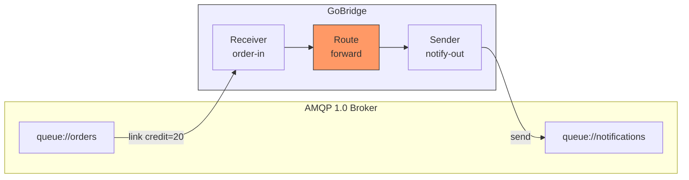
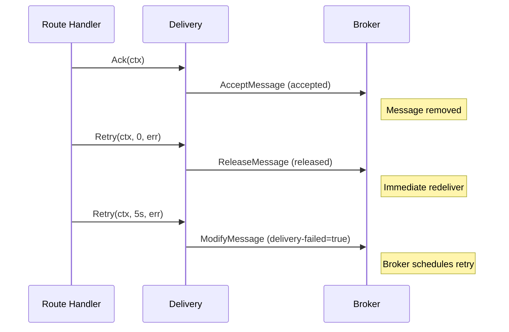

# Scenario 20: AMQP 1.0 Queue Bridge (Artemis / AWS MQ)

Route messages between queues on an AMQP 1.0 broker. Works with Apache ActiveMQ Artemis, AWS MQ for ActiveMQ, Solace PubSub+, and any AMQP 1.0-compliant broker.

## Use Case

An order processing system writes to a `queue://orders` address on an Artemis broker. A notification service needs these events on `queue://notifications`. The bridge consumes orders, and forwards them to the notification queue on the same broker.

A second variation shows the same pattern against AWS MQ (managed ActiveMQ) with TLS.

## Architecture



## Configuration

```yaml
bridge:
  id: amqp10-forwarder

sessions:
  - id: artemis-conn
    transport: amqp10
    options:
      session:
        address: "amqp://localhost:5672"
        container_id: "bridge-node-01"
        username: "admin"
        password: "admin"
        # SASL PLAIN over plaintext amqp:// sends credentials in the clear;
        # opt in explicitly. Prefer an amqps:// address in production.
        allow_insecure_plain: true

receivers:
  - id: order-in
    transport: amqp10
    session_id: artemis-conn
    options:
      receiver:
        address: "queue://orders"
        link_credit: 20

senders:
  - id: notify-out
    transport: amqp10
    session_id: artemis-conn
    options:
      sender:
        address: "queue://notifications"
        timeout: "30s"

bindings:
  - id: to-notifications
    sender_id: notify-out
    address: notifications

routes:
  - id: forward
    receiver_id: order-in
    delivery_mode: direct_hold
    dispatch_mode: single
    bindings: [to-notifications]
```

## Config Walkthrough

### Session

- **`transport: amqp10`** -- Uses the AMQP 1.0 transport adapter.
- **`options.session.address`** -- Broker endpoint. Use `amqps://` for TLS connections.
- **`options.session.container_id`** -- Identifies this client to the broker. Artemis uses it for logging and connection tracking.
- **`options.session.username` / `options.session.password`** -- SASL PLAIN authentication.

### No Topology Declaration

AMQP 1.0 does not declare queues or exchanges. The broker manages topology.
Create queues through the broker's admin interface (Artemis web console,
AWS MQ console, Solace CLI) before starting the bridge.

This is a key difference from AMQP 0-9-1 (RabbitMQ), where `Reconcile`
declares exchanges, queues, and bindings automatically.

### Receiver

- **`options.receiver.address: queue://orders`** -- The AMQP 1.0 link address. Address format depends on the broker. Artemis uses `queue://name` for queues and `topic://name` for multicast addresses.
- **`options.receiver.link_credit: 20`** -- The receiver grants 20 credits to the broker, allowing it to push up to 20 messages ahead. Higher values improve throughput. Lower values reduce memory pressure on slow consumers.

### Sender

- **`options.sender.address: queue://notifications`** -- Publish target.
- **`options.sender.timeout: 30s`** -- Per-message send timeout. Applied when the context has no deadline.

### Settlement



The bridge maps `Ack`, `Retry(0)`, and `Retry(>0)` to AMQP 1.0 dispositions. `Extend` is not supported -- AMQP 1.0 uses credit-based flow control instead of visibility timeouts.

## Go Bootstrap

```go
reg := ports.NewRegistry()
_ = amqp10.Register(reg)

cfg, _ := cfgparser.ParseFile("bridge.yaml", cfgparser.FormatAuto, reg)

rt, _ := bridge.NewBuilder(cfg, bridge.WithLogger(logger)).
    RegisterTransportFactory("amqp10", amqp10.NewFactory(logger)).
    Build(ctx)

rt.Start(ctx)
```

## Variations

### AWS MQ for ActiveMQ (Managed AMQP 1.0)

AWS MQ runs managed ActiveMQ brokers that accept AMQP 1.0 connections over TLS on port 5671.

```yaml
sessions:
  - id: aws-mq-conn
    transport: amqp10
    options:
      session:
        address: "amqps://b-xxxx-xxxx.mq.eu-west-1.amazonaws.com:5671"
        container_id: "bridge-aws-mq"
        username: "admin"
        password: "your-password"
        tls:
          enable: true
```

Queues and topics are created through the AWS MQ console or the ActiveMQ web console. The bridge connects as a standard AMQP 1.0 client -- no AWS SDK required.

### Solace PubSub+

Solace speaks AMQP 1.0 on its default port. Queue addresses use the format `queue/name`:

```yaml
sessions:
  - id: solace-conn
    transport: amqp10
    options:
      session:
        address: "amqp://solace.example.com:5672"
        container_id: "bridge-solace"
        username: "default"
        password: "default"
        # SASL PLAIN over plaintext amqp:// sends credentials in the clear;
        # opt in explicitly. Prefer an amqps:// address in production.
        allow_insecure_plain: true

receivers:
  - id: solace-in
    transport: amqp10
    session_id: solace-conn
    options:
      receiver:
        address: "queue/orders"
        link_credit: 50
```

### TLS with Client Certificates

```yaml
sessions:
  - id: artemis-tls
    transport: amqp10
    options:
      session:
        address: "amqps://artemis.example.com:5671"
        container_id: "bridge-tls"
        tls:
          enable: true
          ca_cert_file: /etc/certs/ca.pem
          cert_file: /etc/certs/client.pem
          key_file: /etc/certs/client.key
```

### Topic Subscriptions (Artemis)

Artemis supports multicast (topic) addresses. Each subscriber gets a copy of every message:

```yaml
receivers:
  - id: topic-in
    transport: amqp10
    session_id: artemis-conn
    options:
      receiver:
        address: "topic://events"
        link_credit: 10
```

The broker creates a temporary subscription for the receiver's link. For durable subscriptions, configure them on the broker side.

### Cross-Broker Bridge

Forward messages from one Artemis instance to another:

```yaml
sessions:
  - id: source-broker
    transport: amqp10
    options:
      session:
        address: "amqp://artemis-a:5672"
        container_id: "bridge-source"
        username: "admin"
        password: "admin"
        # SASL PLAIN over plaintext amqp:// sends credentials in the clear;
        # opt in explicitly. Prefer an amqps:// address in production.
        allow_insecure_plain: true

  - id: target-broker
    transport: amqp10
    options:
      session:
        address: "amqp://artemis-b:5672"
        container_id: "bridge-target"
        username: "admin"
        password: "admin"
        # SASL PLAIN over plaintext amqp:// sends credentials in the clear;
        # opt in explicitly. Prefer an amqps:// address in production.
        allow_insecure_plain: true

receivers:
  - id: source-in
    transport: amqp10
    session_id: source-broker
    options:
      receiver:
        address: "queue://orders"
        link_credit: 50

senders:
  - id: target-out
    transport: amqp10
    session_id: target-broker
    options:
      sender:
        address: "queue://orders-replica"
        timeout: "30s"

bindings:
  - id: to-replica
    sender_id: target-out
    address: orders-replica

routes:
  - id: replicate
    receiver_id: source-in
    delivery_mode: direct_hold
    dispatch_mode: single
    bindings: [to-replica]
```
