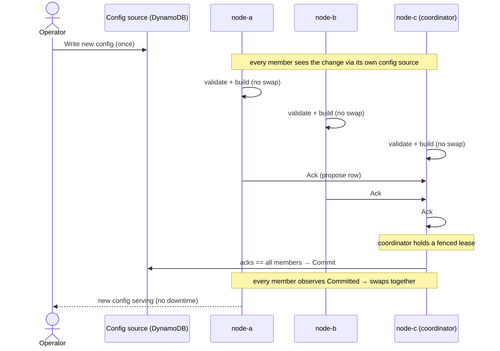
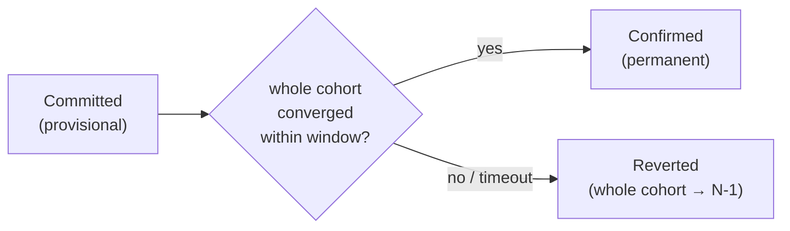

# Scenario 23: Coordinated Cluster Config Rollout

Change the config of a **whole cluster** at once — safely, with no downtime — by
posting it to one node and letting the cohort roll it out together.

## Use Case

You run several GoBridge processes as one cohort (for availability and
throughput). They share brokers and durable stores, so you **cannot** just edit
config and let each process reload on its own schedule — for a few seconds some
would run the old config and some the new one, which can hand the same exclusive
session to two owners and strand messages. By default GoBridge refuses a live
change to a cohort for exactly this reason (see
[Scenario 10](10-dynamic-reconfiguration.md#cluster-semantics-and-limitations)).

**Coordinated rollout** lifts that restriction for *live-safe* changes. You post
the new config to one node; every member validates and builds it; and only once
**all** of them agree does a single elected coordinator commit it. If any member
can't accept the change, nothing swaps and the old config keeps serving. No
process ever runs a config the others haven't agreed to.

The *decision* is atomic; the swap after it is per member. Each one applies the
committed generation locally, normally within a poll of the commit — but a member
whose broker or store is unhealthy can fail where its peers succeed, and then the
cohort runs two generations until it recovers or is replaced. That window is
bounded and alarmed rather than prevented; see
[Operating a coordinated cohort](../cluster/operating.md#after-the-commit-state-committed-with-applied-false).
The [confirm window](#variation-confirm-window-auto-revert) below is what removes
it, by reverting the whole cohort instead of leaving it split.

This is the worked example for the [cluster configuration guide](../cluster/README.md)
and [ADR 0013](../adr/0013-coordinated-cluster-config-rollout.md). For the
optional auto-revert layer on top, see [Confirm window](#variation-confirm-window-auto-revert)
below.

## How a coordinated rollout works



If any member sends `Nack` (it can't build the change), or the deadline passes
before everyone acks, the coordinator **aborts**: nothing swaps and the running
config keeps serving.

## Configuration

The rollout behavior is turned on entirely in YAML. This is a live-safe cohort
that rolls route/processor changes with no downtime:

```yaml
bridge:
  id: cluster-bridge
  deployment_mode: clustered
  cluster:
    rollout: coordinated
    members: [node-a, node-b, node-c]
    confirm_window: 90s

sessions:
  - id: mqtt
    transport: mqtt
    # direct_hold relies on the broker redelivering what a crashed process never
    # acknowledged; only a persistent (or exclusive) session does that.
    session_mode: persistent
    options:
      session:
        broker_url: tcp://broker.internal:1883
        client_id: cohort-ingress
        # Three members share one broker: each needs its own client id, and a
        # plain filter would deliver every event to every member. The hostname
        # suffix keys the id per member (the members are named, stable hosts,
        # which the assertion vouches for); the shared subscription splits the
        # stream across the cohort.
        client_id_suffix: hostname
        assert_stable_client_identity: true
        clean_start: false
        session_expiry_interval: 3600

stores:
  # A persistent session keeps an exact record of the filters it installed on
  # the broker (ADR 0003); a cohort keeps it in DynamoDB, seeded per member.
  managed_subscriptions:
    type: dynamodb
    options:
      table_name: gobridge-managed-subscriptions
  dlq:
    type: dynamodb
    options:
      table_name: gobridge-dlq

receivers:
  - id: in
    session_id: mqtt
    topics:
      - topic: "$share/cohort/events/#"
        qos: 1

senders:
  - id: out
    session_id: mqtt
    options:
      sender:
        default_topic: processed/events

bindings:
  - id: fwd
    sender_id: out
    # Naming the session on the binding is what makes the bridge manage it:
    # connect, subscribe, reconcile. A session nobody manages never subscribes.
    session_id: mqtt
    address: processed/events

routes:
  - id: process
    receiver_id: in
    bindings: [fwd]
    policy:
      # The shared subscription splits the stream across members; no single
      # owner fences it, and that is the intended scale-out.
      allow_unfenced: true
```

**Prerequisites (deployment-level, not shown above).** Coordinated mode also
requires the **versioned DynamoDB config source** (the `dynamodb_coordinated_ha`
profile — see [Scenario 9](09-layered-dynamodb-config.md)) and the shared
lease/outbox stores an exclusive-session cohort already uses
([Scenario 8](08-clustered-exclusive-sessions.md)). Each process also announces a
stable **`member_id`** (in its bootstrap/deployment config) that must appear in
`bridge.cluster.members`. The shipped file-based AWS image wires all of this for
you; you just set the YAML above and deploy.

## Config Walkthrough

| Field | Value | Purpose |
|-------|-------|---------|
| `bridge.deployment_mode` | `clustered` | Marks this a cohort — several processes sharing brokers and stores. |
| `bridge.cluster.rollout` | `coordinated` | Opts into the rollout barrier. Unset (or `refuse`) keeps the default: every change needs a whole-cohort restart. |
| `bridge.cluster.members` | `[node-a, node-b, node-c]` | The cohort roster the barrier freezes and counts acknowledgements against. Must be identical on every member; each `member_id` must appear here. |
| `bridge.cluster.confirm_window` | `90s` | Optional. Makes each commit provisional and auto-reverts if the cohort can't connect (see [below](#variation-confirm-window-auto-revert)). Omit it for the base protocol. |

## What you observe

You do **not** run anything per change — you write the config once and watch it
land. Deep health (`GET /api/v1/monitor/deephealth`, under `config_watch.rollout`)
is the window into a rollout:

```text
config_watch.rollout:
  state:          staging          # proposed → staging → committed
  config_version: 42
  epoch:          [node-a, node-b, node-c]
  acked:          [node-a, node-c]
  nacked:         []
  reconfigure_pending: true        # this member is holding its swap until commit
```

- **`epoch` minus `acked` minus `nacked` is exactly who the cohort is waiting on.**
  Here it's `node-b` — most often a member whose own config source hasn't
  delivered the change yet.
- When every member has acked, `state` flips to `committed`, `reconfigure_pending`
  clears, and each member reports the new `config_version`.
- **If it aborts** (a member nacked, or the deadline passed): `state` reads
  `aborted` with a `reason`, nothing swapped, and every member keeps serving. Fix
  the config and re-post it — the cohort is unharmed.

Metrics tell the same story fleet-wide: `ClusterRolloutState` (one-hot per state),
`ClusterRolloutAcks` (`acks/epoch`), and `ClusterRolloutResolved`
(`outcome=committed|aborted|…`).

## Variation: Confirm window (auto-revert)

With `confirm_window` set, a commit is a **trial**. Every member swaps, then must
actually connect to its broker (converge). If the **whole** cohort converges
within the window, the coordinator confirms it (permanent). If any member can't —
or the coordinator dies — the whole cohort **automatically reverts** to the
previous config when the window expires. A member that crashes mid-window reboots
on the last *confirmed* config, never the trial one.



Use it for changes that can *validate* but fail to *connect* — rotated
credentials, new broker ACLs, an endpoint that might be unreachable. The cost is
that a failed trial disconnects twice (apply, then revert), so leave it off for
routine tuning that always converges. See
[ADR 0014](../adr/0014-confirm-window-provisional-commit.md).

## Variation: A change that can't roll live

Some changes are **replacement-required** even in a coordinated cohort — changing
a durable session identity (`client_id`), a lease/outbox/DLQ **store target**,
`deployment_mode`, or the cohort's own `bridge.cluster.members` / `endpoints` /
`rollout`. The cohort refuses to roll these through the barrier (it names the
class) and you apply them with the manual
[whole-cohort replacement procedure](../runbooks/cluster-config-rollout.md)
instead. See
[which changes are live-safe](../cluster/operating.md#which-changes-roll-live-and-which-need-a-window).

## Custom composition root

The shipped file-based AWS image already drives the barrier, so most users need
no Go code. If you build a **custom** composition root on `bridge.Supervisor`,
wire the seam with the rollout, lease, and committed-config stores plus this
node's `member_id`:

```go
sup := bridge.NewSupervisor(
    bridge.WithSupervisorLogger(logger),
    bridge.WithClusterRollout(bridge.ClusterRolloutConfig{
        Store:    rolloutStore,   // ports.ClusterRolloutStore (DynamoDB or memory)
        Lease:    leaseStore,     // elects the fenced coordinator
        MemberID: "node-a",       // must appear in bridge.cluster.members
        // PollInterval defaults to 2s
    }),
)
```

The full wiring (committed-config artifact store, config codec, and the
post-swap config-manager reconcile) is what the shipped `bootstrap.App` provides;
see the [protocol spec](../cluster/spec/) for the composition obligations.

## Related

- [Cluster configuration guide](../cluster/README.md) — which mode to pick and what each buys you.
- [Operating a coordinated cohort](../cluster/operating.md) — day-to-day operation and reading rollout health.
- [Cluster cost guide (TCO)](../cluster/tco.md) — what coordinated mode costs.
- [Scenario 8: Clustered MQTT with Exclusive Sessions](08-clustered-exclusive-sessions.md) — the shared-store cohort this builds on.
- [Scenario 9: Layered Configuration with DynamoDB Overlay](09-layered-dynamodb-config.md) — the versioned config source coordinated mode requires.
- [Scenario 10: Dynamic Reconfiguration](10-dynamic-reconfiguration.md) — single-process reload and why clustered live reload is otherwise refused.
- [Cluster config rollout runbook](../runbooks/cluster-config-rollout.md) — the whole-cohort replacement procedure.
- [ADR 0013](../adr/0013-coordinated-cluster-config-rollout.md) · [ADR 0014](../adr/0014-confirm-window-provisional-commit.md).
