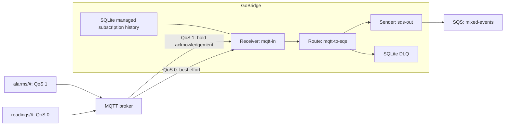

# Scenario 24: Mixed MQTT QoS to SQS

Send alarms and frequent readings through one MQTT-to-SQS `direct_hold` route.
Keep broker recovery for alarms while accepting best-effort readings. This
example runs one bridge replica and uses SQLite for managed subscription history
and dead letters.

## Use Case

Devices publish alarms at QoS 1 and readings at QoS 0. QoS means quality of
service on the MQTT hop. QoS 1 keeps an unacknowledged message for redelivery;
QoS 0 sends once, without an acknowledgement. The SQS consumer handles duplicate
alarms, while a newer reading can replace one that was lost.

## Architecture



## Configuration

### Part A: Persistent mixed-QoS ingress

Save as `bridge.yaml`. Replace the broker URL, AWS region and queue URL with
your endpoints. AWS credentials come from the normal SDK credential chain.

```yaml
bridge:
  id: mqtt-mixed-qos-to-sqs
stores:
  managed_subscriptions:
    type: sqlite
    options:
      path: /var/lib/gobridge/managed/managed-subscriptions.db
  dlq:
    type: sqlite
    options:
      path: /var/lib/gobridge/deadletters/dlq.db
sessions:
  - id: mqtt-ingress
    transport: mqtt
    session_mode: persistent
    options:
      session:
        broker_url: tcp://mqtt.example.com:1883
        client_id: mixed-qos-bridge-01
        clean_start: false
        session_expiry_interval: 600
receivers:
  - id: mqtt-in
    session_id: mqtt-ingress
    topics:
      - {topic: "alarms/#", qos: 1}
      - {topic: "readings/#", qos: 0}
senders:
  - id: sqs-out
    transport: sqs
    options:
      queue_url: https://sqs.us-west-1.amazonaws.com/123456789012/mixed-events
      region: us-west-1
bindings:
  - {id: to-sqs, sender_id: sqs-out, address: mixed-events}
routes:
  - id: mqtt-to-sqs
    receiver_id: mqtt-in
    delivery_mode: direct_hold
    bindings: [to-sqs]
    policy:
      allow_unfenced: true
      max_in_flight: 100
```

## Config Walkthrough

**Session.** `client_id` stays the same across restarts. `clean_start: false`
asks the broker to resume its existing state. The 600-second expiry gives the
bridge ten minutes after disconnection to return before the broker discards
that state. Omitted or zero expiry on a persistent session takes the existing
86400-second default, not immediate expiry.

**Subscriptions.** Alarms request QoS 1; readings request QoS 0. The actual
packet's QoS is the lower of the publisher and subscription levels. A publisher
sending an alarm at QoS 0 therefore does not gain redelivery from this
subscription.

**Route.** `direct_hold` sends to SQS before acknowledging MQTT. QoS 0 Ack does
nothing; its acceptance is not a promise of redelivery. At successful activation
the bridge logs one INFO line for `readings/#`, naming route and receiver.
`allow_unfenced: true` acknowledges this example's single-replica ownership
model. Do not run competing copies with the same client identity.

**Stores and initialization.** The managed-subscription store records the exact
filters installed on the broker. Keep its directory and the DLQ directory on a
durable volume, owned by the bridge user with mode `0700`. For a **new broker
identity**, initialize its empty baseline once before first startup:

```bash
gobridge -config bridge.yaml -seed-managed-subscriptions mqtt-ingress
```

Use a binary built with `gobridge_mqtt,gobridge_aws,gobridge_native` (or
`gobridge_all`). Do not reseed an existing identity to empty on restart. Follow
[managed-subscription history](../transports/mqtt-durable-sessions.md#managed-subscription-history)
when adopting an identity that already has broker subscriptions.

The dead-letter queue (DLQ) holds messages the route cannot deliver. Selecting
QoS 0 does **not** waive the DLQ-or-explicit-drop safeguard.

## Go Bootstrap

This complete bootstrap registers the store decoder and factory as well as both
transports. Initialize the managed baseline with the command above first.

```go
package main

import (
    "context"
    "errors"
    "log/slog"
    "os"
    "os/signal"
    "syscall"
    "time"

    "github.com/mariotoffia/gobridge/adapters/aws/transport/sqs"
    "github.com/mariotoffia/gobridge/adapters/mqtt/transport/paho"
    nativestore "github.com/mariotoffia/gobridge/adapters/native/store"
    "github.com/mariotoffia/gobridge/bridge"
    "github.com/mariotoffia/gobridge/config"
    cfgparser "github.com/mariotoffia/gobridge/config/parser"
    "github.com/mariotoffia/gobridge/ports"
)

func main() {
    ctx, cancel := signal.NotifyContext(context.Background(), os.Interrupt, syscall.SIGTERM)
    defer cancel()
    if err := run(ctx); err != nil {
        slog.Error("bridge stopped", "error", err)
        os.Exit(1)
    }
}

func run(ctx context.Context) error {
    logger := slog.Default()
    reg := ports.NewRegistry()
    if err := errors.Join(paho.Register(reg), sqs.Register(reg), nativestore.Register(reg)); err != nil {
        return err
    }
    cfg, err := cfgparser.ParseFile("bridge.yaml", cfgparser.FormatAuto, reg)
    if err != nil {
        return err
    }
    rt, err := bridge.NewBuilder(cfg,
        bridge.WithBlueprintValidator(config.Validate),
        bridge.WithLogger(logger)).
        RegisterTransportFactory("mqtt", paho.NewFactory(logger)).
        RegisterTransportFactory("sqs", sqs.NewFactory(logger)).
        RegisterStoreFactory("sqlite", nativestore.NewSQLiteStoreFactory()).
        Build(ctx)
    if err != nil {
        return err
    }
    startErr := rt.Start(ctx)
    if startErr == nil {
        <-ctx.Done()
    }
    stopCtx, cancel := context.WithTimeout(context.Background(), 30*time.Second)
    defer cancel()
    return errors.Join(startErr, rt.Stop(stopCtx))
}
```

## Crash Recovery / Failure Modes

**Normal operation.** Both kinds of message arrive in SQS. A successful QoS 1
send releases its MQTT acknowledgement. QoS 0 needs no protocol settlement.

**Restart while messages are in flight.** If the broker session survives,
unacknowledged QoS 1 alarms return after reconnect. They can arrive twice if SQS
accepted a send but the bridge stopped before acknowledging MQTT. Give alarms
stable producer IDs (`mqtt.message-id`) and make the consumer idempotent.
In-flight readings **may** be missing: QoS 0 cannot be redelivered. They are not
necessarily lost, because SQS might already have accepted them. An abruptly
killed bridge cannot count its crash gap.

**Away beyond session expiry.** The broker discards the old session and its
queued alarms. Alarms published while no subscription exists are not protected.
Expiry limits recovery; it does not guarantee storage for an unlimited outage.

**Destination failure while running.** Actual QoS 0 Retry is unsupported. The
route uses its DLQ fallback. If bounded DLQ persistence also fails, it counts
one `MessagesDropped{reason=retry_unsupported_dlq_failed}`, surfaces the error,
and releases its slot so later messages can progress. It does not recycle the
MQTT session for that QoS 0 failure. This is distinct from
`MQTTReceiverEmitRejected{outcome=lost}`, which counts immediate refusal at the
receiver boundary. Generated message IDs can first take the existing
`unstable_identity` terminal path.

QoS 2 adds protection on the MQTT hop only. It does not make SQS delivery
exactly-once.

## Variations

### Part B: Ephemeral mixed QoS is rejected

An ephemeral session starts fresh on every connection. The broker forgets the
old session, so there is nobody to redeliver an unconfirmed alarm after restart.
This complete configuration is deliberately invalid:

<!-- docs-example: skip -->
```yaml
bridge:
  id: ephemeral-mixed
stores:
  dlq:
    type: sqlite
    options: {path: /var/lib/gobridge/deadletters/dlq.db}
sessions:
  - id: mqtt-ingress
    transport: mqtt
    session_mode: ephemeral
    options:
      session:
        broker_url: tcp://mqtt.example.com:1883
        client_id: mixed-qos-bridge-01
receivers:
  - id: mqtt-in
    session_id: mqtt-ingress
    topics:
      - {topic: "alarms/#", qos: 1}
      - {topic: "readings/#", qos: 0}
senders:
  - id: sqs-out
    transport: sqs
    options:
      queue_url: https://sqs.us-west-1.amazonaws.com/123456789012/mixed-events
      region: us-west-1
bindings:
  - {id: to-sqs, sender_id: sqs-out, address: mixed-events}
routes:
  - id: mqtt-to-sqs
    receiver_id: mqtt-in
    delivery_mode: direct_hold
    bindings: [to-sqs]
    policy: {allow_unfenced: true}
```

The builder reports:

```text
bridge: route validation: route "mqtt-to-sqs": direct_hold invalid: the source does not redeliver an unsettled message, so a crash between the send and the settle loses it: the ingress session "mqtt-ingress" connects with clean_start, so a restarted process is handed a fresh broker session and every delivery the old one held is gone (set session_mode: persistent or exclusive with clean_start: false)
```

Use the persistent session in Part A to recover unacknowledged alarms. It costs
broker-held session state and durable managed-subscription history.
Exclusive mode also resumes, but needs lease-bearing ownership wiring; it is
not a replacement for receiver-only ingress.

Alternatively, [shared outbox](05-durable-shared-outbox.md) protects each message
**after a successful durable Persist**. It needs a durable outbox store, a lease
store and an exclusive drain-session partition, not just a `delivery_mode`
change. It adds a store write per message and does not recover a crash before
Persist or traffic missed while an ephemeral subscriber was disconnected.

### Part B: Ephemeral readings-only is accepted

QoS 0 never needed a durable broker session. Keep the failure sink:

```yaml
bridge:
  id: ephemeral-readings
stores:
  dlq:
    type: sqlite
    options: {path: /var/lib/gobridge/deadletters/dlq.db}
sessions:
  - id: mqtt-ingress
    transport: mqtt
    session_mode: ephemeral
    options:
      session:
        broker_url: tcp://mqtt.example.com:1883
        client_id: readings-bridge-01
receivers:
  - id: mqtt-in
    session_id: mqtt-ingress
    topics:
      - {topic: "readings/#", qos: 0}
senders:
  - id: sqs-out
    transport: sqs
    options:
      queue_url: https://sqs.us-west-1.amazonaws.com/123456789012/mixed-events
      region: us-west-1
bindings:
  - {id: to-sqs, sender_id: sqs-out, address: mixed-events}
routes:
  - id: mqtt-to-sqs
    receiver_id: mqtt-in
    delivery_mode: direct_hold
    bindings: [to-sqs]
    policy: {allow_unfenced: true}
```

To deliberately operate without a DLQ, remove the `stores.dlq` block and set:

```yaml
policy:
  allow_unfenced: true
  allow_retry_drop: true
  on_permanent_failure: drop
  on_expired: drop
```

`on_filtered` defaults to drop; setting it to `dlq` still needs a store.
To lower a subscription to QoS 0, edit the source document rather than relying
on a zero-valued overlay. See [Merge Rules](../configuration-overview.md#layered-configuration).

## Related

- [MQTT admission](../transports/mqtt.md#source-redelivery-and-what-it-admits)
- [MQTT guarantee matrix](../transports/mqtt-behavior.md#source-to-destination-guarantee-matrix)
- [MQTT settlement recovery](../transports/mqtt-settlement-recovery.md)
- [Scenario 3: MQTT to SQS](03-mqtt-to-sqs.md)
- [Scenario 5: Durable shared outbox](05-durable-shared-outbox.md)
