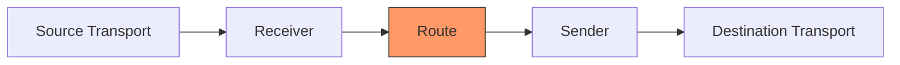

# Scenario N: <Short Title>

<!--
Template for new GoBridge scenarios. Copy this file to `NN-<slug>.md` and
fill in each section. The goal is structural consistency across all
scenarios; existing scenarios under `docs/scenarios/` (especially 01, 02,
05, 06, 17) are the reference for tone and depth.

Section rules:
  * Sections marked REQUIRED MUST appear in every scenario, in this order.
  * Sections marked OPTIONAL appear only when the scenario actually has
    something material to say about that topic. Do not include empty
    headings.
  * Use Mermaid for diagrams (flowchart / graph TD / sequenceDiagram /
    stateDiagram-v2). Keep node labels aligned with `UBIQUITOUS.md`.
  * YAML snippets must be valid against `BridgeConfig`
    (`docs/configuration-reference.md`). Go snippets must compile against
    the current public API of `bridge`, `config`, and the relevant
    adapter modules.
  * Do not restate ARCHITECTURE.md, DDD.md, or PLUGIN.md content -- link
    to the canonical section instead.

Delete this comment block before committing.
-->

One-paragraph summary of what this scenario demonstrates and which
GoBridge capabilities it exercises (transports involved, delivery mode,
processors, stores, clustering, HTTP API, etc.). [REQUIRED]

## Use Case

Concrete business or operational scenario. Who is producing the
messages, who is consuming them, what guarantees the operator needs.
Two to four sentences. [REQUIRED]

## Architecture

Single Mermaid diagram showing the message flow at the transport /
component level. Highlight the bridge boundary and any relevant
processors, stores, or HTTP surfaces. [REQUIRED]



## Configuration

The complete, runnable YAML blueprint for this scenario. Inline comments
sparingly -- prefer a focused walkthrough below. [REQUIRED]

```yaml
bridge:
  id: <scenario-bridge-id>

# sessions / receivers / senders / bindings / routes / stores / http
# as required by this scenario
```

## Config Walkthrough

Field-by-field explanation of the non-obvious parts of the YAML above:
why these specific values, what the defaults would do, and which
invariants are at play. Group by top-level key (`sessions`, `receivers`,
`routes`, …). [REQUIRED]

## Go Bootstrap

Minimal `main.go` that registers the necessary adapter factories, builds
the runtime, and runs it. Show only the wiring that is specific to this
scenario; link to other scenarios or to `bridge/doc.go` for boilerplate.
[REQUIRED]

```go
package main

import (
    "context"
    "log/slog"

    "github.com/mariotoffia/gobridge/bridge"
    cfgparser "github.com/mariotoffia/gobridge/config/parser"
    "github.com/mariotoffia/gobridge/ports"
    // adapter imports
)

func main() {
    logger := slog.Default()

    // Register each linked adapter's config decoder; ParseFile requires a
    // non-nil registry.
    reg := ports.NewRegistry()
    // _ = paho.Register(reg) // one Register per linked adapter

    cfg, _ := cfgparser.ParseFile("bridge.yaml", cfgparser.FormatAuto, reg)

    rt, _ := bridge.NewBuilder(cfg, bridge.WithLogger(logger)).
        // RegisterTransportFactory / RegisterStoreFactory / RegisterProcessor calls
        Build(context.Background())

    ctx, cancel := context.WithCancel(context.Background())
    defer cancel()

    rt.Start(ctx)
    // ... wait for shutdown signal ...
    rt.Stop(ctx)
}
```

## Component Relationship [OPTIONAL]

Mermaid `graph TD` linking sessions, receivers, senders, bindings,
routes, processors, and stores. Useful when the YAML alone does not make
the wiring obvious (multi-binding fan-out, shared sessions, processor
chains).

## Deep Dive: <Topic> [OPTIONAL]

One subsection per non-trivial concept introduced by the scenario
(processor implementation, custom resolver, state machine, recovery
flow). Each deep dive should:

  * State the invariant or behaviour being illustrated.
  * Show the smallest code excerpt that demonstrates it.
  * Link to the authoritative doc (`ARCHITECTURE.md` section, `PLUGIN.md`
    section, port interface) instead of restating it.

## Crash Recovery / Failure Modes [OPTIONAL]

When the scenario relies on durable delivery, leases, replay, or DLQ:
describe what happens on instance crash, transport outage, or
poison-message arrival. Reference the relevant `ErrorCode` constants
from `domain/shared/errors.go`.

## Variations

Two to five short YAML or Go snippets showing common deltas: TLS,
alternate transport options, multi-tenant variants, swapping store
backend, enabling the HTTP API. Keep each variation self-contained and
two-to-ten lines long where possible. [REQUIRED]

### Variation 1: <Name>

```yaml
# delta against the base configuration above
```

### Variation 2: <Name>

```yaml
# delta
```

## Related

Bullet list of links to the canonical docs and other scenarios this
scenario builds on or sets up. Avoid repeating their content; this
section is purely navigational. [REQUIRED]

```markdown
  * [ARCHITECTURE.md §<n> — <section>](../../ARCHITECTURE.md)
  * [Scenario M: <name>](./MM-<slug>.md)
  * [Configuration Reference](../configuration-reference.md)
```
