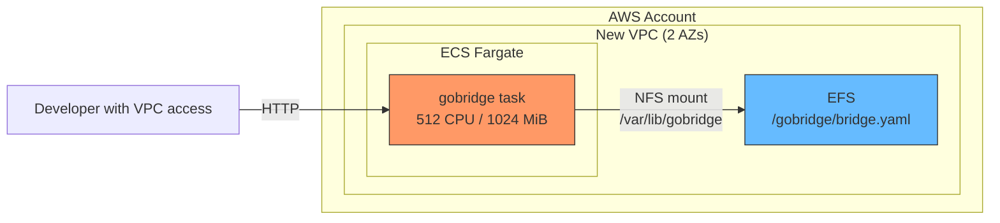

# CDK Scenario 1: Quickstart with Default VPC

## Overview

Deploy one GoBridge task on Amazon Elastic Container Service (ECS) Fargate.
The example creates a Virtual Private Cloud (VPC) and a shared config filesystem.

## Use Case

You are a developer evaluating GoBridge and want a running instance as quickly as possible. You
have an AWS account and a VPC (or let your CDK app create one), but no ECS cluster or EFS
filesystem. The `gobridgesingle.NewGoBridgeSingle` facade construct creates the ECS service, EFS
filesystem, mount, and Identity and Access Management (IAM) grants.
The bridge process creates absent config using the initial document embedded
in your image; no seeder container is needed.

## Architecture



The construct provisions:

- An encrypted EFS filesystem with an access point, shared into the task.
- A single Fargate task running the gobridge container image.
- Port mappings for the admin API (8080) and monitor API (8081).
- A control role that can initialize an absent `bridge.yaml` and update it later.

The single facade runs exactly one task (`DesiredCount` is hard-coded to 1, a
runtime invariant of the single EFS RW writer) and has **no** autoscaling.
Scale horizontally with the cluster facade instead ([Scenario 5](05-multi-bridge-cluster.md)).
You supply the VPC — the single facade does not create or look one up.

## Prerequisites

| Requirement       | Minimum version | Check command            |
|-------------------|-----------------|--------------------------|
| AWS account       | --              | `aws sts get-caller-identity` |
| AWS CLI           | 2.x             | `aws --version`          |
| AWS CDK CLI       | 2.x             | `cdk --version`          |
| Go                | 1.25+           | `go version`             |
| Docker            | 20.x+           | `docker --version`       |
| CDK bootstrapped  | --              | `cdk bootstrap aws://ACCOUNT/REGION` |

Ensure your shell has valid AWS credentials:

```bash
export CDK_DEFAULT_ACCOUNT=$(aws sts get-caller-identity --query Account --output text)
export CDK_DEFAULT_REGION=us-west-1
```

## Build and Push Container Image

Save the [bridge configuration](#bridge-configuration) as `bridge.yaml` before
building or synthesizing. The same document must describe the image's initial
config and the CDK declaration.

GoBridge ships as a Go binary. The repository root already contains a production `Dockerfile`
that builds the `gobridge-filebased` binary as a multi-stage, `CGO_ENABLED=0` (pure-Go SQLite via
`modernc.org/sqlite`), distroless/static-debian12 image running as nonroot UID 65532. Use it as-is
— do not hand-roll an Alpine image:

```bash
# From the repository root
docker build --build-arg INITIAL_CONFIG_FILE=bridge.yaml -t gobridge:local .
```

The image has no shell, `curl`, or `wget`; its `HEALTHCHECK` runs the binary directly
(`["/usr/local/bin/gobridge-filebased", "-healthcheck"]`), which probes the local monitor
`/live` endpoint.

Create an ECR repository and push the image you built:

```bash
ACCOUNT=$(aws sts get-caller-identity --query Account --output text)
REGION=us-west-1
REPO_URI="${ACCOUNT}.dkr.ecr.${REGION}.amazonaws.com/gobridge"

# Create ECR repository (skip if it already exists)
aws ecr create-repository \
  --repository-name gobridge \
  --region "${REGION}" || true

# Authenticate Docker with ECR
aws ecr get-login-password --region "${REGION}" | \
  docker login --username AWS --password-stdin "${ACCOUNT}.dkr.ecr.${REGION}.amazonaws.com"

# Tag and push the configured image
docker tag gobridge:local "${REPO_URI}:initial"
docker push "${REPO_URI}:initial"

# Use this digest in ImageFromRegistry, not the mutable tag.
aws ecr describe-images --repository-name gobridge \
  --image-ids imageTag=initial --region "${REGION}" \
  --query 'imageDetails[0].imageDigest' --output text
```

CDK cannot modify this registry image. `BridgeYamlAsset("bridge.yaml")` still
drives validation and grants; it is not a separate S3 upload or overwrite.
An image without embedded config needs an existing target or waits idle for
operator creation. Literal credentials may be embedded, but artifact readers
can recover them; Base64 does not hide them.

The alternative `ImageFromGoBuild` path automatically embeds the facade's parsed
config by fetching the published package through Go tooling, filling its fixed
embed file in a writable module copy, and running `go build`. No Git checkout
is needed; the no-config path still uses `go install package@version`.
A compatible published `lib` module and any optional family wiring remain
prerequisites; do not assume current released versions provide them. See
[CDK image sources](../../aws-deployment/cdk-constructs.md#runtime-image-source).

## Create SSM Parameter

The admin API requires an API key stored in AWS Systems Manager Parameter Store. The Fargate
task reads it at startup via the `AdminAPIKeyParam` bootstrap field.

```bash
aws ssm put-parameter \
  --name /gobridge/admin-api-key \
  --type SecureString \
  --value "my-secret-admin-key-min16chars" \
  --region us-west-1
```

The value must be at least 16 characters. Choose a strong, random string for production use.

## CDK Stack

There is no prebuilt env-driven CDK entrypoint; you write a small CDK app that instantiates the
`gobridgesingle.NewGoBridgeSingle` facade. The facade takes a `*SingleProps`. Its four required
fields are `Vpc`, `Image`, `Bootstrap`, and `BridgeConfig`; everything else falls back to
documented defaults (CPU 512, MemoryMiB 1024, MountPath `/var/lib/gobridge`).

### App

```go
package main

import (
	"github.com/aws/aws-cdk-go/awscdk/v2"
	"github.com/aws/aws-cdk-go/awscdk/v2/awsec2"
	"github.com/aws/jsii-runtime-go"

	"github.com/mariotoffia/gobridge/deployment/aws-filebased-config/cdk/constructs/gobridgesingle"
	"github.com/mariotoffia/gobridge/deployment/aws-filebased-config/cdk/gobridgecdk"
	"github.com/mariotoffia/gobridge/deployment/aws-filebased-config/infra"
)

func main() {
	app := awscdk.NewApp(nil)
	stack := awscdk.NewStack(app, jsii.String("GoBridgeQuickstart"), &awscdk.StackProps{
		Env: &awscdk.Environment{
			Account: jsii.String("<account>"),
			Region:  jsii.String("us-west-1"),
		},
	})

	// Provide a VPC (create one, or look up an existing VPC by ID/tags).
	vpc := awsec2.NewVpc(stack, jsii.String("Vpc"), &awsec2.VpcProps{MaxAzs: jsii.Number(2)})

	gobridgesingle.NewGoBridgeSingle(stack, jsii.String("Single"), &gobridgesingle.SingleProps{
		Vpc:   vpc,
		Image: gobridgecdk.ImageFromRegistry("<account>.dkr.ecr.us-west-1.amazonaws.com/gobridge@sha256:<digest>"),
		Bootstrap: infra.BootstrapConfig{
			BridgeID:         "gobridge-main",
			ConfigFilePath:   "/var/lib/gobridge/bridge.yaml",
			AdminAPIKeyParam: "/gobridge/admin-api-key",
		},
		// Declare the same logical config used to build this registry image.
		BridgeConfig: gobridgecdk.BridgeYamlAsset("bridge.yaml"),
	})

	app.Synth(nil)
}
```

### Deploy

```bash
cd <your-cdk-app>
cdk deploy --require-approval broadening
```

The facade serializes the `BootstrapConfig` (after defaults are applied) into the task container
as the `GOBRIDGE_FILEBASED_BOOTSTRAP_JSON` environment variable:

```json
{
  "bridge_id": "gobridge-main",
  "node_role": "control",
  "topology": "single",
  "config_file_path": "/var/lib/gobridge/bridge.yaml",
  "admin_addr": ":8080",
  "monitor_addr": ":8081",
  "transport_http_addr": ":8082",
  "admin_api_key_param": "/gobridge/admin-api-key"
}
```

## Initial bridge config

The control process creates the file only when it is definitively absent.
Existing operator edits win, and creation races reread the winning document.
The Fargate task reads config at
`/var/lib/gobridge/bridge.yaml` on the EFS mount. Create a minimal config that accepts HTTP POST
requests and republishes them as Server-Sent Events for testing.

### Bridge configuration

Save the following as `bridge.yaml` locally:

```yaml
bridge:
  id: gobridge-main
  log_level: info

receivers:
  - id: http-in
    transport: http
    options:
      path: /ingest

senders:
  - id: sse-out
    transport: http
    options:
      path: /events
      mode: sse

bindings:
  - id: to-sse
    sender_id: sse-out
    address: events

stores:
  # The default policy dead-letters permanent failures; the quickstart keeps
  # them in memory and acknowledges that a restart loses them. Scenario 7
  # shows a durable DLQ.
  dlq:
    type: memory
    options:
      acknowledge_volatile: true

routes:
  - id: forward
    receiver_id: http-in
    bindings: [to-sse]
```

This config creates a single route: HTTP POST requests to `/ingest` on the transport HTTP port
(8082) are republished as Server-Sent Events to clients streaming from `/events`.

### Later config changes

Changing the embedded document does not update an existing target. Use an admin
config transaction or an atomic external writer; see
[configuration updates](../../aws-deployment/configuration.md#bridge-config-on-efs).
Do not delete the target to force an update: confirmed absence stops new intake
and drains the runtime to idle. That process will not initialize it again.
A fresh process may initialize an absent target.

## Verify

After deployment, verify liveness and readiness separately. Missing config
keeps a valid bootstrap live but not ready. A read failure before activation
leaves the data plane idle with an error.

### Health check

This stack does not create a load balancer. Run probes on a host with VPC
routing to the task's private address and permit that host's narrow source
range in the task security group. The monitor uses port 8081, separate from
admin on 8080 and message transport on 8082.

```bash
TASK_IP=10.0.1.23 # Replace with your task's private address.
ADMIN_ENDPOINT="http://${TASK_IP}:8080"
MONITOR_ENDPOINT="http://${TASK_IP}:8081"
curl --fail-with-body "${MONITOR_ENDPOINT}/api/v1/monitor/live"
curl --fail-with-body "${MONITOR_ENDPOINT}/api/v1/monitor/ready"
```

Require successful readiness before sending messages. A successful liveness
probe alone does not prove that the bridge has activated a configuration.

### Admin config API

Retrieve the running configuration:

```bash
curl -s -H "X-API-Key: my-secret-admin-key-min16chars" \
  "${ADMIN_ENDPOINT}/api/v1/admin/config" | jq .
```

### Send a test message

The receiver accepts an HTTP POST at `/ingest`; the SSE sender republishes it to clients
streaming from `/events`. Stream the sender output in one terminal:

```bash
curl -N "http://${TASK_IP}:8082/events"
```

Then POST a message to the ingress in another:

```bash
curl -s -X POST \
  -H "Content-Type: application/json" \
  -d '{"sensor":"temp-1","value":23.5}' \
  "http://${TASK_IP}:8082/ingest"
```

The `/events` stream emits the posted message as a `data:` event.

## Clean Up

Remove all provisioned resources:

```bash
cd <your-cdk-app>
cdk destroy
```

**EFS retention warning** -- The EFS filesystem uses the default `RETAIN` removal policy. After
`cdk destroy`, the filesystem and its data persist in your account. Identify
the exact retained filesystem and its mount targets before deleting it.
Deletion permanently removes its configuration and any stored message state.

Also clean up the ECR repository and SSM parameter:

```bash
aws ecr delete-repository --repository-name gobridge --force --region us-west-1
aws ssm delete-parameter --name /gobridge/admin-api-key --region us-west-1
```

## What's Next

- [CDK Scenario 2: Custom VPC](02-custom-vpc.md) -- deploy into an existing VPC with private
  subnets and a NAT gateway.
- [CDK Scenario 4: Production Stack](04-production-stack.md) -- add monitoring, alerting, and
  security hardening for production workloads.
- [AWS Deployment Overview](../../aws-deployment/overview.md) -- understand the full
  architecture, deployment profiles, and operational model.
- [Scenario 1: MQTT-to-MQTT](../01-mqtt-to-mqtt.md) -- explore bridge configuration patterns
  starting with the simplest MQTT forwarding setup.
