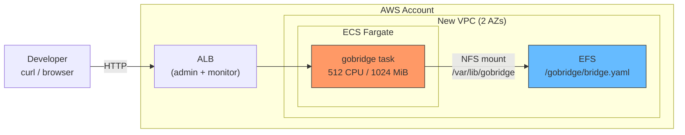

# CDK Scenario 1: Quickstart with Default VPC

Deploy GoBridge on AWS ECS Fargate in under 10 minutes with zero existing infrastructure.

## Use Case

You are a developer evaluating GoBridge and want a running instance as quickly as possible. You
have an AWS account and a VPC (or let your CDK app create one), but no ECS cluster or EFS
filesystem. The `gobridgesingle.NewGoBridgeSingle` facade construct creates the ECS service, EFS
filesystem, mount, IAM, and config seeder for you -- so you can focus on bridge configuration
instead of infrastructure plumbing.

## Architecture



The construct provisions:

- An encrypted EFS filesystem with an access point, shared into the task.
- A single Fargate task running the gobridge container image.
- Port mappings for the admin API (8080) and monitor API (8081).
- A config seeder that writes `bridge.yaml` to EFS on first deploy.

The single facade runs exactly one task (`DesiredCount` is hard-coded to 1, a
runtime invariant of the single EFS RW writer) and has **no** autoscaling.
Scale horizontally with the cluster facade instead ([Scenario 5](05-multi-bridge-cluster.md)).
You supply the VPC — the single facade does not create or look one up.

## Prerequisites

| Requirement       | Minimum version | Check command            |
|-------------------|-----------------|--------------------------|
| AWS account       | --              | `aws sts get-caller-identity` |
| AWS CLI           | 2.x             | `aws --version`          |
| AWS CDK CLI       | 2.x             | `cdk --version`          |
| Go                | 1.25+           | `go version`             |
| Docker            | 20.x+           | `docker --version`       |
| CDK bootstrapped  | --              | `cdk bootstrap aws://ACCOUNT/REGION` |

Ensure your shell has valid AWS credentials:

```bash
export CDK_DEFAULT_ACCOUNT=$(aws sts get-caller-identity --query Account --output text)
export CDK_DEFAULT_REGION=us-west-1
```

## Build and Push Container Image

GoBridge ships as a Go binary. The repository root already contains a production `Dockerfile`
that builds the `gobridge-filebased` binary as a multi-stage, `CGO_ENABLED=0` (pure-Go SQLite via
`modernc.org/sqlite`), distroless/static-debian12 image running as nonroot UID 65532. Use it as-is
— do not hand-roll an Alpine image:

```bash
# From the repository root
docker build -t gobridge:latest .
```

The image has no shell, `curl`, or `wget`; its `HEALTHCHECK` runs the binary directly
(`["/usr/local/bin/gobridge-filebased", "-healthcheck"]`), which probes the local monitor
`/live` endpoint.

Create an ECR repository, build the image, and push it:

```bash
ACCOUNT=$(aws sts get-caller-identity --query Account --output text)
REGION=us-west-1
REPO_URI="${ACCOUNT}.dkr.ecr.${REGION}.amazonaws.com/gobridge"

# Create ECR repository (skip if it already exists)
aws ecr create-repository \
  --repository-name gobridge \
  --region "${REGION}" || true

# Authenticate Docker with ECR
aws ecr get-login-password --region "${REGION}" | \
  docker login --username AWS --password-stdin "${ACCOUNT}.dkr.ecr.${REGION}.amazonaws.com"

# Build and push
docker build -t gobridge:latest -f Dockerfile .
docker tag gobridge:latest "${REPO_URI}:latest"
docker push "${REPO_URI}:latest"
```

## Create SSM Parameter

The admin API requires an API key stored in AWS Systems Manager Parameter Store. The Fargate
task reads it at startup via the `AdminAPIKeyParam` bootstrap field.

```bash
aws ssm put-parameter \
  --name /gobridge/admin-api-key \
  --type SecureString \
  --value "my-secret-admin-key-min16chars" \
  --region us-west-1
```

The value must be at least 16 characters. Choose a strong, random string for production use.

## CDK Stack

There is no prebuilt env-driven CDK entrypoint; you write a small CDK app that instantiates the
`gobridgesingle.NewGoBridgeSingle` facade. The facade takes a `*SingleProps`. Its four required
fields are `Vpc`, `Image`, `Bootstrap`, and `BridgeConfig`; everything else falls back to
documented defaults (CPU 512, MemoryMiB 1024, MountPath `/var/lib/gobridge`, SeederMode
`SeedOnce`).

### App

```go
package main

import (
	"github.com/aws/aws-cdk-go/awscdk/v2"
	"github.com/aws/aws-cdk-go/awscdk/v2/awsec2"
	"github.com/aws/aws-cdk-go/awscdk/v2/awsecs"
	"github.com/aws/jsii-runtime-go"

	"github.com/mariotoffia/gobridge/deployment/aws-filebased-config/cdk/constructs/gobridgesingle"
	"github.com/mariotoffia/gobridge/deployment/aws-filebased-config/cdk/gobridgecdk"
	"github.com/mariotoffia/gobridge/deployment/aws-filebased-config/infra"
)

func main() {
	app := awscdk.NewApp(nil)
	stack := awscdk.NewStack(app, jsii.String("GoBridgeQuickstart"), &awscdk.StackProps{
		Env: &awscdk.Environment{
			Account: jsii.String("<account>"),
			Region:  jsii.String("us-west-1"),
		},
	})

	// Provide a VPC (create one, or look up an existing VPC by ID/tags).
	vpc := awsec2.NewVpc(stack, jsii.String("Vpc"), &awsec2.VpcProps{MaxAzs: jsii.Number(2)})

	gobridgesingle.NewGoBridgeSingle(stack, jsii.String("Single"), &gobridgesingle.SingleProps{
		Vpc:   vpc,
		Image: awsecs.ContainerImage_FromRegistry(jsii.String("<account>.dkr.ecr.us-west-1.amazonaws.com/gobridge:latest"), nil),
		Bootstrap: infra.BootstrapConfig{
			BridgeID:         "gobridge-main",
			ConfigFilePath:   "/var/lib/gobridge/bridge.yaml",
			AdminAPIKeyParam: "/gobridge/admin-api-key",
		},
		// BridgeYamlAsset seeds bridge.yaml onto EFS from a local file;
		// BridgeYamlInline seeds a programmatically built *ports.BridgeConfig.
		BridgeConfig: gobridgecdk.BridgeYamlAsset("bridge.yaml"),
	})

	app.Synth(nil)
}
```

### Deploy

```bash
cd <your-cdk-app>
cdk deploy --require-approval broadening
```

The facade serializes the `BootstrapConfig` (after defaults are applied) into the task container
as the `GOBRIDGE_FILEBASED_BOOTSTRAP_JSON` environment variable:

```json
{
  "bridge_id": "gobridge-main",
  "node_role": "control",
  "topology": "single",
  "config_file_path": "/var/lib/gobridge/bridge.yaml",
  "admin_addr": ":8080",
  "monitor_addr": ":8081",
  "transport_http_addr": ":8082",
  "admin_api_key_param": "/gobridge/admin-api-key"
}
```

## Write Bridge Config to EFS

With `BridgeYamlAsset`/`BridgeYamlInline` the facade seeds `bridge.yaml` onto EFS on first deploy
(SeederMode `SeedOnce`), so you normally do not touch EFS by hand. This section shows the manual
path for updating the file out-of-band. The Fargate task reads the config at
`/var/lib/gobridge/bridge.yaml` on the EFS mount. Create a minimal config that accepts HTTP POST
requests and republishes them as Server-Sent Events for testing.

### Bridge configuration

Save the following as `bridge.yaml` locally:

```yaml
bridge:
  id: quickstart
  log_level: info

receivers:
  - id: http-in
    transport: http
    options:
      path: /ingest

senders:
  - id: sse-out
    transport: http
    options:
      path: /events
      mode: sse

bindings:
  - id: to-sse
    sender_id: sse-out

routes:
  - id: forward
    receiver_id: http-in
    bindings: [to-sse]
```

This config creates a single route: HTTP POST requests to `/ingest` on the transport HTTP port
(8082) are republished as Server-Sent Events to clients streaming from `/events`.

### Upload to EFS

EFS is only accessible from within the VPC. Use a one-shot ECS task to copy the file. The
following script creates a temporary task definition, runs it, and cleans up:

```bash
# Resolve stack outputs
CLUSTER=$(aws ecs list-clusters --query "clusterArns[?contains(@, 'GoBridge')]|[0]" --output text)
SUBNETS=$(aws ec2 describe-subnets \
  --filters "Name=tag:aws-cdk:subnet-name,Values=Private" \
  --query "Subnets[*].SubnetId" --output text | tr '\t' ',')
SG=$(aws ec2 describe-security-groups \
  --filters "Name=description,Values=gobridge EFS mount target access" \
  --query "SecurityGroups[0].GroupId" --output text)
FS_ID=$(aws efs describe-file-systems \
  --query "FileSystems[?Name!=null]|[0].FileSystemId" --output text)
AP_ID=$(aws efs describe-access-points \
  --file-system-id "${FS_ID}" --query "AccessPoints[0].AccessPointId" --output text)

# Encode config as base64
CONFIG_B64=$(base64 < bridge.yaml)

# Register a one-shot task definition
cat > /tmp/efs-writer-task.json <<EOF
{
  "family": "gobridge-efs-writer",
  "networkMode": "awsvpc",
  "requiresCompatibilities": ["FARGATE"],
  "cpu": "256",
  "memory": "512",
  "volumes": [{
    "name": "gobridge-config",
    "efsVolumeConfiguration": {
      "fileSystemId": "${FS_ID}",
      "transitEncryption": "ENABLED",
      "authorizationConfig": {
        "accessPointId": "${AP_ID}",
        "iam": "ENABLED"
      }
    }
  }],
  "containerDefinitions": [{
    "name": "writer",
    "image": "alpine:3.20",
    "essential": true,
    "command": ["sh", "-c", "echo '${CONFIG_B64}' | base64 -d > /var/lib/gobridge/bridge.yaml && echo 'Config written.' && sleep 2"],
    "mountPoints": [{
      "sourceVolume": "gobridge-config",
      "containerPath": "/var/lib/gobridge"
    }]
  }]
}
EOF

aws ecs register-task-definition --cli-input-json file:///tmp/efs-writer-task.json
aws ecs run-task \
  --cluster "${CLUSTER}" \
  --task-definition gobridge-efs-writer \
  --launch-type FARGATE \
  --network-configuration "awsvpcConfiguration={subnets=[${SUBNETS}],securityGroups=[${SG}]}" \
  --count 1
```

Wait for the task to reach STOPPED status, then the gobridge service will pick up the config
file on its next poll (default: every 1 second).

## Verify

After the stack deploys and the config file is on EFS, verify that GoBridge is running.

### Health check

The monitor server exposes an unauthenticated health endpoint. Through the ALB it
is path-routed to the monitor target group; on a direct task IP it lives on the
monitor port (`:8081`), separate from the admin port (`:8080`).

```bash
ALB_DNS=$(aws elbv2 describe-load-balancers \
  --query "LoadBalancers[?contains(DNSName, 'gobridge') || contains(LoadBalancerName, 'GoBridge')]|[0].DNSName" \
  --output text 2>/dev/null)

# If no ALB, use ECS task public IP (when running with public subnets).
# The ALB path-routes both planes on one host; a direct task IP splits them
# across the admin (:8080) and monitor (:8081) ports.
if [ -z "${ALB_DNS}" ] || [ "${ALB_DNS}" = "None" ]; then
  TASK_ARN=$(aws ecs list-tasks --cluster "${CLUSTER}" --service-name gobridge --query "taskArns[0]" --output text)
  ENI=$(aws ecs describe-tasks --cluster "${CLUSTER}" --tasks "${TASK_ARN}" \
    --query "tasks[0].attachments[0].details[?name=='networkInterfaceId'].value" --output text)
  TASK_IP=$(aws ec2 describe-network-interfaces --network-interface-ids "${ENI}" \
    --query "NetworkInterfaces[0].Association.PublicIp" --output text)
  ADMIN_ENDPOINT="http://${TASK_IP}:8080"
  MONITOR_ENDPOINT="http://${TASK_IP}:8081"
else
  ADMIN_ENDPOINT="http://${ALB_DNS}"
  MONITOR_ENDPOINT="http://${ALB_DNS}"
fi

curl -s "${MONITOR_ENDPOINT}/api/v1/monitor/health"
```

Expected response:

```json
{"status":"ok"}
```

### Admin config API

Retrieve the running configuration:

```bash
curl -s -H "X-API-Key: my-secret-admin-key-min16chars" \
  "${ADMIN_ENDPOINT}/api/v1/admin/config" | jq .
```

### Send a test message

The receiver accepts an HTTP POST at `/ingest`; the SSE sender republishes it to clients
streaming from `/events`. Stream the sender output in one terminal:

```bash
curl -N "http://${TASK_IP}:8082/events"
```

Then POST a message to the ingress in another:

```bash
curl -s -X POST \
  -H "Content-Type: application/json" \
  -d '{"sensor":"temp-1","value":23.5}' \
  "http://${TASK_IP}:8082/ingest"
```

The `/events` stream emits the posted message as a `data:` event.

## Clean Up

Remove all provisioned resources:

```bash
cd deployment/aws-filebased-config/cdk
cdk destroy --force
```

**EFS retention warning** -- The EFS filesystem uses the default `RETAIN` removal policy. After
`cdk destroy`, the filesystem and its data persist in your account. Delete it manually if you
no longer need it:

```bash
aws efs delete-file-system --file-system-id "${FS_ID}"
```

Also clean up the ECR repository and SSM parameter:

```bash
aws ecr delete-repository --repository-name gobridge --force --region us-west-1
aws ssm delete-parameter --name /gobridge/admin-api-key --region us-west-1
```

## What's Next

- [CDK Scenario 2: Custom VPC](02-custom-vpc.md) -- deploy into an existing VPC with private
  subnets and a NAT gateway.
- [CDK Scenario 4: Production Stack](04-production-stack.md) -- add monitoring, alerting, and
  security hardening for production workloads.
- [AWS Deployment Overview](../../aws-deployment/overview.md) -- understand the full
  architecture, deployment profiles, and operational model.
- [Scenario 1: MQTT-to-MQTT](../01-mqtt-to-mqtt.md) -- explore bridge configuration patterns
  starting with the simplest MQTT forwarding setup.
