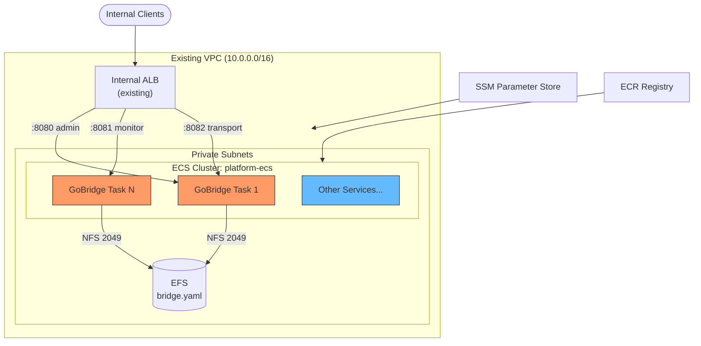

# CDK Scenario 2: Custom VPC & Existing Infrastructure

Add GoBridge to an established AWS environment with an existing VPC, ALB, and
ECS cluster. Instead of creating all resources from scratch, this scenario
imports shared infrastructure and layers the GoBridge Fargate service on top.

## Use Case

An enterprise platform team maintains a shared **landing zone** with a
centralized VPC, a shared ECS cluster, and an internal Application Load
Balancer. Individual service teams deploy into this environment without creating
their own networking primitives.

Your team needs to add GoBridge for bridging MQTT telemetry into SQS queues.
The constraints are:

- **VPC** -- An existing multi-AZ VPC with private and public subnets, managed
  by the platform team. You may not create new VPCs.
- **ECS Cluster** -- A shared Fargate cluster (`platform-ecs`) that already
  runs other services. You add your task definitions to it.
- **ALB** -- A centralized internal ALB with an HTTPS listener. You add target
  groups and listener rules for the GoBridge admin, monitor, and transport
  ports.
- **EFS** -- Either a new filesystem scoped to GoBridge, or an existing shared
  EFS already provisioned by the platform team.

## Architecture



GoBridge tasks run alongside other workloads in the shared cluster. The ALB
routes traffic to GoBridge target groups using path-based rules.

## VPC Lookup

Import the existing VPC by its ID. CDK performs a context lookup at synth time
to resolve subnets, availability zones, and route tables.

```go
import (
    "github.com/aws/aws-cdk-go/awscdk/v2/awsec2"
    "github.com/aws/jsii-runtime-go"
)

vpc := awsec2.Vpc_FromLookup(stack, jsii.String("Vpc"), &awsec2.VpcLookupOptions{
    VpcId: jsii.String("vpc-0abc1234def56789a"),
})
```

If you prefer lookup by tag instead of a hard-coded ID:

```go
vpc := awsec2.Vpc_FromLookup(stack, jsii.String("Vpc"), &awsec2.VpcLookupOptions{
    Tags: &map[string]string{
        "environment": "production",
        "team":        "platform",
    },
})
```

### Subnet Selection

When the VPC contains multiple subnet tiers, select private subnets explicitly
for Fargate task placement:

```go
privateSubnets := &awsec2.SubnetSelection{
    SubnetType: awsec2.SubnetType_PRIVATE_WITH_EGRESS,
}
```

This selection is used later when creating the Fargate service and EFS mount
targets to ensure resources stay within private subnets with NAT-based egress.

## Cluster Import

Import the shared ECS cluster by name and VPC reference. CDK needs both the
cluster name and the VPC to resolve service networking.

```go
import "github.com/aws/aws-cdk-go/awscdk/v2/awsecs"

cluster := awsecs.Cluster_FromClusterAttributes(stack, jsii.String("Cluster"),
    &awsecs.ClusterAttributes{
        ClusterName:    jsii.String("platform-ecs"),
        Vpc:            vpc,
        SecurityGroups: &[]awsec2.ISecurityGroup{},
    },
)
```

The empty `SecurityGroups` slice signals that task-level security groups are
managed per service, not at the cluster level. This is the recommended pattern
for shared clusters where each workload defines its own network rules.

## ALB Integration

Import the existing ALB by its ARN and create target groups for each GoBridge
port. The platform team provides the ALB ARN and the HTTPS listener ARN.

Import the existing HTTPS listener using `ApplicationListener_FromLookup` with
the load balancer tags and port 443. The full import is shown in the
[Complete CDK Code](#complete-cdk-code) section below.

### Admin Target Group (with Sticky Sessions)

The admin target group requires ALB sticky sessions. Configuration transactions
are held in memory on a single GoBridge instance. When a client begins a
transaction (`POST /api/v1/admin/config/transactions`), all subsequent requests
for that transaction must reach the same task. Without stickiness, the ALB could
route a commit request to a different instance that has no knowledge of the
in-progress transaction.

```go
adminTg := elbv2.NewApplicationTargetGroup(stack, jsii.String("AdminTG"),
    &elbv2.ApplicationTargetGroupProps{
        Port:       jsii.Number(8080),
        Protocol:   elbv2.ApplicationProtocol_HTTP,
        Vpc:        vpc,
        TargetType: elbv2.TargetType_IP,
        HealthCheck: &elbv2.HealthCheck{
            Path:                    jsii.String("/api/v1/monitor/health"),
            Port:                    jsii.String("8081"),
            Interval:                awscdk.Duration_Seconds(jsii.Number(30)),
            Timeout:                 awscdk.Duration_Seconds(jsii.Number(5)),
            HealthyThresholdCount:   jsii.Number(2),
            UnhealthyThresholdCount: jsii.Number(3),
        },
        StickinessCookieDuration: awscdk.Duration_Minutes(jsii.Number(5)),
    },
)
```

The 5-minute stickiness duration matches the default transaction auto-expiry
timeout. If the client does not commit within 5 minutes, the transaction
expires and the sticky cookie has no further effect. See
[HTTP API & Networking](../../aws-deployment/http-api.md) for a detailed
explanation of the transaction flow and stickiness requirements.

### Monitor and Transport Target Groups

Monitor and transport traffic is stateless, so stickiness is not needed.

```go
monitorTg := elbv2.NewApplicationTargetGroup(stack, jsii.String("MonitorTG"),
    &elbv2.ApplicationTargetGroupProps{
        Port:       jsii.Number(8081),
        Protocol:   elbv2.ApplicationProtocol_HTTP,
        Vpc:        vpc,
        TargetType: elbv2.TargetType_IP,
        HealthCheck: &elbv2.HealthCheck{
            Path:     jsii.String("/api/v1/monitor/health"),
            Port:     jsii.String("8081"),
            Interval: awscdk.Duration_Seconds(jsii.Number(30)),
            Timeout:  awscdk.Duration_Seconds(jsii.Number(5)),
        },
    },
)

transportTg := elbv2.NewApplicationTargetGroup(stack, jsii.String("TransportTG"),
    &elbv2.ApplicationTargetGroupProps{
        Port:       jsii.Number(8082),
        Protocol:   elbv2.ApplicationProtocol_HTTP,
        Vpc:        vpc,
        TargetType: elbv2.TargetType_IP,
        HealthCheck: &elbv2.HealthCheck{
            Path:     jsii.String("/api/v1/monitor/health"),
            Port:     jsii.String("8081"),
            Interval: awscdk.Duration_Seconds(jsii.Number(30)),
            Timeout:  awscdk.Duration_Seconds(jsii.Number(5)),
        },
    },
)
```

### Listener Rules

Attach path-based routing rules to the shared HTTPS listener. Each target group
gets a priority-ordered rule matching its API path prefix (`/api/v1/admin/*`,
`/api/v1/monitor/*`, `/api/v1/transport/*`). The full listener rule setup is
shown in the [Complete CDK Code](#complete-cdk-code) section.

## Security Groups

Define explicit security group rules to follow least-privilege networking
within the shared VPC.

```go
// Task security group -- applied to GoBridge Fargate tasks.
taskSG := awsec2.NewSecurityGroup(stack, jsii.String("TaskSG"),
    &awsec2.SecurityGroupProps{
        Vpc:              vpc,
        Description:      jsii.String("GoBridge Fargate tasks"),
        AllowAllOutbound: jsii.Bool(true),
    },
)

// EFS security group -- controls NFS mount target access.
efsSG := awsec2.NewSecurityGroup(stack, jsii.String("EfsSG"),
    &awsec2.SecurityGroupProps{
        Vpc:              vpc,
        Description:      jsii.String("GoBridge EFS mount targets"),
        AllowAllOutbound: jsii.Bool(false),
    },
)

// Allow Task -> EFS on NFS port 2049.
efsSG.AddIngressRule(
    taskSG,
    awsec2.Port_Tcp(jsii.Number(2049)),
    jsii.String("GoBridge tasks NFS access"),
    jsii.Bool(false),
)

// Allow ALB -> Task on admin, monitor, and transport ports.
// Import or reference the ALB security group.
albSG := awsec2.SecurityGroup_FromLookupById(stack, jsii.String("AlbSG"),
    jsii.String("sg-0alb1234security56"),
)

taskSG.AddIngressRule(
    albSG,
    awsec2.Port_TcpRange(jsii.Number(8080), jsii.Number(8082)),
    jsii.String("ALB to GoBridge ports"),
    jsii.Bool(false),
)

// Restrict outbound from tasks to VPC CIDR only (tighten if needed).
taskSG.AddEgressRule(
    awsec2.Peer_Ipv4(jsii.String("10.0.0.0/16")),
    awsec2.Port_AllTraffic(),
    jsii.String("VPC-internal traffic only"),
    jsii.Bool(false),
)
```

This produces three security group relationships:

| Source | Destination | Port(s) | Purpose |
|--------|------------|---------|---------|
| ALB SG | Task SG | 8080-8082 | Load-balanced HTTP traffic |
| Task SG | EFS SG | 2049 | NFS config mount |
| Task SG | VPC CIDR | all | Outbound to internal services |

## Complete CDK Code

Below is the full stack wiring all imported resources together with the
`NewGoBridgeService` L2 construct.

```go
package main

import (
    "github.com/aws/aws-cdk-go/awscdk/v2"
    "github.com/aws/aws-cdk-go/awscdk/v2/awsec2"
    "github.com/aws/aws-cdk-go/awscdk/v2/awsecs"
    elbv2 "github.com/aws/aws-cdk-go/awscdk/v2/awselasticloadbalancingv2"
    "github.com/aws/constructs-go/constructs/v10"
    "github.com/aws/jsii-runtime-go"

    gbcdk "github.com/mariotoffia/gobridge/deployment/aws-filebased-config/cdk/constructs"
    "github.com/mariotoffia/gobridge/deployment/aws-filebased-config/infra"
)

func NewGoBridgeStack(scope constructs.Construct, id string) awscdk.Stack {
    stack := awscdk.NewStack(scope, &id, &awscdk.StackProps{
        Env: &awscdk.Environment{
            Account: jsii.String("123456789012"),
            Region:  jsii.String("eu-west-1"),
        },
    })

    // --- Import existing infrastructure ---

    vpc := awsec2.Vpc_FromLookup(stack, jsii.String("Vpc"), &awsec2.VpcLookupOptions{
        VpcId: jsii.String("vpc-0abc1234def56789a"),
    })

    cluster := awsecs.Cluster_FromClusterAttributes(stack, jsii.String("Cluster"),
        &awsecs.ClusterAttributes{
            ClusterName:    jsii.String("platform-ecs"),
            Vpc:            vpc,
            SecurityGroups: &[]awsec2.ISecurityGroup{},
        },
    )

    // --- EFS for bridge config ---

    efsConfig := gbcdk.NewGoBridgeEfsConfig(stack, jsii.String("Efs"),
        &gbcdk.GoBridgeEfsConfigProps{
            Vpc: vpc,
        },
    )

    // --- GoBridge Fargate service ---

    svc := gbcdk.NewGoBridgeService(stack, jsii.String("Bridge"),
        &gbcdk.GoBridgeServiceProps{
            Vpc:         vpc,
            Cluster:     cluster,
            EfsConfig:   efsConfig,
            ServiceName: "gobridge-mqtt",
            Image: awsecs.ContainerImage_FromRegistry(
                jsii.String("123456789012.dkr.ecr.eu-west-1.amazonaws.com/gobridge:latest"),
                nil,
            ),
            Bootstrap: infra.BootstrapConfig{
                BridgeID:         "gobridge-mqtt",
                ConfigFilePath:   "/mnt/gobridge/bridge.yaml",
                AdminAPIKeyParam: "/gobridge/prod/admin-api-key",
                Topology:         infra.TopologyFilesystemReplicated,
            },
            Exposure: infra.Exposure{
                Admin:         true,
                Monitor:       true,
                TransportHTTP: true,
            },
            CPU:                jsii.Number(1024),
            MemoryMiB:          jsii.Number(2048),
            DesiredCount:       jsii.Number(2),
            ScalingMaxCapacity: jsii.Number(6),
            CpuTargetPercent:   jsii.Number(65),
            SsmParameterArns: []*string{
                jsii.String("arn:aws:ssm:eu-west-1:123456789012:parameter/gobridge/prod/*"),
            },
        },
    )

    // --- ALB integration (import existing) ---

    listener := elbv2.ApplicationListener_FromLookup(stack, jsii.String("Listener"),
        &elbv2.ApplicationListenerLookupOptions{
            LoadBalancerTags: &map[string]string{"purpose": "internal-services"},
            ListenerPort:     jsii.Number(443),
        },
    )

    adminTg := elbv2.NewApplicationTargetGroup(stack, jsii.String("AdminTG"),
        &elbv2.ApplicationTargetGroupProps{
            Port:       jsii.Number(8080),
            Protocol:   elbv2.ApplicationProtocol_HTTP,
            Vpc:        vpc,
            TargetType: elbv2.TargetType_IP,
            HealthCheck: &elbv2.HealthCheck{
                Path: jsii.String("/api/v1/monitor/health"),
                Port: jsii.String("8081"),
            },
            StickinessCookieDuration: awscdk.Duration_Minutes(jsii.Number(5)),
        },
    )

    monitorTg := elbv2.NewApplicationTargetGroup(stack, jsii.String("MonitorTG"),
        &elbv2.ApplicationTargetGroupProps{
            Port:       jsii.Number(8081),
            Protocol:   elbv2.ApplicationProtocol_HTTP,
            Vpc:        vpc,
            TargetType: elbv2.TargetType_IP,
            HealthCheck: &elbv2.HealthCheck{
                Path: jsii.String("/api/v1/monitor/health"),
                Port: jsii.String("8081"),
            },
        },
    )

    // Register the Fargate service with target groups.
    svc.Service().AttachToApplicationTargetGroup(adminTg)
    svc.Service().AttachToApplicationTargetGroup(monitorTg)

    listener.AddTargetGroups(jsii.String("AdminRule"),
        &elbv2.AddApplicationTargetGroupsProps{
            TargetGroups: &[]elbv2.IApplicationTargetGroup{adminTg},
            Conditions: &[]elbv2.ListenerCondition{
                elbv2.ListenerCondition_PathPatterns(
                    &[]*string{jsii.String("/api/v1/admin/*")},
                ),
            },
            Priority: jsii.Number(10),
        },
    )

    listener.AddTargetGroups(jsii.String("MonitorRule"),
        &elbv2.AddApplicationTargetGroupsProps{
            TargetGroups: &[]elbv2.IApplicationTargetGroup{monitorTg},
            Conditions: &[]elbv2.ListenerCondition{
                elbv2.ListenerCondition_PathPatterns(
                    &[]*string{jsii.String("/api/v1/monitor/*")},
                ),
            },
            Priority: jsii.Number(20),
        },
    )

    return stack
}

func main() {
    app := awscdk.NewApp(nil)
    NewGoBridgeStack(app, "GoBridgeCustomVpc")
    app.Synth(nil)
}
```

The `NewGoBridgeService` construct handles task definitions, EFS volume mounts,
IAM policies, security groups for EFS access, container port mappings, and
auto-scaling. You only need to wire the ALB target groups and listener rules
externally because the ALB is shared infrastructure outside the construct's
scope.

## EFS in a Shared VPC

### Reusing an Existing EFS Filesystem

When the platform team provides a shared EFS filesystem, pass it directly to
`GoBridgeEfsConfigProps.FileSystem`. The construct creates only the access point
and skips filesystem creation.

```go
existingFs := awsefs.FileSystem_FromFileSystemAttributes(stack, jsii.String("SharedEfs"),
    &awsefs.FileSystemAttributes{
        FileSystemId: jsii.String("fs-0abc1234def56789a"),
        SecurityGroup: awsec2.SecurityGroup_FromSecurityGroupId(
            stack, jsii.String("SharedEfsSG"),
            jsii.String("sg-0efs1234security56"),
            &awsec2.SecurityGroupImportOptions{},
        ),
    },
)

efsConfig := gbcdk.NewGoBridgeEfsConfig(stack, jsii.String("Efs"),
    &gbcdk.GoBridgeEfsConfigProps{
        Vpc:        vpc,
        FileSystem: existingFs,
    },
)
```

### Cross-AZ Mount Targets

EFS mount targets must exist in every availability zone where Fargate tasks may
run. When reusing a shared EFS, verify that mount targets cover all private
subnets. If the platform team created the EFS with mount targets in only two
AZs but the VPC has three, tasks scheduled in the third AZ will fail to mount
the volume.

Check existing mount targets:

```bash
aws efs describe-mount-targets --file-system-id fs-0abc1234def56789a \
    --query 'MountTargets[].{AZ:AvailabilityZoneName,SubnetId:SubnetId}'
```

If coverage is incomplete, the platform team must add mount targets to the
missing subnets before deploying the GoBridge stack.

## Variations

### Shared EFS Across Services

Multiple services can share one EFS filesystem with separate access points.
Each access point scopes its root directory, providing logical isolation.

```go
// GoBridge access point at /gobridge
gobridgeEfs := gbcdk.NewGoBridgeEfsConfig(stack, jsii.String("GoBridgeEfs"),
    &gbcdk.GoBridgeEfsConfigProps{
        Vpc:             vpc,
        FileSystem:      sharedFs,
        AccessPointPath: jsii.String("/gobridge"),
    },
)

// Another service at /other-service (outside gobridge constructs)
otherAP := awsefs.NewAccessPoint(stack, jsii.String("OtherAP"),
    &awsefs.AccessPointProps{
        FileSystem: sharedFs,
        Path:       jsii.String("/other-service"),
        PosixUser:  &awsefs.PosixUser{Uid: jsii.String("1001"), Gid: jsii.String("1001")},
        CreateAcl:  &awsefs.Acl{OwnerUid: jsii.String("1001"), OwnerGid: jsii.String("1001"), Permissions: jsii.String("755")},
    },
)
```

### Cross-Account VPC Peering

When GoBridge runs in a workload account but must reach an MQTT broker or SQS
queue in a central account, set up VPC peering or Transit Gateway. The CDK stack
itself does not change -- VPC peering is configured at the networking layer. The
key adjustment is ensuring that the GoBridge task security group allows egress
to the peered CIDR range:

```go
taskSG.AddEgressRule(
    awsec2.Peer_Ipv4(jsii.String("10.1.0.0/16")),  // peered VPC CIDR
    awsec2.Port_Tcp(jsii.Number(1883)),              // MQTT broker port
    jsii.String("MQTT broker in central account"),
    jsii.Bool(false),
)
```

### PrivateLink for SQS

To reach SQS without traversing the public internet, add a VPC endpoint. This
is typically managed by the platform team, but you can verify it exists:

```bash
aws ec2 describe-vpc-endpoints \
    --filters Name=vpc-id,Values=vpc-0abc1234def56789a \
              Name=service-name,Values=com.amazonaws.eu-west-1.sqs
```

If it does not exist, add it in CDK:

```go
vpc.AddInterfaceEndpoint(jsii.String("SqsEndpoint"),
    &awsec2.InterfaceVpcEndpointOptions{
        Service: awsec2.InterfaceVpcEndpointAwsService_SQS(),
    },
)
```

GoBridge SQS transport configuration requires no changes -- the AWS SDK
automatically routes API calls through the VPC endpoint when one is present.

## What's Next

- [Scenario 4: Production Stack](04-production-stack.md) -- adds CloudWatch
  alarms, WAF, multi-region failover, and operational runbooks.
- [HTTP API & Networking](../../aws-deployment/http-api.md) -- deep dive into
  config transactions, sticky sessions, SSE egress, and API Gateway integration.
- [Configuration on AWS](../../aws-deployment/configuration.md) -- how the
  bootstrap config, EFS-mounted bridge.yaml, and SSM parameters work together.
- [AWS Overview](../../aws-deployment/overview.md) -- full architecture diagram
  and design decisions for the AWS deployment profile.
