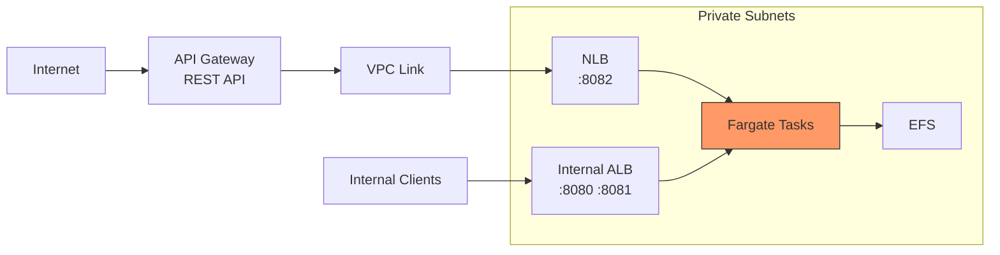

# CDK Scenario 3: HTTP Transport Behind API Gateway

Expose the GoBridge HTTP transport to external clients with managed
authentication, rate limiting, and a custom domain.

## Use Case

A SaaS platform operates GoBridge as its message routing backbone. External
partners need to push events into the bridge via HTTP POST and pull event
streams via SSE. The platform requirements are:

- **API keys** -- Each partner receives a unique key tied to a usage plan.
- **Throttling** -- Protect the backend from traffic spikes with burst and
  sustained rate limits.
- **Quotas** -- Limit each partner to a daily request budget.
- **TLS termination** -- HTTPS with a branded custom domain (`api.example.com`).
- **WAF integration** -- Block bad actors and enforce request-body size limits.

Internal admin and monitor traffic continues to flow through the internal ALB
as configured in [Scenario 1](01-quickstart-default-vpc.md). Only the transport
port (8082) is exposed externally through API Gateway.

## Architecture



Key observations:

- **Two load balancers** -- The internal ALB handles admin (8080) and monitor
  (8081) traffic. The NLB serves only the transport port (8082) for API Gateway.
- **VPC Link** -- Connects the public API Gateway to the private NLB without
  exposing the NLB to the internet.
- **EFS** -- Bridge configuration is mounted at `/mnt/gobridge` as in
  previous scenarios.

## Why API Gateway

API Gateway provides capabilities that neither an ALB nor a bare NLB can offer
for external-facing APIs: managed TLS, usage plans with API keys, WAF
integration, request validation against OpenAPI schemas, custom domains, and
built-in CloudWatch metrics per method.

### REST API vs HTTP API

| Dimension | REST API | HTTP API |
|-----------|----------|----------|
| Cost | $3.50 per million requests | $1.00 per million requests |
| Usage plans / API keys | Yes | No |
| WAF integration | Yes | No |
| Request validation | Yes | No |
| Lambda authorizers | Yes | Yes |
| Latency overhead | ~10-20 ms | ~5-10 ms |

**This scenario uses REST API** because it requires usage plans and API keys.
If you only need JWT-based authorization and want lower cost, see the
[HTTP API variation](#http-api-cheaper-no-usage-plans) at the end.

## VPC Link & NLB

API Gateway VPC Links require a **Network Load Balancer (NLB)**, not an ALB.
This is an AWS platform constraint -- VPC Link integration targets must be NLB
listeners.

| Concern | NLB | ALB |
|---------|-----|-----|
| VPC Link support | Yes | No |
| Protocol | TCP/TLS (Layer 4) | HTTP/HTTPS (Layer 7) |
| Latency | Lower (no HTTP parsing) | Higher |
| Path-based routing | No (API Gateway handles it) | Yes |

Since API Gateway performs path-based routing, request validation, and TLS
termination before forwarding, the NLB only needs to pass TCP traffic through
to the Fargate tasks on port 8082. The NLB health check targets port 8081
(the monitor server) because GoBridge registers health endpoints only on that
port -- the same pattern used for ALB target groups in
[Scenario 2](02-custom-vpc.md).

## REST API Definition

Define the API using an OpenAPI snippet with API Gateway extensions. The
`x-amazon-apigateway-integration` blocks tell the gateway how to forward
requests through the VPC Link.

```yaml
openapi: "3.0.1"
info:
  title: GoBridge Transport API
  version: "1.0"
paths:
  /transport/http/receivers/{id}/messages:
    post:
      summary: Ingest a message
      parameters:
        - name: id
          in: path
          required: true
          schema:
            type: string
      security:
        - apiKey: []
      x-amazon-apigateway-integration:
        type: http_proxy
        httpMethod: POST
        uri: "http://{nlb_dns}:8082/transport/http/receivers/{id}/messages"
        connectionType: VPC_LINK
        connectionId: "{vpc_link_id}"
        requestParameters:
          integration.request.path.id: method.request.path.id
  /transport/http/senders/{id}/events:
    get:
      summary: SSE event stream
      parameters:
        - name: id
          in: path
          required: true
          schema:
            type: string
      security:
        - apiKey: []
      x-amazon-apigateway-integration:
        type: http_proxy
        httpMethod: GET
        uri: "http://{nlb_dns}:8082/transport/http/senders/{id}/events"
        connectionType: VPC_LINK
        connectionId: "{vpc_link_id}"
        requestParameters:
          integration.request.path.id: method.request.path.id
components:
  securitySchemes:
    apiKey:
      type: apiKey
      in: header
      name: x-api-key
```

Replace `{nlb_dns}` and `{vpc_link_id}` with actual values. In CDK these are
resolved automatically when constructing integration objects (see
[Complete CDK Code](#complete-cdk-code) below).

## Usage Plans & API Keys

Usage plans associate API keys with throttle and quota limits. Each external
partner receives their own API key linked to a plan. The
[Complete CDK Code](#complete-cdk-code) below creates a `partner-standard` plan
with:

- **50 requests/second** sustained rate limit
- **100 requests/second** burst limit
- **10,000 requests/day** quota

To add more partners, create additional API keys and associate them with the
same plan -- or create a `partner-premium` plan with higher limits for
different tiers.

## Custom Domain

Serve the API under a branded domain like `api.example.com` using Route 53
and ACM. The CDK code below:

1. Looks up the `example.com` hosted zone in Route 53.
2. Creates an ACM certificate with automatic DNS validation.
3. Creates a regional API Gateway custom domain.
4. Maps the `/v1` base path to the deployed stage.
5. Creates a Route 53 alias record pointing to the API Gateway domain.

After deployment, partners reach the API at:

```
https://api.example.com/v1/transport/http/receivers/{id}/messages
```

## Complete CDK Code

Below is the full stack combining `GoBridgeService`, NLB, VPC Link, REST API,
usage plans, and custom domain.

```go
package main

import (
    "github.com/aws/aws-cdk-go/awscdk/v2"
    apigw "github.com/aws/aws-cdk-go/awscdk/v2/awsapigateway"
    "github.com/aws/aws-cdk-go/awscdk/v2/awscertificatemanager"
    "github.com/aws/aws-cdk-go/awscdk/v2/awsec2"
    "github.com/aws/aws-cdk-go/awscdk/v2/awsecs"
    elbv2 "github.com/aws/aws-cdk-go/awscdk/v2/awselasticloadbalancingv2"
    "github.com/aws/aws-cdk-go/awscdk/v2/awsroute53"
    "github.com/aws/aws-cdk-go/awscdk/v2/awsroute53targets"
    "github.com/aws/constructs-go/constructs/v10"
    "github.com/aws/jsii-runtime-go"

    gbcdk "github.com/mariotoffia/gobridge/deployment/aws-filebased-config/cdk/constructs"
    "github.com/mariotoffia/gobridge/deployment/aws-filebased-config/infra"
)

func NewAPIGatewayStack(scope constructs.Construct, id string) awscdk.Stack {
    stack := awscdk.NewStack(scope, &id, &awscdk.StackProps{
        Env: &awscdk.Environment{
            Account: jsii.String("123456789012"),
            Region:  jsii.String("us-west-1"),
        },
    })

    // --- VPC ---

    vpc := awsec2.Vpc_FromLookup(stack, jsii.String("Vpc"), &awsec2.VpcLookupOptions{
        VpcId: jsii.String("vpc-0abc1234def56789a"),
    })

    // --- GoBridge Fargate service ---

    efsConfig := gbcdk.NewGoBridgeEfsConfig(stack, jsii.String("Efs"),
        &gbcdk.GoBridgeEfsConfigProps{Vpc: vpc},
    )

    svc := gbcdk.NewGoBridgeService(stack, jsii.String("Bridge"),
        &gbcdk.GoBridgeServiceProps{
            Vpc:         vpc,
            EfsConfig:   efsConfig,
            ServiceName: "gobridge-api",
            Image: awsecs.ContainerImage_FromRegistry(
                jsii.String("123456789012.dkr.ecr.us-west-1.amazonaws.com/gobridge:latest"),
                nil,
            ),
            Bootstrap: infra.BootstrapConfig{
                BridgeID:         "gobridge-api",
                ConfigFilePath:   "/mnt/gobridge/bridge.yaml",
                AdminAPIKeyParam: "/gobridge/admin-api-key",
            },
            Exposure: infra.Exposure{
                Admin:         true,
                Monitor:       true,
                TransportHTTP: true,
            },
            CPU:          jsii.Number(1024),
            MemoryMiB:    jsii.Number(2048),
            DesiredCount: jsii.Number(2),
        },
    )

    // --- NLB for API Gateway VPC Link ---

    nlb := elbv2.NewNetworkLoadBalancer(stack, jsii.String("TransportNLB"),
        &elbv2.NetworkLoadBalancerProps{
            Vpc:              vpc,
            InternetFacing:   jsii.Bool(false),
            CrossZoneEnabled: jsii.Bool(true),
        },
    )

    nlbListener := nlb.AddListener(jsii.String("Transport"),
        &elbv2.BaseNetworkListenerProps{
            Port:     jsii.Number(8082),
            Protocol: elbv2.Protocol_TCP,
        },
    )

    nlbListener.AddTargets(jsii.String("TransportTG"),
        &elbv2.AddNetworkTargetsProps{
            Port:    jsii.Number(8082),
            Targets: &[]elbv2.INetworkLoadBalancerTarget{svc.Service()},
            HealthCheck: &elbv2.HealthCheck{
                Port:     jsii.String("8081"),
                Protocol: elbv2.Protocol_HTTP,
                Path:     jsii.String("/api/v1/monitor/health"),
            },
        },
    )

    // VPC Link connecting API Gateway to the private NLB.
    vpcLink := apigw.NewVpcLink(stack, jsii.String("VpcLink"),
        &apigw.VpcLinkProps{
            Targets: &[]elbv2.INetworkLoadBalancer{nlb},
        },
    )

    // --- REST API ---

    api := apigw.NewRestApi(stack, jsii.String("TransportAPI"),
        &apigw.RestApiProps{
            RestApiName: jsii.String("gobridge-transport"),
            Deploy:      jsii.Bool(true),
            DeployOptions: &apigw.StageOptions{
                StageName: jsii.String("v1"),
            },
        },
    )

    // Proxy integration: forward all paths through VPC Link to NLB.
    integration := apigw.NewIntegration(&apigw.IntegrationProps{
        Type:                  apigw.IntegrationType_HTTP_PROXY,
        IntegrationHttpMethod: jsii.String("ANY"),
        Options: &apigw.IntegrationOptions{
            ConnectionType: apigw.ConnectionType_VPC_LINK,
            VpcLink:        vpcLink,
        },
        Uri: jsii.String(
            "http://" + *nlb.LoadBalancerDnsName() + ":8082/{proxy}",
        ),
    })

    // {proxy+} catches all sub-paths under the root.
    proxy := api.Root().AddProxy(&apigw.ProxyResourceOptions{
        DefaultIntegration: integration,
        AnyMethod:          jsii.Bool(true),
        DefaultMethodOptions: &apigw.MethodOptions{
            ApiKeyRequired: jsii.Bool(true),
        },
    })
    _ = proxy

    // --- Usage plan and API key ---

    plan := api.AddUsagePlan(jsii.String("PartnerPlan"),
        &apigw.UsagePlanProps{
            Name: jsii.String("partner-standard"),
            Throttle: &apigw.ThrottleSettings{
                RateLimit:  jsii.Number(50),
                BurstLimit: jsii.Number(100),
            },
            Quota: &apigw.QuotaSettings{
                Limit:  jsii.Number(10000),
                Period: apigw.Period_DAY,
            },
        },
    )
    plan.AddApiStage(&apigw.UsagePlanPerApiStage{
        Api:   api,
        Stage: api.DeploymentStage(),
    })

    partnerKey := api.AddApiKey(jsii.String("PartnerAlphaKey"),
        &apigw.ApiKeyOptions{ApiKeyName: jsii.String("partner-alpha")},
    )
    plan.AddApiKey(partnerKey)

    // --- Custom domain ---

    zone := awsroute53.HostedZone_FromLookup(stack, jsii.String("Zone"),
        &awsroute53.HostedZoneProviderProps{
            DomainName: jsii.String("example.com"),
        },
    )

    cert := awscertificatemanager.NewCertificate(stack, jsii.String("APICert"),
        &awscertificatemanager.CertificateProps{
            DomainName: jsii.String("api.example.com"),
            Validation: awscertificatemanager.CertificateValidation_FromDns(zone),
        },
    )

    domain := apigw.NewDomainName(stack, jsii.String("APIDomain"),
        &apigw.DomainNameProps{
            DomainName:   jsii.String("api.example.com"),
            Certificate:  cert,
            EndpointType: apigw.EndpointType_REGIONAL,
        },
    )
    domain.AddBasePathMapping(api, &apigw.BasePathMappingOptions{
        BasePath: jsii.String("v1"),
    })

    awsroute53.NewARecord(stack, jsii.String("APIAlias"),
        &awsroute53.ARecordProps{
            Zone:       zone,
            RecordName: jsii.String("api"),
            Target: awsroute53.RecordTarget_FromAlias(
                awsroute53targets.NewApiGatewayDomain(domain),
            ),
        },
    )

    return stack
}

func main() {
    app := awscdk.NewApp(nil)
    NewAPIGatewayStack(app, "GoBridgeAPIGateway")
    app.Synth(nil)
}
```

### Code Walkthrough

| Section | Lines | Purpose |
|---------|-------|---------|
| VPC lookup | `Vpc_FromLookup` | Import existing VPC by ID |
| GoBridge service | `NewGoBridgeService` | Fargate task with EFS, SSM, auto-scaling |
| NLB + target group | `NewNetworkLoadBalancer` | Internal NLB on port 8082, health check on 8081 |
| VPC Link | `NewVpcLink` | Connects API Gateway to the private NLB |
| REST API + proxy | `NewRestApi`, `AddProxy` | Catches all paths, requires API key |
| Usage plan | `AddUsagePlan` | 50 req/s rate, 100 burst, 10K/day quota |
| Custom domain | `NewDomainName`, `NewARecord` | ACM cert + Route 53 alias for `api.example.com` |

The `Exposure` struct enables port 8082 on the container. Without
`TransportHTTP: true`, the container would not map that port and the NLB
health checks would fail.

## Testing

### Send a Test Message

Retrieve the API key from the API Gateway console or via the CLI, then call
the ingest endpoint:

```bash
API_KEY="your-api-key-from-console"
API_URL="https://api.example.com/v1"

curl -s -X POST \
    -H "Content-Type: application/json" \
    -H "x-api-key: ${API_KEY}" \
    -d '{"subject":"sensor/temp","payload":"eyJ0ZW1wIjoyMy41fQ=="}' \
    "${API_URL}/transport/http/receivers/http-in/messages"
```

Expected response:

```json
{"status":"accepted"}
```

### Verify Without API Key

A request without the `x-api-key` header should be rejected at the gateway:

```bash
curl -s -X POST \
    -H "Content-Type: application/json" \
    -d '{"subject":"test","payload":"dGVzdA=="}' \
    "${API_URL}/transport/http/receivers/http-in/messages"
```

Expected response:

```json
{"message":"Forbidden"}
```

### CloudWatch Metrics to Watch

| Metric | Namespace | What to look for |
|--------|-----------|-----------------|
| `Count` | `AWS/ApiGateway` | Total API calls per stage |
| `4XXError` | `AWS/ApiGateway` | Client errors (missing keys, throttled) |
| `5XXError` | `AWS/ApiGateway` | Server errors (backend failures) |
| `Latency` | `AWS/ApiGateway` | End-to-end latency including integration |
| `IntegrationLatency` | `AWS/ApiGateway` | Time in VPC Link + NLB + Fargate |

Set CloudWatch alarms on `5XXError` and `Latency` (p99) to catch backend
issues early. See [Monitoring Guide](../../aws-deployment/monitoring.md) for
alarm CDK examples.

## Variations

### HTTP API (Cheaper, No Usage Plans)

If you do not need usage plans, API keys, or WAF, an HTTP API cuts costs by
roughly 70%. Replace the REST API with an `HttpApi` and use
`HttpUrlIntegration` pointing to the same NLB. Use a Lambda authorizer for
JWT/OAuth validation since HTTP API does not support built-in API keys.

### Lambda Authorizer for JWT/OAuth

Add a `TokenAuthorizer` backed by a Lambda function that validates JWT tokens
from an identity provider (Cognito, Auth0, Okta). This supports standard
OAuth 2.0 flows and can be combined with API keys for layered authentication.
See [HTTP API Guide](../../aws-deployment/http-api.md) for detailed auth
patterns.

### Mutual TLS for High Security

For machine-to-machine communication where both sides present certificates,
enable mTLS on the API Gateway custom domain via the `MtlsAuthentication`
property. Store the trust store PEM file in an S3 bucket referenced by the
domain configuration. Only clients presenting a certificate signed by the
trusted CA are allowed through.

### WebSocket API for SSE Egress

The SSE egress endpoint (`GET /transport/http/senders/{id}/events`) works
through REST API VPC Link integration, but for bidirectional streaming
consider using the API Gateway WebSocket API. This requires a custom adapter
on the GoBridge side and suits use cases where clients need to send control
messages upstream while receiving events.

## What's Next

- [CDK Scenario 4: Production Stack](04-production-stack.md) -- add CloudWatch
  alarms, WAF web ACLs, and operational hardening for production workloads.
- [HTTP API Guide](../../aws-deployment/http-api.md) -- deep dive into
  authentication patterns, CORS, SSE egress, and config transactions.
- [TCO Guide](../../aws-deployment/tco.md) -- compare API Gateway vs ALB costs
  for your expected traffic volume.
- [Scenario 1: Quickstart](01-quickstart-default-vpc.md) -- prerequisite
  covering basic Fargate deployment and EFS setup.
