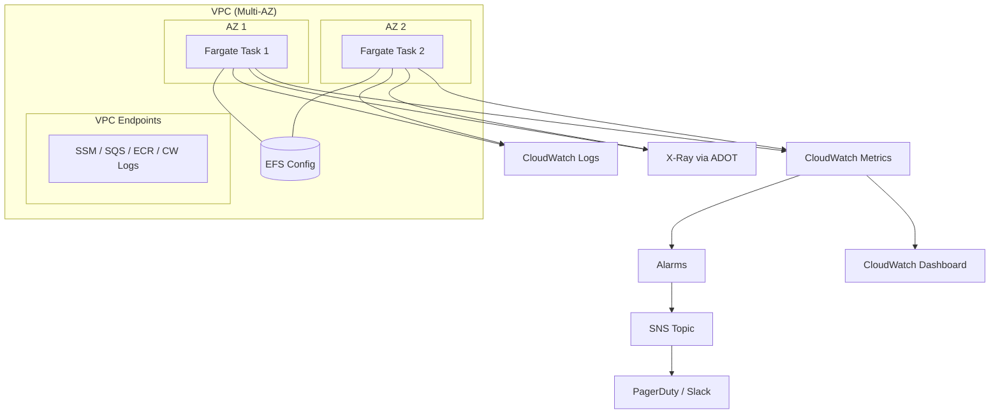
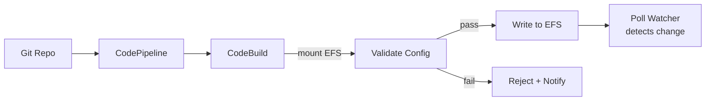

# CDK Scenario 4: Production-Ready Stack with Monitoring

Go live with alarms, dashboards, auto-scaling, hardened security, and full
operational visibility. This scenario builds on
[Scenario 1](01-quickstart-default-vpc.md) and adds everything you need for a
production deployment that your on-call team can operate with confidence.

---

## Use Case

You are deploying GoBridge to handle **business-critical messages** with defined
SLA requirements. Operators need dashboards, alarms, and structured logs to
diagnose issues without SSH access. Specific requirements:

- **99.9% uptime** -- multi-AZ Fargate tasks with worker autoscaling (cluster facade).
- **Alerting within 5 minutes** -- CloudWatch alarms fire to SNS, routing to
  PagerDuty or Slack.
- **Audit trail** -- structured JSON logs retained for 30 days.
- **Zero NAT Gateway cost** -- VPC endpoints for all AWS API calls.
- **Least-privilege IAM** -- task role scoped to exact SSM paths and EFS mounts.
- **Distributed tracing** -- 10% sampling via X-Ray for latency analysis.

---

## Architecture



---

## Security Hardening

### Non-Root Container and Read-Only Filesystem

The GoBridge Dockerfile runs as UID 1000. Enforce a read-only root filesystem
in the container definition by setting `ReadonlyRootFilesystem: jsii.Bool(true)`.
The EFS volume is also mounted read-only (see the complete stack below).

### SSM SecureString with Customer-Managed KMS

```go
kmsKey := awskms.NewKey(stack, jsii.String("Key"), &awskms.KeyProps{
    Description: jsii.String("GoBridge SSM encryption"), EnableKeyRotation: jsii.Bool(true),
})
```

> **Note:** CDK does not natively create `SecureString` parameters. Use
> `aws ssm put-parameter --type SecureString --key-id <key-id>` in your
> bootstrap script, then reference the ARN in the task role policy.

### Scoped IAM Task Role

Grant only what the task needs -- SSM reads by path prefix and KMS decrypt:

```go
taskRole.AddToPrincipalPolicy(awsiam.NewPolicyStatement(&awsiam.PolicyStatementProps{
    Actions:   &[]*string{jsii.String("ssm:GetParameter")},
    Resources: &[]*string{jsii.String("arn:aws:ssm:*:*:parameter/gobridge/prod/*")},
}))
taskRole.AddToPrincipalPolicy(awsiam.NewPolicyStatement(&awsiam.PolicyStatementProps{
    Actions:   &[]*string{jsii.String("kms:Decrypt")},
    Resources: &[]*string{kmsKey.KeyArn()},
}))
```

The GoBridge facade (single or cluster) automatically grants
`elasticfilesystem:ClientMount` and `elasticfilesystem:ClientRead` on the EFS
filesystem to its task roles.

### VPC Endpoints

Eliminate NAT Gateway costs by creating interface endpoints for every AWS
service GoBridge calls:

```go
for _, ep := range []struct {
    ID  string
    Svc awsec2.InterfaceVpcEndpointAwsService
}{
    {"SSM", awsec2.InterfaceVpcEndpointAwsService_SSM()},
    {"SQS", awsec2.InterfaceVpcEndpointAwsService_SQS()},
    {"ECR", awsec2.InterfaceVpcEndpointAwsService_ECR()},
    {"ECRDocker", awsec2.InterfaceVpcEndpointAwsService_ECR_DOCKER()},
    {"CWLogs", awsec2.InterfaceVpcEndpointAwsService_CLOUDWATCH_LOGS()},
    {"CWMetrics", awsec2.InterfaceVpcEndpointAwsService_CLOUDWATCH()},
} {
    vpc.AddInterfaceEndpoint(jsii.String(ep.ID),
        &awsec2.InterfaceVpcEndpointOptions{
            Service: ep.Svc, PrivateDnsEnabled: jsii.Bool(true),
        },
    )
}
vpc.AddGatewayEndpoint(jsii.String("S3"), &awsec2.GatewayVpcEndpointOptions{
    Service: awsec2.GatewayVpcEndpointAwsService_S3(),
})
```

Each interface endpoint costs ~$7.30/month. The S3 gateway endpoint is free.

---

## Auto-Scaling

Autoscaling is a property of the **cluster** facade and applies to the worker
service only (the control task is always a single EFS RW writer, `DesiredCount`
hard-coded to 1). It is opt-in: pass `AutoScaling` on `ClusterProps`. When
`TargetCPU` is 0 it defaults to 70. The single facade has no autoscaling.

```go
workers := float64(2)

bridge := gobridgecluster.NewGoBridgeCluster(stack, jsii.String("Bridge"),
    &gobridgecluster.ClusterProps{
        WorkerDesiredCount: &workers,
        AutoScaling: &gobridgecluster.AutoScalingProps{
            Min:       2,
            Max:       8,
            TargetCPU: 70,
        },
        // ... other props
    },
)
```

| Behavior | Detail |
|----------|--------|
| Scaling target | Worker service average ECS CPU utilization at `TargetCPU` (70%) |
| Min workers | `AutoScaling.Min` (2) -- floor on the worker `DesiredCount` |
| Max workers | `AutoScaling.Max` (8) -- ceiling on the worker `DesiredCount` |
| Control task | Always 1 (not autoscaled) |

---

## CloudWatch Alarms

Five alarms cover the failure modes that matter most. Each fires to an SNS
topic that routes to your incident management system.

| Alarm | Metric | Threshold | Period | Severity |
|-------|--------|-----------|--------|----------|
| Unhealthy Tasks | ECS `CPUUtilization` SampleCount | < 2 | 1 min | Critical |
| High Error Rate | `RouteErrors / MessagesReceived * 100` | > 5% | 5 min | High |
| CPU Utilization | ECS `CPUUtilization` | > 80% | 5 min | Warn |
| DLQ Depth | `DLQEntries` Sum | > 0 | 5 min | High |
| Config Reload Failure | `ConfigReloadFailures` (log metric) | > 0 | 5 min | High |

Example -- DLQ alarm with SNS action:

```go
dlqAlarm := awscloudwatch.NewAlarm(stack, jsii.String("DLQDepth"),
    &awscloudwatch.AlarmProps{
        AlarmName: jsii.String("GoBridge-DLQ-NonEmpty"),
        Metric: awscloudwatch.NewMetric(&awscloudwatch.MetricProps{
            Namespace: jsii.String("GoBridge/Runtime"), MetricName: jsii.String("DLQEntries"),
            Statistic: jsii.String("Sum"), Period: awscdk.Duration_Minutes(jsii.Number(5)),
        }),
        Threshold: jsii.Number(0), EvaluationPeriods: jsii.Number(1),
        ComparisonOperator: awscloudwatch.ComparisonOperator_GREATER_THAN_THRESHOLD,
        TreatMissingData:   awscloudwatch.TreatMissingData_NOT_BREACHING,
    },
)
dlqAlarm.AddAlarmAction(alarmAction)
dlqAlarm.AddOkAction(alarmAction)
```

See the [Monitoring Guide](../../aws-deployment/monitoring.md) for the complete
alarm definitions including the math-expression error-rate alarm.

---

## CloudWatch Dashboard

The dashboard gives the on-call team a single pane of glass.

| Row | Widget | Metric | Type |
|-----|--------|--------|------|
| 1 | Throughput | `MessagesReceived`, `MessagesSent` | Line graph |
| 1 | Delivery Latency | `DeliveryE2ELatency` p50, p99 | Line graph |
| 2 | Error Rate | `RouteErrors / MessagesReceived * 100` | Single value |
| 2 | ECS CPU & Memory | `CPUUtilization`, `MemoryUtilization` | Stacked area |

See the complete stack below for the full CDK dashboard code. The
[Monitoring Guide](../../aws-deployment/monitoring.md) covers the dashboard
JSON layout in detail.

---

## SSM Secrets Management

Organize parameters under a path prefix for clean IAM scoping:

```text
/gobridge/prod/admin-api-key        (SecureString)
/gobridge/prod/monitor-api-key      (SecureString)
/gobridge/prod/mqtt-password         (SecureString)
```

Reference them in the bootstrap config:

```go
Bootstrap: infra.BootstrapConfig{
    BridgeID: "gobridge-prod", ConfigFilePath: "/var/lib/gobridge/bridge.yaml",
    PollInterval: "5s", AdminAPIKeyParam: "/gobridge/prod/admin-api-key",
    MonitorAPIKeyParam: "/gobridge/prod/monitor-api-key",
},
```

**Rotation strategy:** SSM values are resolved at startup and on config reload.
To rotate: (1) update the parameter value, (2) trigger reload by modifying the
EFS config file or calling `POST /admin/reload`. For full automation, use
Secrets Manager with a Lambda rotation function.

---

## Structured Logging

Set 30-day retention via `LogRetention: awslogs.RetentionDays_ONE_MONTH` in the
service props. The construct creates a CloudWatch log group automatically.

### Log-Based Metric Filter

```go
awslogs.NewMetricFilter(stack, jsii.String("ConfigReloadFilter"),
    &awslogs.MetricFilterProps{
        LogGroup: logGroup,
        FilterPattern: awslogs.FilterPattern_StringValue(
            jsii.String("$.msg"), jsii.String("="), jsii.String("config reload rejected"),
        ),
        MetricNamespace: jsii.String("GoBridge/Logs"),
        MetricName: jsii.String("ConfigReloadFailures"),
        MetricValue: jsii.String("1"), DefaultValue: jsii.Number(0),
    },
)
```

### CloudWatch Logs Insights Queries

```text
-- Find errors in the last hour
fields @timestamp, msg, route_id, error | filter level = "ERROR"
| sort @timestamp desc | limit 50

-- Trace a request by correlation ID
fields @timestamp, msg, route_id | filter correlation_id = "abc-123"
| sort @timestamp asc

-- Count errors by route (24h)
fields route_id | filter level = "ERROR"
| stats count(*) as error_count by route_id | sort error_count desc
```

---

## X-Ray Tracing

### ADOT Sidecar

Add the ADOT collector as a sidecar. It receives OTLP spans on port 4318 and
forwards them to X-Ray:

```go
adot := taskDef.AddContainer(jsii.String("adot-collector"),
    &awsecs.ContainerDefinitionOptions{
        Image: awsecs.ContainerImage_FromRegistry(
            jsii.String("public.ecr.aws/aws-observability/aws-otel-collector:latest"), nil,
        ),
        Command: &[]*string{jsii.String("--config=/etc/ecs/otel-config.yaml")},
    },
)
adot.AddPortMappings(&awsecs.PortMapping{
    ContainerPort: jsii.Number(4318), Protocol: awsecs.Protocol_TCP,
})
```

### Bridge Tracing Configuration

Observability is **not** configured through the bridge YAML — there is no
`tracing:` config key. The tracer is wired in Go code (see
[Scenario 18](../18-observability.md)) and honors the standard OpenTelemetry
environment variables, which is the idiomatic way to configure it per
environment in ECS:

```go
tracer, err := oteltracing.New(ctx,
    oteltracing.WithServiceName("gobridge"),
    oteltracing.WithEnvironment("production"),
    oteltracing.WithSamplerRatio(0.1),
    // Endpoint omitted: honors OTEL_EXPORTER_OTLP_ENDPOINT from the task env.
)
```

Set the exporter target and resource attributes as task-definition
environment variables pointing at the ADOT sidecar:

```go
container.AddEnvironment(jsii.String("OTEL_EXPORTER_OTLP_ENDPOINT"),
    jsii.String("http://localhost:4318"))
container.AddEnvironment(jsii.String("OTEL_SERVICE_NAME"),
    jsii.String("gobridge"))
container.AddEnvironment(jsii.String("OTEL_RESOURCE_ATTRIBUTES"),
    jsii.String("deployment.environment=production"))
```

Precedence is: explicit `WithXxx` option > `OTEL_*` env var > built-in default.

### Sampling Rule and IAM

```go
awsxray.NewCfnSamplingRule(stack, jsii.String("Sampling"),
    &awsxray.CfnSamplingRuleProps{
        SamplingRule: &awsxray.CfnSamplingRule_SamplingRuleProperty{
            RuleName: jsii.String("GoBridge-Prod"), Priority: jsii.Number(100),
            FixedRate: jsii.Number(0.1), ReservoirSize: jsii.Number(5),
            ServiceName: jsii.String("gobridge"), ServiceType: jsii.String("*"),
            Host: jsii.String("*"), HttpMethod: jsii.String("*"),
            UrlPath: jsii.String("*"), ResourceArn: jsii.String("*"),
        },
    },
)
// Grant xray:PutTraceSegments, PutTelemetryRecords, GetSamplingRules, GetSamplingTargets
```

---

## Config Management Pipeline

Treat the bridge config file as a versioned artifact deployed through CI/CD:



1. **Source** -- CodePipeline triggers on push to the `config/` directory.
2. **Build** -- CodeBuild (VPC-connected) mounts EFS, runs
   `gobridge validate --config bridge.yaml`.
3. **Deploy** -- Writes validated config to EFS on success.
4. **Reload** -- Poll watcher detects change within 5s, applies new config.
5. **Rollback** -- On failure the pipeline halts; previous config stays.

This avoids task restarts for most changes. Transport endpoint or SSM parameter
name changes may still require a restart.

---

## Complete CDK Code

The following stack assembles all production components:

```go
package main

import (
    "github.com/aws/aws-cdk-go/awscdk/v2"
    "github.com/aws/aws-cdk-go/awscdk/v2/awscloudwatch"
    "github.com/aws/aws-cdk-go/awscdk/v2/awscloudwatchactions"
    "github.com/aws/aws-cdk-go/awscdk/v2/awsec2"
    "github.com/aws/aws-cdk-go/awscdk/v2/awsecs"
    "github.com/aws/aws-cdk-go/awscdk/v2/awsiam"
    "github.com/aws/aws-cdk-go/awscdk/v2/awskms"
    "github.com/aws/aws-cdk-go/awscdk/v2/awslogs"
    "github.com/aws/aws-cdk-go/awscdk/v2/awssns"
    "github.com/aws/aws-cdk-go/awscdk/v2/awsxray"
    "github.com/aws/constructs-go/constructs/v10"
    "github.com/aws/jsii-runtime-go"

    gobridgecluster "github.com/mariotoffia/gobridge/deployment/aws-filebased-config/cdk/constructs/gobridgecluster"
    "github.com/mariotoffia/gobridge/deployment/aws-filebased-config/cdk/gobridgecdk"
    "github.com/mariotoffia/gobridge/deployment/aws-filebased-config/infra"
)

func NewProductionStack(scope constructs.Construct, id string, props *awscdk.StackProps) awscdk.Stack {
    stack := awscdk.NewStack(scope, &id, props)

    // --- Networking (no NAT -- VPC endpoints instead) ---
    vpc := awsec2.NewVpc(stack, jsii.String("Vpc"), &awsec2.VpcProps{
        MaxAzs: jsii.Number(2), NatGateways: jsii.Number(0),
    })
    for _, ep := range []struct {
        ID  string
        Svc awsec2.InterfaceVpcEndpointAwsService
    }{
        {"SSM", awsec2.InterfaceVpcEndpointAwsService_SSM()},
        {"SQS", awsec2.InterfaceVpcEndpointAwsService_SQS()},
        {"ECR", awsec2.InterfaceVpcEndpointAwsService_ECR()},
        {"ECRDocker", awsec2.InterfaceVpcEndpointAwsService_ECR_DOCKER()},
        {"CWLogs", awsec2.InterfaceVpcEndpointAwsService_CLOUDWATCH_LOGS()},
        {"CWMetrics", awsec2.InterfaceVpcEndpointAwsService_CLOUDWATCH()},
    } {
        vpc.AddInterfaceEndpoint(jsii.String(ep.ID),
            &awsec2.InterfaceVpcEndpointOptions{
                Service: ep.Svc, PrivateDnsEnabled: jsii.Bool(true),
            },
        )
    }
    vpc.AddGatewayEndpoint(jsii.String("S3"), &awsec2.GatewayVpcEndpointOptions{
        Service: awsec2.GatewayVpcEndpointAwsService_S3(),
    })

    // --- KMS for SSM SecureString ---
    kmsKey := awskms.NewKey(stack, jsii.String("Key"), &awskms.KeyProps{
        Description:       jsii.String("GoBridge SSM encryption"),
        EnableKeyRotation: jsii.Bool(true),
    })

    // --- GoBridge cluster (control + autoscaled workers, EFS, log retention built in) ---
    workers := float64(2)
    src := gobridgecdk.BridgeYamlAsset("bridge.yaml")
    bridge := gobridgecluster.NewGoBridgeCluster(stack, jsii.String("Bridge"),
        &gobridgecluster.ClusterProps{
            Vpc: vpc,
            Image: awsecs.ContainerImage_FromRegistry(
                jsii.String("123456789012.dkr.ecr.eu-west-1.amazonaws.com/gobridge:latest"), nil,
            ),
            Bootstrap: infra.BootstrapConfig{
                BridgeID: "gobridge-prod", ConfigFilePath: "/var/lib/gobridge/bridge.yaml",
                PollInterval: "5s", AdminAPIKeyParam: "/gobridge/prod/admin-api-key",
                MonitorAPIKeyParam: "/gobridge/prod/monitor-api-key",
                Topology: infra.TopologyFilesystemReplicated,
                // Publish runtime metrics to CloudWatch (grants PutMetricData
                // scoped to the namespace).
                MetricsExporter: "cloudwatch",
            },
            BridgeConfig:       src,
            CPU:                jsii.Number(512),
            MemoryMiB:          jsii.Number(1024),
            WorkerDesiredCount: &workers,
            AutoScaling: &gobridgecluster.AutoScalingProps{
                Min: 2, Max: 8, TargetCPU: 70,
            },
            LogRetention: awslogs.RetentionDays_ONE_MONTH,
        },
    )

    // --- IAM: KMS decrypt + X-Ray on BOTH task roles ---
    for _, td := range []awsecs.FargateTaskDefinition{
        bridge.ControlTaskDefinition(), bridge.WorkerTaskDefinition(),
    } {
        td.TaskRole().AddToPrincipalPolicy(
            awsiam.NewPolicyStatement(&awsiam.PolicyStatementProps{
                Actions:   &[]*string{jsii.String("kms:Decrypt")},
                Resources: &[]*string{kmsKey.KeyArn()},
            }),
        )
        td.TaskRole().AddToPrincipalPolicy(
            awsiam.NewPolicyStatement(&awsiam.PolicyStatementProps{
                Actions: &[]*string{
                    jsii.String("xray:PutTraceSegments"), jsii.String("xray:PutTelemetryRecords"),
                    jsii.String("xray:GetSamplingRules"), jsii.String("xray:GetSamplingTargets"),
                },
                Resources: &[]*string{jsii.String("*")},
            }),
        )
    }

    // --- X-Ray sampling rule ---
    awsxray.NewCfnSamplingRule(stack, jsii.String("Sampling"),
        &awsxray.CfnSamplingRuleProps{
            SamplingRule: &awsxray.CfnSamplingRule_SamplingRuleProperty{
                RuleName: jsii.String("GoBridge-Prod"), Priority: jsii.Number(100),
                FixedRate: jsii.Number(0.1), ReservoirSize: jsii.Number(5),
                ServiceName: jsii.String("gobridge"), ServiceType: jsii.String("*"),
                Host: jsii.String("*"), HttpMethod: jsii.String("*"),
                UrlPath: jsii.String("*"), ResourceArn: jsii.String("*"),
            },
        },
    )

    // --- Alarms + SNS ---
    topic := awssns.NewTopic(stack, jsii.String("Alerts"),
        &awssns.TopicProps{TopicName: jsii.String("gobridge-prod-alerts")},
    )
    action := awscloudwatchactions.NewSnsAction(topic)

    alarms := []awscloudwatch.Alarm{
        awscloudwatch.NewAlarm(stack, jsii.String("DLQ"), &awscloudwatch.AlarmProps{
            AlarmName: jsii.String("GoBridge-DLQ"),
            Metric: awscloudwatch.NewMetric(&awscloudwatch.MetricProps{
                Namespace: jsii.String("GoBridge/Runtime"), MetricName: jsii.String("DLQEntries"),
                Statistic: jsii.String("Sum"), Period: awscdk.Duration_Minutes(jsii.Number(5)),
            }),
            Threshold: jsii.Number(0), EvaluationPeriods: jsii.Number(1),
            ComparisonOperator: awscloudwatch.ComparisonOperator_GREATER_THAN_THRESHOLD,
            TreatMissingData:   awscloudwatch.TreatMissingData_NOT_BREACHING,
        }),
        awscloudwatch.NewAlarm(stack, jsii.String("CPU"), &awscloudwatch.AlarmProps{
            AlarmName: jsii.String("GoBridge-HighCPU"),
            Metric: bridge.WorkerService().(awsecs.BaseService).MetricCpuUtilization(nil),
            Threshold: jsii.Number(80), EvaluationPeriods: jsii.Number(3),
            ComparisonOperator: awscloudwatch.ComparisonOperator_GREATER_THAN_THRESHOLD,
        }),
    }
    for _, a := range alarms {
        a.AddAlarmAction(action)
        a.AddOkAction(action)
    }

    // --- Dashboard ---
    dash := awscloudwatch.NewDashboard(stack, jsii.String("Dash"),
        &awscloudwatch.DashboardProps{DashboardName: jsii.String("GoBridge-Production")},
    )
    dash.AddWidgets(
        awscloudwatch.NewGraphWidget(&awscloudwatch.GraphWidgetProps{
            Title: jsii.String("Throughput"), Width: jsii.Number(12),
            Left: &[]awscloudwatch.IMetric{
                awscloudwatch.NewMetric(&awscloudwatch.MetricProps{
                    Namespace: jsii.String("GoBridge/Runtime"),
                    MetricName: jsii.String("MessagesReceived"), Statistic: jsii.String("Sum"),
                }),
                awscloudwatch.NewMetric(&awscloudwatch.MetricProps{
                    Namespace: jsii.String("GoBridge/Runtime"),
                    MetricName: jsii.String("MessagesSent"), Statistic: jsii.String("Sum"),
                }),
            },
        }),
        awscloudwatch.NewGraphWidget(&awscloudwatch.GraphWidgetProps{
            Title: jsii.String("ECS Health"), Width: jsii.Number(12),
            Left: &[]awscloudwatch.IMetric{
                bridge.WorkerService().(awsecs.BaseService).MetricCpuUtilization(nil),
                bridge.WorkerService().(awsecs.BaseService).MetricMemoryUtilization(nil),
            },
        }),
    )

    return stack
}

func main() {
    app := awscdk.NewApp(nil)
    NewProductionStack(app, "GoBridgeProd", &awscdk.StackProps{
        Env: &awscdk.Environment{
            Account: jsii.String("123456789012"), Region: jsii.String("eu-west-1"),
        },
    })
    app.Synth(nil)
}
```

Deploy:

```bash
cdk deploy GoBridgeProd
```

---

## Cost Notes

This stack matches the **Production Single** profile from the
[TCO Guide](../../aws-deployment/tco.md): approximately **$80--120/month**.

| Component | Monthly Estimate |
|-----------|-----------------|
| Fargate (2 tasks, 0.5 vCPU / 1 GB) | ~$36 |
| VPC endpoints (6 interface) | ~$44 |
| EFS | < $1 |
| CloudWatch Logs + Metrics | ~$8 |
| SSM parameter reads | < $1 |

VPC endpoints are the second-largest cost. If your account has shared endpoints
(common in enterprise landing zones), networking cost drops significantly. A
single NAT Gateway (~$32/month) is an alternative when you need internet egress.

---

## What's Next

- [Scenario 5: Multi-Bridge Cluster](05-multi-bridge-cluster.md) -- scale out
  with lease-based coordination across multiple bridge instances.
- [Monitoring Guide](../../aws-deployment/monitoring.md) -- deep dive into
  metrics, log queries, and Grafana integration.
- [TCO Guide](../../aws-deployment/tco.md) -- full cost analysis across all
  deployment profiles.
