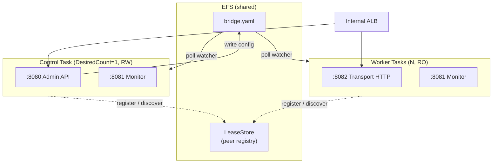
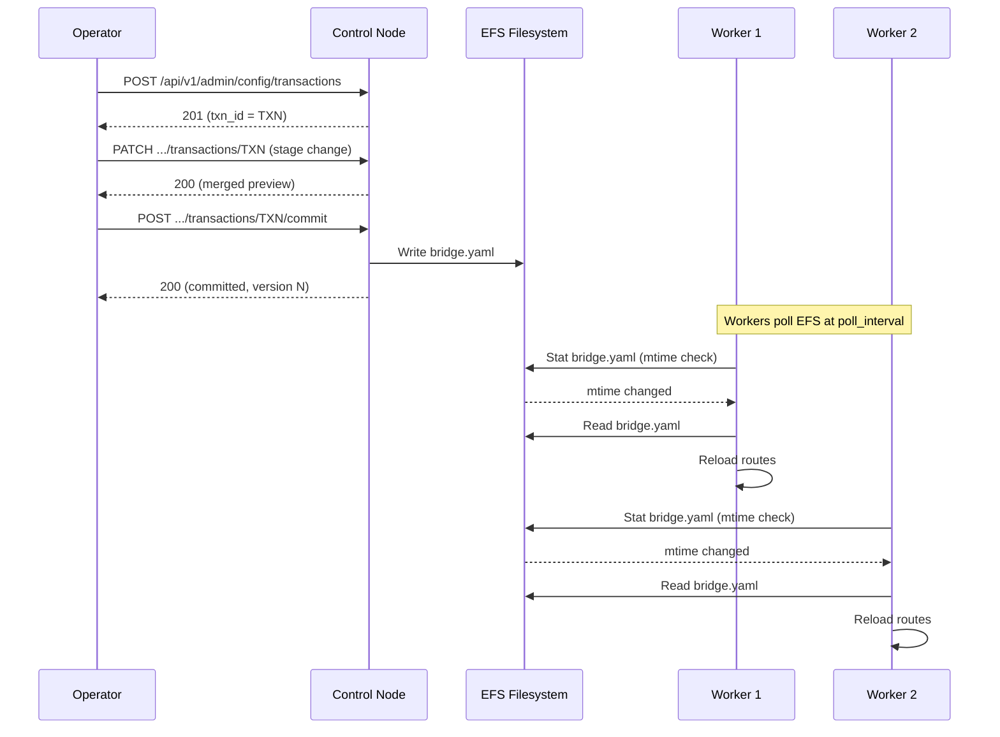

# CDK Scenario 5: Multi-Bridge Cluster with Shared EFS

Deploy a control + worker GoBridge topology with one `GoBridgeCluster` facade — both services
and a shared EFS filesystem are derived from a single `bridge.yaml`.

## Use Case

You need high-throughput message routing across a fleet of GoBridge tasks. The cluster facade
materializes one control task (RW EFS, admin API) plus N worker tasks (RO EFS, transport
ingress) sharing the same `bridge.yaml`. When the control task writes a configuration update,
workers detect the change via a poll watcher and converge automatically.

This topology suits workloads where:

- Message volume exceeds what a single task can handle.
- Configuration changes must propagate to all workers without restarts.
- A single control plane simplifies administrative access (no sticky sessions needed).
- The `shared_outbox` delivery mode is **not** required — all routes use `direct_hold`.

## Architecture



`GoBridgeCluster` builds both ECS services, the EFS filesystem and its two access points
(RW for control, RO for worker), the seeder init container, and the IAM split. Peer discovery
uses an EFS-mediated **LeaseStore** populated by `EcsEndpointResolver` at task start — there
is **no Cloud Map**, no private DNS namespace, no static peer-endpoints block in yaml.

## Topology: filesystem_replicated

The `filesystem_replicated` topology allows multiple instances to share a config file on a
network filesystem. It supports clustered deployment mode but does **not** support features
that require distributed coordination -- those need the HA/DynamoDB config profile instead.

| Feature | Supported? | Notes |
|---------|-----------|-------|
| `deployment_mode: clustered` | Yes | Required for the cluster facade |
| Peer discovery | Yes | EFS LeaseStore + `EcsEndpointResolver`; no Cloud Map needed |
| `shared_outbox` routes | No | Use the HA/DynamoDB profile instead |
| Route session leases | No | Use the HA/DynamoDB profile instead |
| Independent route definitions | Yes | Each worker runs all routes defined in `bridge.yaml` |
| Poll-based config detection | Yes | Workers detect file changes via configurable interval |

Tier-B Phase 1 validation runs once at synth (against the resolved `BridgeConfig`) and
fast-fails on `delivery_mode: shared_outbox` or `route.session` lease coordination, directing
you to the DynamoDB profile. Phase 2 cross-reference errors (unknown queues, missing SSM
parameters, etc.) are aggregated through `Annotations.addError`.

## Control vs Worker

Both task definitions receive the same `infra.BootstrapConfig`; the cluster facade **forces**
the `NodeRole` per service (`control` for the singleton, `worker` for the scaled service). You
do not set `NodeRole` yourself.

| Setting | Control | Worker | Source |
|---------|---------|--------|--------|
| `node_role` | `control` | `worker` | Forced by `GoBridgeCluster` |
| EFS mount | RW (`ClientMount`+`ClientWrite`) | RO (`ClientMount` only) | Cluster IAM split |
| Exposed ports | Admin + Monitor + Transport | Admin + Monitor + Transport | Every node starts all three servers |
| `DesiredCount` | `1` (hard-coded) | `WorkerDesiredCount` (default 2) | Runtime invariant |
| Deploy strategy | `MinHealthy=0`, `MaxHealthy=100` | CDK rolling defaults | Single LeaseStore writer |

The control `DesiredCount=1` and `MinHealthy=0`/`MaxHealthy=100` deploy strategy guarantee a
single LeaseStore writer at all times — including across rolling deploys. Both invariants are
hard-coded and **not** exposed as caller-tunable props.

## Singleton Constraint

> ⚠️ **One `GoBridgeSingle` OR one `GoBridgeCluster` per `awscdk.Stack` tree.**
> A synth-time scope scan in `cdk/constructs/internal/singleton` panics if two facades share
> the enclosing stack. Bridge identity is taken from the deployed yaml's `bridge.name` field
> (validated against `^[a-zA-Z0-9][a-zA-Z0-9_-]{0,62}$` by Phase-1 tier-B validation). There
> is intentionally **no `Name` prop** on `ClusterProps` — the yaml is the single source of
> truth.

## Deploying the Cluster

Wire the VPC, ECS cluster, image, registries and bootstrap, then hand them to
`gobridgecluster.NewGoBridgeCluster`. The facade owns the EFS filesystem, both task
definitions, IAM, the seeder, log groups and the worker autoscaling target.

```go
package main

import (
    "github.com/aws/aws-cdk-go/awscdk/v2"
    "github.com/aws/aws-cdk-go/awscdk/v2/awsec2"
    "github.com/aws/aws-cdk-go/awscdk/v2/awsecs"
    "github.com/aws/aws-cdk-go/awscdk/v2/awssqs"
    "github.com/aws/aws-cdk-go/awscdk/v2/awsssm"
    "github.com/aws/jsii-runtime-go"

    "github.com/mariotoffia/gobridge/deployment/aws-filebased-config/cdk/constructs/gobridgecluster"
    "github.com/mariotoffia/gobridge/deployment/aws-filebased-config/cdk/gobridgecdk"
    "github.com/mariotoffia/gobridge/deployment/aws-filebased-config/cdk/registry"
    "github.com/mariotoffia/gobridge/deployment/aws-filebased-config/infra"
)

func main() {
    app := awscdk.NewApp(nil)
    stack := awscdk.NewStack(app, jsii.String("BridgeCluster"), nil)

    vpc := awsec2.Vpc_FromLookup(stack, jsii.String("Vpc"),
        &awsec2.VpcLookupOptions{IsDefault: jsii.Bool(true)})
    cluster := awsecs.NewCluster(stack, jsii.String("Cluster"), &awsecs.ClusterProps{
        Vpc: vpc, ContainerInsights: jsii.Bool(true),
    })

    // Logical name → CDK handle for queues referenced by yaml.
    queues := registry.NewQueueRegistry()
    queues.AddQueue("orders-in",
        awssqs.Queue_FromQueueArn(stack, jsii.String("OrdersIn"),
            jsii.String("arn:aws:sqs:eu-west-1:123456789012:orders-in")))
    queues.AddQueue("orders-out",
        awssqs.Queue_FromQueueArn(stack, jsii.String("OrdersOut"),
            jsii.String("arn:aws:sqs:eu-west-1:123456789012:orders-out")))

    // Logical name → CDK handle for SSM SecureString parameters referenced by yaml.
    params := registry.NewSsmParamRegistry()
    params.AddParameter("/gobridge/cluster/admin-api-key",
        awsssm.StringParameter_FromSecureStringParameterAttributes(stack,
            jsii.String("AdminKey"), &awsssm.SecureStringParameterAttributes{
                ParameterName: jsii.String("/gobridge/cluster/admin-api-key"),
            }))

    bridge := gobridgecluster.NewGoBridgeCluster(stack, jsii.String("Bridge"),
        &gobridgecluster.ClusterProps{
            Vpc:     vpc,
            Cluster: cluster,
            Image: awsecs.ContainerImage_FromRegistry(
                // Pin a released tag (or, better, a digest) — see the
                // "Pin images by digest" note in the deployment guide.
                jsii.String("ghcr.io/mariotoffia/gobridge:v0.2.0"), nil),
            Bootstrap: infra.BootstrapConfig{
                // NodeRole is forced per service by the facade — do not set it.
                AdminAddr:        ":8080",
                MonitorAddr:      ":8081",
                TransportHTTPAddr: ":8082",
                PollInterval:     "2s",
            },
            BridgeConfig:       gobridgecdk.BridgeYamlAsset("config/bridge.yaml"),
            QueueRegistry:      queues,
            SsmParamRegistry:   params,
            WorkerDesiredCount: jsii.Number(3),
            AutoScaling: &gobridgecluster.AutoScalingProps{
                Min: 2, Max: 10, TargetCPU: 60,
            },
        },
    )
    _ = bridge

    app.Synth(nil)
}
```

### Authoring the bridge config

Two paths produce the sealed `BridgeConfig` source consumed by the cluster facade:

```go
// (a) On-disk yaml — uploaded as a CDK asset, parsed once for tier-B validation.
src := gobridgecdk.BridgeYamlAsset("config/bridge.yaml")

// (b) Typed builder — assembled in Go, marshalled at synth time.
cfg, err := bridgecfg.New("gobridge-cluster").
    WithSQSReceiver("orders-in", queues.Ref("orders-in")).
    WithSQSSender("ingest", queues.Ref("orders-out")).
    WithRoute("orders-in", "ingest"). // synthesises binding "ingest-binding"
    Build()
if err != nil { panic(err) }
src := gobridgecdk.BridgeYamlInline(cfg)
```

Both factories return the same opaque token. The yaml file (Snippet a) for a cluster:

```yaml
bridge:
  id: gobridge-cluster
  deployment_mode: clustered

receivers:
  - id: orders-in
    transport: sqs
    options:
      queue_name: orders-in        # resolved via QueueRegistry

senders:
  - id: ingest
    transport: sqs
    options:
      queue_name: orders-out       # resolved via QueueRegistry

bindings:
  - id: to-ingest
    sender_id: ingest

routes:
  - id: forward
    receiver_id: orders-in
    delivery_mode: direct_hold
    bindings: [to-ingest]
```

The typed builder above produces the equivalent shape — `WithRoute` synthesises a
binding named `<sender>-binding` (here `ingest-binding`) when the id resolves to a
sender rather than a previously-declared binding.

There is no static peer-endpoints block — peer endpoints are discovered from the
LeaseStore at runtime.

### Optional: ALB attachment + alarms

```go
attachment := gobridgealbattachment.NewGoBridgeALBAttachment(stack, jsii.String("Attach"),
    &gobridgealbattachment.AttachmentProps{
        Cluster:      bridge,
        Listener:     listener, // consumer-managed elbv2.IApplicationListener
        Vpc:          vpc,
        BridgeConfig: gobridgecdk.BridgeYamlAsset("config/bridge.yaml"),
        BasePriority: 200,      // reserves listener rule range [200, 299]
    })

gobridgealarms.NewGoBridgeAlarms(stack, jsii.String("Alarms"),
    &gobridgealarms.AlarmsProps{
        Cluster:    bridge,
        Efs:        bridge.EfsConfig(),
        Attachment: attachment,
        AlarmTopic: snsTopic,
    })
```

### EFS access split

The cluster facade owns the EFS filesystem (or the `*GoBridgeEfsConfig` you pass via
`EfsConfig`), both access points, the per-service mount specifications and the IAM grants on
each task role. You do **not** create access points, mount points or IAM policy statements
yourself — RW (control) vs RO (worker) is enforced at IAM and at the ECS volume level by the
construct.

## Config Propagation

When the control node writes a configuration update via the admin API, the change propagates to
workers through EFS file polling.



### Poll interval trade-offs

| Interval | Propagation delay | EFS reads/min (3 workers) | Best for |
|----------|-------------------|---------------------------|----------|
| `1s` | Up to 1 second | 180 | Rapid iteration, dev/staging |
| `2s` | Up to 2 seconds | 90 | Production default |
| `5s` | Up to 5 seconds | 36 | Cost-sensitive, infrequent changes |
| `30s` | Up to 30 seconds | 6 | Stable configs, large fleets |

Each poll performs an `os.Stat` call to check the file modification time. A full read occurs
only when the mtime changes. For most workloads, a 2-second interval balances responsiveness
and EFS operation costs.

## Scaling Workers

Worker autoscaling is target-tracking on ECS service CPU. Opt in by passing
`AutoScaling: &gobridgecluster.AutoScalingProps{...}`; off when nil. The control task is
**not** scalable (`DesiredCount=1` is a runtime invariant).

```go
gobridgecluster.NewGoBridgeCluster(stack, jsii.String("Bridge"),
    &gobridgecluster.ClusterProps{
        // ... required props ...
        WorkerDesiredCount: jsii.Number(3),
        AutoScaling: &gobridgecluster.AutoScalingProps{
            Min: 2, Max: 10, TargetCPU: 60,
        },
    },
)
```

For message-rate-based scaling (e.g. SQS queue depth), attach a custom step-scaling policy to
the worker `awsecs.IService` returned by `bridge.WorkerService()` after construction.

## Variations

### Mixed transports

Workers can consume from MQTT and SQS simultaneously. Each worker runs all routes in
`bridge.yaml`:

```yaml
bridge:
  id: gobridge-cluster
  deployment_mode: clustered

sessions:
  - id: mqtt-conn
    transport: mqtt
    options:
      session:
        broker_url: tls://mqtt.example.com:8883
        client_id: gobridge-worker   # give each worker task a unique id

receivers:
  - id: mqtt-in
    session_id: mqtt-conn
    topics:
      - topic: "$share/gobridge/sensors/#"
        qos: 1
  - id: sqs-in
    transport: sqs
    options:
      queue_name: events            # resolved via QueueRegistry

senders:
  - id: sse-out
    transport: http
    options:
      path: /events
      mode: sse

bindings:
  - id: to-api
    sender_id: sse-out

routes:
  - id: mqtt-forward
    receiver_id: mqtt-in
    delivery_mode: direct_hold
    bindings: [to-api]
  - id: sqs-forward
    receiver_id: sqs-in
    delivery_mode: direct_hold
    bindings: [to-api]
```

Note the `$share/gobridge/` prefix on the MQTT topic — this enables MQTT v5 shared
subscriptions so that messages are load-balanced across workers rather than duplicated.

### Staged config rollout

Roll config out to the cluster through the admin transactions API on the control
node. A transaction opens against the current config version, lets you preview
the merged result, and writes `bridge.yaml` to EFS only on commit — so workers
never read a half-written file. Discard the transaction to back out before it
goes live.

```bash
CONTROL="http://control.gobridge.local:8080"

# 1. Open a transaction against the current config version.
TXN=$(curl -s -X POST -H "X-API-Key: ${API_KEY}" \
  "${CONTROL}/api/v1/admin/config/transactions" | jq -r .txn_id)

# 2. Stage a partial change (JSON BridgeConfig overlay) and preview the merge.
curl -s -X PATCH -H "X-API-Key: ${API_KEY}" \
  -H "Content-Type: application/json" \
  -d @patch.json \
  "${CONTROL}/api/v1/admin/config/transactions/${TXN}" | jq .

# 3. Commit: validates, checks the version CAS, writes bridge.yaml, applies.
curl -s -X POST -H "X-API-Key: ${API_KEY}" \
  "${CONTROL}/api/v1/admin/config/transactions/${TXN}/commit" | jq .
# → {"status":"committed","version":N}
```

The version CAS is checked at commit against the version captured when the
transaction opened, so a concurrent write returns `409`; a config that fails
validation returns `422`. The change goes live at commit: the control node
persists `bridge.yaml` to EFS, and workers pick it up on their next poll (see
[Config Propagation](#config-propagation)).

To back out before commit, discard the transaction:

```bash
curl -s -X DELETE -H "X-API-Key: ${API_KEY}" \
  "${CONTROL}/api/v1/admin/config/transactions/${TXN}"
# → {"status":"rolled_back"}
```

To reverse a change that already committed, open a new transaction, PATCH the
previous values back, and commit. The full endpoint table, status codes, and
merge semantics live in the [HTTP API Reference](../../http-api.md#config-transactions);
the [config-rollback runbook](../../runbooks/config-rollback.md) walks the
incident case.

### Canary deployments

The singleton-per-stack constraint forbids a third `GoBridgeCluster` (or `GoBridgeSingle`)
inside the same stack. Deploy a canary as a **separate stack** pointing at a separate config
asset path; promote by updating the production stack's `BridgeYamlAsset` once the canary is
healthy.

## What's Next

- [Scenario 4: Production Stack](04-production-stack.md) — security hardening, VPC endpoints,
  and WAF configuration to apply alongside the cluster.
- [Configuration Guide](../../aws-deployment/configuration.md) — topology details and the full
  `filesystem_replicated` reference.
- [Monitoring Guide](../../aws-deployment/monitoring.md) — per-task metrics, dashboards, and
  alerting for clustered deployments.
- [HTTP API Guide](../../aws-deployment/http-api.md) — admin API config transactions. The
  single control task avoids sticky-session complexity.
- [aws-filebased-config ARCHITECTURE](../../../deployment/aws-filebased-config/ARCHITECTURE.md)
  — internal layering of the cluster facade, RW/RO EFS split, seeder lifecycle.
- [aws-filebased-config UBIQUITOUS](../../../deployment/aws-filebased-config/UBIQUITOUS.md) —
  canonical terminology (LeaseStore, EcsEndpointResolver, tier-B validation).
