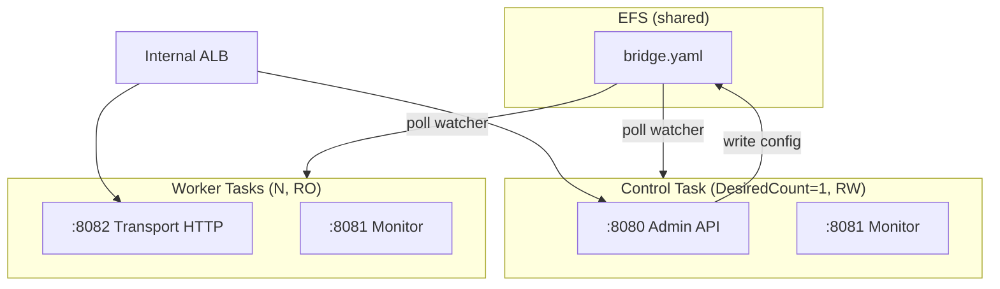
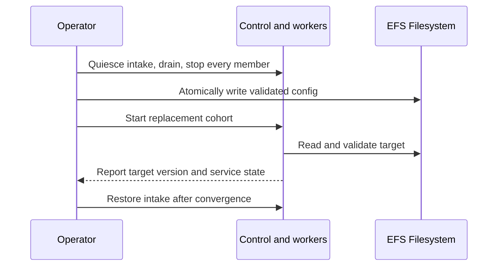

# CDK Scenario 5: Multi-Bridge Cluster with Shared EFS

## Overview

Deploy a control + worker GoBridge topology with one `GoBridgeCluster` facade — both services
and a shared EFS filesystem are derived from a single `bridge.yaml`.

## Use Case

You need high-throughput message routing across a fleet of GoBridge tasks. The cluster facade
materializes one control task (RW EFS, admin API) plus N worker tasks (RO EFS, transport
ingress) sharing the same `bridge.yaml`. Workers observe changes through the
file watcher, but clustered updates require whole-cohort replacement. This
profile does not provide coordinated active/standby failover.

This topology suits workloads where:

- Message volume exceeds what a single task can handle.
- Workers need the same configuration under one control writer.
- A single control plane simplifies administrative access (no sticky sessions needed).
- The `shared_outbox` delivery mode is **not** required — all routes use `direct_hold`.

## Architecture



`GoBridgeCluster` builds both ECS services, the EFS filesystem and its two access points
(RW for control, RO for worker), and the IAM split. Only control may initialize
an absent document. Workers remain read-only and wait idle for valid config;
there is no configuration sidecar. Sharing EFS does not create a distributed
lease store.

## Topology: filesystem_replicated

The `filesystem_replicated` topology allows multiple instances to share a config file on a
network filesystem. It supports clustered deployment mode but does **not** support features
that require distributed coordination -- those need the HA/DynamoDB config profile instead.

| Feature | Supported? | Notes |
|---------|-----------|-------|
| `deployment_mode: clustered` | Yes | Required for the cluster facade |
| Coordinated failover | No | Use `GoBridgeDynamoDBHA` with DynamoDB leases |
| `shared_outbox` routes | No | Use the HA/DynamoDB profile instead |
| Route session leases | No | Use the HA/DynamoDB profile instead |
| Independent route definitions | Yes | Each worker runs all routes defined in `bridge.yaml` |
| Poll-based config detection | Yes | Workers detect file changes via configurable interval |

Tier-B Phase 1 validation runs once at synth (against the resolved `BridgeConfig`) and
fast-fails on `delivery_mode: shared_outbox` or `route.session` lease coordination, directing
you to the DynamoDB profile. Phase 2 cross-reference errors (unknown queues, missing SSM
parameters, etc.) are aggregated through `Annotations.addError`.

## Control vs Worker

Both task definitions receive the same `infra.BootstrapConfig`; the cluster facade **forces**
the `NodeRole` per service (`control` for the singleton, `worker` for the scaled service). You
do not set `NodeRole` yourself.

| Setting | Control | Worker | Source |
|---------|---------|--------|--------|
| `node_role` | `control` | `worker` | Forced by `GoBridgeCluster` |
| EFS mount | RW (`ClientMount`+`ClientWrite`) | RO (`ClientMount` only) | Cluster IAM split |
| Exposed ports | Admin + Monitor + Transport | Admin + Monitor + Transport | Every node starts all three servers |
| `DesiredCount` | `1` (hard-coded) | `WorkerDesiredCount` (default 2) | Runtime invariant |
| Deploy strategy | `MinHealthy=0`, `MaxHealthy=100` | CDK rolling defaults | Single file-config writer |

The control `DesiredCount=1` and `MinHealthy=0`/`MaxHealthy=100` deploy strategy guarantee a
single file-config writer at all times — including across rolling deploys. Both invariants are
hard-coded and **not** exposed as caller-tunable props.

## Singleton Constraint

> ⚠️ **One `GoBridgeSingle` OR one `GoBridgeCluster` per `awscdk.Stack` tree.**
> A synth-time scope scan in `cdk/constructs/internal/singleton` panics if two facades share
> the enclosing stack. Bridge identity is taken from the deployed yaml's `bridge.name` field
> (validated against `^[a-zA-Z0-9][a-zA-Z0-9_-]{0,62}$` by Phase-1 tier-B validation). There
> is intentionally **no `Name` prop** on `ClusterProps` — the yaml is the single source of
> truth.

## Deploying the Cluster

Wire the VPC, ECS cluster, image, registries and bootstrap, then hand them to
`gobridgecluster.NewGoBridgeCluster`. The facade owns the EFS filesystem, both task
definitions, IAM, log groups and the worker autoscaling target.

The registry image must carry its own embedded initial config, consume an
existing target, or wait for operator creation. CDK cannot modify it.
`ImageFromGoBuild` instead embeds the parsed facade config automatically,
building the profile command from the published module. See
[initial configuration](../../aws-deployment/config-initialization.md).

```go
package main

import (
    "github.com/aws/aws-cdk-go/awscdk/v2"
    "github.com/aws/aws-cdk-go/awscdk/v2/awsec2"
    "github.com/aws/aws-cdk-go/awscdk/v2/awsecs"
    "github.com/aws/aws-cdk-go/awscdk/v2/awssqs"
    "github.com/aws/aws-cdk-go/awscdk/v2/awsssm"
    "github.com/aws/jsii-runtime-go"

    "github.com/mariotoffia/gobridge/deployment/aws-filebased-config/cdk/constructs/gobridgecluster"
    "github.com/mariotoffia/gobridge/deployment/aws-filebased-config/cdk/gobridgecdk"
    "github.com/mariotoffia/gobridge/deployment/aws-filebased-config/cdk/registry"
    "github.com/mariotoffia/gobridge/deployment/aws-filebased-config/infra"
)

func main() {
    app := awscdk.NewApp(nil)
    stack := awscdk.NewStack(app, jsii.String("BridgeCluster"), nil)

    vpc := awsec2.Vpc_FromLookup(stack, jsii.String("Vpc"),
        &awsec2.VpcLookupOptions{IsDefault: jsii.Bool(true)})
    cluster := awsecs.NewCluster(stack, jsii.String("Cluster"), &awsecs.ClusterProps{
        Vpc: vpc, ContainerInsights: jsii.Bool(true),
    })

    // Logical name → CDK handle for queues referenced by yaml.
    queues := registry.NewQueueRegistry()
    queues.AddQueue("orders-in",
        awssqs.Queue_FromQueueArn(stack, jsii.String("OrdersIn"),
            jsii.String("arn:aws:sqs:eu-west-1:123456789012:orders-in")))
    queues.AddQueue("orders-out",
        awssqs.Queue_FromQueueArn(stack, jsii.String("OrdersOut"),
            jsii.String("arn:aws:sqs:eu-west-1:123456789012:orders-out")))

    // Logical name → CDK handle for SSM SecureString parameters referenced by yaml.
    params := registry.NewSsmParamRegistry()
    params.AddParameter("/gobridge/cluster/admin-api-key",
        awsssm.StringParameter_FromSecureStringParameterAttributes(stack,
            jsii.String("AdminKey"), &awsssm.SecureStringParameterAttributes{
                ParameterName: jsii.String("/gobridge/cluster/admin-api-key"),
            }))

    bridge := gobridgecluster.NewGoBridgeCluster(stack, jsii.String("Bridge"),
        &gobridgecluster.ClusterProps{
            Vpc:     vpc,
            Cluster: cluster,
            Image: gobridgecdk.ImageFromRegistry(
                // Pin the digest from the release's gobridge-image-digest.txt
                // asset — see "Pin Images by Digest" in the deployment guide.
                "ghcr.io/mariotoffia/gobridge@sha256:<digest>"),
            Bootstrap: infra.BootstrapConfig{
                // NodeRole is forced per service by the facade — do not set it.
                AdminAddr:        ":8080",
                MonitorAddr:      ":8081",
                TransportHTTPAddr: ":8082",
                PollInterval:     "2s",
            },
            BridgeConfig:       gobridgecdk.BridgeYamlAsset("config/bridge.yaml"),
            QueueRegistry:      queues,
            SsmParamRegistry:   params,
            WorkerDesiredCount: jsii.Number(3),
            AutoScaling: &gobridgecluster.AutoScalingProps{
                Min: 2, Max: 10, TargetCPU: 60,
            },
        },
    )
    _ = bridge

    app.Synth(nil)
}
```

### Authoring the bridge config

Two paths produce the sealed `BridgeConfig` source consumed by the cluster facade:

```go
// (a) Local YAML for validation, grants, and optional Go-build embedding.
src := gobridgecdk.BridgeYamlAsset("config/bridge.yaml")

// (b) Typed builder — assembled in Go, marshalled at synth time.
cfg, err := bridgecfg.New("gobridge-cluster").
    WithSQSReceiver("orders-in", queues.Ref("orders-in")).
    WithSQSSender("ingest", queues.Ref("orders-out")).
    WithRoute("orders-in", "ingest"). // synthesises binding "ingest-binding"
    Build()
if err != nil { panic(err) }
src := gobridgecdk.BridgeYamlInline(cfg)
```

Both factories return the same opaque token. The yaml file (Snippet a) for a cluster:

```yaml
bridge:
  id: gobridge-cluster
  deployment_mode: clustered

receivers:
  - id: orders-in
    transport: sqs
    options:
      queue_name: orders-in        # physical name; runtime uses GetQueueUrl

senders:
  - id: ingest
    transport: sqs
    options:
      queue_name: orders-out       # physical name; runtime uses GetQueueUrl

bindings:
  - id: to-ingest
    sender_id: ingest
    address: orders-out

stores:
  # A clustered deployment needs a distributed DLQ for the failures the
  # default policy dead-letters.
  dlq:
    type: dynamodb
    options:
      table_name: gobridge-dlq

routes:
  - id: forward
    receiver_id: orders-in
    delivery_mode: direct_hold
    bindings: [to-ingest]
```

The typed builder above produces the equivalent shape — `WithRoute` synthesises a
binding named `<sender>-binding` (here `ingest-binding`) when the id resolves to a
sender rather than a previously-declared binding.

### Select a queue by tags

The example above uses physical queue names. To select the imported output
queue by tags, bind a selector before building the config:

```go
if err := queues.BindQueueTags("orders-out", map[string]string{
    "application": "gobridge",
    "purpose":     "orders-output",
}, "orders-"); err != nil {
    panic(err)
}
```

The producer must apply these tags to the imported queue. For CDK-owned queues,
`BindQueueTags` applies them. Build again using `queues.Ref("orders-out")`;
the sender now carries `queue_tags` and `queue_name_prefix`, and `WithRoute`
uses `address: sqs:queue` for its generated binding. Hand-authored YAML needs
the same marker. It means “use the configured queue”; the URL stays runtime-only.

`QueueRef.PhysicalName()` returns the known physical name, while `Name()` is
the registry alias. `QueueTags()` and `QueueNamePrefix()` expose the selector.
The facade uses `ResolveQueue` to retain exact grants and dependencies.
See the [CDK queue reference](../../aws-deployment/cdk-constructs.md#sqs-references)
for generated names, ambiguous selectors, and discovery permissions.

### Optional: ALB attachment + alarms

```go
attachment := gobridgealbattachment.NewGoBridgeALBAttachment(stack, jsii.String("Attach"),
    &gobridgealbattachment.AttachmentProps{
        Cluster:      bridge,
        Listener:     listener, // consumer-managed elbv2.IApplicationListener
        Vpc:          vpc,
        BridgeConfig: gobridgecdk.BridgeYamlAsset("config/bridge.yaml"),
        BasePriority: 200,      // reserves listener rule range [200, 299]
    })

gobridgealarms.NewGoBridgeAlarms(stack, jsii.String("Alarms"),
    &gobridgealarms.AlarmsProps{
        Cluster:    bridge,
        Efs:        bridge.EfsConfig(),
        Attachment: attachment,
        AlarmTopic: snsTopic,
    })
```

### EFS access split

The cluster facade owns the EFS filesystem (or the `*GoBridgeEfsConfig` you pass via
`EfsConfig`), both access points, the per-service mount specifications and the IAM grants on
each task role. You do **not** create access points, mount points or IAM policy statements
yourself — RW (control) vs RO (worker) is enforced at IAM and at the ECS volume level by the
construct.

## Config Propagation

File polling detects changes; it does not coordinate a rollout. For a clustered
file source, [ADR 0012](../../adr/0012-cluster-config-whole-cohort-replacement.md)
requires whole-cohort replacement for non-no-op changes.



### Poll interval trade-offs

| Interval | Detection delay | EFS checks/min (3 workers) | Best for |
|----------|-------------------|---------------------------|----------|
| `1s` | Up to 1 second | 180 | Rapid iteration, dev/staging |
| `2s` | Up to 2 seconds | 90 | Production default |
| `5s` | Up to 5 seconds | 36 | Cost-sensitive, infrequent changes |
| `30s` | Up to 30 seconds | 6 | Stable configs, large fleets |

Each poll performs an `os.Stat` call to check the file modification time. A full read occurs
only when the mtime changes. For most workloads, a 2-second interval balances responsiveness
and EFS operation costs.

After clustered activation, confirmed absence stops intake and signals process
exit and replacement, not a live transition to idle. Uncertain teardown also
exits. Read errors keep the last successful runtime as degraded. A fresh control
process may initialize an absent target; workers remain read-only.
Watchers must retain delete/recreate ordering.

## Scaling Workers

Worker autoscaling is target-tracking on ECS service CPU. Opt in by passing
`AutoScaling: &gobridgecluster.AutoScalingProps{...}`; off when nil. The control task is
**not** scalable (`DesiredCount=1` is a runtime invariant).

```go
gobridgecluster.NewGoBridgeCluster(stack, jsii.String("Bridge"),
    &gobridgecluster.ClusterProps{
        // ... required props ...
        WorkerDesiredCount: jsii.Number(3),
        AutoScaling: &gobridgecluster.AutoScalingProps{
            Min: 2, Max: 10, TargetCPU: 60,
        },
    },
)
```

For message-rate-based scaling (e.g. SQS queue depth), attach a custom step-scaling policy to
the worker `awsecs.IService` returned by `bridge.WorkerService()` after construction.

## Variations

### Mixed transports

Workers can consume from MQTT and SQS simultaneously. Each worker runs all routes in
`bridge.yaml`:

```yaml
bridge:
  id: gobridge-cluster
  deployment_mode: clustered

sessions:
  - id: mqtt-conn
    transport: mqtt
    # direct_hold relies on the broker redelivering what a crashed process never
    # acknowledged; only a persistent (or exclusive) session does that.
    session_mode: persistent
    options:
      session:
        broker_url: tls://mqtt.example.com:8883
        client_id: gobridge-worker
        client_id_suffix: hostname   # each worker task connects under its own id
        assert_stable_client_identity: true
        clean_start: false
        session_expiry_interval: 3600

stores:
  # A persistent session keeps an exact record of the filters it installed on
  # the broker (ADR 0003); a cluster keeps it in DynamoDB, seeded per worker.
  managed_subscriptions:
    type: dynamodb
    options:
      table_name: gobridge-managed-subscriptions
  dlq:
    type: dynamodb
    options:
      table_name: gobridge-dlq

receivers:
  - id: mqtt-in
    session_id: mqtt-conn
    topics:
      - topic: "$share/gobridge/sensors/#"
        qos: 1
  - id: sqs-in
    transport: sqs
    options:
      queue_name: events            # physical name; runtime uses GetQueueUrl

senders:
  - id: sse-out
    transport: http
    options:
      path: /events
      mode: sse

bindings:
  - id: to-api
    sender_id: sse-out
    address: events
  - id: to-api-from-mqtt
    sender_id: sse-out
    # Naming the session on the binding is what makes the bridge manage it:
    # connect, subscribe, reconcile. A session nobody manages never subscribes.
    session_id: mqtt-conn
    address: events

routes:
  - id: mqtt-forward
    receiver_id: mqtt-in
    delivery_mode: direct_hold
    bindings: [to-api-from-mqtt]
    policy:
      # The shared subscription splits the stream across workers; no single
      # owner fences it, and that is the intended scale-out.
      allow_unfenced: true
  - id: sqs-forward
    receiver_id: sqs-in
    delivery_mode: direct_hold
    bindings: [to-api]
```

Note the `$share/gobridge/` prefix on the MQTT topic — this enables MQTT v5 shared
subscriptions so that messages are load-balanced across workers rather than duplicated.

### Staged config rollout

Validate the exact document against every member's image before replacing the
cohort. Follow the [cluster rollout runbook](../../runbooks/cluster-config-rollout.md)
for quiescence, atomic target writes, restart, convergence checks, and rollback.
An admin transaction can persist a candidate but cannot make independent
file watchers into a rollout barrier. Do not treat a durable write as proof
that every member applied it.

### Canary deployments

The singleton-per-stack constraint forbids a third `GoBridgeCluster` (or `GoBridgeSingle`)
inside the same stack. Deploy a canary as a **separate stack** pointing at a separate config
target. Once the canary passes, promote the validated document through the
production cohort-replacement procedure. Changing `BridgeYamlAsset` or the
image's embedded document alone does not update an existing target.

## What's Next

- [Scenario 4: Production Stack](04-production-stack.md) — security hardening, VPC endpoints,
  and WAF configuration to apply alongside the cluster.
- [Configuration Guide](../../aws-deployment/configuration.md) — topology details and the full
  `filesystem_replicated` reference.
- [Monitoring Guide](../../aws-deployment/monitoring.md) — per-task metrics, dashboards, and
  alerting for clustered deployments.
- [HTTP API Guide](../../aws-deployment/http-api.md) — admin API config transactions. The
  single control task avoids sticky-session complexity.
- [aws-filebased-config ARCHITECTURE](../../../deployment/aws-filebased-config/ARCHITECTURE.md)
  — internal layering of the cluster facade, RW/RO EFS split, initialization lifecycle.
- [aws-filebased-config UBIQUITOUS](../../../deployment/aws-filebased-config/UBIQUITOUS.md) —
  canonical terminology (LeaseStore, EcsEndpointResolver, tier-B validation).
