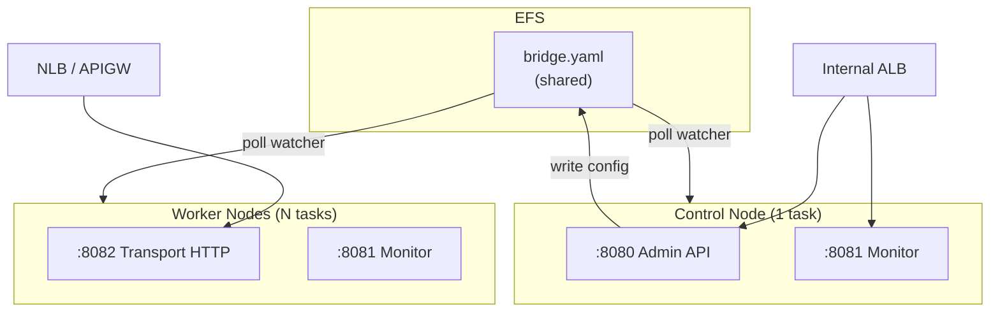
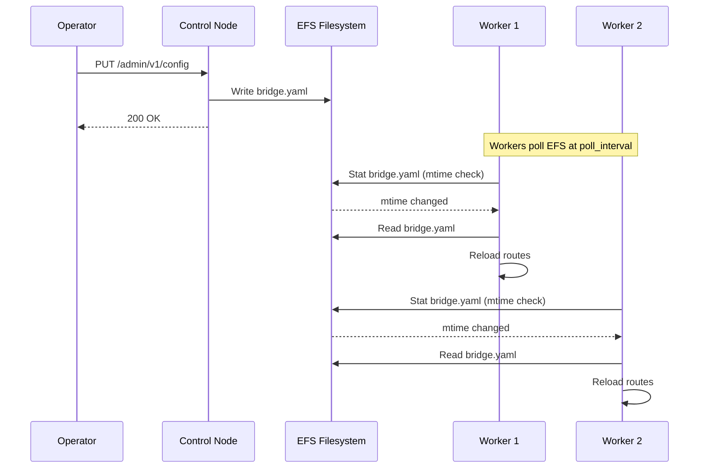

# CDK Scenario 5: Multi-Bridge Cluster with Shared EFS

Deploy multiple GoBridge instances with control/worker topology sharing configuration on EFS.

## Use Case

You need high-throughput message routing across a fleet of GoBridge instances. A single control
node manages bridge configuration via the admin API, while N worker nodes process messages. All
nodes share the same `bridge.yaml` on an EFS filesystem. When the control node writes a
configuration update, workers detect the change via a poll watcher and converge automatically.

This topology suits workloads where:

- Message volume exceeds what a single instance can handle.
- Configuration changes must propagate to all workers without restarts.
- A single control plane simplifies administrative access (no sticky sessions needed).
- The `shared_outbox` delivery mode is **not** required -- all routes use `direct_hold`.

## Architecture



The control node exposes the admin API (port 8080) and the monitor API (port 8081) behind an
internal ALB. Worker nodes expose the transport HTTP port (8082) behind an NLB or API Gateway
for message ingestion. All nodes mount the same EFS filesystem containing `bridge.yaml`.

## Topology: filesystem_replicated

The `filesystem_replicated` topology allows multiple instances to share a config file on a
network filesystem. It supports clustered deployment mode but does **not** support features
that require distributed coordination -- those need the HA/DynamoDB config profile instead.

| Feature | Supported? | Notes |
|---------|-----------|-------|
| `deployment_mode: clustered` | Yes | Recommended for multi-instance deployments |
| `bridge.cluster.endpoints` | Yes | Required for instance discovery |
| `shared_outbox` routes | No | Use the HA/DynamoDB profile instead |
| Route session leases | No | Use the HA/DynamoDB profile instead |
| Independent route definitions | Yes | Each worker runs all routes defined in `bridge.yaml` |
| Poll-based config detection | Yes | Workers detect file changes via configurable interval |

The `validateFilesystemProfile` function in the bootstrap library enforces these constraints at
startup. If a route uses `shared_outbox` or `route.session` lease coordination, the bootstrap
fails with a clear error directing you to the DynamoDB profile.

## Control vs Worker

Each node receives a bootstrap configuration via the `GOBRIDGE_FILEBASED_BOOTSTRAP_JSON`
environment variable. The `node_role` field determines the node's behaviour.

### Control node bootstrap

```json
{
  "bridge_id": "gobridge-cluster",
  "node_role": "control",
  "topology": "filesystem_replicated",
  "config_file_path": "/mnt/gobridge/bridge.yaml",
  "poll_interval": "5s",
  "admin_addr": ":8080",
  "monitor_addr": ":8081",
  "transport_http_addr": ":8082",
  "admin_api_key_param": "/gobridge/cluster/admin-api-key"
}
```

### Worker node bootstrap

```json
{
  "bridge_id": "gobridge-cluster",
  "node_role": "worker",
  "topology": "filesystem_replicated",
  "config_file_path": "/mnt/gobridge/bridge.yaml",
  "poll_interval": "2s",
  "admin_addr": ":8080",
  "monitor_addr": ":8081",
  "transport_http_addr": ":8082",
  "admin_api_key_param": "/gobridge/cluster/admin-api-key"
}
```

Key differences:

| Setting | Control | Worker | Reason |
|---------|---------|--------|--------|
| `node_role` | `control` | `worker` | Controls admin write access |
| `poll_interval` | `5s` | `2s` | Workers poll faster to pick up changes quickly |
| Exposed ports | Admin + Monitor | Transport + Monitor | Separation of concerns |

## Two CDK Services

Create two `GoBridgeService` constructs sharing the same `GoBridgeEfsConfig`. The control
service runs exactly 1 task with the admin API exposed. The worker service runs N tasks with
the transport HTTP port exposed.

```go
// Shared EFS filesystem for both services
sharedEfs := constructs.NewGoBridgeEfsConfig(stack, jsii.String("SharedEfs"),
    &constructs.GoBridgeEfsConfigProps{Vpc: vpc},
)

// Control node: 1 task, admin API exposed, EFS read-write
constructs.NewGoBridgeService(stack, jsii.String("Control"),
    &constructs.GoBridgeServiceProps{
        Vpc: vpc, Cluster: cluster, ServiceName: "gobridge-control",
        Image: image, EfsConfig: sharedEfs,
        Bootstrap: infra.BootstrapConfig{
            BridgeID:         "gobridge-cluster",
            NodeRole:         infra.NodeRoleControl,
            Topology:         infra.TopologyFilesystemReplicated,
            ConfigFilePath:   "/mnt/gobridge/bridge.yaml",
            PollInterval:     "5s",
            AdminAPIKeyParam: "/gobridge/cluster/admin-api-key",
        },
        Exposure:           infra.Exposure{Admin: true, Monitor: true},
        DesiredCount:       jsii.Number(1),
        ScalingMaxCapacity: jsii.Number(0), // disable auto-scaling
    },
)

// Worker nodes: N tasks, transport HTTP exposed, EFS read-only
constructs.NewGoBridgeService(stack, jsii.String("Workers"),
    &constructs.GoBridgeServiceProps{
        Vpc: vpc, Cluster: cluster, ServiceName: "gobridge-workers",
        Image: image, EfsConfig: sharedEfs,
        Bootstrap: infra.BootstrapConfig{
            BridgeID:         "gobridge-cluster",
            NodeRole:         infra.NodeRoleWorker,
            Topology:         infra.TopologyFilesystemReplicated,
            ConfigFilePath:   "/mnt/gobridge/bridge.yaml",
            PollInterval:     "2s",
            AdminAPIKeyParam: "/gobridge/cluster/admin-api-key",
        },
        Exposure:     infra.Exposure{TransportHTTP: true, Monitor: true},
        DesiredCount: jsii.Number(3),
    },
)
```

## Service Discovery

Use AWS Cloud Map to register both services so that nodes can discover each other for
`bridge.cluster.endpoints`. Each service gets a DNS name within a private namespace.

```go
namespace := awsservicediscovery.NewPrivateDnsNamespace(stack, jsii.String("NS"),
    &awsservicediscovery.PrivateDnsNamespaceProps{
        Name: jsii.String("gobridge.local"),
        Vpc:  vpc,
    },
)

namespace.CreateService(jsii.String("ControlSvc"), &awsservicediscovery.DnsServiceProps{
    Name:          jsii.String("control"),
    DnsRecordType: awsservicediscovery.DnsRecordType_A,
    DnsTtl:        awscdk.Duration_Seconds(jsii.Number(10)),
})

namespace.CreateService(jsii.String("WorkerSvc"), &awsservicediscovery.DnsServiceProps{
    Name:          jsii.String("workers"),
    DnsRecordType: awsservicediscovery.DnsRecordType_A,
    DnsTtl:        awscdk.Duration_Seconds(jsii.Number(10)),
})
```

Reference these DNS names in `bridge.yaml`:

```yaml
bridge:
  id: gobridge-cluster
  deployment_mode: clustered
  cluster:
    endpoints:
      control: "http://control.gobridge.local:8080"
      workers: "http://workers.gobridge.local:8082"
```

ECS services can be associated with Cloud Map during creation by configuring `CloudMapOptions`
on the Fargate service. The `GoBridgeService` construct returns the underlying service via
`Service()` for further customization.

## EFS Write Access

In a control/worker topology, the control node needs read-write access to EFS while workers
need only read access. Create two access points on the same filesystem with different
permissions.

```go
// Control access point: read-write (permissions 755)
controlAP := awsefs.NewAccessPoint(stack, jsii.String("ControlAP"), &awsefs.AccessPointProps{
    FileSystem: fs,
    Path:       jsii.String("/gobridge"),
    PosixUser:  &awsefs.PosixUser{Uid: jsii.String("1000"), Gid: jsii.String("1000")},
    CreateAcl:  &awsefs.Acl{
        OwnerUid: jsii.String("1000"), OwnerGid: jsii.String("1000"),
        Permissions: jsii.String("755"),
    },
})

// Worker access point: read-only (permissions 555)
workerAP := awsefs.NewAccessPoint(stack, jsii.String("WorkerAP"), &awsefs.AccessPointProps{
    FileSystem: fs,
    Path:       jsii.String("/gobridge"),
    PosixUser:  &awsefs.PosixUser{Uid: jsii.String("1001"), Gid: jsii.String("1000")},
    CreateAcl:  &awsefs.Acl{
        OwnerUid: jsii.String("1001"), OwnerGid: jsii.String("1000"),
        Permissions: jsii.String("555"),
    },
})
```

Mount the control volume as read-write and the worker volume as read-only:

```go
controlContainer.AddMountPoints(&awsecs.MountPoint{
    SourceVolume: jsii.String("gobridge-config"), ContainerPath: jsii.String("/mnt/gobridge"),
    ReadOnly: jsii.Bool(false), // read-write
})

workerContainer.AddMountPoints(&awsecs.MountPoint{
    SourceVolume: jsii.String("gobridge-config"), ContainerPath: jsii.String("/mnt/gobridge"),
    ReadOnly: jsii.Bool(true), // read-only
})
```

Grant the control task role write permissions in addition to mount and read:

```go
fs.Grant(controlTaskDef.TaskRole(),
    jsii.String("elasticfilesystem:ClientMount"),
    jsii.String("elasticfilesystem:ClientRead"),
    jsii.String("elasticfilesystem:ClientWrite"),
)

fs.Grant(workerTaskDef.TaskRole(),
    jsii.String("elasticfilesystem:ClientMount"),
    jsii.String("elasticfilesystem:ClientRead"),
)
```

## Config Propagation

When the control node writes a configuration update via the admin API, the change propagates to
workers through EFS file polling.



### Poll interval trade-offs

| Interval | Propagation delay | EFS reads/min (3 workers) | Best for |
|----------|-------------------|---------------------------|----------|
| `1s` | Up to 1 second | 180 | Rapid iteration, dev/staging |
| `2s` | Up to 2 seconds | 90 | Production default |
| `5s` | Up to 5 seconds | 36 | Cost-sensitive, infrequent changes |
| `30s` | Up to 30 seconds | 6 | Stable configs, large fleets |

Each poll performs an `os.Stat` call to check the file modification time. A full read occurs
only when the mtime changes. For most workloads, a 2-second interval balances responsiveness
and EFS operation costs.

## Complete CDK Code

The following stack combines all components: shared EFS, control service, worker service,
Cloud Map service discovery, and auto-scaling.

```go
package main

import (
    "os"

    "github.com/aws/aws-cdk-go/awscdk/v2"
    "github.com/aws/aws-cdk-go/awscdk/v2/awsec2"
    "github.com/aws/aws-cdk-go/awscdk/v2/awsecs"
    "github.com/aws/aws-cdk-go/awscdk/v2/awsservicediscovery"
    "github.com/aws/constructs-go/constructs/v10"
    "github.com/aws/jsii-runtime-go"

    gobridgecdk "github.com/mariotoffia/gobridge/deployment/aws-filebased-config/cdk/constructs"
    "github.com/mariotoffia/gobridge/deployment/aws-filebased-config/infra"
)

type ClusterStackProps struct {
    awscdk.StackProps
    ImageURI       string
    AdminKeyParam  string
    WorkerCount    float64
    WorkerMaxCount float64
}

func NewMultiBridgeClusterStack(
    scope constructs.Construct, id string, props *ClusterStackProps,
) awscdk.Stack {
    stack := awscdk.NewStack(scope, &id, &props.StackProps)

    vpc := awsec2.NewVpc(stack, jsii.String("Vpc"), &awsec2.VpcProps{MaxAzs: jsii.Number(2)})
    cluster := awsecs.NewCluster(stack, jsii.String("EcsCluster"), &awsecs.ClusterProps{Vpc: vpc})
    image := awsecs.ContainerImage_FromRegistry(jsii.String(props.ImageURI), nil)

    sharedEfs := gobridgecdk.NewGoBridgeEfsConfig(stack, jsii.String("SharedEfs"),
        &gobridgecdk.GoBridgeEfsConfigProps{Vpc: vpc},
    )

    namespace := awsservicediscovery.NewPrivateDnsNamespace(stack, jsii.String("NS"),
        &awsservicediscovery.PrivateDnsNamespaceProps{
            Name: jsii.String("gobridge.local"), Vpc: vpc,
        },
    )

    controlSvc := gobridgecdk.NewGoBridgeService(stack, jsii.String("Control"),
        &gobridgecdk.GoBridgeServiceProps{
            Vpc: vpc, Cluster: cluster, ServiceName: "gobridge-control",
            Image: image, EfsConfig: sharedEfs,
            Bootstrap: infra.BootstrapConfig{
                BridgeID: "gobridge-cluster", NodeRole: infra.NodeRoleControl,
                Topology: infra.TopologyFilesystemReplicated,
                ConfigFilePath: "/mnt/gobridge/bridge.yaml", PollInterval: "5s",
                AdminAPIKeyParam: props.AdminKeyParam,
            },
            Exposure:           infra.Exposure{Admin: true, Monitor: true},
            DesiredCount:       jsii.Number(1),
            ScalingMaxCapacity: jsii.Number(0),
        },
    )

    workerSvc := gobridgecdk.NewGoBridgeService(stack, jsii.String("Workers"),
        &gobridgecdk.GoBridgeServiceProps{
            Vpc: vpc, Cluster: cluster, ServiceName: "gobridge-workers",
            Image: image, EfsConfig: sharedEfs,
            Bootstrap: infra.BootstrapConfig{
                BridgeID: "gobridge-cluster", NodeRole: infra.NodeRoleWorker,
                Topology: infra.TopologyFilesystemReplicated,
                ConfigFilePath: "/mnt/gobridge/bridge.yaml", PollInterval: "2s",
                AdminAPIKeyParam: props.AdminKeyParam,
            },
            Exposure:           infra.Exposure{TransportHTTP: true, Monitor: true},
            DesiredCount:       jsii.Number(props.WorkerCount),
            ScalingMaxCapacity: jsii.Number(props.WorkerMaxCount),
            CpuTargetPercent:   jsii.Number(65),
        },
    )

    _ = controlSvc // associate via controlSvc.Service().EnableCloudMap(...)
    _ = workerSvc
    _ = namespace

    return stack
}

func main() {
    defer jsii.Close()
    app := awscdk.NewApp(nil)

    NewMultiBridgeClusterStack(app, "GoBridgeCluster", &ClusterStackProps{
        StackProps: awscdk.StackProps{
            Env: &awscdk.Environment{
                Account: jsii.String(os.Getenv("CDK_DEFAULT_ACCOUNT")),
                Region:  jsii.String(os.Getenv("CDK_DEFAULT_REGION")),
            },
        },
        ImageURI:       os.Getenv("GOBRIDGE_IMAGE_URI"),
        AdminKeyParam:  os.Getenv("GOBRIDGE_ADMIN_KEY_PARAM"),
        WorkerCount:    3,
        WorkerMaxCount: 10,
    })

    app.Synth(nil)
}
```

Deploy with:

```bash
export GOBRIDGE_IMAGE_URI="123456789.dkr.ecr.us-west-1.amazonaws.com/gobridge:latest"
export GOBRIDGE_ADMIN_KEY_PARAM="/gobridge/cluster/admin-api-key"
export CDK_DEFAULT_ACCOUNT=$(aws sts get-caller-identity --query Account --output text)
export CDK_DEFAULT_REGION=us-west-1

cdk deploy GoBridgeCluster --require-approval broadening
```

## Scaling Workers

Workers scale independently based on CPU utilization. The control node stays at exactly 1 task
to avoid write conflicts on EFS. The `GoBridgeService` construct supports auto-scaling via
`ScalingMaxCapacity` and `CpuTargetPercent`.

```go
// Control: scaling disabled (max capacity = 0)
&gobridgecdk.GoBridgeServiceProps{
    DesiredCount:       jsii.Number(1),
    ScalingMaxCapacity: jsii.Number(0),
}

// Workers: scale from 3 to 10 tasks at 65% CPU
&gobridgecdk.GoBridgeServiceProps{
    DesiredCount:       jsii.Number(3),
    ScalingMaxCapacity: jsii.Number(10),
    CpuTargetPercent:   jsii.Number(65),
}
```

For message-rate-based scaling (e.g. SQS queue depth), add a custom metric policy:

```go
scaling := workerSvc.Service().AutoScaleTaskCount(
    &awsapplicationautoscaling.EnableScalingProps{
        MinCapacity: jsii.Number(3), MaxCapacity: jsii.Number(10),
    },
)

scaling.ScaleOnMetric(jsii.String("QueueDepthScaling"),
    &awsecs.ScalingOnMetricProps{
        Metric: sqsQueue.MetricApproximateNumberOfMessagesVisible(nil),
        ScalingSteps: &[]*awsapplicationautoscaling.ScalingInterval{
            {Upper: jsii.Number(100), Change: jsii.Number(0)},
            {Lower: jsii.Number(100), Change: jsii.Number(2)},
            {Lower: jsii.Number(500), Change: jsii.Number(4)},
        },
    },
)
```

## Variations

### Mixed transports

Workers can consume from MQTT and SQS simultaneously. Each worker runs all routes in
`bridge.yaml`:

```yaml
bridge:
  id: gobridge-cluster
  deployment_mode: clustered

sessions:
  - id: mqtt-conn
    transport: mqtt
    options:
      broker_url: tls://mqtt.example.com:8883
      client_id_prefix: gobridge-worker

receivers:
  - id: mqtt-in
    session_id: mqtt-conn
    topics:
      - topic: "$share/gobridge/sensors/#"
        qos: 1
  - id: sqs-in
    transport: sqs
    options:
      queue_url: https://sqs.us-west-1.amazonaws.com/123456789/events

senders:
  - id: http-out
    transport: http
    options:
      url: https://api.example.com/ingest

bindings:
  - id: to-api
    sender_id: http-out

routes:
  - id: mqtt-forward
    receiver_id: mqtt-in
    delivery_mode: direct_hold
    bindings: [to-api]
  - id: sqs-forward
    receiver_id: sqs-in
    delivery_mode: direct_hold
    bindings: [to-api]
```

Note the `$share/gobridge/` prefix on the MQTT topic -- this enables MQTT v5 shared
subscriptions so that messages are load-balanced across workers rather than duplicated.

### Blue-green config deployment

Write a new configuration to a staging path, validate it, then promote to active. This
prevents workers from reading a partially-written file:

```bash
# Write new config to staging path
curl -X PUT -H "X-API-Key: ${API_KEY}" \
  -H "Content-Type: application/yaml" \
  -d @new-bridge.yaml \
  "http://control.gobridge.local:8080/admin/v1/config?staging=true"

# Validate the staged config
curl -H "X-API-Key: ${API_KEY}" \
  "http://control.gobridge.local:8080/admin/v1/config/validate?path=staging"

# Promote staging to active (atomic rename on EFS)
curl -X POST -H "X-API-Key: ${API_KEY}" \
  "http://control.gobridge.local:8080/admin/v1/config/promote"
```

### Canary worker

Test a config change on a single canary instance before rolling it out fleet-wide. Deploy a
third `GoBridgeService` with `DesiredCount: 1` pointing to a separate config path:

```go
gobridgecdk.NewGoBridgeService(stack, jsii.String("Canary"),
    &gobridgecdk.GoBridgeServiceProps{
        ServiceName: "gobridge-canary",
        Bootstrap: infra.BootstrapConfig{
            BridgeID:         "gobridge-cluster",
            NodeRole:         infra.NodeRoleWorker,
            Topology:         infra.TopologyFilesystemReplicated,
            ConfigFilePath:   "/mnt/gobridge/canary/bridge.yaml",
            PollInterval:     "2s",
            AdminAPIKeyParam: adminKeyParam,
        },
        DesiredCount:       jsii.Number(1),
        ScalingMaxCapacity: jsii.Number(0),
        // ... remaining props same as worker
    },
)
```

Monitor the canary's metrics at its monitor endpoint before promoting the configuration to the
main worker fleet.

## What's Next

- [Configuration Guide](../../aws-deployment/configuration.md) -- topology details and the full
  `filesystem_replicated` reference.
- [Monitoring Guide](../../aws-deployment/monitoring.md) -- per-node metrics, dashboards, and
  alerting for clustered deployments.
- [Scenario 4: Production Stack](04-production-stack.md) -- security hardening, VPC endpoints,
  and WAF configuration to apply to both control and worker services.
- [HTTP API Guide](../../aws-deployment/http-api.md) -- admin API config transactions. The
  single control node avoids sticky-session complexity.
