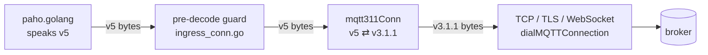

# MQTT 3.1.1 support for the `mqtt` transport — design

Status: approved design, implementation pending. Tracking issue: #109.

## 1. Problem

The `mqtt` transport (`adapters/mqtt/transport/paho`) speaks MQTT 5.0 only. It
is built on `github.com/eclipse/paho.golang` v0.23.0, which hard-codes protocol
level 5 (`paho/client.go:276-277`). Its maintainers have declined MQTT 3.1.1
support (eclipse/paho.golang#6, eclipse/paho.golang#89, eclipse/paho.golang#273; eclipse/paho.golang#104 closed unmerged).

`docs/transports/mqtt-broker-support.md` lists v3.1.1 as not supported, while
`doc.go` claims "MQTT 3.1.1 degrades gracefully with startup warnings". No code
backs that claim.

Brokers and managed services that speak only 3.1.1 cannot be bridged today.
Examples are Azure IoT Hub, legacy device fleets, and brokers configured for
3.1.1.

## 2. Decisions

| Question | Decision |
|---|---|
| Same adapter or a new one? | Same `mqtt` transport, plus a wire translator below the existing pre-decode guard. It turns MQTT 5 into MQTT 3.1.1 and back. |
| Protocol selector | `options.session.protocol_version`, values `v5` and `v3.1.1`. Omitted means `v5`. |
| Version naming | MQTT 5.0 is current; there is no 5.1. The value names the exact version, because `mqtt3` is ambiguous: 3.1 (protocol name `MQIsdp`, level 3) and 3.1.1 (`MQTT`, level 4) differ on the wire. Values never look like numbers: the options decoder is strict (`WeaklyTypedInput: false`), so an unquoted YAML `5` would decode as an int and fail. MQTT 3.1 is not supported. |
| `no_local` on 3.1.1 | Rejected at validation. The broker "bridge bit" (`try_private`, 0x80 on the protocol level) gives No-Local only on Mosquitto and VerneMQ. Using it would make loop prevention silently depend on the broker. |
| Headers on 3.1.1 | Not carried. This is documented and warned once at session start. There is no payload envelope. |
| Retained replay on reconnect | Accepted and documented as degraded. `mqtt.retained=true` lets consumers filter. |

### 2.1 Alternatives rejected

**A second client stack (`eclipse/paho.mqtt.golang`) inside the adapter.**
- The router, delivery and session code are written against paho.golang types
  (`paho.Publish`, `PublishReceived`, `Client.Ack`,
  `autopaho.ConnectionManager`).
- The v3 library sends manual acks in call order. MQTT 3.1.1 §4.6 requires
  receive order.
- It has open QoS 2 duplicate-delivery bugs (eclipse/paho.mqtt.golang#768, #788, #791).
- It cannot report Session Present after an auto-reconnect (eclipse/paho.mqtt.golang#582).
- The result would be two reconnect engines and a large refactor.

**A separate `mqtt311` adapter, following the AMQP 0-9-1 / 1.0 precedent.**
- It would duplicate or fork 13.6k lines of hardened session behaviour: grace
  window, orphan cleanup, poison escape, recovery, managed subscriptions,
  credential rotation and takeover damping.
- It would add a second kind to every core touchpoint that matches the kind
  name:
  - `bridge/specs.go` `isMQTTPahoTransport`;
  - `max_mqtt_sessions` counting;
  - the managed-subscription store gate;
  - `tests/docsexamples/session_transport_enum_test.go`;
  - `scripts/pluginsym` and `scripts/registrychk`;
  - CDK `imgsource`;
  - build tags and plugin file pairs.
- The precedent does not fit. AMQP 0-9-1 and 1.0 are different protocols. MQTT
  3.1.1 and 5 differ in a version byte and an absent property block.

## 3. Architecture



- **Where it lives.** The translator is a `net.Conn` wrapper in a new file,
  `adapters/mqtt/transport/paho/mqtt311_conn.go`, in the existing package. A
  new package would need its own `.go-arch-lint.yml` component, because the
  MQTT component maps the exact package path.
- **Where it is installed.** `attemptGuardedConnection` (`acl_net.go`) wraps
  the dialled stream only when the session's protocol version is `v3.1.1`.
  - On v3.1.1 the chain is `raw → mqtt311Conn → mqttIngressConn → paho`.
  - On `v5` the chain is unchanged.
- **Who knows about versions.** paho.golang, the guard, the router, delivery,
  reconcile and every session behaviour keep running on MQTT 5 semantics. The
  translator is the only code that knows a second wire format exists.
- **No new dependency.**
  - Outbound: packets are decoded with paho's own `packets.ReadPacket`, which
    already parses the v5 bytes paho writes.
  - Inbound: v3.1.1 packets are small and are parsed by hand with the existing
    VBI helpers (`readMQTTVBI`, `appendMQTTVBI`).

### 3.1 Write side (paho → broker)

**Framing.**
- paho serialises every packet write through the guard's `sync.Locker`, so the
  bytes of two packets never interleave.
- `mqtt311Conn.Write` accumulates bytes until one whole v5 packet is buffered
  (fixed header, Remaining Length and body).
- It translates that packet, writes the v3.1.1 form to the raw stream, and
  reports `len(p)` consumed.
- A packet that cannot be expressed fails the write with an error, and the
  connection drops. Nothing is silently weakened.

| v5 packet | v3.1.1 output |
|---|---|
| CONNECT | Protocol name `MQTT`, level 4. Connect flags keep the same bit layout. All properties and will properties are dropped. **Clean Session** is derived as below. A password without a username is an error. |
| PUBLISH | Fixed header, topic, packet id (QoS > 0) and payload. All properties are dropped. An empty topic (topic alias) is an error. |
| PUBACK, PUBREC, PUBREL, PUBCOMP | Fixed header and the 2-byte packet id. Reason code and properties are dropped. PUBREL keeps flags `0x2`. |
| SUBSCRIBE | Packet id, then for each filter the topic and a requested-QoS byte with bits 2-7 zero. `NoLocal` or `RetainAsPublished` set is an error. Retain Handling is dropped (§5.2). Properties are dropped. |
| UNSUBSCRIBE | Packet id and topics. Properties are dropped. The translator records `packet id → filter count` for the UNSUBACK. |
| PINGREQ | Unchanged. |
| DISCONNECT, reason `0x00` | v3.1.1 DISCONNECT (`0xE0 0x00`). The broker discards the Last Will, as a v5 broker does for `0x00`. |
| DISCONNECT, any other reason | **Nothing is written.** See the note below this table. |
| AUTH | Error. Never sent today. |

Why a non-zero DISCONNECT writes nothing:
- The only senders are the guard's reject (`0x95`/`0x81`) and paho's own error
  paths. In both cases the caller closes the socket next.
- A 3.1.1 broker publishes the Last Will on an unclean close.
- A v5 broker publishes it for any non-zero reason (MQTT-3.1.2-8), so the
  outcome matches.
- A v3.1.1 DISCONNECT would discard the will instead.

**Clean Session mapping.** The inputs are the v5 CONNECT's Clean Start flag and
its Session Expiry Interval property (absent means 0).

| Clean Start | Session Expiry | Clean Session | Who produces it |
|---|---|---|---|
| 1 | 0 | 1 | Ephemeral, every connect |
| 0 | > 0 | 0 | Persistent and Exclusive, including recovery connects |
| 0 | 0 | 1 | Not produced today. In v5 this means "resume, then end the session on close". The nearest 3.1.1 form ends the session immediately. |
| 1 | > 0 | **error** | Persistent with `clean_start: true`. Rejected at validation (§4.2). The translator fails closed if it is reached anyway. |

autopaho sends Clean Start only on the first connection of a manager. Every
reconnect sends 0, and the table maps that correctly.

### 3.2 Read side (broker → paho)

**Framing.**
- `mqtt311Conn.Read` frames one v3.1.1 packet at a time and hands out the
  equivalent v5 bytes. This mirrors how the guard hands out one packet.
- It validates the fixed header and Remaining Length with the existing VBI
  rules before allocating anything.

| v3.1.1 packet | v5 output |
|---|---|
| CONNACK (`flags, return code`) | `flags, reason code, 0x00` (empty properties). Return codes are mapped below this table. |
| PUBLISH | Fixed header with a recomputed Remaining Length, then topic, packet id (QoS > 0), `0x00` (empty properties) and the payload. QoS 3, a topic length past the packet, or a zero packet id is malformed. |
| PUBACK, PUBREC, PUBREL, PUBCOMP | Unchanged. The 2-byte form is valid v5 (§3.4.2.1: Remaining Length 2 means success and no properties). |
| SUBACK | Packet id, `0x00`, then the return codes unchanged. The 3.1.1 codes `0x00`/`0x01`/`0x02`/`0x80` are valid v5 reason codes with the same meaning. |
| UNSUBACK | Packet id, `0x00`, then `N × 0x00`, where N is the filter count recorded for that packet id. An unknown packet id is malformed. Always reporting Success is the conservative choice (§5.2). |
| PINGRESP | Unchanged. |
| CONNECT, SUBSCRIBE, UNSUBSCRIBE, PINGREQ, DISCONNECT, AUTH, reserved | Malformed. A 3.1.1 server never sends these. |

CONNACK return codes:

| 3.1.1 return code | v5 reason code |
|---|---|
| 0 | `0x00` |
| 1 | `0x84` (unsupported protocol version) |
| 2 | `0x85` (client identifier not valid) |
| 3 | `0x88` (server unavailable) |
| 4 | `0x86` (bad user name or password) |
| 5 | `0x87` (not authorized) |
| anything else | malformed |

Because the translated CONNACK carries no properties, paho falls back to the v5
defaults:
- Receive Maximum 65535 and Maximum QoS 2;
- retain and shared subscriptions available;
- no Maximum Packet Size.

The existing CONNACK handling (`MapError`, `ErrNotAuthorized`, `resumeLost`)
works unchanged.

**Oversized PUBLISH: poison escape on the wire.**
- *The problem.* 3.1.1 cannot advertise a Maximum Packet Size, so a compliant
  broker forwards a PUBLISH of any size, up to a Remaining Length of
  268,435,455.
- *Why the guard is not enough.* If such a packet reached the guard, it would
  be rejected with a reconnect. The broker would redeliver it on every
  `clean_start=false` resume, which gives any publisher a permanent kill switch
  for the session.
- *The fix.* The translator never buffers more than the payload cap:
  1. It reads the topic and packet id.
  2. It keeps the first `max_payload_bytes + 1` bytes of the payload.
  3. It discards the rest from the stream with `io.CopyN(io.Discard, …)`.
  4. It emits a v5 PUBLISH carrying that truncated payload.
- *Why it works.* The truncated packet fits the guard's size limit, because the
  metadata allowance covers the topic. The router's existing ingress cap
  (`payload > max_payload_bytes`) then acks and drops it in receive order,
  counted on `MQTTIngressPoisonDropped`.
- No new metric, queue or ack path is introduced.

**Oversized non-PUBLISH.** A non-PUBLISH packet above the guard's maximum
packet size (`wirePacketSizeFor(max_payload_bytes)`) is rejected as too large.
Only a broken broker produces one.

**Violations.** A malformed or oversized non-PUBLISH packet takes the guard's
reporting path:
- `onViolation` is `Session.rejectPredecodeIngress`. It records
  `MQTTIngressRejected`, sets health to None, applies the reject streak
  backoff, and starts the readiness hold-down.
- The translator then closes the raw connection **without** writing a
  DISCONNECT, so the Last Will is still published (§3.1).
- Later reads return the same error.

### 3.3 Concurrency

- Read and write run on different goroutines.
- The only state they share is the UNSUBSCRIBE packet-id map, and a mutex
  guards it.
- Read-side state is touched only on the read path, which the guard already
  serialises.
- `Close` closes the raw connection. Deadlines and addresses pass through the
  embedded `net.Conn`.

## 4. Configuration

### 4.1 New key

```yaml
sessions:
  - id: legacy-broker
    transport: mqtt
    session_mode: persistent
    options:
      session:
        broker_url: ssl://broker.example:8883
        client_id: bridge-legacy
        protocol_version: v3.1.1   # v5 (default) | v3.1.1
```

```go
ProtocolVersion string `mapstructure:"protocol_version" yaml:"protocol_version,omitempty" json:"protocol_version,omitempty"`
```

- **Default.** The empty string means `v5`.
- **Nothing existing changes.** These keep their current values and behaviour:
  - existing configurations and their content fingerprints
    (`config/manager.go`);
  - the marshal round trip (`config/parser/blueprint_marshal.go`, which
    reflects on the json/yaml tags);
  - the CDK builder (`deployment/aws/cdk/bridgecfg/mqtt.go`). It builds
    `*paho.Config` without `DefaultConfig()`, so its zero value is `v5`.
- **Library path.** `SessionOptionsFromMap` (`config_decode.go`) also reads
  `protocol_version`, so the lenient library path matches the registry path.
- **Not part of durable identity.** The value is left out of
  `DurableSessionIdentity`:
  - A broker keeps one session per client id, whichever protocol version
    resumes it.
  - Including the value would make the managed-subscription ledger fail closed
    ("missing baseline") on a protocol switch.
  - A protocol change still rebuilds the session, because the typed config is
    part of the reload unit's content identity.

### 4.2 Validation on `v3.1.1`

| Rule | Where | Why |
|---|---|---|
| `protocol_version` must be empty, `v5` or `v3.1.1` | `Config.Validate` | Typos fail at load. |
| `no_local: true` is rejected | `Config.Validate` | 3.1.1 has no No-Local. Loop prevention must not silently disappear (ADR 0010). |
| `session_expiry_interval` other than 0 is rejected | `Config.Validate` | 3.1.1 cannot send it, and the broker decides how long a session lives. See the note below this table. |
| `password` without `username` is rejected | `Config.Validate`, and `ApplyCredentials` after `credentials_uri` resolution (as the plaintext gate does) | MQTT-3.1.2-22. |
| `clean_start: true` with `session_mode: persistent` is rejected | `ValidateEffectiveSession(mode)` | No 3.1.1 wire form exists (§3.1). Exclusive already overrides `clean_start` to false, and Ephemeral ignores it. |

About `session_expiry_interval` on 3.1.1:
- Default session lifetimes: Mosquitto never expires the session, EMQX expires
  it after 2 h, and AWS IoT after 1 h.
- Zero is the unset marker. For durable modes `NewSession` still coerces it to
  86400 locally, so durable identity and `SourceRedeliversUnsettled` keep their
  meaning.
- On v3.1.1 the coercion is silent, because no wire value exists to warn about.

Every error is `shared.ErrInvalidConfig.WithMessage(...)`. It names the key,
the protocol version and what to do instead. Example: "mqtt: session.no_local
is not available on protocol_version v3.1.1 (MQTT 3.1.1 has no No-Local);
remove it, or use v5".

### 4.3 Startup warning

When the protocol version is `v3.1.1`, `NewSession` logs one Warn listing what
the session cannot do:
- no headers or message identity;
- no takeover detection;
- no publish refusal verdicts;
- retained messages replay on every reconnect;
- the broker controls the in-flight window and the session lifetime.

That makes the warning `doc.go` describes real.

## 5. Behaviour on MQTT 3.1.1

### 5.1 Unchanged

These behave exactly as on v5:
- ack after settlement, in receive order (paho's ack tracker);
- QoS 0/1/2;
- session resume, and resume-loss detection from Session Present;
- startup grace, covered-retain and orphan cleanup;
- the managed-subscription ledger;
- settlement recovery and unit-rebuild containment;
- the poison escape;
- credential rotation;
- TLS, WebSocket and proxies;
- multi-URL failover;
- keep-alive;
- Last Will;
- the cluster and lease rules;
- `client_id_suffix`;
- QoS downgrade detection (SUBACK carries the granted QoS);
- `max_mqtt_sessions`;
- the circuit breaker.

### 5.2 Degraded (accepted, documented, warned once)

| Behaviour | On v3.1.1 |
|---|---|
| Headers and identity | Only topic, payload, QoS and RETAIN cross the wire. On egress, all headers, the subject and the expiry are dropped. Ingress consequences are listed below this table. |
| Session takeover | No DISCONNECT 0x8E exists, so a takeover looks like any other connection loss. The ordinary reconnect backoff applies. `MQTTSessionTakeover` and the takeover penalty stay idle. The exclusive lease is still the owner guarantee. |
| Publish refusal | PUBACK and PUBREC carry no reason code. A broker that refuses a publish either acks it (Mosquitto) or closes the connection, which surfaces as `ErrConnectionLost` (retryable). `throttle_retry_after` never applies. |
| Subscribe refusal | SUBACK `0x80` is the only failure code. It keeps its v5 meaning, `ErrUnavailable` (transient), so a broker ACL denial is not classified `ErrForbidden`. |
| Retained replay | There is no Retain Handling. Every reconnect re-SUBSCRIBEs all filters, and so does every QoS re-check, so each matching retained message is delivered again. These are at-least-once duplicates, flagged `mqtt.retained=true`. |
| Flow control | `receive_maximum` is not sent, but it still sizes the dispatch queue and the pending buffer. The broker's per-client in-flight limit must not exceed it. Defaults: Mosquitto `max_inflight_messages` 20, EMQX `max_inflight` 32, AWS IoT 100. If the broker sends more, the router blocks rather than drops, so nothing is lost. A blocked read can delay PINGRESP until keep-alive forces a reconnect, which redelivers. |
| Maximum packet size | Not advertised. An oversized PUBLISH is acked and dropped (§3.2) instead of being refused by the broker. Egress has no broker limit to check against: its cap falls back to the protocol maximum, as it already does when a v5 CONNACK omits the property. |
| UNSUBACK detail | Every filter reports Success. Managed cleanup therefore always takes its connection-recycle path, one extra reconnect per cleanup. Non-managed orphan cleanup never logs "survived cleanup"; a reconnect resets both maps anyway. |
| Session lifetime | Broker policy. `session_expiry_interval` is rejected (§4.2). |
| Shared subscriptions | `$share/` depends on the broker. Mosquitto, EMQX, HiveMQ, VerneMQ and AWS IoT accept it from 3.1.1 clients; Azure Event Grid disconnects. `shared_consumer` stays declared, because factory capabilities are per kind, not per config. |
| Error classification | CONNACK codes 1–5 map to the nearest v5 code (§3.2). There is no server-busy (`0x89`) or quota (`0x97`) signal. |

Ingress consequences of carrying no headers:
- None of these arrive: `mqtt.message-id`, correlation data, subject, expiry,
  content type, response topic, `traceparent`, user headers.
- Every message therefore gets a minted id and `x-bridge.generated-id`.
- `direct_hold` sinks a message whose send keeps failing as `unstable_identity`
  once `send_retry_budget` is spent.
- `shared_outbox` cannot dedup a broker redelivery.

### 5.3 Not available, and nothing to reject

The adapter never sets or configures these, so no config key exists to reject:
- topic alias;
- subscription identifiers;
- enhanced authentication (AUTH);
- request/response information;
- server reference;
- will properties.

### 5.4 Answer: what missing functionality is simple to add?

**In scope.** None of these needs a new queue, store or table:
- CONNACK code mapping;
- Clean Session mapping;
- UNSUBACK synthesis;
- the will-preserving DISCONNECT mapping;
- the oversized-PUBLISH poison escape;
- the four validation rejections and the startup warning.

**Simple but deferred.**
- *No-Local through the bridge bit.* About five lines, but broker-specific.
  Mosquitto and VerneMQ honour it, EMQX only with `ignore_loop_deliver`, and
  HiveMQ, AWS IoT and Azure are unknown. Rejected for now (§2).
- *Header envelope.* An opt-in payload wrapper for bridge-to-bridge hops. It
  changes the payload contract for every non-bridge consumer. Rejected for now
  (§2).

**Possible but moderate, deferred.**
- *Suppress retained replay.* On a Session Present reconnect over 3.1.1, keep
  the broker-confirmed subscription set and skip the re-SUBSCRIBE. This
  touches the reconcile and QoS-grant reset logic. Rejected for now (§2).

**Not possible on 3.1.1.**
- a session expiry interval;
- broker-side message expiry;
- publish refusal verdicts;
- a takeover reason;
- header carriage without changing the payload.

## 6. Core impact

**No core Go change.** The transport kind stays `mqtt`, so every core rule that
matches it keeps working:
- `isMQTTPahoTransport`;
- `max_mqtt_sessions`;
- the managed-subscription store and seeding;
- the durable identity snapshot;
- clustered `$share` validation;
- the docs enum test;
- CDK `imgsource`;
- `registrychk` and `pluginsym`.

Considered and not needed:
- **A core "cannot carry headers" capability.**
  - No core rule refuses a route because it lacks headers.
  - A v5 publisher that sets no `mqtt.message-id` already produces minted ids.
  - The core already handles minted ids through the generated-id contract
    (`domain/messaging/headers.go`, `ports/transporttest/identity.go`).
- **A per-config shared-consumer capability.** `$share` support on 3.1.1 is a
  broker property, just as it already is for v5 brokers that reject it.

**Comment-level touch.** `ports.SessionHealth.ReceiveMaximum` is documented as
"MQTT v5 ReceiveMaximum". It becomes "the session's Receive Maximum window
(advertised on v5, local-only on v3.1.1)".

## 7. Changes by file

| File | Change |
|---|---|
| `adapters/mqtt/transport/paho/mqtt311_conn.go` | **New.** The translator (§3). |
| `adapters/mqtt/transport/paho/config.go` | `ProtocolVersion` field, the `ProtocolVersion*` constants and a `protocolV311()` helper. The field docs for `clean_start`, `session_expiry_interval`, `receive_maximum`, `max_payload_bytes` and `no_local` mention v3.1.1. |
| `adapters/mqtt/transport/paho/config_plugin.go` | The §4.2 rules in `Validate`, `ValidateEffectiveSession` and `ApplyCredentials`. |
| `adapters/mqtt/transport/paho/config_decode.go` | `protocol_version` in `SessionOptionsFromMap`. |
| `adapters/mqtt/transport/paho/acl_net.go` | `attemptGuardedConnection` wraps the raw stream on v3.1.1. A `Session.translateMQTT311` helper mirrors `guardIngress`. |
| `adapters/mqtt/transport/paho/session.go` | The §4.3 warning. The expiry-coercion warning is skipped on v3.1.1. |
| `adapters/mqtt/transport/paho/doc.go` | Replace the unbacked 3.1.1 claim with the translator design. |
| `ports/transport.go` | The `SessionHealth.ReceiveMaximum` comment (§6). |
| `docs/adr/0022-mqtt-311-by-wire-translation.md` | **New ADR.** Decision, alternatives and consequences (§2, §3, §5). |
| `docs/adr/README.md` | Index row. |
| `docs/transports/mqtt.md` | Transport header lists the protocol versions. A new "MQTT 3.1.1" section holds the §5 matrix. The session-mode table, deployment identity and error classification note the v3.1.1 differences. |
| `docs/transports/mqtt-options.md` | `protocol_version` row. Notes on `clean_start`, `session_expiry_interval`, `receive_maximum`, `max_payload_bytes`, `no_local` and `throttle_retry_after`. |
| `docs/transports/mqtt-behavior.md` | v3.1.1 notes in: ingress cap violations; resilience (CONNACK mapping, retain handling); QoS downgrade; backpressure; shared subscriptions. |
| `docs/transports/mqtt-ingress-headers.md` | On v3.1.1 nothing but topic, QoS and RETAIN arrives, and every message gets a minted id. |
| `docs/transports/mqtt-durable-sessions.md` | UNSUBACK and session-expiry notes. |
| `docs/transports/mqtt-settlement-recovery.md` | Receive-Maximum note. |
| `docs/transports/mqtt-broker-support.md` | The protocol row becomes "MQTT v5 and v3.1.1". Add proved rows for v3.1.1, each naming its test (§8.2). Remove the "Not proved" row. |
| `docs/message-mapping.md` | One paragraph: MQTT 3.1.1 carries no properties. |
| `docs/configuration-reference.md` | `protocol_version` in the MQTT session options. |
| `UBIQUITOUS.md` | Term **Protocol version (MQTT)**: `v5` / `v3.1.1`, wire translation, degraded set. |
| `README.md` | Feature line: MQTT v5 and v3.1.1. |
| `.github/instructions/mqtt.instructions.md` | v3.1.1 rules. See the list below this table. |
| `CHANGELOG.md` | Unreleased entry. |

Rules to add to `.github/instructions/mqtt.instructions.md`:
- The translator is the only version-aware code.
- Never write a v3.1.1 DISCONNECT for a non-zero reason.
- Clean Session derives from Session Expiry.
- An oversized PUBLISH is truncated, not rejected.
- The §4.2 rejections.

## 8. Proof

### 8.1 Unit tests (package `paho`, no Docker)

**`mqtt311_conn_test.go`.** Table-driven golden tests for every row of the §3.1
and §3.2 tables, in both directions:
- the Clean Session table;
- CONNACK codes 0–5 and an invalid code;
- PUBLISH at each QoS, with and without properties;
- the ack short forms;
- SUBSCRIBE with Retain Handling 1 (dropped) and No Local (error);
- UNSUBACK synthesis for 1 filter, N filters, and an unknown packet id;
- DISCONNECT `0x00` (written) vs `0x95`, `0x81` and `0x04` (nothing written);
- AUTH (error);
- a server-sent DISCONNECT and reserved types (malformed).

**Partial writes.** One packet split across several `Write` calls, and several
packets in one `Write`, translate identically.

**Round trip through paho's codec.**
- Every v5 packet paho can write (`packets.ControlPacket.WriteTo`) translates
  to v3.1.1 bytes.
- A hand-built v3.1.1 reply translates to bytes that `packets.ReadPacket`
  decodes without error.

**Oversized PUBLISH.**
- A 1 MiB payload with `max_payload_bytes` 1 KiB comes out as a v5 PUBLISH
  with a 1025-byte payload.
- The stream is left positioned at the next packet.
- Allocation stays bounded: the test reads from an `io.Reader` that fails if
  more than the cap plus headers is buffered.

**Violations.** A malformed inbound packet calls `onViolation`, closes the raw
conn, writes no bytes, and returns the same error on later reads.

**`FuzzMQTT311Inbound`.**
- Arbitrary inbound bytes never panic.
- Any accepted packet decodes with `packets.ReadPacket`.
- Buffered bytes stay within `max_payload_bytes + 1 + 65,540`.

**`protocol_version_test.go` (validation).**
- Each §4.2 rejection, with its message.
- `v5` and empty are accepted.
- The `credentials_uri` path rejects a resolved password without a username.
- Persistent with `clean_start` is rejected only on v3.1.1.
- `SessionOptionsFromMap` matches the registry path.

### 8.2 Integration tests (package `paho_test`, Mosquitto via `testutil/mqttlocal`)

Mosquitto 2.1.2 accepts v3.1.1 and v5 on the same listener, so the fixture
needs no change. Each test skips with `testing.Short()` and the Docker probe
(TESTS.md §5.1).

| Test | Proves |
|---|---|
| `TestIntegration_MQTT311_PubSubRoundTrip` | Connect, subscribe, publish and settle at QoS 0/1/2 over v3.1.1. |
| `TestIntegration_MQTT311_PersistentSessionRedeliversUnsettled` | An unsettled QoS 1 delivery is redelivered after the session restarts with Clean Session 0, and Session Present is observed. |
| `TestIntegration_MQTT311_OversizedPublishIsAckedAndDropped` | On a persistent session, a payload above `max_payload_bytes` is counted on `MQTTIngressPoisonDropped` and never redelivered, and the next message flows (no reject loop). |
| `TestIntegration_MQTT311_CredentialFailureSurfacesNotAuthorized` | CONNACK code 4 or 5 surfaces as `ErrNotAuthorized`. |
| `TestIntegration_MQTT311_RefusedSubscriptionFailsReconcile` | An ACL-denied filter (SUBACK 0x80, `mqttlocal.WithACL`) fails the reconcile. |
| `TestIntegration_MQTT311_LastWill` | The will is published on an ungraceful close and suppressed by a graceful DISCONNECT. |
| `TestIntegration_MQTT311_HeadersAreNotCarried` | A v5 publish with user properties arrives on a v3.1.1 session with only the `mqtt.*` headers and a minted id. |
| `TestIntegration_MQTT311_ManagedUnsubscribeConverges` | Removing a managed filter converges and forgets it (synthesized UNSUBACK). |
| `TestIntegration_MQTT311_SharedSubscription` | `$share` competing consumers split a stream without duplication on Mosquitto. |

### 8.3 Gates

- `make lint` and `make test` must be green.
- The integration tests above run under `make test-integration`.

## 9. Risks

| Risk | Mitigation |
|---|---|
| A translation bug corrupts the stream | paho's own codec decodes the write side. Golden tests cover both directions, a fuzz target covers the inbound side, and Mosquitto integration tests run every packet type against a real broker. |
| A paho upgrade emits a v5 feature the translator cannot express | The translator fails closed: the write errors and the connection drops, so nothing is silently weakened. The golden tests pin the packets paho writes today. |
| An operator misses a degraded behaviour | Startup warning, the docs matrix (§5.2), and ADR 0022. |
| The broker's in-flight limit exceeds `receive_maximum` | Documented requirement. No loss, only a possible keep-alive reconnect. |

## 10. Out of scope

- MQTT 3.1 (`MQIsdp`, level 3).
- Automatic protocol fallback (try v5, then 3.1.1).
- No-Local through the bridge bit.
- The header envelope.
- Suppressing retained replay.
- A CDK builder option for the protocol version.
