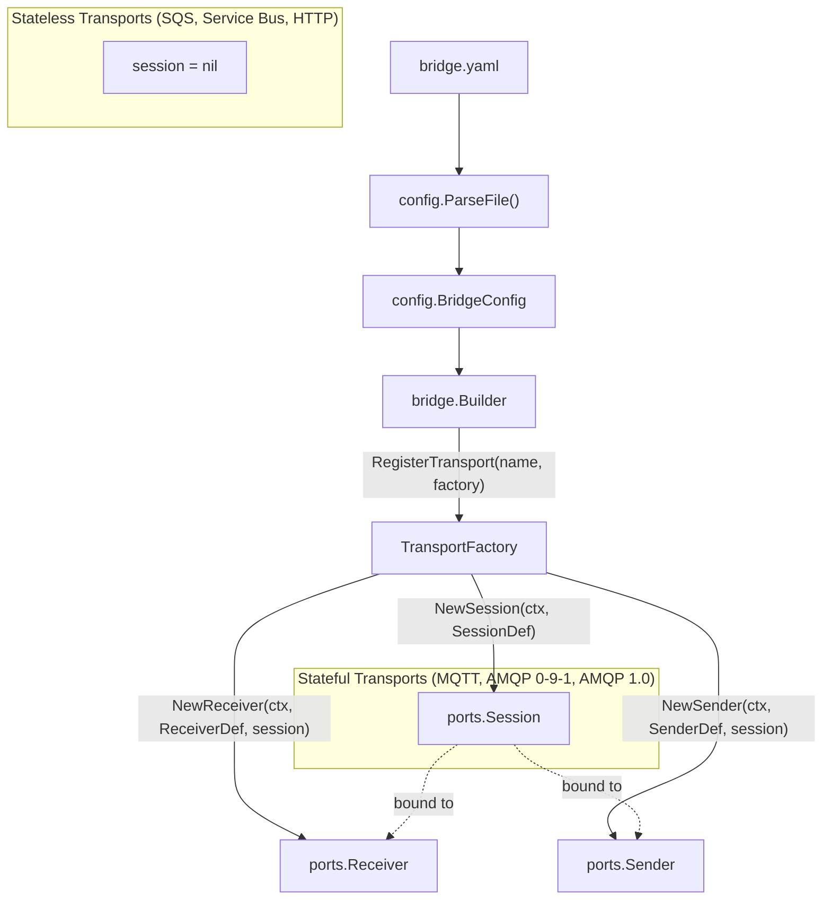

# Transport Configuration Reference

GoBridge uses a factory-based architecture where each transport is registered
by name and creates sessions, receivers, and senders from declarative YAML
configuration. The YAML `options:` block under each session, receiver, and
sender is decoded **once** at config-parse time into the transport's typed
`ports.PluginConfig` (e.g. `paho.Config`, `sqs.SenderConfig`) by the decoder
the adapter registered on `*ports.Registry` from its `register.go`. The
typed value is then carried on `ports.SessionSpec.Config` /
`ports.ReceiverSpec.Config` / `ports.SenderSpec.Config` to the factory — the
runtime never hands `map[string]any` to plugin code. See
[`docs/typed-plugin-config.adoc`](typed-plugin-config.adoc) for the full
contract and [`PLUGIN.md`](../PLUGIN.md#typed-plugin-config) for the
adapter-author summary.

## Per-Transport Configuration

Each transport's detailed configuration -- YAML examples, option-reference
tables, settlement and resilience semantics -- lives in its own reference under
[`docs/transports/`](transports/):

| Transport | `transport:` name | Reference |
|-----------|-------------------|-----------|
| MQTT (Paho) | `mqtt` | [transports/mqtt.md](transports/mqtt.md) |
| AWS SQS | `sqs` | [transports/sqs.md](transports/sqs.md) |
| Azure Service Bus | `servicebus` | [transports/servicebus.md](transports/servicebus.md) |
| RabbitMQ (AMQP 0-9-1) | `amqp091` | [transports/amqp091.md](transports/amqp091.md) |
| AMQP 1.0 | `amqp10` | [transports/amqp10.md](transports/amqp10.md) |
| HTTP | `http` | [transports/http.md](transports/http.md) |

The sections below cover cross-transport concerns shared by all of the above:
the factory architecture, the Subject-vs-Address model, the capability matrix,
programmatic registration, and a multi-transport example.

## Factory Architecture



Stateful transports (MQTT, AMQP 0-9-1, AMQP 1.0) create a real `Session`
that receivers and senders share. Stateless transports (SQS, Azure Service
Bus, HTTP) return `nil` from `NewSession` -- receivers and senders manage
their own connections.

## Subject vs. Address

Two concepts are kept strictly separate across every transport:

- **`Envelope.Subject`** — the logical event subject. It is set by the producer (or by the bridge's ingress mapping) and is never mutated by the runtime to inject a destination.
- **`ports.OutboundMessage.Address`** — the transport destination chosen by the route's dispatch plan (`DispatchPlan.Address`). The runtime passes it to `Sender.Send(ctx, OutboundMessage)` separately from the envelope.

Each transport carries the logical subject over the wire in a transport-native field where one exists; for transports that do not have a dedicated subject slot (MQTT, AMQP 0-9-1) the bridge uses an explicit non-reserved carrier named **`gobridge.subject`**.

| Transport | Outbound destination from `OutboundMessage.Address` | Subject carrier on the wire | Ingress: what sets `Envelope.Subject` |
|-----------|------------------------------------------------------|-----------------------------|---------------------------------------|
| MQTT | Publish topic (or `default_topic` when address is empty). Never derived from `Envelope.Subject`. | MQTT user property `gobridge.subject` | The `gobridge.subject` user property. The publish topic the broker delivered on is exposed in `Headers["mqtt.topic"]`. |
| AMQP 0-9-1 | Routing key (when sender `routing_key` is empty). Never derived from `Envelope.Subject`. | AMQP header `gobridge.subject` | The `gobridge.subject` AMQP header. The broker's `Delivery.RoutingKey` is preserved in `Headers["amqp091.routing-key"]`. |
| AMQP 1.0 | Validated against the configured sender link address (empty allowed; mismatch fails fast). Per-address dynamic links are deferred. | `Message.Properties.Subject` | `Message.Properties.Subject`. There is no fallback from the link address. |
| SQS | Reserved for future dynamic queue selection. Today the queue is sender-state. | `Subject` message attribute | The `Subject` message attribute. There is no fallback from the queue URL/name. When the producer supplies no explicit `MessageDeduplicationId`, FIFO dedup is derived from an md5 hash of the payload, subject and id (or creation time when id is empty) — not the subject alone. |
| Azure Service Bus | Reserved for future dynamic entity selection. Today the entity is sender-state. | `Message.Subject` | `Message.Subject`. There is no fallback from the queue/topic name. |
| HTTP / SSE | Path is sender-state. | JSON field `subject` | JSON field `subject`. |

Reserved `x-bridge.*` headers are not used as the cross-transport subject carrier; `gobridge.subject` is the explicit, application-visible name where no native field exists.

---

## Transport Capabilities Matrix

Each transport declares its capabilities at registration time. The runtime
uses these to validate routes and enable transport-specific features.

| Capability | MQTT | SQS | Azure SB | AMQP 0-9-1 | AMQP 1.0 | HTTP | Description |
|------------|:----:|:---:|:--------:|:----------:|:--------:|:----:|-------------|
| `stateful_session` | Yes | -- | -- | Yes | Yes | -- | Persistent session across reconnects |
| `exclusive_identity` | Yes | -- | -- | -- | -- | -- | Lease-based single-holder session |
| `plan_driven_subscriptions` | Yes | -- | -- | Yes | -- | -- | Subscribes only when the session manager reconciles the plan |
| `visibility_extension` | -- | Yes | Yes | -- | -- | -- | Auto-renew message lock / visibility |
| `source_redelivery` | -- | Yes | -- | Yes | Yes | -- | Broker redelivers unacknowledged messages |
| `delayed_send` | -- | Yes | -- | -- | -- | -- | Native delayed delivery (SQS `delay_seconds`) |
| `http_endpoint` | -- | -- | -- | -- | -- | Yes | Exposes HTTP endpoints |

Additional capabilities defined in `ports.Capability` but not currently
declared by any built-in transport: `shared_consumer`.

---

## Programmatic Registration

Register transport factories on the `Builder` (one-shot) or `Supervisor`
(survives config reloads):

```go
// Builder (one-shot)
rt, err := bridge.NewBuilder(cfg, bridge.WithLogger(logger)).
    RegisterTransport("mqtt", paho.NewFactory(logger)).
    RegisterTransport("sqs", sqs.NewFactory(logger)).
    RegisterTransport("servicebus", servicebus.NewFactory(logger)).
    RegisterTransport("amqp091", amqp091.NewFactory(logger)).
    RegisterTransport("amqp10", amqp10.NewFactory(logger)).
    RegisterTransport("http", httptransport.NewFactory(
        httptransport.WithFactoryLogger(logger),
    )).
    RegisterStoreFactory("memory", nativestore.NewMemoryStoreFactory()).
    Build(ctx)

// Supervisor (survives hot-reload)
sup := bridge.NewSupervisor()
sup.RegisterTransport("mqtt", paho.NewFactory(logger))
sup.RegisterTransport("sqs", sqs.NewFactory(logger))
sup.RegisterTransport("servicebus", servicebus.NewFactory(logger))
sup.RegisterTransport("amqp091", amqp091.NewFactory(logger))
sup.RegisterTransport("amqp10", amqp10.NewFactory(logger))
sup.RegisterTransport("http", httptransport.NewFactory(
    httptransport.WithFactoryLogger(logger),
))
```

All factories implement the `TransportFactory` interface:

```go
type TransportFactory interface {
    NewSession(ctx context.Context, def config.SessionDef) (ports.Session, error)
    NewReceiver(ctx context.Context, def config.ReceiverDef, session ports.Session) (ports.Receiver, error)
    NewSender(ctx context.Context, def config.SenderDef, session ports.Session) (ports.Sender, error)
    Capabilities() []ports.Capability
}
```

---

## Multi-Transport Example

HTTP webhook ingress fanned out to an SQS archive, MQTT device commands, and an
SSE dashboard -- three transports on one bridge:

```yaml
bridge:
  id: multi-transport-bridge
http:
  admin_addr: ":8080"
  admin_api_key: "change-me-please-16"
sessions:
  - id: mqtt-primary
    transport: mqtt
    session_mode: persistent
    options:
      session:
        broker_url: "tcp://mqtt.example.com:1883"
        client_id: "bridge-01"
receivers:
  - id: webhook-in
    transport: http
    options:
      path: "/transport/http/receivers/webhook-in/messages"
      api_key: "webhook-key-min-16ch"
senders:
  - id: sqs-archive
    transport: sqs
    options: { queue_name: "event-archive", region: "eu-west-1", batch_size: 10 }
  - id: mqtt-commands
    transport: mqtt
    session_id: mqtt-primary
    options:
      sender:
        default_topic: "devices/commands"
        qos: 1
  - id: sse-dashboard
    transport: http
    options: { mode: "sse", heartbeat_interval: "15s", max_clients: 50 }
bindings:
  - id: to-archive
    sender_id: sqs-archive
    address: "event-archive"
  - id: to-commands
    sender_id: mqtt-commands
    address: "devices/commands"
  - id: to-dashboard
    sender_id: sse-dashboard
    address: "dashboard-events"
routes:
  - id: webhook-fanout
    receiver_id: webhook-in
    bindings: ["to-archive", "to-commands", "to-dashboard"]
    policy: { max_in_flight: 100 }
```

> **A binding's `address:` is its per-destination target.** Each binding names
> a sender (`sender_id`) and an `address` -- the transport-level destination
> (SQS queue, MQTT topic, AMQP routing key/link address) that the runtime
> propagates as `OutboundMessage.Address`, overriding the sender's default for
> that fan-out leg. Transport connection/behaviour settings live on the sender.
> The parser *accepts* an `options:` block on a binding, but the runtime never
> reads `DestinationBinding.Config` -- so leave bindings bare and put all
> transport options on the sender.
