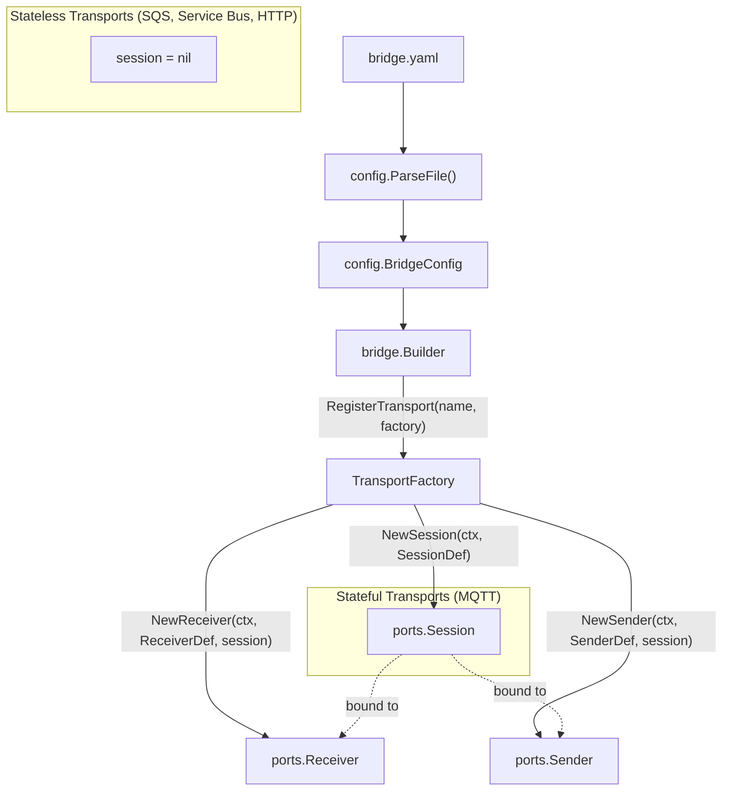
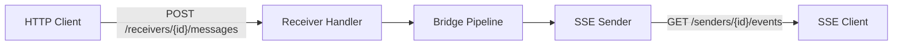

# Transport Configuration Reference

GoBridge uses a factory-based architecture where each transport is registered
by name and creates sessions, receivers, and senders from declarative YAML
configuration. The `map[string]any` options blocks in the YAML are passed
directly to each transport's `*ConfigFromOptions` or `*OptionsFromMap`
functions at build time.

## Factory Architecture



Stateful transports (like MQTT) create a real `Session` that receivers and
senders share. Stateless transports (SQS, Azure Service Bus, HTTP) return
`nil` from `NewSession` -- receivers and senders manage their own connections.

---

## MQTT (Paho)

**Transport name:** `mqtt`
**Factory:** `paho.NewBridgeFactory(logger)`
**Capabilities:** `stateful_session`, `exclusive_identity`

MQTT requires a session. Multiple receivers and senders can share one session
(one TCP connection). Session mode controls lifecycle and ownership semantics.

### Session Modes

| Mode | `session_mode` | `clean_start` | Behavior |
|------|---------------|---------------|----------|
| Ephemeral | `ephemeral` (default) | `true` | No state survives disconnect |
| Persistent | `persistent` | `false` | Broker retains subscriptions and queued messages |
| Exclusive | `exclusive` | `false` | Lease-based single holder; requires a lease store |

### YAML Example

```yaml
sessions:
  - id: mqtt-session-1
    transport: mqtt
    session_mode: persistent
    options:
      broker_url: "tcp://broker.example.com:1883"
      client_id: "bridge-node-01"
      keep_alive: 30
      connect_timeout: "30s"
      reconnect_timeout: "30s"
      clean_start: false
      session_expiry_interval: 3600
      username: "bridge"
      password: "secret"
      tls:
        enable: true
        ca_cert_file: "/etc/certs/ca.pem"
        cert_file: "/etc/certs/client.pem"
        key_file: "/etc/certs/client-key.pem"
        insecure_skip_verify: false

receivers:
  - id: sensor-receiver
    transport: mqtt
    session_id: mqtt-session-1
    topics:
      - topic: "sensors/+/temperature"
        qos: 1
      - topic: "sensors/+/humidity"
        qos: 1

senders:
  - id: command-sender
    transport: mqtt
    session_id: mqtt-session-1
    options:
      default_topic: "devices/commands"
      qos: 1
      retain: false
      timeout: "30s"
```

### Session Options Reference

| Key | Type | Default | Description |
|-----|------|---------|-------------|
| `broker_url` | string | -- | Single broker URL (e.g. `tcp://host:1883`) |
| `broker_urls` | []string | -- | Multiple broker URLs for failover |
| `client_id` | string | **required** | MQTT client identifier |
| `keep_alive` | int | 30 | Keep-alive interval in seconds |
| `connect_timeout` | duration | `30s` | TCP + MQTT CONNECT timeout |
| `reconnect_timeout` | duration | `30s` | Delay before reconnect attempt |
| `clean_start` | bool | `true` | MQTT 5 clean start flag |
| `session_expiry_interval` | int | 0 | Session expiry in seconds (MQTT 5) |
| `username` | string | -- | Authentication username |
| `password` | string | -- | Authentication password |
| `tls.enable` | bool | `false` | Enable TLS |
| `tls.ca_cert_file` | string | -- | CA certificate file path |
| `tls.cert_file` | string | -- | Client certificate file path |
| `tls.key_file` | string | -- | Client private key file path |
| `tls.insecure_skip_verify` | bool | `false` | Skip server certificate verification |

### Sender Options Reference

| Key | Type | Default | Description |
|-----|------|---------|-------------|
| `default_topic` | string | -- | Fallback publish topic |
| `qos` | int | 1 | MQTT QoS level (0, 1, or 2) |
| `retain` | bool | `false` | MQTT retain flag |
| `timeout` | duration | `30s` | Per-publish timeout |

### Resilience Behavior

- **Publish timeout fallback.** When `timeout` is set to `0` (or omitted and no
  context deadline is present), the sender applies a 60-second safety-net
  timeout to prevent indefinite hangs on stalled broker connections.
- **Case-insensitive error classification.** MQTT error messages from brokers
  are matched case-insensitively. `"Connection Refused"`, `"CONNECTION REFUSED"`,
  and `"connection refused"` are all correctly classified as `ErrConnectionLost`,
  enabling proper retry behavior regardless of broker formatting.
- **Properties deep-copy for shared sessions.** When multiple receivers share an
  MQTT session, each handler goroutine receives an independent deep-copy of the
  MQTT Properties (User properties, CorrelationData, ContentType, etc.),
  preventing data races under concurrent dispatch.

### Receiver Options

MQTT receivers have no transport-specific options. Subscriptions are declared
in the `topics[]` array on the `ReceiverDef`, not in the `options` map.

---

## AWS SQS

**Transport name:** `sqs`
**Factory:** `sqs.NewBridgeFactory(logger)`
**Capabilities:** `visibility_extension`, `source_redelivery`

SQS is stateless -- no sessions are needed. Each receiver and sender opens
its own AWS SDK client. Receivers support long polling and automatic
visibility extension. Senders support batching and FIFO queues.

### YAML Example

```yaml
receivers:
  - id: order-events
    transport: sqs
    options:
      queue_url: "https://sqs.eu-west-1.amazonaws.com/123456789012/orders"
      region: "eu-west-1"
      max_messages: 10
      wait_time_seconds: 20
      visibility_timeout: 60
      auto_extend: true
      sns_unwrap: false

senders:
  - id: notification-sender
    transport: sqs
    options:
      queue_name: "notifications"
      region: "eu-west-1"
      delay_seconds: 0
      batch_size: 10
      timeout: "30s"

  - id: fifo-sender
    transport: sqs
    options:
      queue_url: "https://sqs.eu-west-1.amazonaws.com/123456789012/orders.fifo"
      region: "eu-west-1"
      fifo: true
      message_group_id: "order-processing"
      batch_size: 10
```

### Receiver Options Reference

| Key | Type | Default | Description |
|-----|------|---------|-------------|
| `queue_url` | string | -- | Fully qualified SQS queue URL |
| `queue_name` | string | -- | Logical queue name (resolved at startup) |
| `region` | string | SDK default | AWS region |
| `endpoint` | string | -- | Override endpoint (for LocalStack) |
| `profile` | string | -- | AWS shared-config profile name |
| `max_messages` | int | 10 | Messages per ReceiveMessage call (1--10) |
| `wait_time_seconds` | int | 20 | Long-poll duration in seconds (0--20) |
| `visibility_timeout` | int | 30 | Visibility timeout in seconds |
| `auto_extend` | bool | `true` | Renew visibility at 50% of timeout |
| `sns_unwrap` | bool | `false` | Extract inner message from SNS wrapper |

Either `queue_url` or `queue_name` must be provided.

### Sender Options Reference

| Key | Type | Default | Description |
|-----|------|---------|-------------|
| `queue_url` | string | -- | Fully qualified SQS queue URL |
| `queue_name` | string | -- | Logical queue name (resolved at startup) |
| `region` | string | SDK default | AWS region |
| `endpoint` | string | -- | Override endpoint (for LocalStack) |
| `profile` | string | -- | AWS shared-config profile name |
| `delay_seconds` | int | 0 | Delivery delay in seconds (0--900) |
| `batch_size` | int | 10 | Messages per SendMessageBatch (1--10) |
| `timeout` | duration | `30s` | Per-call send timeout |
| `message_group_id` | string | -- | Default FIFO message group ID |
| `fifo` | bool | `false` | Mark queue as FIFO |

Either `queue_url` or `queue_name` must be provided.

### Resilience Behavior

- **Long-poll default.** `wait_time_seconds` defaults to `20` (maximum SQS
  long-poll duration) when not explicitly configured, preventing accidental
  short-polling which causes excessive API costs.
- **Receiver initialization timeout.** SQS receiver startup (client creation,
  queue URL resolution) is bounded by a 30-second timeout, preventing
  indefinite hangs when AWS credentials or endpoints are unavailable.
- **Per-poll timeout.** Each `ReceiveMessage` call has an explicit timeout of
  `WaitTimeSeconds + 10` seconds, protecting against network-level stalls
  beyond the SQS long-poll window.
- **Batch error classification.** SQS batch send failures distinguish between
  server faults (transient, retriable) and sender faults (permanent, not
  retriable). Messages with malformed payloads are classified as
  `ErrorRejected` and routed to DLQ instead of being retried indefinitely.
- **Adaptive auto-extend ticker.** When `Extend()` changes the SQS visibility
  timeout, the auto-extend ticker interval updates accordingly, preventing
  excessive or insufficient extend calls.

> **Tip:** Set the SQS native DLQ `maxReceiveCount` to at least
> `(bridge max retries + 3)` to prevent SQS from moving messages to the DLQ
> before the bridge has finished its own retry handling.

---

## Azure Service Bus

**Transport name:** `servicebus`
**Factory:** `servicebus.NewBridgeFactory(logger)`
**Capabilities:** `visibility_extension`

Azure Service Bus is stateless in GoBridge (no bridge-level sessions).
Connection credentials are nested directly in receiver/sender options.
The transport supports both queues and topic/subscription patterns, plus
Azure SB sessions for ordered processing.

### YAML Example

```yaml
receivers:
  - id: asb-queue-receiver
    transport: servicebus
    options:
      connection_string: "Endpoint=sb://myns.servicebus.windows.net/;SharedAccessKeyName=listen;SharedAccessKey=..."
      queue_name: "orders"
      max_messages: 10
      max_wait_time: "30s"
      prefetch: 50
      receive_mode: "PeekLock"
      lock_duration: "30s"
      auto_extend: true

  - id: asb-topic-receiver
    transport: servicebus
    options:
      namespace: "myns.servicebus.windows.net"
      use_managed_identity: true
      topic_name: "events"
      subscription_name: "bridge-sub"
      receive_mode: "PeekLock"
      session_id: "partition-1"

senders:
  - id: asb-queue-sender
    transport: servicebus
    options:
      connection_string: "Endpoint=sb://myns.servicebus.windows.net/;SharedAccessKeyName=send;SharedAccessKey=..."
      queue_name: "commands"
      batch_size: 10
      timeout: "30s"
      default_session_id: "partition-1"

  - id: asb-topic-sender
    transport: servicebus
    options:
      namespace: "myns.servicebus.windows.net"
      tenant_id: "aaaaaaaa-bbbb-cccc-dddd-eeeeeeeeeeee"
      client_id: "ffffffff-0000-1111-2222-333333333333"
      client_secret: "my-secret"
      topic_name: "notifications"
```

### Receiver Options Reference

| Key | Type | Default | Description |
|-----|------|---------|-------------|
| `queue_name` | string | -- | Service Bus queue name |
| `topic_name` | string | -- | Service Bus topic name |
| `subscription_name` | string | -- | Subscription on the topic |
| `session_id` | string | -- | Lock to a specific ASB session |
| `max_messages` | int | 10 | Messages per receive call (1--100) |
| `max_wait_time` | duration | `30s` | Maximum wait for messages |
| `prefetch` | int | 0 | AMQP link prefetch count |
| `receive_mode` | string | `PeekLock` | `PeekLock` or `ReceiveAndDelete` |
| `sub_queue` | string | -- | `""`, `"deadletter"`, or `"transferdeadletter"` |
| `lock_duration` | duration | `30s` | Expected lock duration (for auto-extend) |
| `auto_extend` | bool | `true` | Renew lock at 50% of duration |

Either `queue_name` or both `topic_name` + `subscription_name` are required.

### Sender Options Reference

| Key | Type | Default | Description |
|-----|------|---------|-------------|
| `queue_name` | string | -- | Service Bus queue name |
| `topic_name` | string | -- | Service Bus topic name |
| `default_session_id` | string | -- | Default ASB session for messages |
| `batch_size` | int | 10 | Upper bound on messages per batch |
| `timeout` | duration | `30s` | Per-call send timeout |

Either `queue_name` or `topic_name` is required.

### Connection Options (nested in receiver/sender)

| Key | Type | Default | Description |
|-----|------|---------|-------------|
| `connection_string` | string | -- | Full Service Bus connection string |
| `namespace` | string | -- | Namespace FQDN (token-based auth) |
| `use_managed_identity` | bool | `false` | Use Azure Managed Identity |
| `tenant_id` | string | -- | Azure AD tenant (app auth) |
| `client_id` | string | -- | Azure AD app client ID |
| `client_secret` | string | -- | Azure AD app client secret |
| `ca_pem` | string | -- | Custom CA certificate (PEM string) |
| `insecure_skip_verify` | bool | `false` | Skip TLS server verification |

Either `connection_string` or `namespace` is required.

---

## HTTP Transport

**Transport name:** `http`
**Factory:** `httptransport.NewBridgeFactory(opts...)`
**Capabilities:** `http_endpoint`
**OpenAPI spec:** `spec/http-adapter/http-api.yaml`

The HTTP transport exposes receivers as POST endpoints and senders as
Server-Sent Events (SSE) GET endpoints. All endpoints are mounted on an
internal `http.ServeMux` accessible via `factory.Handler()`.



### Authentication

Both receivers and senders support optional per-endpoint API key
authentication. When `api_key` is configured, requests must include the key
via `X-API-Key` header or `Authorization: Bearer` token. Keys are compared
using SHA-256 constant-time comparison to prevent timing and length-based
information leaks.

### YAML Example

```yaml
receivers:
  - id: webhook-receiver
    transport: http
    options:
      path: "/transport/http/receivers/webhook-receiver/messages"
      api_key: "recv-secret-min-16ch"
      max_body_size: 1048576

senders:
  - id: event-stream
    transport: http
    options:
      mode: "sse"
      path: "/transport/http/senders/event-stream/events"
      heartbeat_interval: "30s"
      api_key: "sse-secret-min-16ch"
      max_clients: 100
```

### Receiver Options Reference

| Key | Type | Default | Description |
|-----|------|---------|-------------|
| `path` | string | `/transport/http/receivers/{id}/messages` | POST endpoint path |
| `api_key` | string | -- | Per-receiver API key (SHA-256 constant-time comparison) |
| `max_body_size` | int | 1048576 (1 MiB) | Maximum request body in bytes |

### Receiver Request Format

The receiver accepts JSON POST with the following fields:

| Field | Type | Required | Description |
|-------|------|----------|-------------|
| `subject` | string | **yes** | Message topic or routing key |
| `payload` | any JSON | no | Message content (stored as raw bytes) |
| `id` | string | no | Caller-provided message ID |
| `headers` | object | no | Custom metadata (`X-Bridge-*` keys stripped) |
| `expires_at` | RFC 3339 | no | Message TTL (drives `on_expired` policy) |

### Sender Options Reference

| Key | Type | Default | Description |
|-----|------|---------|-------------|
| `mode` | string | `sse` | Sender mode (only `sse` supported) |
| `path` | string | `/transport/http/senders/{id}/events` | GET endpoint path |
| `heartbeat_interval` | duration | `30s` | SSE keep-alive heartbeat interval |
| `api_key` | string | -- | Per-sender API key (SHA-256 constant-time comparison) |
| `max_clients` | int | 10000 | Maximum concurrent SSE connections |

### Resilience Behavior

- **Content-Type validation.** HTTP ingress validates
  `Content-Type: application/json` when the header is present, returning
  `415 Unsupported Media Type` for non-JSON requests. Requests without a
  `Content-Type` header are accepted (assumed JSON).
- **Automatic envelope ID.** HTTP ingress generates a unique UUID envelope ID
  when the request omits the `id` field, ensuring all messages have traceable
  identifiers through the pipeline.
- **Forward error classification.** HTTP forwarder responses are classified by
  status code family: **5xx** responses map to `ErrUnavailable` (transient,
  retriable) and **4xx** responses map to `ErrForwardFailed` (permanent, not
  retriable), enabling correct DLQ routing for upstream HTTP failures.

### Cluster-Aware Routing

When a `RouteLocator` is configured, endpoints become cluster-aware:

- **Receivers**: If the target route is owned by a remote node, the message is
  transparently forwarded to the peer. The `X-Bridge-Forwarded: true` header
  prevents infinite loops.
- **Senders**: If the target route is remote, the client receives an HTTP 307
  redirect to the peer's SSE endpoint.

### Factory Options

The HTTP factory accepts functional options at registration time:

| Option | Description |
|--------|-------------|
| `WithPathPrefix(prefix)` | Override URL prefix (default `/transport/http`) |
| `WithRouteLocator(l)` | Set cluster-aware route locator |
| `WithMessageForwarder(fw)` | Set cluster message forwarder |
| `WithFactoryMetrics(m)` | Set metrics exporter |
| `WithFactoryLogger(l)` | Set structured logger |

---

## Transport Capabilities Matrix

Each transport declares its capabilities at registration time. The runtime
uses these to validate routes and enable transport-specific features.

| Capability | MQTT | SQS | Azure SB | HTTP | Description |
|------------|:----:|:---:|:--------:|:----:|-------------|
| `stateful_session` | Yes | -- | -- | -- | Persistent session across reconnects |
| `exclusive_identity` | Yes | -- | -- | -- | Lease-based single-holder session |
| `visibility_extension` | -- | Yes | Yes | -- | Auto-renew message lock / visibility |
| `source_redelivery` | -- | Yes | -- | -- | Broker redelivers unacknowledged messages |
| `http_endpoint` | -- | -- | -- | Yes | Exposes HTTP endpoints |

Additional capabilities defined in `ports.Capability` but not currently
declared by any built-in transport: `delayed_send`, `shared_consumer`.

---

## Programmatic Registration

Register transport factories on the `Builder` (one-shot) or `Supervisor`
(survives config reloads):

```go
// Builder (one-shot)
rt, err := bridge.NewBuilder(cfg, bridge.WithLogger(logger)).
    RegisterTransport("mqtt", paho.NewBridgeFactory(logger)).
    RegisterTransport("sqs", sqs.NewBridgeFactory(logger)).
    RegisterTransport("servicebus", servicebus.NewBridgeFactory(logger)).
    RegisterTransport("http", httptransport.NewBridgeFactory(
        httptransport.WithFactoryLogger(logger),
    )).
    RegisterStoreFactory("memory", nativestore.NewMemoryStoreFactory()).
    Build(ctx)

// Supervisor (survives hot-reload)
sup := bridge.NewSupervisor()
sup.RegisterTransport("mqtt", paho.NewBridgeFactory(logger))
sup.RegisterTransport("sqs", sqs.NewBridgeFactory(logger))
sup.RegisterTransport("servicebus", servicebus.NewBridgeFactory(logger))
sup.RegisterTransport("http", httptransport.NewBridgeFactory(
    httptransport.WithFactoryLogger(logger),
))
```

All factories implement the `TransportFactory` interface:

```go
type TransportFactory interface {
    NewSession(ctx context.Context, def config.SessionDef) (ports.Session, error)
    NewReceiver(ctx context.Context, def config.ReceiverDef, session ports.Session) (ports.Receiver, error)
    NewSender(ctx context.Context, def config.SenderDef, session ports.Session) (ports.Sender, error)
    Capabilities() []ports.Capability
}
```

---

## Multi-Transport Example

MQTT sensors to SQS archive with SSE dashboard streaming:

```yaml
bridge:
  id: multi-transport-bridge
http:
  admin_addr: ":8080"
  admin_api_key: "change-me"
sessions:
  - id: mqtt-primary
    transport: mqtt
    session_mode: persistent
    options: { broker_url: "tcp://mqtt.example.com:1883", client_id: "bridge-01" }
receivers:
  - id: mqtt-sensors
    transport: mqtt
    session_id: mqtt-primary
    topics: [{ topic: "sensors/#", qos: 1 }]
senders:
  - id: sqs-archive
    transport: sqs
    options: { queue_name: "sensor-archive", region: "eu-west-1", batch_size: 10 }
  - id: sse-dashboard
    transport: http
    options: { mode: "sse", heartbeat_interval: "15s", max_clients: 50 }
bindings:
  - { id: to-archive, sender_id: sqs-archive, address: "sensor-archive" }
  - { id: to-dashboard, sender_id: sse-dashboard, address: "dashboard-events" }
routes:
  - id: sensor-to-archive
    receiver_id: mqtt-sensors
    bindings: ["to-archive", "to-dashboard"]
    policy: { max_in_flight: 100 }
```
