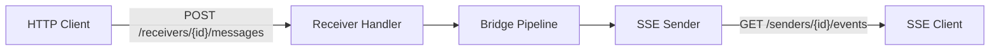

# HTTP Transport

> Part of the [Transport Configuration Reference](../transport-configuration.md).

**Transport name:** `http`
**Factory:** `httptransport.NewFactory(opts...)`
**Capabilities:** `http_endpoint`
**OpenAPI spec:** `spec/http-adapter/http-api.yaml`

The HTTP transport exposes receivers as POST endpoints and senders as
Server-Sent Events (SSE) GET endpoints. All endpoints are mounted on an
internal `http.ServeMux` accessible via `factory.Handler()`.



## Authentication

Both receivers and senders support optional per-endpoint API key
authentication. When `api_key` is configured, requests must include the key
via `X-API-Key` header or `Authorization: Bearer` token. Keys are compared
using SHA-256 constant-time comparison to prevent timing and length-based
information leaks. A `401` always carries an RFC 7235
`WWW-Authenticate: Bearer` challenge.

**Minimum key length (breaking).** An inline `api_key` shorter than 16
characters is rejected at decode time (`minAPIKeyLength`). A short key an
earlier build accepted must be lengthened to >= 16 characters.
Credential-resolved keys (via `credentials_uri`) are validated at the
credential layer and not re-checked here.

> **The `api_key` and the cluster forward token MUST be distinct secrets.**
> Every client presents `api_key` on each request; reusing it as the forward
> token would let any authenticated caller spoof `X-Bridge-Forwarded`. Provision
> two independent secrets.

## YAML Example

```yaml
receivers:
  - id: webhook-receiver
    transport: http
    options:
      path: "/transport/http/receivers/webhook-receiver/messages"
      api_key: "recv-secret-min-16ch"
      max_body_size: 1048576

senders:
  - id: event-stream
    transport: http
    options:
      mode: "sse"
      path: "/transport/http/senders/event-stream/events"
      heartbeat_interval: "30s"
      api_key: "sse-secret-min-16ch"
      max_clients: 100
```

## Receiver Options Reference

| Key | Type | Default | Description |
|-----|------|---------|-------------|
| `path` | string | `/transport/http/receivers/{id}/messages` | POST endpoint path (literal mount point; no ServeMux `{}` metacharacters) |
| `api_key` | string | -- | Per-receiver API key (constant-time comparison; inline keys >= 16 chars) |
| `max_body_size` | int | 1048576 (1 MiB) | Maximum request body in bytes; a breach returns `413` |
| `dedup_window` | int | 4096 | Size of the node-local ingress idempotency LRU (remembered `Idempotency-Key` / `X-Dedup-Id` values) |
| `max_dispatch_duration` | duration | `5m` | Hard bound on the **detached** dispatch: the delivery is emitted on a `context.WithoutCancel` copy of the request context, and this cap always cancels it so a wedged downstream cannot leak a goroutine + in-memory delivery per stuck request. Released early when the delivery settles (Ack/Retry). Independent of any fronting `http.TimeoutHandler`. |
| `credentials_uri` | string | -- | URI resolved by the bridge credential store at build time (populates `api_key` when empty) |

## Receiver Request Format

The receiver accepts a single JSON POST value (trailing tokens are rejected with
`400`) with the following fields:

| Field | Type | Required | Description |
|-------|------|----------|-------------|
| `subject` | string | **yes** | Logical event subject. Mapped 1:1 to `Envelope.Subject`. Not a topic or routing key. |
| `payload` | any JSON | no | Message content (stored as raw bytes) |
| `id` | string | no | Caller-provided message ID (auto-assigned as `http-<instance-entropy>-<unixnano>-<counter>` when omitted -- 8 crypto/rand bytes hex; NOT a UUID) |
| `headers` | object | no | Custom metadata (reserved `x-bridge.*` keys stripped at ingress) |
| `expires_at` | RFC 3339 | no | Message TTL (drives `on_expired` policy) |

**First-class propagation headers.** The idempotency, dedup, and ordering keys
are accepted *only* through their dedicated non-reserved HTTP request headers and
re-stamped on the trusted side; a client cannot inject them via the reserved
`x-bridge.*` namespace (stripped at ingress):

| Header | Purpose |
|--------|---------|
| `Idempotency-Key` | Cross-hop identity/dedup key; feeds the ingress idempotency window and rides forwards |
| `X-Dedup-Id` | Alternative dedup key remembered by the ingress window |
| `X-Ordering-Key` | Propagated as envelope metadata for ordered *targets* (FIFO queues); HTTP ingress itself never orders |

## Sender Options Reference

| Key | Type | Default | Description |
|-----|------|---------|-------------|
| `mode` | string | `sse` | Sender mode (only `sse` supported) |
| `path` | string | `/transport/http/senders/{id}/events` | GET endpoint path |
| `heartbeat_interval` | duration | `30s` | SSE keep-alive heartbeat interval |
| `write_timeout` | duration | `15s` | Per-frame SSE write deadline (re-armed before every frame; overrides a fronting server's global `WriteTimeout` and evicts a stalled subscriber) |
| `api_key` | string | -- | Per-sender API key (constant-time comparison; inline keys >= 16 chars) |
| `max_clients` | int | 10000 | Maximum concurrent SSE connections (no uncapped mode) |
| `client_buffer_size` | int | 256 | Per-subscriber event-queue depth. A full queue drops the event for that subscriber (`SSEDroppedEvents`) instead of blocking healthy subscribers. Raise it to tolerate bursty producers / briefly slow consumers. There is deliberately **no** slow-consumer disconnect policy keyed on this depth — a persistently slow subscriber is evicted by `write_timeout`. |
| `fail_on_zero_delivery` | bool | `false` | **Legacy / deprecated.** Retained for backward compatibility only. Zero-delivery now fails transient by *default* (see `at_most_once_accept_loss`), so `true` is a no-op equal to the default and `false` no longer means "ack the loss". Mutually exclusive with `at_most_once_accept_loss` — configuring both is **rejected at load time**. New config should use `at_most_once_accept_loss` to opt *out* of the safe default. |
| `at_most_once_accept_loss` | bool | `false` | **Safe default (`false`):** a broadcast that reaches zero subscribers (none connected, or every buffer full) makes `Send` return a **transient** (Unavailable-class) error so the route runner does **not** ack a delivery that reached nobody. A durable source (SQS/ASB/AMQP) retries then DLQs; an HTTP-ingress (webhook→SSE) source surfaces **HTTP 500** to the producer. Set `true` to restore classic fire-and-forget at-most-once (ack even when delivery reached nobody). **Not** a replay buffer — durable fan-out still needs a `shared_outbox` policy. |
| `redirect_endpoint` | string | -- (disabled) | `PeerInfo.Endpoints` key used to build a `307` redirect for a remote-owned route. Empty **disables** redirect (remote route → `503`) so an internal peer endpoint is never leaked to an SSE client. |
| `credentials_uri` | string | -- | URI resolved by the bridge credential store at build time |

## Resilience & Delivery Semantics

- **Content-Type validation.** HTTP ingress validates
  `Content-Type: application/json` when the header is present, returning
  `415 Unsupported Media Type` for non-JSON requests. Requests without a
  `Content-Type` header are accepted (assumed JSON).
- **Body limit → 413.** A body exceeding `max_body_size` returns
  `413 Request Entity Too Large`, distinct from the `400` used for malformed
  JSON or trailing tokens.
- **Automatic envelope ID.** HTTP ingress generates a process-unique envelope
  ID of the form `http-<instance-entropy>-<unixnano>-<counter>` when the
  request omits `id`; the 8-byte crypto/rand instance entropy prevents
  cross-node collisions in dedup/DLQ records keyed on the ID.
- **Ingress readiness fails fast (503).** A receiver dispatches only once the
  route runner has wired its emit callback. A request that arrives before the
  receiver is ready is refused **immediately** with `503 Service Unavailable`
  via a non-blocking readiness check, rather than parking the request goroutine
  until the client cancels. Treat the `503` as retriable.
- **Ingress is at-least-once with a best-effort dedup window.** Each receiver
  keeps a bounded, node-local LRU of `Idempotency-Key` / `X-Dedup-Id` values of
  *successfully* processed requests (`dedup_window`, default 4096). A request
  presenting a remembered key is acknowledged `200` without re-emitting and
  counted on `HTTPIngressDuplicates`. Keys are recorded only after success, so a
  retry after a `5xx` is re-processed. The window is per-node/per-process and
  not persisted -- it bounds but does not eliminate duplicates.
- **Emit concurrency (deviation).** Unlike the default sequential emit contract,
  each in-flight request emits from its own handler goroutine. The downstream
  pipeline observes concurrent emits and **no ordering guarantee exists -- not
  even for requests sharing an `X-Ordering-Key`**. The ordering key is metadata
  for ordered targets only.
- **Dispatch decoupled from the client connection.** Once the body is converted
  to an envelope, the delivery is emitted on a `context.WithoutCancel` copy of
  the request context: a client disconnect cannot abort the pipeline
  mid-dispatch. The HTTP response still honours the client context (`504` on
  timeout/disconnect) -- a `504` means "outcome unknown", not "not processed".
  Producers that retry on `504` should supply `Idempotency-Key`. Detached is
  **not** unbounded: the dispatch context is **always** bounded by
  `max_dispatch_duration` (default `5m`), armed unconditionally and released
  early when the delivery settles (Ack/Retry). This does **not** depend on the
  request context carrying a deadline -- a bare `http.Server` (Read/WriteTimeout
  only) installs none, so the old "re-arm only if a deadline is present" was a
  no-op under the shipped bootstrap and let a wedged downstream leak one
  goroutine + in-memory delivery per stuck request. An `http.TimeoutHandler`
  remains useful to bound the client-facing *response*, but is no longer
  required to bound the detached dispatch.
- **Cluster forwarding is at-least-once.** A forward timeout after the peer
  received the body is retried as a fresh POST. Every forward carries an
  `Idempotency-Key` (the envelope's own or derived from its ID) so the peer's
  idempotency window absorbs the replay. Forward classification: `5xx`, `429`
  (`ErrThrottled`) and `408` (`ErrTimeout`) are transient and honour a bounded
  `Retry-After` hint (clamped to 30s); other `4xx` are permanent. A `3xx`
  redirect is **not followed** (the client returns `http.ErrUseLastResponse`)
  and is classified **permanent**: following it would turn the POST into a
  bodyless GET, silently dropping the forwarded body. An optional
  circuit breaker (`ForwarderConfig.Breaker`) makes a dead peer fail fast and
  emits `HTTPForwardBreakerOpen`.
- **Loop prevention.** A request carrying `X-Bridge-Forwarded: true` is trusted
  as an already-forwarded peer message (and processed locally) **only** when it
  also proves the shared `X-Bridge-Forward-Token` (constant-time compared). With
  no token configured the marker is never trusted, so a client cannot force
  local processing on a non-owner node. An already-forwarded request for a route
  this node does not own is refused with `508 Loop Detected`
  (`HTTPForwardLoopRefused`) -- neither processed nor re-forwarded -- so even an
  untokened cluster fails closed instead of entering an A->B->A loop. A trusted
  forwarded request is processed locally **without re-verifying live ownership on
  the receiving hop**: if the forwarding node acted on its locator cache (≤
  `CacheTTL`, 2s default) in the brief window just after ownership moved, the
  just-stepped-down node processes that one request. The window is bounded by the
  locator cache TTL and single-hop (a forwarded request is never re-forwarded);
  outbox fencing still prevents a duplicate *commit*, so the only effect is a
  possible duplicate *send* on a direct-mode route, which the downstream
  idempotency already required for at-least-once delivery absorbs.
- **SSE egress fails safe on zero delivery (default).** `Send` returns a
  **transient** (Unavailable-class) error when a broadcast reaches zero
  subscribers -- either none are connected or every subscriber's buffer is full
  -- so the route runner does **not** ack a delivery that reached nobody. Both
  zero-delivery cases are counted (`SSENoSubscribers` / `SSEAllDropped`) and
  logged at **ERROR** level. What the transient error buys depends on the
  source: a durable source that redelivers with an incrementing receive count
  (SQS/ASB/AMQP) is retried with backoff (letting a briefly-disconnected
  subscriber reconnect) then dead-lettered once `MaxReplayAttempts` is
  exhausted; an **HTTP-ingress** source (webhook → SSE) carries no redelivery
  count, so there is no bridge-side retry or DLQ -- the transient error
  surfaces to the POSTing producer as **HTTP 500** and retry is the producer's
  responsibility. This is **not** a replay buffer: durable fan-out (delivery to
  a subscriber absent at broadcast time) requires fronting SSE egress with a
  `shared_outbox` route policy. "Delivery" means the event was enqueued to the
  buffer of a subscriber that is **currently connected and still reading** -- a
  subscriber whose handler has already begun disconnecting does not count -- not
  that the subscriber acknowledged receipt. If every remaining target has gone
  or is buffer-full the broadcast counts as zero delivery and fails safe.
  - **Opting out (accept loss).** Set `at_most_once_accept_loss: true` to
    restore classic fire-and-forget at-most-once: `Send` acks (returns success)
    even when delivery reached nobody. The metrics and ERROR logs still fire.
    **Breaking change:** prior releases acked by default; the legacy
    `fail_on_zero_delivery` flag is retained but redundant (its `true` == the
    new default) and is mutually exclusive with `at_most_once_accept_loss`.
  - **Close/reload also fails safe.** Once the sender is closing (hot reload or
    shutdown) `Send` returns the transient Unavailable error **regardless** of
    `at_most_once_accept_loss`, because the subscriber set has been (or is being)
    drained and cannot receive the event. This prevents a reload/shutdown window
    from silently acking or dropping an in-flight event. Conversely, an event
    already **acked** before the sender began closing (enqueued to a live
    subscriber's buffer) is **flushed on shutdown** before that subscriber's
    stream closes, so a graceful `Close` does not drop an event `Send` already
    reported as delivered. (A subscriber wedged mid-write when `Close` fires
    cannot be flushed -- SSE is at-most-once with no per-subscriber durable
    queue.)
- **SSE per-subscriber buffering.** Each subscriber has an event queue of
  `client_buffer_size` (default 256). A broadcast that finds the queue full
  drops the event for that subscriber (`SSEDroppedEvents`) rather than blocking
  the fan-out to healthy subscribers. A persistently slow subscriber is evicted
  by the per-write deadline (`write_timeout`), not by queue occupancy.
- **Config reload and shutdown drain SSE subscribers.** A hot config reload
  rebuilds the HTTP transport and shutdown closes it; both drain every open SSE
  stream so clients disconnect and reconnect to the newly-installed instance,
  rather than holding a live-but-event-less stream on a superseded sender.
  Expect a brief reconnect on every reload -- even one that changed nothing
  HTTP-related.
- **SSE frames carry no `id:` field.** Emitting one would make `EventSource`
  clients send `Last-Event-ID` on reconnect and expect a replay window that does
  not exist. The envelope ID remains in the JSON payload.
- **SSE `data:` framing is multiline-safe.** The serialised payload is split on
  newlines and every physical line is emitted as its own `data:` field, per the
  SSE wire format (an unescaped `\n` inside a `data:` value is a record
  separator, not payload). `EventSource` rejoins the fields with `\n`, so a
  payload carrying embedded newlines is reconstructed byte-for-byte instead of
  being truncated at the first newline or split into phantom events.
- **SSE egress header hygiene.** Internal-only reserved headers (`route-id`,
  `route-override`, `source-id`, `content-type`) are stripped before an envelope
  is serialised to a subscriber. Bridge-to-bridge propagated headers
  (correlation/causation/idempotency/tenant/trace/forwarded-*) and application
  headers pass through -- **if any SSE endpoint is publicly reachable, strip the
  `x-bridge.*` namespace plus `traceparent`/`tracestate` at the edge** or keep it
  internal, or that metadata leaks to external clients.
- **SSE cross-cluster redirect is opt-in.** A remote-owned route is refused with
  `503` by default; a `307` is emitted only when `redirect_endpoint` names a
  `PeerInfo.Endpoints` key, so the internal forwarder endpoint is never leaked in
  a `Location` header. Ownership is resolved at connect time **and re-checked
  periodically** (heartbeat cadence): a cluster rebalance that moves the route
  after a client connected closes the now-stranded stream so the client
  reconnects and re-hits the redirect/refuse path, instead of holding a
  live-but-event-less stream forever. A transient locator error during a
  re-check keeps the stream open.
- **Forward error classification (route policy).** Forwarder responses map by
  status family: `5xx` → `ErrUnavailable` (transient, retriable), `4xx` and
  `3xx` → `ErrForwardFailed` (permanent, not retriable), enabling correct DLQ
  routing.
- **Graceful shutdown order.** `Factory.Close` fans out to every SSE sender,
  unblocking connected client handlers so `http.Server.Shutdown` can complete.
  **The composition root must call `Factory.Close` before server shutdown**;
  otherwise `Shutdown` blocks until clients disconnect on their own.

## Forwarder Configuration (`ForwarderConfig`)

Cluster forwarding is configured by the composition root, not the YAML
`options:` block. Defaults (`DefaultForwarderConfig`):

| Field | Default | Description |
|-------|---------|-------------|
| `Timeout` | `30s` | Per-forward request timeout |
| `IdleConnTimeout` | `90s` | Transport idle connection timeout |
| `MaxRetries` | `2` | Forward retry attempts |
| `RetryInitialDelay` | `100ms` | First retry backoff |
| `RetryMaxDelay` | `200ms` | Retry backoff ceiling |
| `MaxIdleConnsPerHost` | `32` | Transport idle conns per peer |
| `MaxConnsPerHost` | `64` | Transport max conns per peer |
| `ForwardToken` | -- | Shared secret sent as `X-Bridge-Forward-Token` (must match receiver `WithForwardToken`) |
| `ReceiverAPIKeys` | -- | Per-receiver-ID API keys used when forwarding to protected peers |
| `Breaker` | -- | Optional `ports.CircuitBreaker` gating each forward |
| `TLSClientConfig` | -- (Go defaults) | Optional `*tls.Config` applied to the forward `http.Transport` so a peer reachable only over HTTPS with a private CA, or requiring mTLS, can be forwarded to. Nil keeps system roots and no client certificate. |
| `Metrics` | no-op | Receives `HTTPForwardBreakerOpen` |

## Cluster-Aware Routing

When a `RouteLocator` is configured, endpoints become cluster-aware:

- **Receivers**: If the target route is owned by a remote node, the message is
  transparently forwarded to the peer. The `X-Bridge-Forwarded: true` header
  prevents infinite loops.
- **Senders**: If the target route is remote, the client receives an HTTP 307
  redirect to the peer's SSE endpoint.

## Factory Options

The HTTP factory accepts functional options at registration time:

| Option | Description |
|--------|-------------|
| `WithPathPrefix(prefix)` | Override URL prefix (default `/transport/http`) |
| `WithRouteLocator(l)` | Set cluster-aware route locator |
| `WithMessageForwarder(fw)` | Set cluster message forwarder |
| `WithForwardToken(token)` | Shared secret receivers require in `X-Bridge-Forward-Token` before trusting an `X-Bridge-Forwarded` marker; must match `ForwarderConfig.ForwardToken` |
| `WithFactoryMetrics(m)` | Set metrics exporter |
| `WithFactoryLogger(l)` | Set structured logger |

---

